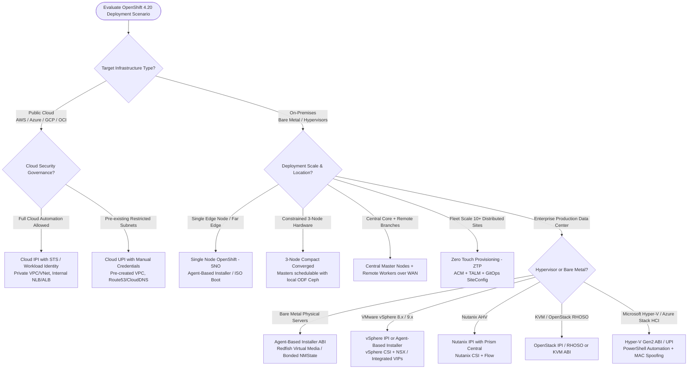

# Enterprise Red Hat OpenShift 4.20 Architecture, Installation & Lifecycle Matrix (Day 0, Day 1, Day 2)

An exhaustive, state-of-the-art reference architecture, installation handbook, automation toolkit, and Day 0/1/2 operational guide for **Red Hat OpenShift Container Platform (OCP) 4.20** across all physical bare-metal, on-prem hypervisors, public clouds, connected, proxy-restricted, and air-gapped environments.

> [!IMPORTANT]
> **Architecture Reference & Non-Live Environment Disclaimer**:
> This repository, along with its architecture matrices, configuration manifests, and automation scripts, was generated using **Gemini 3.8 Flash**. It has **not yet been tested in a live cluster environment**; it is designed to serve as a dense, comprehensive **enterprise architecture reference and implementation blueprint** up to date as of September 2026. Always validate and tailor all manifests, network CIDRs, and scripts within a staging environment before executing in production.

---

## Executive Architecture Summary

By **September 2026**, OpenShift 4.20 establishes the enterprise foundation for hybrid cloud and AI infrastructure. This repository codifies the modern architectural paradigms:

1. **Provisioning Modernization**: The **Agent-Based Installer (ABI)** replaces legacy User-Provisioned Infrastructure (UPI) for on-prem bare-metal and VMware/Nutanix, eliminating the temporary bootstrap VM in favor of **Bootstrap-in-Place**.
2. **Air-Gapped Standard**: Standardization on **`oc-mirror` v2** (ImageSetConfiguration v2, OCI file-based catalogs, ephemeral streaming caches, and ImageDigestMirrorSets).
3. **Storage & Data Fabric**: First-class **OpenShift Data Foundation (ODF)** integration for multi-cloud Ceph block (RBD), file (CephFS), and object (RGW) storage.
4. **Data Protection Verdict**: Strict enforcement of **OADP (OpenShift API for Data Protection)** with **Kopia** data-movers, definitively superseding vanilla upstream Velero which fails to handle OpenShift security contexts and proprietary CRDs.
5. **Declarative Rebuilds**: Treating clusters as disposable infrastructure reproducible in <45 minutes via **Red Hat OpenShift GitOps (ArgoCD v3+)** and **Advanced Cluster Management (ACM 2.12+)**.

---

## Master Architecture Decision Tree

Use this interactive logic flow to determine the optimal installation method and cluster footprint for your organization:

---

## Master Deployment & Architecture Matrix

| Platform / Scenario | Primary Provisioning Method | Recommended Topologies | Network Mode | Storage Architecture | Typical Deploy Time | Production Recommendation |
| :--- | :--- | :--- | :--- | :--- | :---: | :--- |
| **Bare Metal (Dell/HPE/Cisco)** | Agent-Based (ABI) / ZTP | SNO, Compact, Standard HA | Air-Gapped or Connected | Local NVMe + ODF (Ceph) | 25 - 35 mins | **Recommended for Maximum Performance & AI/Telco** |
| **VMware vSphere (8.x / 9.x)** | vSphere IPI or ABI | Compact, Standard HA | Connected / Proxy / Air-Gap | vSphere CSI / vSAN / ODF | 30 - 45 mins | **Standard for On-Premises Enterprise IT** |
| **Nutanix AHV** | Nutanix IPI | Compact, Standard HA | Connected / Air-Gapped | Nutanix CSI (Volumes/Files) | 35 - 45 mins | **Recommended for Nutanix HCI Customers** |
| **KVM / OpenStack (RHOSO)** | OpenStack IPI / ABI | Standard HA, Compact | Connected / Air-Gapped | Cinder CSI / ODF | 35 - 50 mins | **Standard for Telco & Open Cloud Stacks** |
| **Amazon Web Services (AWS)**| Cloud IPI (Private VPC) | Standard HA (Multi-AZ) | Connected / Private NAT | AWS EBS (gp3) / EFS CSI | 35 - 45 mins | **Recommended: Manual STS / IRSA Auth Mode** |
| **Microsoft Azure** | Cloud IPI (Private VNet)| Standard HA (Multi-AZ) | Connected / Private VNet | Azure Managed Disk / Azure File | 35 - 45 mins | **Recommended: Azure Workload Identity** |
| **Google Cloud (GCP)** | Cloud IPI (Shared VPC) | Standard HA (Multi-Zone)| Connected / Private PSC | Persistent Disk (pd-balanced/ssd) | 35 - 45 mins | **Recommended: GCP Workload Identity Federation** |
| **Microsoft Hyper-V / Azure Stack HCI** | Agent-Based (ABI) / UPI | Compact, Standard HA | Connected / Air-Gapped | ODF / SMB CSI / Local VHDX | 30 - 40 mins | **Gen 2 UEFI + MicrosoftUEFICACert + MAC Spoofing** |
| **Air-Gapped / Dark Site** | `oc-mirror` v2 + ABI | SNO, Compact, Standard HA | Strictly Disconnected | Local Quay/Harbor + ODF | 45 - 60 mins | **Mandatory: Internal DNS, NTP & Private PKI** |

---

## Complete Documentation Index

The complete documentation suite is divided into 8 focused engineering sections with bidirectional navigation:

### [01. Architecture & Cluster Topologies](docs/01-architecture-topologies/README.md)
Detailed hardware specifications, failure domain behavior, and resource overhead across all topologies:
- [Single Node OpenShift (SNO)](docs/01-architecture-topologies/01-sno-single-node.md): Minimal footprint, far-edge, non-quorum etcd operations.
- [3-Node Compact Converged](docs/01-architecture-topologies/02-compact-3-node-converged.md): Schedulable masters, local ODF Ceph co-location, 1-node failure quorum.
- [Standard Multi-Node HA](docs/01-architecture-topologies/03-standard-ha-multinode.md): Dedicated masters, worker pools, and dedicated 3-node infra pools.
- [Remote Worker Nodes over WAN](docs/01-architecture-topologies/04-remote-workers-wan.md): Latency tolerance (<100ms RTT), heartbeat tuning, edge disconnection resilience.
- [Hosted Control Planes (HyperShift)](docs/01-architecture-topologies/05-hypershift-hosted-cp.md): Running control planes as pods on a central management cluster.

### [02. Provisioning Paradigms](docs/02-provisioning-paradigms/README.md)
Comparison and execution mechanics of modern and legacy installation tools:
- [Agent-Based Installer (ABI)](docs/02-provisioning-paradigms/01-agent-based-installer.md): Bootstrap-in-Place, Rendezvous node, discovery ISO generation.
- [Installer Provisioned Infrastructure (IPI)](docs/02-provisioning-paradigms/02-installer-provisioned-ipi.md): Automated cloud & hypervisor API orchestration.
- [User Provisioned Infrastructure (UPI)](docs/02-provisioning-paradigms/03-user-provisioned-upi.md): Manual VM provisioning and Ignition injection for strict change-control IT.
- [Zero Touch Provisioning (ZTP)](docs/02-provisioning-paradigms/04-ztp-acm-gitops.md): Declarative fleet provisioning via ACM, TALM, and SiteConfig CRDs.

### [03. Network Architecture & Connectivity](docs/03-network-and-connectivity/README.md)
Enterprise network design, proxy bypasses, air-gap mirroring, and CNI performance:
- [Connected with Corporate Proxies](docs/03-network-and-connectivity/01-connected-with-proxies.md): Forward proxy configuration, `noProxy` rules, and custom CA trust injection.
- [Air-Gapped Disconnected Deployments (`oc-mirror` v2)](docs/03-network-and-connectivity/02-air-gapped-oc-mirror-v2.md): OCI catalogs, streaming ephemeral caches, and IDMS manifests.
- [Air-Gapped Core Services](docs/03-network-and-connectivity/03-air-gapped-core-services.md): Split-horizon DNS, Chrony NTP clock sync (<500ms), and internal enterprise PKI.
- [OVN-Kubernetes Tuning](docs/03-network-and-connectivity/04-ovn-kubernetes-tuning.md): MTU sizing (Geneve 100-byte overhead), deterministic EgressIPs, and EgressFirewalls.

### [04. Platform Specific Deployment Guides](docs/04-platforms/README.md)
Exhaustive configuration blueprints across all physical and cloud infrastructures:
- [Bare Metal Physical Hardware](docs/04-platforms/01-bare-metal-physical.md): Dell iDRAC, HPE iLO, Cisco UCS, Redfish Virtual Media automation.
- [VMware vSphere 8.x / 9.x](docs/04-platforms/02-vmware-vsphere.md): vSphere IPI vs ABI, vSAN storage, DRS anti-affinity, and vSphere CSI.
- [Nutanix AHV](docs/04-platforms/03-nutanix-ahv.md): Nutanix IPI, Prism Central integration, Flow security policies, and Nutanix CSI.
- [KVM & OpenStack (RHOSO)](docs/04-platforms/04-kvm-openstack.md): Standalone KVM virt-install and Red Hat OpenStack Services on OpenShift.
- [Amazon Web Services (AWS)](docs/04-platforms/05-aws.md): Private VPC IPI, STS manual credentials mode, and AWS EBS/EFS CSI.
- [Microsoft Azure](docs/04-platforms/06-azure.md): Private VNet, Azure Workload Identity Federation, Accelerated Networking, and Azure Disk CSI.
- [Google Cloud Platform (GCP)](docs/04-platforms/07-gcp.md): Shared VPC Host/Service projects, GCP Workload Identity, and PSC endpoints.
- [Microsoft Hyper-V & Azure Stack HCI](docs/04-platforms/08-microsoft-hyper-v.md): Gen 2 UEFI VM specifications, Secure Boot templates, MAC spoofing for Keepalived VIPs, and PowerShell automation.

### [05. Day 0 Infrastructure Readiness](docs/05-day0-readiness/README.md)
Preflight validation and capacity planning:
- [Hardware & Capacity Sizing](docs/05-day0-readiness/01-hardware-and-sizing.md): CPU/RAM quotas, fio disk write latency verification (<10ms fdatasync).
- [DNS & Load Balancing Matrix](docs/05-day0-readiness/02-dns-loadbalancer-matrix.md): Full port mapping tables, VIPs vs external F5/HAProxy load balancers.
- [Storage Architecture & ODF](docs/05-day0-readiness/03-storage-architecture-odf.md): Ceph RBD (Block), CephFS (Shared File), and RGW (S3 Object) storage classes.
- [Helper Node Architecture & Engineering](docs/05-day0-readiness/04-helper-node-architecture.md): When the Bastion/Services node is mandatory (Bare Metal UPI, Air-Gap, Restricted On-Prem) vs eliminated (Public Cloud IPI), and full service configuration (BIND9, HAProxy, Chrony, HTTP).

### [06. Day 1 Post-Install Hardening](docs/06-day1-baselining/README.md)
Baselining, security lockdowns, and enterprise integration:
- [Cluster Operator Verification](docs/06-day1-baselining/01-cluster-operator-hardening.md): Validating all 34+ operators, troubleshooting degraded states.
- [Ingress & Custom Certificates](docs/06-day1-baselining/02-ingress-and-custom-certs.md): Replacing default wildcard certificates with corporate PKI TLS certs.
- [Identity Providers & RBAC Hardening](docs/06-day1-baselining/03-identity-providers-rbac.md): Keycloak/Entra ID OIDC SSO, revoking self-provisioners, deleting `kubeadmin`.
- [MachineConfigPools & Node Tuning](docs/06-day1-baselining/04-machineconfigpools-tuning.md): Dedicated infra node pools, real-time kernels, CPU pinning, and sysctl tuning.

### [07. Day 2 Operations & Lifecycle](docs/07-day2-operations/README.md)
Observability, compliance, GitOps, and upgrade management:
- [Enterprise Observability Stack](docs/07-day2-operations/01-observability-stack.md): User Workload Monitoring, LokiStack + Vector logging, Tempo distributed tracing.
- [Security & Compliance](docs/07-day2-operations/02-security-and-compliance.md): Automated CIS Benchmark and NIST SP 800-53 enforcement via Compliance Operator.
- [GitOps Foundation](docs/07-day2-operations/03-gitops-foundation.md): Red Hat OpenShift GitOps (ArgoCD v3+), App-of-Apps, and External Secrets Operator (ESO).
- [Cluster Lifecycle & Upgrades](docs/07-day2-operations/04-lifecycle-and-upgrades.md): EUS-to-EUS upgrade paths, paused MCP canary rollouts, node drain safety.
- [Automated Upgrades & Pre-Upgrade Mandates](docs/07-day2-operations/05-automated-upgrades.md): Deep architectural rationale for why upgrades must be strictly orchestrated, why fresh etcd snapshots are non-negotiable before upgrading, paused worker MCP rollouts, and automated scripts.

### [08. Disaster Recovery, Backup & GitOps Rebuild](docs/08-backup-dr-and-rebuild/README.md)
RTO/RPO evaluation, etcd restoration, and declarative rebuilding:
- [etcd Backup, Recovery & Quorum Loss](docs/08-backup-dr-and-rebuild/01-etcd-backup-restore.md): Scheduled snapshots and step-by-step 2-node quorum failure recovery.
- [OADP vs Vanilla Velero Deep-Dive](docs/08-backup-dr-and-rebuild/02-oadp-vs-velero-deepdive.md): Exhaustive analysis of why vanilla Velero fails on OpenShift and why OADP is mandatory.
- [Metro-DR & Regional-DR Multi-Cluster](docs/08-backup-dr-and-rebuild/03-metro-dr-and-regional-dr.md): Synchronous Metro-DR (RPO=0) vs Asynchronous Regional-DR with ACM and ODF.
- [Declarative GitOps Rebuild from Scratch](docs/08-backup-dr-and-rebuild/04-declarative-rebuild-gitops.md): Rebuilding entire production clusters in <45 mins from Git repositories.

---

## Production Automation Scripts & Manifests

All scripts and manifests are ready to execute from this repository:

### Shell Scripts (`scripts/`)
| Script | Description | Usage |
| :--- | :--- | :--- |
| [`scripts/preflight-check.sh`](scripts/preflight-check.sh) | Validates DNS, reverse PTR, NTP, proxy settings, and port connectivity. | `./scripts/preflight-check.sh` |
| [`scripts/generate-agent-iso.sh`](scripts/generate-agent-iso.sh) | Validates config and builds bootable Agent-Based Installer ISO. | `TOPOLOGY=compact ./scripts/generate-agent-iso.sh` |
| [`scripts/mirror-ocp420-airgap.sh`](scripts/mirror-ocp420-airgap.sh) | Automates `oc-mirror` v2 mirroring to local Quay/Harbor registry. | `./scripts/mirror-ocp420-airgap.sh` |
| [`scripts/etcd-backup.sh`](scripts/etcd-backup.sh) | Automates etcd snapshots, validates integrity, and enforces retention. | `./scripts/etcd-backup.sh` |
| [`scripts/validate-cluster-health.sh`](scripts/validate-cluster-health.sh) | Audits ClusterOperators, MCPs, Nodes, Ingress, and StorageClasses. | `./scripts/validate-cluster-health.sh` |
| [`scripts/deploy-hyperv-vms.ps1`](scripts/deploy-hyperv-vms.ps1) | Automated PowerShell deployment of Gen 2 OpenShift VMs on Hyper-V. | `.\scripts\deploy-hyperv-vms.ps1` |
| [`scripts/pre-upgrade-health-check.sh`](scripts/pre-upgrade-health-check.sh) | Pre-upgrade audit: validates ClusterOperators, MCPs, etcd backup freshness, deprecated APIs, and firing alerts. | `./scripts/pre-upgrade-health-check.sh` |
| [`scripts/automated-cluster-upgrade.sh`](scripts/automated-cluster-upgrade.sh) | End-to-end upgrade orchestrator: pre-audit -> automated etcd backup -> worker MCP pause -> CVO upgrade -> canary rollout. | `./scripts/automated-cluster-upgrade.sh 4.20.1` |
| [`scripts/airgap-upgrade.sh`](scripts/airgap-upgrade.sh) | Air-gapped upgrade orchestrator: mirrors target release via oc-mirror v2, applies IDMS, and triggers upgrade. | `./scripts/airgap-upgrade.sh 4.20.1` |

### Production Manifests (`configs/`)
- **Agent-Based**: [`configs/agent-based/agent-config.yaml`](configs/agent-based/agent-config.yaml), [`install-config-sno.yaml`](configs/agent-based/install-config-sno.yaml), [`install-config-compact.yaml`](configs/agent-based/install-config-compact.yaml), [`install-config-standard.yaml`](configs/agent-based/install-config-standard.yaml).
- **Public Cloud IPI**: [`configs/ipi-cloud/aws-install-config.yaml`](configs/ipi-cloud/aws-install-config.yaml), [`azure-install-config.yaml`](configs/ipi-cloud/azure-install-config.yaml), [`gcp-install-config.yaml`](configs/ipi-cloud/gcp-install-config.yaml).
- **Virtualization UPI**: [`configs/upi-vsphere/vsphere-install-config.yaml`](configs/upi-vsphere/vsphere-install-config.yaml).
- **Air-Gapped**: [`configs/airgap/imageset-config-v2.yaml`](configs/airgap/imageset-config-v2.yaml), [`local-registry-quay.yaml`](configs/airgap/local-registry-quay.yaml).
- **Day 1**: [`configs/day1/machineconfig-chrony.yaml`](configs/day1/machineconfig-chrony.yaml), [`cluster-proxy-trustedca.yaml`](configs/day1/cluster-proxy-trustedca.yaml), [`ingresscontroller-custom-tls.yaml`](configs/day1/ingresscontroller-custom-tls.yaml), [`idp-keycloak-oidc.yaml`](configs/day1/idp-keycloak-oidc.yaml), [`mcp-infra-nodes.yaml`](configs/day1/mcp-infra-nodes.yaml).
- **Day 2**: [`configs/day2/oadp-dpa-cr.yaml`](configs/day2/oadp-dpa-cr.yaml), [`etcd-backup-cronjob.yaml`](configs/day2/etcd-backup-cronjob.yaml), [`compliance-suite-cis.yaml`](configs/day2/compliance-suite-cis.yaml), [`cluster-autoscaler.yaml`](configs/day2/cluster-autoscaler.yaml).

---

## Technical Deep-Dive: The Velero Question

> [!CAUTION]
> **Can we use vanilla upstream Velero on OpenShift?**
> **Definitive Answer**: **NO.** Upstream Velero is designed strictly for generic vanilla Kubernetes and will critically fail in OpenShift production environments.

### Why Vanilla Velero Fails on OpenShift:
1. **Security Context Constraints (SCC)**: Vanilla Velero node-agent pods are blocked by OpenShift's default `restricted-v2` SCC, preventing host-level backup access.
2. **Proprietary API Groups**: OpenShift uses native CRDs (`route.openshift.io`, `security.openshift.io`, `build.openshift.io`). Upstream Velero fails to preserve internal route TLS certificates and build revisions during restore.
3. **Dynamic UID/GID Allocation**: OpenShift allocates dynamic UID/GID ranges per namespace. Vanilla Velero restores fixed UIDs, causing pods to fail with `CrashLoopBackOff (Permission Denied)`.
4. **The Supported Solution**: **Red Hat OADP (OpenShift API for Data Protection)** integrates Velero with the `openshift-velero-plugin`, custom SCC bindings, and automated CSI VolumeSnapshot integration, backed by full Red Hat 24x7 enterprise support.

---

## Classified Real References & External Standards (September 2026)

### 1. Official Red Hat Product Documentation & Architecture
- [Red Hat OpenShift Container Platform 4.20 Documentation Suite](https://docs.openshift.com/container-platform/4.20/welcome/index.html)
- [OpenShift 4.20 Installing with the Agent-based Installer](https://docs.openshift.com/container-platform/4.20/installing/installing_with_agent_based_installer/preparing-to-install-with-agent-based-installer.html)
- [OpenShift 4.20 Disconnected Installation Mirroring with oc-mirror v2](https://docs.openshift.com/container-platform/4.20/installing/disconnected_install/installing-mirroring-disconnected-v2.html)
- [Red Hat OpenShift Data Foundation (ODF) 4.16+ Architecture](https://docs.redhat.com/en/documentation/red_hat_openshift_data_foundation)
- [Red Hat Advanced Cluster Management for Kubernetes (ACM 2.12+)](https://docs.redhat.com/en/documentation/red_hat_advanced_cluster_management_for_kubernetes)
- [Red Hat OpenShift API for Data Protection (OADP 1.4+) Guide](https://docs.openshift.com/container-platform/4.20/backup_and_restore/application_backup_and_restore/oadp-features.html)

### 2. Red Hat Knowledgebase (KCS) & Solution Blueprints
- [KCS 4290531: Recommended etcd performance baselines and disk latency troubleshooting](https://access.redhat.com/solutions/4290531)
- [KCS 5493261: OpenShift 4 etcd Disaster Recovery and Quorum Restoration](https://access.redhat.com/solutions/5493261)
- [KCS 6958471: Migration from oc-mirror v1 to oc-mirror v2 for disconnected clusters](https://access.redhat.com/solutions/6958471)
- [KCS 3986601: Setting up corporate proxy and custom CA certificates in OpenShift 4](https://access.redhat.com/solutions/3986601)

### 3. Open Source Upstream & Core Tooling Repositories
- [OpenShift Installer GitHub Repository (`openshift/installer`)](https://github.com/openshift/installer)
- [OpenShift Assisted Service & Agent Installer (`openshift/assisted-service`)](https://github.com/openshift/assisted-service)
- [OpenShift oc-mirror Plugin CLI v2 (`openshift/oc-mirror`)](https://github.com/openshift/oc-mirror)
- [OpenShift Machine Config Operator (`openshift/machine-config-operator`)](https://github.com/openshift/machine-config-operator)
- [OpenShift OVN-Kubernetes CNI Driver (`ovn-org/ovn-kubernetes`)](https://github.com/ovn-org/ovn-kubernetes)
- [OpenShift API for Data Protection Operator (`openshift/oadp-operator`)](https://github.com/openshift/oadp-operator)
- [Topology Aware Lifecycle Manager for ZTP (`openshift-kni/cluster-group-upgrades-operator`)](https://github.com/openshift-kni/cluster-group-upgrades-operator)

### 4. Enterprise Security, Benchmarks & Compliance
- [CIS Red Hat OpenShift Container Platform 4 Benchmark](https://www.cisecurity.org/benchmark/red_hat_openshift)
- [NIST Special Publication 800-53 Rev. 5: Security Controls for Information Systems](https://csrc.nist.gov/publications/detail/sp/800-53/rev-5/final)
- [Red Hat OpenShift Compliance Operator Profiles & Scanning](https://github.com/ComplianceAsCode/content)

### 5. Infrastructure Vendor Reference Guides
- [VMware vSphere with Tanzu & OpenShift Best Practices (Broadcom)](https://core.vmware.com)
- [Nutanix OpenShift Reference Architecture (Tech Note TN-2070)](https://www.nutanix.com/solutions/openshift)
- [AWS Security Token Service (STS) with OpenShift IRSA Guide](https://docs.aws.amazon.com/STS/latest/UsingSTS/Welcome.html)
- [Microsoft Azure Workload Identity Federation for Kubernetes](https://learn.microsoft.com/en-us/azure/aks/workload-identity-overview)

---

## License

This repository is licensed under the [Apache 2.0 License](LICENSE).
Copyright © 2026 Nubenetes.
