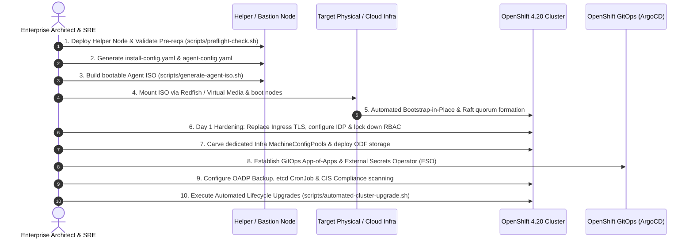

# Enterprise Red Hat OpenShift 4.20 Architecture, Installation & Lifecycle Matrix (Day 0, Day 1, Day 2)

[](https://docs.openshift.com)
[](https://kubernetes.io)
[]()
[]()
[](LICENSE)
[]()

An exhaustive, enterprise-grade reference architecture, installation engineering handbook, declarative automation toolkit, and Day 0/1/2 operational field manual for **Red Hat OpenShift Container Platform (OCP) 4.20** (Kubernetes 1.31–1.33, updated through **September/October 2026**).

Designed for Enterprise Platform Architects, Principal Site Reliability Engineers (SREs), and Hybrid Cloud Infrastructure Specialists, this repository bridges the complete operational continuum: from **Day 0** hardware/network capacity planning and preflight validation, to **Bootstrap-in-Place** media engineering, **Day 1** zero-trust security baselining, **Day 2** autonomous GitOps drift self-healing, **Modern Virtualization (KubeVirt/MTV)**, **Enterprise AI/GPU compute (RHOAI/vLLM)**, **Disaster Recovery (OADP/Metro-DR)**, and **Out-of-Band Emergency Runbooks** to resurrect dead clusters when the API server is unreachable.

### Key Repository Assets at a Glance:
- 📚 **51 Exhaustive Engineering Modules (`docs/`)**: Organized across 9 operational domains covering every topology, hypervisor, public cloud, Gateway API, and incident scenario.
- ⚙️ **34 Production Declarative Manifests (`configs/`)**: Validated Custom Resources for Agent-Based Installer, Keyless Cloud IPI, oc-mirror v2, Gateway API, Ingress PKI, GitOps root App-of-Apps, External Secrets Operator, cert-manager, OpenShift Virtualization, RHOAI, and vLLM ServingRuntime.
- 🛠️ **14 Production Automation Scripts (`scripts/`)**: Complete shell and PowerShell operational tools covering preflight validation, air-gap mirroring, automated etcd backups, canary cluster upgrades with Prometheus SLO gating, automated OADP restore drills, expired certificate recovery from the Helper Node, and single-member quorum restoration.
- 🎯 **10-Step Deterministic Implementation Workflow**: A unified sequence linking Day 0 readiness through to autonomous lifecycle operations across all infrastructure targets.

> [!IMPORTANT]
> **Architecture Reference & Non-Live Environment Disclaimer**:
> This repository, along with its architecture matrices, configuration manifests, and automation scripts, was generated using **Gemini 3.8 Flash**. It has **not yet been tested in a live cluster environment**; it is designed to serve as a dense, comprehensive **enterprise architecture reference and implementation blueprint** up to date as of September 2026. Always validate and tailor all manifests, network CIDRs, and scripts within a staging environment before executing in production.

---

## Table of Contents

- [Executive Architecture Summary](#executive-architecture-summary)
- [Master Architecture Decision Tree](#master-architecture-decision-tree)
  - [Visual ASCII Decision Routing Tree](#visual-ascii-routing-tree)
  - [Architecture Decision Criteria & Technical Specifications](#architecture-decision-criteria--technical-specifications)
    - [Section 1: Public Cloud Deployments (AWS, Azure, GCP, OCI)](#section-1-public-cloud-deployments-aws-azure-gcp-oci)
      - [1. Cloud IPI (Installer-Provisioned Infrastructure)](#cloud-ipi)
      - [2. Cloud UPI (User-Provisioned Infrastructure)](#cloud-upi)
      - [Public Cloud Provisioning Model Comparison Matrix](#cloud-comparison-matrix)
    - [Section 2: Edge & Distributed Deployment Topologies](#section-2-edge--distributed-deployment-topologies)
      - [1. Single Node OpenShift (SNO)](#sno-single-node)
      - [2. 3-Node Compact Converged](#compact-3-node)
      - [3. Remote Worker Nodes (WAN)](#remote-workers-wan)
      - [4. Zero Touch Provisioning (ZTP) at Scale](#ztp-acm-gitops)
      - [5. Hosted Control Planes / HyperShift (HCP)](#hypershift-hosted-cp)
    - [Section 3: On-Premises Datacenter Platforms](#section-3-on-premises-datacenter-platforms)
      - [1. Physical Bare Metal](#bare-metal-physical)
      - [2. VMware vSphere (8.x / 9.x)](#vmware-vsphere)
      - [3. Nutanix AHV HCI](#nutanix-ahv)
      - [4. KVM & RHOSO (Red Hat OpenStack Services on OpenShift)](#kvm-openstack)
      - [5. Microsoft Hyper-V / Azure Stack HCI](#microsoft-hyper-v)
    - [Section 4: Network Isolation & Connectivity Paradigms](#section-4-network-isolation--connectivity-paradigms)
      - [1. Fully Connected Network](#network-fully-connected)
      - [2. Proxy-Restricted Enterprise Network](#network-proxy-restricted)
      - [3. Air-Gapped / Disconnected Dark Site Network](#network-air-gapped)
  - [Graphical Mermaid Flowchart](#graphical-mermaid-flowchart)
- [Master Deployment & Architecture Matrix](#master-deployment--architecture-matrix)
- [Repository Directory Structure & Architectural File Map](#repository-directory-structure--architectural-file-map)
  - [High-Level Directory Tree](#high-level-directory-tree)
  - [Architectural Component Breakdown](#architectural-component-breakdown)
  - [Lifecycle Alignment Matrix (Day 0, Day 1, Day 2)](#lifecycle-alignment-matrix-day-0-day-1-day-2)
- [Complete End-to-End Master Implementation Workflow (Ordered Step-by-Step)](#complete-end-to-end-master-implementation-workflow-ordered-step-by-step)
  - [Step 1: Preflight Infrastructure & Network Validation](#step-1-preflight-infrastructure--network-validation)
  - [Step 2: Helper Node / Bastion Service Deployment](#step-2-helper-node--bastion-service-deployment)
  - [Step 3: Declarative Configuration Definition](#step-3-declarative-configuration-definition)
  - [Step 4: Installation Media Generation & Boot](#step-4-installation-media-generation--boot)
  - [Step 5: Bootstrap-in-Place & Cluster Convergence](#step-5-bootstrap-in-place--cluster-convergence)
  - [Step 6: Day 1 Ingress TLS & Identity Federation](#step-6-day-1-ingress-tls--identity-federation)
  - [Step 7: MachineConfigPool Hardening & Storage Provisioning](#step-7-machineconfigpool-hardening--storage-provisioning)
  - [Step 8: GitOps Foundation & Secret Management](#step-8-gitops-foundation--secret-management)
  - [Step 9: Observability, Compliance & Backup Encampment](#step-9-observability-compliance--backup-encampment)
  - [Step 10: Automated Lifecycle & Upgrade Orchestration](#step-10-automated-lifecycle--upgrade-orchestration)
- [Complete Documentation Index](#complete-documentation-index)
  - [01. Architecture & Cluster Topologies](#01-architecture--cluster-topologies)
    - [Single Node OpenShift (SNO)](docs/01-architecture-topologies/01-sno-single-node.md)
    - [3-Node Compact Converged](docs/01-architecture-topologies/02-compact-3-node-converged.md)
    - [Standard Multi-Node HA](docs/01-architecture-topologies/03-standard-ha-multinode.md)
    - [Remote Worker Nodes over WAN](docs/01-architecture-topologies/04-remote-workers-wan.md)
    - [Hosted Control Planes (HyperShift)](docs/01-architecture-topologies/05-hypershift-hosted-cp.md)
  - [02. Provisioning Paradigms](#02-provisioning-paradigms)
    - [Agent-Based Installer (ABI)](docs/02-provisioning-paradigms/01-agent-based-installer.md)
    - [Installer Provisioned Infrastructure (IPI)](docs/02-provisioning-paradigms/02-installer-provisioned-ipi.md)
    - [User Provisioned Infrastructure (UPI)](docs/02-provisioning-paradigms/03-user-provisioned-upi.md)
    - [Zero Touch Provisioning (ZTP)](docs/02-provisioning-paradigms/04-ztp-acm-gitops.md)
  - [03. Network Architecture & Connectivity](#03-network-architecture--connectivity)
    - [Connected with Corporate Proxies](docs/03-network-and-connectivity/01-connected-with-proxies.md)
    - [Air-Gapped Disconnected Deployments (`oc-mirror` v2)](docs/03-network-and-connectivity/02-air-gapped-oc-mirror-v2.md)
    - [Air-Gapped Core Services](docs/03-network-and-connectivity/03-air-gapped-core-services.md)
    - [OVN-Kubernetes Tuning](docs/03-network-and-connectivity/04-ovn-kubernetes-tuning.md)
    - [Kubernetes Gateway API Architecture](docs/03-network-and-connectivity/05-gateway-api-architecture.md)
  - [04. Platform Specific Deployment Guides](#04-platform-specific-deployment-guides)
    - [Bare Metal Physical Hardware](docs/04-platforms/01-bare-metal-physical.md)
    - [VMware vSphere 8.x / 9.x](docs/04-platforms/02-vmware-vsphere.md)
    - [Nutanix AHV](docs/04-platforms/03-nutanix-ahv.md)
    - [KVM & OpenStack (RHOSO)](docs/04-platforms/04-kvm-openstack.md)
    - [Amazon Web Services (AWS)](docs/04-platforms/05-aws.md)
    - [Microsoft Azure](docs/04-platforms/06-azure.md)
    - [Google Cloud Platform (GCP)](docs/04-platforms/07-gcp.md)
    - [Microsoft Hyper-V & Azure Stack HCI](docs/04-platforms/08-microsoft-hyper-v.md)
    - [OpenShift Virtualization (KubeVirt & MTV)](docs/04-platforms/09-openshift-virtualization.md)
  - [05. Day 0 Infrastructure Readiness](#05-day-0-infrastructure-readiness)
    - [Hardware & Capacity Sizing](docs/05-day0-readiness/01-hardware-and-sizing.md)
    - [DNS & Load Balancing Matrix](docs/05-day0-readiness/02-dns-loadbalancer-matrix.md)
    - [Storage Architecture & ODF](docs/05-day0-readiness/03-storage-architecture-odf.md)
    - [Helper Node Architecture & Engineering](docs/05-day0-readiness/04-helper-node-architecture.md)
  - [06. Day 1 Post-Install Hardening](#06-day-1-post-install-hardening)
    - [Cluster Operator Verification](docs/06-day1-baselining/01-cluster-operator-hardening.md)
    - [Ingress & Custom Certificates](docs/06-day1-baselining/02-ingress-and-custom-certs.md)
    - [Identity Providers & RBAC Hardening](docs/06-day1-baselining/03-identity-providers-rbac.md)
    - [MachineConfigPools & Node Tuning](docs/06-day1-baselining/04-machineconfigpools-tuning.md)
    - [Secrets & Automated Certificate Rotation](docs/06-day1-baselining/05-secrets-and-cert-rotation.md)
  - [07. Day 2 Operations & Lifecycle](#07-day-2-operations--lifecycle)
    - [Enterprise Observability Stack](docs/07-day2-operations/01-observability-stack.md)
    - [Security & Compliance](docs/07-day2-operations/02-security-and-compliance.md)
    - [GitOps Foundation](docs/07-day2-operations/03-gitops-foundation.md)
    - [Cluster Lifecycle & Upgrades](docs/07-day2-operations/04-lifecycle-and-upgrades.md)
    - [Automated Upgrades & Pre-Upgrade Mandates](docs/07-day2-operations/05-automated-upgrades.md)
    - [GitOps App-of-Apps & Configuration Drift Management](docs/07-day2-operations/06-gitops-app-of-apps.md)
    - [Enterprise AI & GPU Acceleration (RHOAI & vLLM)](docs/07-day2-operations/07-openshift-ai-gpu.md)
  - [08. Disaster Recovery, Backup & GitOps Rebuild](#08-disaster-recovery-backup--gitops-rebuild)
    - [etcd Backup, Recovery & Quorum Loss](docs/08-backup-dr-and-rebuild/01-etcd-backup-restore.md)
    - [OADP vs Vanilla Velero Deep-Dive](docs/08-backup-dr-and-rebuild/02-oadp-vs-velero-deepdive.md)
    - [Metro-DR & Regional-DR Multi-Cluster](docs/08-backup-dr-and-rebuild/03-metro-dr-and-regional-dr.md)
    - [Declarative GitOps Rebuild from Scratch](docs/08-backup-dr-and-rebuild/04-declarative-rebuild-gitops.md)
  - [09. Emergency Runbooks & Disaster Troubleshooting](#09-emergency-runbooks--disaster-troubleshooting)
    - [Expired Certificates Recovery](docs/09-emergency-runbooks/01-expired-certs-recovery.md)
    - [Helper Node Emergency Access & Jumping](docs/09-emergency-runbooks/02-helper-node-access-and-jumping.md)
    - [Node Reinstallation & Replacement](docs/09-emergency-runbooks/03-node-reinstallation-and-replacement.md)
    - [etcd Quorum Loss Recovery](docs/09-emergency-runbooks/04-etcd-quorum-loss-recovery.md)
    - [MachineConfig & Storage Recovery](docs/09-emergency-runbooks/05-machineconfig-and-storage-recovery.md)
- [Production Automation Scripts & Manifests](#production-automation-scripts--manifests)
  - [Shell Scripts (`scripts/`)](#shell-scripts-scripts)
    - [`preflight-check.sh`](scripts/preflight-check.sh) - Preflight DNS, NTP, and Network Connectivity Auditor
    - [`generate-agent-iso.sh`](scripts/generate-agent-iso.sh) - Agent-Based Installer Boot ISO Generator
    - [`mirror-ocp420-airgap.sh`](scripts/mirror-ocp420-airgap.sh) - `oc-mirror` v2 Disconnected Registry Mirroring
    - [`etcd-backup.sh`](scripts/etcd-backup.sh) - Automated Control Plane etcd Snapshot & Retention Engine
    - [`validate-cluster-health.sh`](scripts/validate-cluster-health.sh) - ClusterOperator & Infrastructure Health Auditor
    - [`deploy-hyperv-vms.ps1`](scripts/deploy-hyperv-vms.ps1) - Automated PowerShell Gen 2 Hyper-V VM Deployment
    - [`pre-upgrade-health-check.sh`](scripts/pre-upgrade-health-check.sh) - Pre-Upgrade Health & etcd Freshness Gating
    - [`automated-cluster-upgrade.sh`](scripts/automated-cluster-upgrade.sh) - Canary MCP-Gated Upgrade Orchestrator
    - [`airgap-upgrade.sh`](scripts/airgap-upgrade.sh) - Disconnected oc-mirror v2 Release Upgrade Orchestrator
    - [`test-oadp-restore.sh`](scripts/test-oadp-restore.sh) - Automated DR Verification & Restore Drill Engine
    - [`recover-expired-certs.sh`](scripts/recover-expired-certs.sh) - Helper Node Expired Certificates Recovery Engine
    - [`helper-ssh-jump.sh`](scripts/helper-ssh-jump.sh) - Out-of-Band SSH Jump & IPMI SOL Console Tool
    - [`replace-control-plane-node.sh`](scripts/replace-control-plane-node.sh) - Control Plane Master Node Replacement Assistant
    - [`reinstall-worker-node.sh`](scripts/reinstall-worker-node.sh) - Worker & Infra Node Drain and Reinstallation Engine
    - [`emergency-etcd-single-member.sh`](scripts/emergency-etcd-single-member.sh) - Single-Member etcd Quorum Recovery Tool
  - [Production Manifests (`configs/`)](#production-manifests-configs)
    - [Agent-Based Installer (`configs/agent-based/`)](configs/agent-based/)
    - [Public Cloud IPI (`configs/ipi-cloud/`)](configs/ipi-cloud/)
    - [Virtualization UPI (`configs/upi-vsphere/`)](configs/upi-vsphere/)
    - [Air-Gapped & Registry (`configs/airgap/`)](configs/airgap/)
    - [Kubernetes Gateway API (`configs/gateway-api/`)](configs/gateway-api/)
    - [Day 1 Baselining & Hardening (`configs/day1/`)](configs/day1/)
    - [Day 2 Operations & DR (`configs/day2/`)](configs/day2/)
    - [GitOps App-of-Apps (`configs/gitops/`)](configs/gitops/)
    - [Security & Certificate Management (`configs/security/`)](configs/security/)
    - [OpenShift Virtualization (`configs/virt/`)](configs/virt/)
    - [Enterprise AI & GPU Acceleration (`configs/ai/`)](configs/ai/)
    - [Helper Node Configurations (`configs/helper-node/`)](configs/helper-node/)
- [Technical Deep-Dive: The Velero Question](#technical-deep-dive-the-velero-question)
  - [Why Vanilla Velero Fails on OpenShift:](#why-vanilla-velero-fails-on-openshift)
- [Classified Real References & External Standards (September 2026)](#classified-real-references--external-standards-september-2026)
  - [1. Official Red Hat Product Documentation & Architecture](#1-official-red-hat-product-documentation--architecture)
  - [2. Red Hat Knowledgebase (KCS) & Solution Blueprints](#2-red-hat-knowledgebase-kcs--solution-blueprints)
  - [3. Open Source Upstream & Core Tooling Repositories](#3-open-source-upstream--core-tooling-repositories)
  - [4. Enterprise Security, Benchmarks & Compliance](#4-enterprise-security-benchmarks--compliance)
  - [5. Infrastructure Vendor Reference Guides](#5-infrastructure-vendor-reference-guides)
- [License](#license)
---

## Executive Architecture Summary

By **September/October 2026**, Red Hat OpenShift Container Platform 4.20 establishes the enterprise industry standard for mission-critical hybrid cloud infrastructure, modernized virtualization, and private AI compute.

This repository codifies the modern architectural paradigms, enterprise design decisions, and operational standards that define an enterprise-grade OpenShift 4.20 deployment:

### 1. Provisioning Modernization & Media Engineering
* **Bootstrap-in-Place Standard**: The **Agent-Based Installer (ABI)** replaces legacy User-Provisioned Infrastructure (UPI) for on-premises bare-metal, VMware vSphere 8/9, and Nutanix AHV. ABI eliminates external temporary bootstrap virtual machines by leveraging an ephemeral Assisted Service on a designated **Rendezvous Node** (`master-0`), booting directly into RHCOS and converting into permanent control plane quorum.
* **Declarative Host Customization**: Static NMState networking, LACP bonding (802.3ad), MTU 9000 jumbo frames, and storage disk partition layouts are embedded directly into discovery media via declarative `agent-config.yaml` manifests.
* **Cloud-Native IPI with Keyless IAM**: Public cloud deployments (AWS, Azure, GCP) standardize on Installer-Provisioned Infrastructure (IPI) with private VPCs/VNets and **Keyless Workload Identity** (AWS STS with IRSA, Azure Workload Identity Federation, GCP Workload Identity), strictly eliminating permanent long-lived IAM access keys.
* **Large-Scale Fleet Zero Touch Provisioning (ZTP)**: Edge and distributed far-edge deployments utilize **Advanced Cluster Management (ACM 2.12+)** and **Topology Aware Lifecycle Manager (TALM)** to provision 10,000+ Single Node OpenShift (SNO) sites via declarative `SiteConfig` CRDs and GitOps.

### 2. Next-Generation Air-Gapped & Disconnected Architecture
* **Standardization on `oc-mirror` v2**: Deprecates legacy `oc-mirror` v1 in favor of the high-performance v2 architecture utilizing declarative `ImageSetConfiguration` v2, OCI file-based streaming catalogs, and ephemeral local caching to slash mirror sync windows by over 70%.
* **Declarative Cluster Mirror Routing**: Disconnected clusters consume local Quay or Harbor registries via Kubernetes-native `ImageDigestMirrorSet` (IDMS) and `ImageTagMirrorSet` (ITMS) Custom Resources, replacing legacy `ImageContentSourcePolicy` (ICSP).
* **Helper Node / Bastion Engineering**: In air-gapped and restricted on-prem environments, a dedicated Linux Helper Node provides essential authoritative split-horizon BIND9 DNS, Keepalived/HAProxy Layer 4 load balancing for API (6443) and Ingress (80/443), and Stratum Chrony NTP clock synchronization (<500ms jitter).

### 3. Software-Defined Storage & Unified Data Fabric
* **OpenShift Data Foundation (ODF 4.16+)**: Multi-tenant, enterprise software-defined Ceph storage natively integrated via the Rook-Ceph operator.
* **Tri-Modal Storage Services**:
  * **Block (Ceph RBD)**: Sub-millisecond `ReadWriteOnce` storage for transactional databases, etcd, and virtual machine disks.
  * **Shared Filesystem (CephFS)**: POSIX-compliant `ReadWriteMany` shared storage for enterprise application pipelines and shared datasets.
  * **Object Storage (Ceph RGW)**: S3-compatible multi-cloud object storage supporting OADP backups, container registries, and AI model checkpoints.
* **Preflight Disk IOPS Validation**: Mandatory automated benchmarking verifying control plane disk write latency (`fdatasync` < 10ms at 99th percentile) via `fio` to prevent etcd quorum collapse.

### 4. Enterprise Identity, PKI & Secrets Governance
* **Zero-Trust Identity Federation**: Default `self-provisioner` role revoked and temporary `kubeadmin` account permanently decommissioned. Authentication federated to enterprise Identity Providers (Keycloak, Microsoft Entra ID, Okta) via OpenID Connect (OIDC) with fine-grained RBAC cluster role bindings.
* **Automated Certificate Lifecycle (cert-manager)**: Red Hat cert-manager deployed to automate the issuance, validation, and renewal of Ingress wildcard TLS certificates, internal routes, and mutual TLS (mTLS) services using HashiCorp Vault PKI or ACME/Let's Encrypt `ClusterIssuers`.
* **External Secrets Operator (ESO)**: Secure secret hydration from centralized enterprise secret stores (HashiCorp Vault, AWS Secrets Manager, Azure Key Vault). Secrets are never committed to Git; instead, `ExternalSecret` custom resources continuously reconcile and inject native Kubernetes `Secrets` dynamically.

### 5. Autonomous GitOps App-of-Apps & Drift Management
* **Declarative Cluster Desired State**: The entire cluster lifecycle—from operators to storage, networking, security policies, and application workloads—is managed declaratively in Git via **Red Hat OpenShift GitOps (ArgoCD v3+)**.
* **Root App-of-Apps Architecture**: A single root ArgoCD Application coordinates all subordinate configuration applications using deterministic **Sync Waves** (Phase 1: Operators -> Phase 2: CRDs -> Phase 3: Storage/Security -> Phase 4: Workloads).
* **Automated Drift Self-Healing**: Continuous drift detection with active remediation (`selfHeal: true`, `prune: true`) guarantees that unauthorized manual out-of-band changes applied via CLI are automatically overwritten back to the audited Git state within seconds.

### 6. Modernized Unified Virtualization (OpenShift Virtualization & MTV)
* **KubeVirt Hypervisor Convergence**: Legacy enterprise virtual machines (RHEL 8/9, Windows Server 2022/2025) run side-by-side with containerized microservices on bare-metal OpenShift, eliminating redundant virtualization infrastructure and hypervisor licensing costs.
* **Enterprise VM Capabilities**: High-performance VM storage via ODF Ceph RBD, automated live migration over dedicated secondary migration networks, Cloud-Init provisioning, and containerdisk containerized OS boot.
* **Automated Migration Engine (MTV 2.8+)**: **Migration Toolkit for Virtualization (Forklift)** automates bulk cold and warm live migrations from VMware vSphere 7/8/9 with automated VM guest OS disk conversion and network mapping.

### 7. Enterprise AI Infrastructure & High-Throughput Model Serving
* **Accelerated GPU Compute**: Automated GPU driver compilation, CUDA runtime injection, and DCGM monitoring via the **NVIDIA GPU Operator 24.x**. Support for both dynamic Time-Slicing (for lightweight dev/test sharing) and hardware-level Multi-Instance GPU (**MIG**) slicing for strict hardware workload isolation.
* **Red Hat OpenShift AI (RHOAI 2.16+)**: Unified MLOps platform orchestrating distributed model training, data science pipelines (Kubeflow Pipelines, Ray, CodeFlare), and advanced workload queue management via Kueue.
* **High-Throughput Private LLM Serving**: Deployment of optimized **vLLM ServingRuntime** supporting PagedAttention, continuous batching, and tensor parallelism for self-hosted, private Large Language Models (Mistral, LLaMA-3, DeepSeek) exposing standard OpenAI-compatible REST APIs.

### 8. Telemetry-Gated Canary Lifecycle & Upgrade Orchestration
* **Non-Negotiable Pre-Upgrade Safeguards**: Mandatory preflight health checks enforcing 100% healthy ClusterOperators, zero active alerts, deprecated API validation (`apirequestcounts`), and verified etcd snapshot freshness (<24 hours) prior to initiating cluster upgrades.
* **Paused MachineConfigPool Canary Rollouts**: Upgrades decouple control plane rollout from worker node updates. The worker pool is paused (`spec.paused: true`) to prevent simultaneous node drain and reboot storms across the cluster.
* **Prometheus / Thanos SLO Telemetry Gating**: Upgrades to worker nodes proceed sequentially through a canary pool. Automated scripts evaluate Thanos Querier telemetry—gating the rollout based on HTTP 5xx ingress error rates (<2.0%) and container crashloop restart rates (<25 in 5m) during soak periods before unpausing the fleet.

### 9. Enterprise Data Protection & Continuous Disaster Recovery
* **The Velero Verdict (Why Vanilla Velero Fails)**: Vanilla upstream Velero critically fails on OpenShift due to Security Context Constraints (SCC) denial on host filesystems, inability to preserve OpenShift-proprietary API groups (`route.openshift.io`, `security.openshift.io`), and static UID/GID corruption.
* **The Supported Standard**: Strict enterprise enforcement of **Red Hat OADP (OpenShift API for Data Protection) 1.4+** with **Kopia** data-movers, native CSI volume snapshotting, and S3-compatible cloud/ODF object storage targets.
* **Continuous Automated DR Verification**: Continuous validation of backup integrity using the automated drill harness (`scripts/test-oadp-restore.sh`), deploying canary stateful workloads, taking on-demand snapshots, simulating catastrophic namespace deletion, executing OADP restore, and auditing data checksum integrity.
* **Multi-Cluster DR Topologies**: Architectural implementation of **Metro-DR** (synchronous Ceph mirroring, RPO=0, RTO<5m over <10ms latency links) and **Regional-DR** (asynchronous replication, RPO<5m over WAN) orchestrated by ACM.

### 10. Out-of-Band Emergency Triage & API-Less Recovery
* **Resurrecting Expired Disconnected Clusters**: Dedicated procedural runbooks and automation scripts to recover clusters where kubelet client certificates expired after prolonged shutdowns (>30 days / 1 year) directly from the **Helper Node** via SSH, bypassing dead API servers to purge lockfiles, restore bootstrap credentials, and approve node CSRs.
* **Catastrophic etcd Quorum Recovery**: Automated recovery procedures to rescue clusters from 2-of-3 master failures by forcing surviving control plane nodes into a single-member etcd cluster leader, restoring API server operations, and sequentially reintegrating new masters.
* **Out-of-Band Bastion Jumping**: Intelligent SSH jump tools with automated SSH key discovery and direct Serial-Over-LAN (SOL) IPMI/Redfish console fallback for headless hardware debugging when Kubernetes networking is inoperative.

### 11. Modern L4/L7 Traffic Management & Kubernetes Gateway API Standard
* **Decoupled Role-Oriented Ingress**: Superseding legacy host-centric OpenShift `Route` resources with the **Kubernetes Gateway API (`gateway.networking.k8s.io`)** to enforce strict separation of duties between Platform Operators (`GatewayClass`), Cluster SREs (`Gateway`), and Application Developers (`HTTPRoute`, `GRPCRoute`, `TLSRoute`).
* **Production Envoy Engine**: Backed by high-performance dynamic Envoy proxy instances managed by the OpenShift Ingress Operator and native **Red Hat OpenShift Service Mesh 3.x (OSSM 3.0 / Istio)**.
* **Native Weighted Canary Traffic Splitting**: Declarative percentage-based traffic shifts (e.g. 90% production / 10% canary) and header-based overrides directly within `HTTPRoute` rules without third-party annotations.
* **gRPC Streaming for AI & SNI Passthrough for VMs**: Native `GRPCRoute` enabling unbuffered token streaming for **vLLM / RHOAI** Large Language Models, and `TLSRoute` delivering zero-overhead L4 SNI passthrough routing directly to **OpenShift Virtualization** guest VMs.

---

## Master Architecture Decision Tree

<a id="visual-ascii-routing-tree"></a>
Use this deterministic ASCII decision tree to determine the optimal installation method, cluster footprint, platform configuration, and networking mode with full text and zero truncation:

```text
========================================================================================================================
                                    OPENSHIFT 4.20 MASTER ARCHITECTURE DECISION TREE                                    
========================================================================================================================

                               [ Target Infrastructure Environment? ]
                                                  │
          ┌───────────────────────────────────────┼───────────────────────────────────────┐
          │                                       │                                       │
          ▼                                       ▼                                       ▼
 ┌──────────────────┐                    ┌──────────────────┐                    ┌──────────────────┐
 │ 1. Public Cloud  │                    │ 2. Edge & Distr. │                    │ 3. On-Premises   │
 │    Deployments   │                    │    Topologies    │                    │    Datacenter    │
 └────────┬─────────┘                    └────────┬─────────┘                    └────────┬─────────┘
          │                                       │                                       │
          ▼                                       ▼                                       ▼
[ Cloud Security & IAM? ]            [ Edge Topology & Scale? ]               [ Datacenter Platform? ]
          │                                       │                                       │
          ├─► Cloud IPI (Automated)               ├─► 1 Node: SNO (Single Node)           ├─► Bare Metal (ABI / Redfish)
          │   (AWS / Azure / GCP / OCI)           ├─► 3 Nodes: Compact Converged HA       ├─► VMware vSphere (8.x / 9.x)
          │                                       ├─► Fleet Scale: ZTP via ACM 2.12+      ├─► Nutanix AHV HCI
          └─► Cloud UPI (Enterprise VPC)          ├─► Central + WAN: Remote Workers       ├─► KVM / OpenStack (RHOSO)
              (Manual Subnets & SecOps)           └─► Multi-Tenant: HyperShift (HCP)      └─► Microsoft Hyper-V / HCI
                                                  │
                                                  ▼
                                   [ Network Connectivity Mode? ]
                                                  │
          ┌───────────────────────────────────────┼───────────────────────────────────────┐
          │                                       │                                       │
          ▼                                       ▼                                       ▼
 ┌──────────────────┐                    ┌──────────────────┐                    ┌──────────────────┐
 │ Fully Connected  │                    │ Proxy-Restricted │                    │ Air-Gapped / Dark│
 │ Direct Internet  │                    │ Corporate Egress │                    │ Disconnected Site│
 │ Red Hat CDN Sync │                    │ Proxy + CA MITM  │                    │ oc-mirror v2 Pull│
 └──────────────────┘                    └──────────────────┘                    └──────────────────┘
```

### Architecture Decision Criteria & Technical Specifications

#### Section 1: Public Cloud Deployments (AWS, Azure, GCP, OCI)

<a id="cloud-ipi"></a>
- **1. Cloud IPI (Installer-Provisioned Infrastructure)**
  - **Mechanism**: Fully automated end-to-end installation and cloud infrastructure lifecycle.
  - **Target Clouds**: AWS, Azure, Google Cloud (GCP), Oracle Cloud Infrastructure (OCI).
  - **Cloud Infrastructure**: Dynamic VPC/VNet, private subnets, NAT gateways, route tables, and internal/external NLB/ALB load balancers.
  - **Authentication & IAM**: Manual STS (AWS), Azure Workload Identity, or GCP Workload Identity Federation (keyless authentication).
  - **Ingress & API**: Public internet-facing or private (`publish: Internal`) for zero-public-IP enterprise topologies.
  - **Compute Scaling**: Automated MachineSets dynamically provision, scale, and heal worker node instances.
  - **Architecture & Guide**: [`docs/02-provisioning-paradigms/02-installer-provisioned-ipi.md`](docs/02-provisioning-paradigms/02-installer-provisioned-ipi.md) • Cloud Guides: [AWS](docs/04-platforms/05-aws.md) | [Azure](docs/04-platforms/06-azure.md) | [GCP](docs/04-platforms/07-gcp.md)

<a id="cloud-upi"></a>
- **2. Cloud UPI (User-Provisioned Infrastructure)**
  - **Mechanism**: User, Security, or Terraform pre-provisioned cloud infrastructure.
  - **Target Clouds**: AWS, Azure, Google Cloud (GCP), Oracle Cloud Infrastructure (OCI).
  - **Cloud Infrastructure**: Cluster deployed into pre-existing enterprise VPC/VNet with strict SecOps firewalls and shared subnets.
  - **Authentication & IAM**: Cloud Credential Operator Manual mode with `ccoctl` pre-generating IAM roles and permissions.
  - **Ingress & API**: Pre-allocated internal load balancers, enterprise transit gateways, and custom DNS zones.
  - **Compute Scaling**: Semi-automated MachineSets or custom enterprise Infrastructure-as-Code (Terraform / Ansible).
  - **Architecture & Guide**: [`docs/02-provisioning-paradigms/03-user-provisioned-upi.md`](docs/02-provisioning-paradigms/03-user-provisioned-upi.md) • Cloud Guides: [AWS](docs/04-platforms/05-aws.md) | [Azure](docs/04-platforms/06-azure.md) | [GCP](docs/04-platforms/07-gcp.md)

<a id="cloud-comparison-matrix"></a>
| Provisioning Model | Key Characteristics & Architecture | Authentication & Governance | Primary Use Case & Documentation |
| :--- | :--- | :--- | :--- |
| **Cloud IPI** *(Installer-Provisioned)* | • **Fully automated** end-to-end cloud infrastructure creation<br/>• Dynamic VPC/VNet, private subnets, route tables, and internal/external LBs<br/>• Automated MachineSets dynamically manage worker compute lifecycle | • **Keyless IAM**: AWS STS with IRSA, Azure Workload Identity, GCP Workload Identity Federation<br/>• Supports `publish: Internal` for zero-public-IP private clusters | **Standard Enterprise Cloud**<br/>👉 [`docs/02-provisioning-paradigms/02-installer-provisioned-ipi.md`](docs/02-provisioning-paradigms/02-installer-provisioned-ipi.md)<br/>• Cloud Guides: [AWS](docs/04-platforms/05-aws.md) \| [Azure](docs/04-platforms/06-azure.md) \| [GCP](docs/04-platforms/07-gcp.md) |
| **Cloud UPI** *(User-Provisioned)* | • Deployed into **existing enterprise VPC / VNet**<br/>• Pre-created subnets, corporate firewalls, custom route tables & NAT gateways<br/>• Semi-automated MachineSets or Terraform/IaC-managed instances | • **Manual IAM**: Cloud Credential Operator in Manual mode with `ccoctl` CLI<br/>• Dedicated enterprise transit gateways, ExpressRoute, and private DNS | **Strict SecOps & Shared VPC**<br/>👉 [`docs/02-provisioning-paradigms/03-user-provisioned-upi.md`](docs/02-provisioning-paradigms/03-user-provisioned-upi.md)<br/>• Cloud Guides: [AWS](docs/04-platforms/05-aws.md) \| [Azure](docs/04-platforms/06-azure.md) \| [GCP](docs/04-platforms/07-gcp.md) |

#### Section 2: Edge & Distributed Deployment Topologies

<a id="sno-single-node"></a>
- **1. Single Node OpenShift (SNO)** `[1 Physical or Virtual Host]`
  - **Footprint**: Collocated master control plane and application workloads on a single node (minimum 8 vCPU, 16–32 GB RAM, 120 GB SSD/NVMe).
  - **Operational Profile**: Zero control plane overhead; autonomous agent ISO boot; continues operation during prolonged upstream WAN loss.
  - **Target Scenarios**: Cell towers, retail branch kiosks, far-edge IoT gateways, remote defense/medical field equipment.
  - **Documentation**: [`docs/01-architecture-topologies/01-sno-single-node.md`](docs/01-architecture-topologies/01-sno-single-node.md)

<a id="compact-3-node"></a>
- **2. 3-Node Compact Converged** `[3 Schedulable Master Nodes]`
  - **Footprint**: Full 3-node etcd Raft quorum; masters run compute workloads without dedicated workers (`mastersSchedulable: true`).
  - **Storage Architecture**: Collocated OpenShift Data Foundation (ODF) 3-node Ceph storage providing HA persistent block and file storage.
  - **Resiliency**: Survives the loss of any single physical node without application or persistent data service interruption.
  - **Target Scenarios**: Medium branch offices, ROBO sites, space/power-constrained server rooms, edge micro-datacenters.
  - **Documentation**: [`docs/01-architecture-topologies/02-compact-3-node-converged.md`](docs/01-architecture-topologies/02-compact-3-node-converged.md)

<a id="remote-workers-wan"></a>
- **3. Remote Worker Nodes** `[Central Core Control Plane + Distributed WAN Edge Workers]`
  - **Footprint**: Central 3-node HA control plane hosted in core datacenter; worker nodes deployed at remote edge sites over WAN.
  - **Tuning**: Tuned Kubelet heartbeats (`node-status-update-frequency: 10s`) and resilient pod eviction tolerances for WAN blips.
  - **Cost Profile**: Eliminates dedicated control plane hardware and licensing costs at distributed edge facilities.
  - **Target Scenarios**: Smart factories, distribution warehouses, connected hospital networks, intelligent retail outlets.
  - **Documentation**: [`docs/01-architecture-topologies/04-remote-workers-wan.md`](docs/01-architecture-topologies/04-remote-workers-wan.md)

<a id="ztp-acm-gitops"></a>
- **4. Zero Touch Provisioning (ZTP) at Scale** `[Fleet Automation via ACM 2.12+ & TALM]`
  - **Footprint**: Central Red Hat ACM Fleet Hub orchestrates declarative GitOps `SiteConfig` and `PolicyGenerator` Custom Resources.
  - **Automation**: Out-of-band Redfish BMC bare-metal hardware discovery, BIOS configuration, and automated ISO streaming.
  - **Scale**: Mass parallel Day 0 boot and Day 1 policy governance across fleets ranging from 10 to 10,000+ edge clusters.
  - **Target Scenarios**: 5G Telco Distributed Units (DU/CU), nationwide retail store chains, smart energy grid substations.
  - **Documentation**: [`docs/02-provisioning-paradigms/04-ztp-acm-gitops.md`](docs/02-provisioning-paradigms/04-ztp-acm-gitops.md)

<a id="hypershift-hosted-cp"></a>
- **5. Hosted Control Planes / HyperShift (HCP)** `[Centralized Containerized Control Plane Pods]`
  - **Footprint**: Control plane components (`etcd`, `kube-apiserver`, CVO) run as containerized pods inside a central hosting cluster.
  - **Efficiency**: Delivers up to 60% compute hardware savings, sub-15 minute cluster provisioning, and strict tenant isolation.
  - **Target Scenarios**: Internal Developer Platforms (IDP), multi-tenant dev/test sandboxes, cloud-native SaaS environments.
  - **Documentation**: [`docs/01-architecture-topologies/05-hypershift-hosted-cp.md`](docs/01-architecture-topologies/05-hypershift-hosted-cp.md)

#### Section 3: On-Premises Datacenter Platforms

<a id="bare-metal-physical"></a>
- **1. Physical Bare Metal** `(Dell PowerEdge / HPE ProLiant / Cisco UCS / Supermicro / Lenovo)`
  - **Provisioning**: Agent-Based Installer (ABI) or Assisted Installer via Redfish BMC Virtual Media (Bootstrap-in-Place).
  - **Networking**: NMState declarative static IP bonding (LACP / 802.3ad) with VLAN tagging and jumbo frames (MTU 9000).
  - **Storage**: OpenShift Data Foundation (ODF) backed by local NVMe SSDs; CSI local storage operator integration.
  - **Best For**: Maximum compute throughput, deterministic low latency, Telco vRAN, and GPU/AI training clusters.
  - **Documentation**: [`docs/04-platforms/01-bare-metal-physical.md`](docs/04-platforms/01-bare-metal-physical.md)

<a id="vmware-vsphere"></a>
- **2. VMware vSphere (8.x / 9.x)**
  - **Provisioning**: vSphere IPI (fully automated vCenter VM lifecycle) or Agent-Based Installer (ABI).
  - **Storage**: VMware vSphere CSI Driver integrated with VMware vSAN, VMFS datastores, or enterprise SAN arrays.
  - **Integration**: Automated DRS anti-affinity rules, multi-vCenter failure zones, and NSX-T / VDS distributed networking.
  - **Best For**: Enterprise private clouds with existing VMware vSphere investments and storage tiering.
  - **Documentation**: [`docs/04-platforms/02-vmware-vsphere.md`](docs/04-platforms/02-vmware-vsphere.md)

<a id="nutanix-ahv"></a>
- **3. Nutanix AHV HCI**
  - **Provisioning**: Nutanix IPI directly integrated with Prism Central (PC) and Prism Element (PE) REST APIs.
  - **Storage**: Nutanix CSI driver supporting Nutanix Volumes (Block) and Nutanix Files (NFS) storage classes.
  - **Integration**: Native Flow Microsegmentation network policies and Prism Disaster Recovery protection domains.
  - **Best For**: Organizations standardizing on Nutanix Hyperconverged Infrastructure for datacenter compute.
  - **Documentation**: [`docs/04-platforms/03-nutanix-ahv.md`](docs/04-platforms/03-nutanix-ahv.md)

<a id="kvm-openstack"></a>
- **4. KVM & RHOSO (Red Hat OpenStack Services on OpenShift)**
  - **Provisioning**: OpenStack IPI (using openstack-installer) or Agent-Based ISO booted on Libvirt / KVM hypervisors.
  - **Storage**: OpenStack Cinder CSI driver for persistent block storage backed by Ceph RBD or NetApp arrays.
  - **Networking**: OVN-Kubernetes with Octavia Load Balancing, SR-IOV Passthrough, and multi-network attachments.
  - **Best For**: Telco Network Function Virtualization (NFV) and enterprise open-source private cloud datacenters.
  - **Documentation**: [`docs/04-platforms/04-kvm-openstack.md`](docs/04-platforms/04-kvm-openstack.md)

<a id="microsoft-hyper-v"></a>
- **5. Microsoft Hyper-V / Azure Stack HCI**
  - **Provisioning**: Agent-Based Installer (ABI) paired with automated PowerShell VM deployment and lifecycle scripts.
  - **Architecture**: Generation 2 (Gen 2) UEFI VMs with `MicrosoftUEFICertificateAuthority` template.
  - **Networking**: Virtual Switch with MAC Address Spoofing enabled for Keepalived VIP high availability failover.
  - **Storage**: OpenShift Data Foundation (ODF) internal cluster or enterprise Windows SMB / CSI storage drivers.
  - **Best For**: Microsoft-centric enterprise datacenters and Azure Stack HCI on-prem hybrid cloud environments.
  - **Documentation**: [`docs/04-platforms/08-microsoft-hyper-v.md`](docs/04-platforms/08-microsoft-hyper-v.md)

#### Section 4: Network Isolation & Connectivity Paradigms

<a id="network-fully-connected"></a>
- **1. Fully Connected Network** `[Direct Internet / Red Hat CDN]`
  - **Egress Connectivity**: Direct outbound HTTPS access to `registry.redhat.io`, `quay.io`, and OpenShift release repositories.
  - **Lifecycle Management**: Automated Cincinnati / OpenShift Update Service (OSUS) channel tracking (`fast-4.20`, `stable-4.20`, `eus-4.20`).
  - **Helper Node**: Optional; cloud-native DHCP, Route53 / Cloud DNS, and native cloud load balancers satisfy all requirements.
  - **Documentation**: [`docs/03-network-and-connectivity/01-connected-with-proxies.md`](docs/03-network-and-connectivity/01-connected-with-proxies.md)

<a id="network-proxy-restricted"></a>
- **2. Proxy-Restricted Enterprise Network** `[Corporate Forward Proxy + TLS Inspection]`
  - **Egress Connectivity**: All outbound traffic routed strictly through enterprise forward proxy (Squid, BlueCoat, Zscaler).
  - **Cluster Configuration**: Global cluster `Proxy` resource defines `httpProxy`, `httpsProxy`, and `noProxy` bypass CIDRs.
  - **Enterprise PKI**: Custom enterprise root/intermediate CA certificates injected into cluster-wide `trustedCA` bundle ConfigMap.
  - **Helper Node**: Recommended on-premises for internal proxy bypass, DNS resolution, and Keepalived VIP load balancing.
  - **Documentation**: [`docs/03-network-and-connectivity/01-connected-with-proxies.md`](docs/03-network-and-connectivity/01-connected-with-proxies.md)

<a id="network-air-gapped"></a>
- **3. Air-Gapped / Disconnected Dark Site Network** `[Zero Internet Connectivity]`
  - **Egress Connectivity**: Strictly zero external internet access; air-gapped datacenter, tactical edge, or isolated enclave.
  - **Enterprise Mirroring**: `oc-mirror` v2 CLI with declarative `ImageSetConfiguration` v2 and local OCI cache streaming.
  - **In-Cluster Mirroring**: `ImageDigestMirrorSet` (IDMS) and `ImageTagMirrorSet` (ITMS) CRDs redirect image pulls to private registry.
  - **Helper Node**: **MANDATORY** on-premises for enterprise Quay / Harbor registry, BIND9 DNS, Stratum NTP, and HAProxy VIP routing.
  - **Documentation**: [`docs/03-network-and-connectivity/02-air-gapped-oc-mirror-v2.md`](docs/03-network-and-connectivity/02-air-gapped-oc-mirror-v2.md) & [`docs/05-day0-readiness/04-helper-node-architecture.md`](docs/05-day0-readiness/04-helper-node-architecture.md)

```mermaid
flowchart LR
    Start(["<div style='width:240px; text-align:center'><b>OpenShift 4.20 Architecture<br/>Master Decision Engine</b></div>"]) --> TargetEnv{{"<div style='width:180px; text-align:center'><b>Target Infrastructure<br/>Environment?</b></div>"}}

    %% Routing to Subgraphs
    TargetEnv -->|"Public Cloud"| CloudSec{{"<div style='width:180px; text-align:center'><b>Cloud IAM &<br/>Security Governance?</b></div>"}}
    TargetEnv -->|"Edge & Remote"| EdgeScale{{"<div style='width:180px; text-align:center'><b>Target Edge Footprint<br/>& Cluster Scale?</b></div>"}}
    TargetEnv -->|"On-Premises"| DCPlatform{{"<div style='width:180px; text-align:center'><b>Datacenter Hypervisor<br/>or Physical Platform?</b></div>"}}
    TargetEnv -->|"Network Layer"| NetMode{{"<div style='width:180px; text-align:center'><b>Network Isolation<br/>& Egress Security?</b></div>"}}

    subgraph CloudFlow [" 1. Public Cloud Deployments "]
        direction TB
        CloudSec -->|"Automated API"| CloudIPI["<div style='width:340px; text-align:left; padding:6px 12px'><b>Cloud IPI (Automated)</b><br/>• AWS / Azure / GCP / OCI<br/>• Keyless STS & Cloud IAM<br/>• Dynamic VPC & Subnets<br/>• Auto-Scaling Compute</div>"]
        CloudSec -->|"Strict Gov"| CloudUPI["<div style='width:340px; text-align:left; padding:6px 12px'><b>Cloud UPI (Custom VPC)</b><br/>• Pre-Created Enterprise VPC<br/>• Manual ccoctl Credentials<br/>• Custom SecOps Firewalls<br/>• Internal Private Gateways</div>"]
    end

    subgraph EdgeFlow [" 2. Edge & Distributed Topologies "]
        direction TB
        EdgeScale -->|"1 Node (Far Edge)"| SNO["<div style='width:340px; text-align:left; padding:6px 12px'><b>Single Node OpenShift (SNO)</b><br/>• Master + Workloads Unified<br/>• Min: 8 vCPU, 16-32GB RAM<br/>• Autonomous Agent ISO Boot<br/>• Survives WAN Isolation</div>"]
        EdgeScale -->|"3 Nodes (Branch)"| Compact["<div style='width:340px; text-align:left; padding:6px 12px'><b>3-Node Compact Converged</b><br/>• Schedulable Master Nodes<br/>• Collocated ODF Ceph HA<br/>• Full 3-Node Raft Quorum<br/>• Zero Dedicated Workers</div>"]
        EdgeScale -->|"Distributed WAN"| RemoteWorkers["<div style='width:340px; text-align:left; padding:6px 12px'><b>Remote Worker Nodes (WAN)</b><br/>• Central 3-Node Control<br/>• Remote Edge Worker Nodes<br/>• Tuned Kubelet (10s Ping)<br/>• Resilient Pod Eviction</div>"]
        EdgeScale -->|"Fleet (10+ Sites)"| ZTP["<div style='width:340px; text-align:left; padding:6px 12px'><b>Zero Touch Provisioning (ZTP)</b><br/>• ACM 2.12+ Fleet Hub<br/>• GitOps SiteConfig CRDs<br/>• Out-of-Band Redfish Boot<br/>• Scalable: 10,000+ Sites</div>"]
        EdgeScale -->|"Multi-Tenant IDP"| HCP["<div style='width:340px; text-align:left; padding:6px 12px'><b>Hosted Control Planes (HCP)</b><br/>• Containerized Control Pods<br/>• 60% Hardware Savings<br/>• Sub-15 Min Cluster Deploy<br/>• Isolated Tenant Domains</div>"]
    end

    subgraph DCFlow [" 3. On-Premises Datacenter Platforms "]
        direction TB
        DCPlatform -->|"Bare Metal"| BM["<div style='width:340px; text-align:left; padding:6px 12px'><b>Physical Bare Metal</b><br/>• Agent-Based Install (ABI)<br/>• Dell / HPE Redfish BMC<br/>• Bonded LACP (MTU 9000)<br/>• NVMe + ODF Ceph Storage</div>"]
        DCPlatform -->|"VMware vSphere"| VMW["<div style='width:340px; text-align:left; padding:6px 12px'><b>VMware vSphere (8.x / 9.x)</b><br/>• Automated vCenter IPI<br/>• VMware CSI & vSAN Storage<br/>• DRS Anti-Affinity Rules<br/>• Multi-vCenter Domains</div>"]
        DCPlatform -->|"Nutanix HCI"| Nutanix["<div style='width:340px; text-align:left; padding:6px 12px'><b>Nutanix AHV HCI</b><br/>• Nutanix IPI Prism API<br/>• CSI Volumes & Files<br/>• Flow Microsegmentation<br/>• Prism Disaster Recovery</div>"]
        DCPlatform -->|"KVM / OpenStack"| OpenStack["<div style='width:340px; text-align:left; padding:6px 12px'><b>KVM & RHOSO OpenStack</b><br/>• OpenStack IPI / Libvirt<br/>• Cinder CSI Block Storage<br/>• Octavia LBs & SR-IOV<br/>• Telco NFV Private Cloud</div>"]
        DCPlatform -->|"Microsoft Hyper-V"| HyperV["<div style='width:340px; text-align:left; padding:6px 12px'><b>Microsoft Hyper-V / HCI</b><br/>• Generation 2 (Gen 2) VMs<br/>• Microsoft UEFICA Cert<br/>• MAC Spoofing for VIPs<br/>• PowerShell Automated Setup</div>"]
    end

    subgraph NetFlow [" 4. Network Isolation & Security "]
        direction TB
        NetMode -->|"Direct CDN"| NetConnected["<div style='width:340px; text-align:left; padding:6px 12px'><b>Fully Connected Network</b><br/>• Direct Red Hat CDN Access<br/>• Cincinnati Updates OSUS<br/>• Quay & Red Hat Registries<br/>• Native Load Balancers</div>"]
        NetMode -->|"Corp Proxy"| NetProxy["<div style='width:340px; text-align:left; padding:6px 12px'><b>Proxy-Restricted Network</b><br/>• Corporate Proxy Egress<br/>• Cluster Proxy Resource<br/>• Enterprise Root CA Trust<br/>• Helper Node VIP Routing</div>"]
        NetMode -->|"Air-Gapped"| NetAirGap["<div style='width:340px; text-align:left; padding:6px 12px'><b>Air-Gapped / Dark Site</b><br/>• Zero Internet (Dark Site)<br/>• oc-mirror v2 OCI Cache<br/>• IDMS / ITMS Image Mirrors<br/>• MANDATORY Helper Node</div>"]
    end

    %% Node Styles for High Readability
    classDef mainNode fill:#0d233a,stroke:#2f7ed8,stroke-width:2px,color:#ffffff,font-size:12px;
    classDef decision fill:#302744,stroke:#8d79b9,stroke-width:2px,color:#ffffff,font-size:12px;
    classDef cloudBox fill:#e8f4fd,stroke:#0288d1,stroke-width:2px,color:#01579b,font-size:12px;
    classDef edgeBox fill:#f3e5f5,stroke:#7b1fa2,stroke-width:2px,color:#4a148c,font-size:12px;
    classDef dcBox fill:#e8f5e9,stroke:#388e3c,stroke-width:2px,color:#1b5e20,font-size:12px;
    classDef netBox fill:#fff3e0,stroke:#e65100,stroke-width:2px,color:#e65100,font-size:12px;

    class Start mainNode;
    class TargetEnv,CloudSec,EdgeScale,DCPlatform,NetMode decision;
    class CloudIPI,CloudUPI cloudBox;
    class SNO,Compact,RemoteWorkers,ZTP,HCP edgeBox;
    class BM,VMW,Nutanix,OpenStack,HyperV dcBox;
    class NetConnected,NetProxy,NetAirGap netBox;
```


<a id="graphical-mermaid-flowchart"></a>
<details>
<summary><b>Click to view Graphical Mermaid Flowchart</b></summary>



</details>

---

## Master Deployment & Architecture Matrix

| Platform / Scenario | Primary Provisioning Method | Recommended Topologies | Network Mode | Storage Architecture | Typical Deploy Time | Production Recommendation |
| :--- | :--- | :--- | :--- | :--- | :---: | :--- |
| **Bare Metal (Dell/HPE/Cisco)** | Agent-Based (ABI) / ZTP | SNO, Compact, Standard HA | Air-Gapped or Connected | Local NVMe + ODF (Ceph) | 25 - 35 mins | **Recommended for Maximum Performance & AI/Telco** |
| **VMware vSphere (8.x / 9.x)** | vSphere IPI or ABI | Compact, Standard HA | Connected / Proxy / Air-Gap | vSphere CSI / vSAN / ODF | 30 - 45 mins | **Standard for On-Premises Enterprise IT** |
| **Nutanix AHV** | Nutanix IPI | Compact, Standard HA | Connected / Air-Gapped | Nutanix CSI (Volumes/Files) | 35 - 45 mins | **Recommended for Nutanix HCI Customers** |
| **KVM / OpenStack (RHOSO)** | OpenStack IPI / ABI | Standard HA, Compact | Connected / Air-Gapped | Cinder CSI / ODF | 35 - 50 mins | **Standard for Telco & Open Cloud Stacks** |
| **Amazon Web Services (AWS)**| Cloud IPI (Private VPC) | Standard HA (Multi-AZ) | Connected / Private NAT | AWS EBS (gp3) / EFS CSI | 35 - 45 mins | **Recommended: Manual STS / IRSA Auth Mode** |
| **Microsoft Azure** | Cloud IPI (Private VNet)| Standard HA (Multi-AZ) | Connected / Private VNet | Azure Managed Disk / Azure File | 35 - 45 mins | **Recommended: Azure Workload Identity** |
| **Google Cloud (GCP)** | Cloud IPI (Shared VPC) | Standard HA (Multi-Zone)| Connected / Private PSC | Persistent Disk (pd-balanced/ssd) | 35 - 45 mins | **Recommended: GCP Workload Identity Federation** |
| **Microsoft Hyper-V / Azure Stack HCI** | Agent-Based (ABI) / UPI | Compact, Standard HA | Connected / Air-Gapped | ODF / SMB CSI / Local VHDX | 30 - 40 mins | **Gen 2 UEFI + MicrosoftUEFICACert + MAC Spoofing** |
| **Air-Gapped / Dark Site** | `oc-mirror` v2 + ABI | SNO, Compact, Standard HA | Strictly Disconnected | Local Quay/Harbor + ODF | 45 - 60 mins | **Mandatory: Internal DNS, NTP & Private PKI** |

---

## Repository Directory Structure & Architectural File Map

To navigate and utilize this enterprise repository effectively, the directory structure below maps every documentation guide, declarative configuration manifest, and automation script to its exact role in the OpenShift 4.20 lifecycle:

### High-Level Directory Tree

> [!TIP]
> Click any file or directory below to jump directly to its document, YAML manifest, or automation script on GitHub.

- `├──` 📄 [`.gitignore`](.gitignore) — *Ignored artifacts (ISOs, ignition, local auth tokens, logs)*
- `├──` 📄 [`LICENSE`](LICENSE) — *Apache 2.0 open-source enterprise license*
- `├──` 📄 [`README.md`](README.md) — *Master architecture matrix, decision trees, workflow & TOC*
- `├──` 📁 **[`docs/`](docs/)** — *Exhaustive Technical Documentation & Architecture Modules*
  - `├──` 📄 [`docs/00-navigation.md`](docs/00-navigation.md) — *Comprehensive cross-reference index and document map*
  - `├──` 📁 **[`docs/01-architecture-topologies/`](docs/01-architecture-topologies/)** — *Sizing, quorum, and hardware topologies*
    - `├──` 📄 [`01-sno-single-node.md`](docs/01-architecture-topologies/01-sno-single-node.md) — *Single Node OpenShift (far-edge, autonomous operation)*
    - `├──` 📄 [`02-compact-3-node-converged.md`](docs/01-architecture-topologies/02-compact-3-node-converged.md) — *3-Node Compact Converged (collocated masters + ODF storage)*
    - `├──` 📄 [`03-standard-ha-multinode.md`](docs/01-architecture-topologies/03-standard-ha-multinode.md) — *Standard HA Multi-Node (dedicated masters, infra, workers)*
    - `├──` 📄 [`04-remote-workers-wan.md`](docs/01-architecture-topologies/04-remote-workers-wan.md) — *Distributed Remote Worker Nodes over high-latency WAN links*
    - `├──` 📄 [`05-hypershift-hosted-cp.md`](docs/01-architecture-topologies/05-hypershift-hosted-cp.md) — *Hosted Control Planes (HyperShift centralized pods)*
    - `└──` 📄 [`README.md`](docs/01-architecture-topologies/README.md) — *Architecture module summary & sizing tables*
  - `├──` 📁 **[`docs/02-provisioning-paradigms/`](docs/02-provisioning-paradigms/)** — *Installation mechanisms & bootstrap architectures*
    - `├──` 📄 [`01-agent-based-installer.md`](docs/02-provisioning-paradigms/01-agent-based-installer.md) — *Agent-Based Installer (ABI) & Bootstrap-in-Place deep dive*
    - `├──` 📄 [`02-installer-provisioned-ipi.md`](docs/02-provisioning-paradigms/02-installer-provisioned-ipi.md) — *Installer-Provisioned Infrastructure (IPI) automation*
    - `├──` 📄 [`03-user-provisioned-upi.md`](docs/02-provisioning-paradigms/03-user-provisioned-upi.md) — *User-Provisioned Infrastructure (UPI) legacy / strict SecOps*
    - `├──` 📄 [`04-ztp-acm-gitops.md`](docs/02-provisioning-paradigms/04-ztp-acm-gitops.md) — *Zero Touch Provisioning (ZTP) via ACM 2.12+ & TALM GitOps*
    - `└──` 📄 [`README.md`](docs/02-provisioning-paradigms/README.md) — *Provisioning paradigms evaluation matrix*
  - `├──` 📁 **[`docs/03-network-and-connectivity/`](docs/03-network-and-connectivity/)** — *Enterprise networking, proxy egress, and air-gap mirrors*
    - `├──` 📄 [`01-connected-with-proxies.md`](docs/03-network-and-connectivity/01-connected-with-proxies.md) — *Forward proxy egress, noProxy CIDRs, and custom trustedCA*
    - `├──` 📄 [`02-air-gapped-oc-mirror-v2.md`](docs/03-network-and-connectivity/02-air-gapped-oc-mirror-v2.md) — *Disconnected mirroring standard with oc-mirror v2 & IDMS*
    - `├──` 📄 [`03-air-gapped-core-services.md`](docs/03-network-and-connectivity/03-air-gapped-core-services.md) — *Isolated infrastructure services (split DNS, Chrony, PKI)*
    - `├──` 📄 [`04-ovn-kubernetes-tuning.md`](docs/03-network-and-connectivity/04-ovn-kubernetes-tuning.md) — *OVN-Kubernetes CNI, MTU sizing, EgressIP & EgressFirewall*
    - `├──` 📄 [`05-gateway-api-architecture.md`](docs/03-network-and-connectivity/05-gateway-api-architecture.md) — *Kubernetes Gateway API standard, canary routing & Route migration*
    - `└──` 📄 [`README.md`](docs/03-network-and-connectivity/README.md) — *Network architecture module guide*
  - `├──` 📁 **[`docs/04-platforms/`](docs/04-platforms/)** — *Infrastructure-specific installation blueprints*
    - `├──` 📄 [`01-bare-metal-physical.md`](docs/04-platforms/01-bare-metal-physical.md) — *Physical Bare Metal (Dell, HPE, Cisco UCS, Lenovo) via BMC*
    - `├──` 📄 [`02-vmware-vsphere.md`](docs/04-platforms/02-vmware-vsphere.md) — *VMware vSphere (8.x / 9.x) IPI vs ABI, vSAN, and CSI*
    - `├──` 📄 [`03-nutanix-ahv.md`](docs/04-platforms/03-nutanix-ahv.md) — *Nutanix AHV HCI IPI via Prism Central and Nutanix CSI*
    - `├──` 📄 [`04-kvm-openstack.md`](docs/04-platforms/04-kvm-openstack.md) — *KVM Libvirt & Red Hat OpenStack Services on OpenShift (RHOSO)*
    - `├──` 📄 [`05-aws.md`](docs/04-platforms/05-aws.md) — *Amazon Web Services Private VPC IPI with STS Manual Mode*
    - `├──` 📄 [`06-azure.md`](docs/04-platforms/06-azure.md) — *Microsoft Azure Private VNet IPI with Workload Identity*
    - `├──` 📄 [`07-gcp.md`](docs/04-platforms/07-gcp.md) — *Google Cloud Platform Shared VPC with Workload Identity*
    - `├──` 📄 [`08-microsoft-hyper-v.md`](docs/04-platforms/08-microsoft-hyper-v.md) — *Microsoft Hyper-V / Azure Stack HCI Gen 2 VM deployment*
    - `├──` 📄 [`09-openshift-virtualization.md`](docs/04-platforms/09-openshift-virtualization.md) — *OpenShift Virtualization (KubeVirt) & MTV 2.8 migration*
    - `└──` 📄 [`README.md`](docs/04-platforms/README.md) — *Platform compatibility & deployment matrix*
  - `├──` 📁 **[`docs/05-day0-readiness/`](docs/05-day0-readiness/)** — *Preflight capacity planning & core services deployment*
    - `├──` 📄 [`01-hardware-and-sizing.md`](docs/05-day0-readiness/01-hardware-and-sizing.md) — *Hardware capacity, CPU/RAM quotas, and disk IOPS latency*
    - `├──` 📄 [`02-dns-loadbalancer-matrix.md`](docs/05-day0-readiness/02-dns-loadbalancer-matrix.md) — *DNS records matrix, port routing, and Keepalived VIP specs*
    - `├──` 📄 [`03-storage-architecture-odf.md`](docs/05-day0-readiness/03-storage-architecture-odf.md) — *OpenShift Data Foundation (ODF) Ceph RBD, CephFS & RGW*
    - `├──` 📄 [`04-helper-node-architecture.md`](docs/05-day0-readiness/04-helper-node-architecture.md) — *Helper Node / Bastion engineering (BIND9, HAProxy, Chrony)*
    - `└──` 📄 [`README.md`](docs/05-day0-readiness/README.md) — *Day 0 readiness overview*
  - `├──` 📁 **[`docs/06-day1-baselining/`](docs/06-day1-baselining/)** — *Day 1 post-installation hardening & enterprise baselining*
    - `├──` 📄 [`01-cluster-operator-hardening.md`](docs/06-day1-baselining/01-cluster-operator-hardening.md) — *Verifying 34+ ClusterOperators and resolving degraded states*
    - `├──` 📄 [`02-ingress-and-custom-certs.md`](docs/06-day1-baselining/02-ingress-and-custom-certs.md) — *Replacing ingress router certificates with enterprise PKI*
    - `├──` 📄 [`03-identity-providers-rbac.md`](docs/06-day1-baselining/03-identity-providers-rbac.md) — *Enterprise SSO (Keycloak, Entra ID) and RBAC lockdown*
    - `├──` 📄 [`04-machineconfigpools-tuning.md`](docs/06-day1-baselining/04-machineconfigpools-tuning.md) — *Dedicated infra MCPs, real-time kernel, and node tuning*
    - `├──` 📄 [`05-secrets-and-cert-rotation.md`](docs/06-day1-baselining/05-secrets-and-cert-rotation.md) — *Automated cert rotation (cert-manager) & External Secrets (ESO)*
    - `└──` 📄 [`README.md`](docs/06-day1-baselining/README.md) — *Day 1 baselining overview*
  - `├──` 📁 **[`docs/07-day2-operations/`](docs/07-day2-operations/)** — *Day 2 enterprise operations, observability & lifecycle*
    - `├──` 📄 [`01-observability-stack.md`](docs/07-day2-operations/01-observability-stack.md) — *User Workload Monitoring, LokiStack logging & Tempo tracing*
    - `├──` 📄 [`02-security-and-compliance.md`](docs/07-day2-operations/02-security-and-compliance.md) — *CIS Benchmark & NIST SP 800-53 via Compliance Operator*
    - `├──` 📄 [`03-gitops-foundation.md`](docs/07-day2-operations/03-gitops-foundation.md) — *Red Hat OpenShift GitOps (ArgoCD v3+) & External Secrets*
    - `├──` 📄 [`04-lifecycle-and-upgrades.md`](docs/07-day2-operations/04-lifecycle-and-upgrades.md) — *Cluster lifecycle, EUS-to-EUS upgrades & MCP canary rollout*
    - `├──` 📄 [`05-automated-upgrades.md`](docs/07-day2-operations/05-automated-upgrades.md) — *Automated upgrade workflows, etcd snapshot preflight gating*
    - `├──` 📄 [`06-gitops-app-of-apps.md`](docs/07-day2-operations/06-gitops-app-of-apps.md) — *GitOps App-of-Apps, drift self-healing & multi-environment promotion*
    - `├──` 📄 [`07-openshift-ai-gpu.md`](docs/07-day2-operations/07-openshift-ai-gpu.md) — *Enterprise AI workloads, GPU Operator & vLLM model serving*
    - `└──` 📄 [`README.md`](docs/07-day2-operations/README.md) — *Day 2 operational runbooks overview*
  - `├──` 📁 **[`docs/08-backup-dr-and-rebuild/`](docs/08-backup-dr-and-rebuild/)** — *Business continuity, disaster recovery & rapid rebuild*
    - `├──` 📄 [`01-etcd-backup-restore.md`](docs/08-backup-dr-and-rebuild/01-etcd-backup-restore.md) — *Control plane etcd snapshot automation & disaster recovery*
    - `├──` 📄 [`02-oadp-vs-velero-deepdive.md`](docs/08-backup-dr-and-rebuild/02-oadp-vs-velero-deepdive.md) — *Technical deep-dive: why vanilla Velero fails vs OADP Kopia*
    - `├──` 📄 [`03-metro-dr-and-regional-dr.md`](docs/08-backup-dr-and-rebuild/03-metro-dr-and-regional-dr.md) — *Metro-DR (RPO=0) vs Regional-DR (RPO<5m) multi-cluster*
    - `├──` 📄 [`04-declarative-rebuild-gitops.md`](docs/08-backup-dr-and-rebuild/04-declarative-rebuild-gitops.md) — *Full cluster rebuild in <45 minutes via GitOps & ACM*
    - `└──` 📄 [`README.md`](docs/08-backup-dr-and-rebuild/README.md) — *Backup & DR module overview*
  - `└──` 📁 **[`docs/09-emergency-runbooks/`](docs/09-emergency-runbooks/)** — *Emergency incident recovery & out-of-band triage*
    - `├──` 📄 [`01-expired-certs-recovery.md`](docs/09-emergency-runbooks/01-expired-certs-recovery.md) — *Reviving clusters with expired certificates after prolonged shutdown*
    - `├──` 📄 [`02-helper-node-access-and-jumping.md`](docs/09-emergency-runbooks/02-helper-node-access-and-jumping.md) — *Helper Node SSH jumping, serial console & IPMI/Redfish SOL*
    - `├──` 📄 [`03-node-reinstallation-and-replacement.md`](docs/09-emergency-runbooks/03-node-reinstallation-and-replacement.md) — *Control plane & worker replacement (CLI, UI, ACM)*
    - `├──` 📄 [`04-etcd-quorum-loss-recovery.md`](docs/09-emergency-runbooks/04-etcd-quorum-loss-recovery.md) — *Emergency etcd single-member restoration & split-brain recovery*
    - `├──` 📄 [`05-machineconfig-and-storage-recovery.md`](docs/09-emergency-runbooks/05-machineconfig-and-storage-recovery.md) — *Unsticking degraded MCPs & container storage overlay exhaustion*
    - `└──` 📄 [`README.md`](docs/09-emergency-runbooks/README.md) — *Emergency runbooks index & severity classification*
- `├──` 📁 **[`configs/`](configs/)** — *Production Declarative Manifests & Configurations*
  - `├──` 📁 **[`configs/agent-based/`](configs/agent-based/)** — *Declarative Agent-Based Installer (ABI) manifests*
    - `├──` 📄 [`agent-config.yaml`](configs/agent-based/agent-config.yaml) — *Static NMState host IP bonding and Rendezvous node config*
    - `├──` 📄 [`install-config-sno.yaml`](configs/agent-based/install-config-sno.yaml) — *SNO single-node cluster install configuration*
    - `├──` 📄 [`install-config-compact.yaml`](configs/agent-based/install-config-compact.yaml) — *3-Node Compact Converged install configuration*
    - `└──` 📄 [`install-config-standard.yaml`](configs/agent-based/install-config-standard.yaml) — *Standard 3-Master + 3-Worker HA install configuration*
  - `├──` 📁 **[`configs/ipi-cloud/`](configs/ipi-cloud/)** — *Public Cloud Installer-Provisioned (IPI) manifests*
    - `├──` 📄 [`aws-install-config.yaml`](configs/ipi-cloud/aws-install-config.yaml) — *AWS Private VPC install-config with STS keyless IAM*
    - `├──` 📄 [`azure-install-config.yaml`](configs/ipi-cloud/azure-install-config.yaml) — *Azure Private VNet install-config with Workload Identity*
    - `└──` 📄 [`gcp-install-config.yaml`](configs/ipi-cloud/gcp-install-config.yaml) — *GCP Shared VPC install-config with Workload Identity*
  - `├──` 📁 **[`configs/upi-vsphere/`](configs/upi-vsphere/)** — *Virtualization User-Provisioned (UPI) manifests*
    - `└──` 📄 [`vsphere-install-config.yaml`](configs/upi-vsphere/vsphere-install-config.yaml) — *VMware vSphere UPI install configuration*
  - `├──` 📁 **[`configs/airgap/`](configs/airgap/)** — *Disconnected & Air-Gapped cluster manifests*
    - `├──` 📄 [`imageset-config-v2.yaml`](configs/airgap/imageset-config-v2.yaml) — *oc-mirror v2 declarative image set mirroring specification*
    - `└──` 📄 [`local-registry-quay.yaml`](configs/airgap/local-registry-quay.yaml) — *On-prem mirror registry deployment manifest (Quay / Harbor)*
  - `├──` 📁 **[`configs/gateway-api/`](configs/gateway-api/)** — *Kubernetes Gateway API declarative resources*
    - `├──` 📄 [`gatewayclass-openshift.yaml`](configs/gateway-api/gatewayclass-openshift.yaml) — *OpenShift Ingress Operator / Envoy GatewayClass*
    - `├──` 📄 [`enterprise-gateway.yaml`](configs/gateway-api/enterprise-gateway.yaml) — *Multi-tenant L4/L7 Gateway with cert-manager automated TLS*
    - `├──` 📄 [`httproute-canary-split.yaml`](configs/gateway-api/httproute-canary-split.yaml) — *Weighted canary traffic split with header matching and rewrite*
    - `├──` 📄 [`grpcroute-ai-inference.yaml`](configs/gateway-api/grpcroute-ai-inference.yaml) — *Native gRPC streaming route for vLLM AI model serving*
    - `└──` 📄 [`tlsroute-vm-passthrough.yaml`](configs/gateway-api/tlsroute-vm-passthrough.yaml) — *L4 SNI TLS passthrough route for OpenShift Virtualization VMs*
  - `├──` 📁 **[`configs/day1/`](configs/day1/)** — *Day 1 baselining & security configuration manifests*
    - `├──` 📄 [`machineconfig-chrony.yaml`](configs/day1/machineconfig-chrony.yaml) — *Declarative Chrony NTP sync MachineConfig (stratum servers)*
    - `├──` 📄 [`cluster-proxy-trustedca.yaml`](configs/day1/cluster-proxy-trustedca.yaml) — *Cluster-wide corporate forward proxy & trustedCA bundle*
    - `├──` 📄 [`ingresscontroller-custom-tls.yaml`](configs/day1/ingresscontroller-custom-tls.yaml) — *Default IngressController custom wildcard TLS certificate*
    - `├──` 📄 [`idp-keycloak-oidc.yaml`](configs/day1/idp-keycloak-oidc.yaml) — *Enterprise OpenID Connect (OIDC) identity provider*
    - `└──` 📄 [`mcp-infra-nodes.yaml`](configs/day1/mcp-infra-nodes.yaml) — *Dedicated MachineConfigPool for Ingress/Registry/Monitoring*
  - `├──` 📁 **[`configs/day2/`](configs/day2/)** — *Day 2 observability, governance, and backup manifests*
    - `├──` 📄 [`oadp-dpa-cr.yaml`](configs/day2/oadp-dpa-cr.yaml) — *OADP 1.4+ DataProtectionApplication CR (Kopia data-mover)*
    - `├──` 📄 [`etcd-backup-cronjob.yaml`](configs/day2/etcd-backup-cronjob.yaml) — *Scheduled etcd snapshot Kubernetes CronJob*
    - `├──` 📄 [`compliance-suite-cis.yaml`](configs/day2/compliance-suite-cis.yaml) — *Compliance Operator CIS benchmark scanning suite*
    - `└──` 📄 [`cluster-autoscaler.yaml`](configs/day2/cluster-autoscaler.yaml) — *Automated compute scaling threshold specification*
  - `├──` 📁 **[`configs/gitops/`](configs/gitops/)** — *Red Hat OpenShift GitOps & App-of-Apps root manifests*
    - `├──` 📄 [`gitops-operator-sub.yaml`](configs/gitops/gitops-operator-sub.yaml) — *OpenShift GitOps Operator Subscription*
    - `└──` 📄 [`root-app-of-apps.yaml`](configs/gitops/root-app-of-apps.yaml) — *ArgoCD root App-of-Apps orchestrator*
  - `├──` 📁 **[`configs/security/`](configs/security/)** — *Certificate management & External Secrets Operator*
    - `├──` 📄 [`cert-manager-clusterissuer.yaml`](configs/security/cert-manager-clusterissuer.yaml) — *cert-manager ClusterIssuer (Vault / ACME / Private CA)*
    - `└──` 📄 [`external-secrets-store.yaml`](configs/security/external-secrets-store.yaml) — *External Secrets Operator ClusterSecretStore for HashiCorp Vault*
  - `├──` 📁 **[`configs/virt/`](configs/virt/)** — *OpenShift Virtualization & Migration Toolkit (MTV)*
    - `├──` 📄 [`hyperconverged-cr.yaml`](configs/virt/hyperconverged-cr.yaml) — *HyperConverged Operator Custom Resource (KubeVirt)*
    - `├──` 📄 [`mtv-forklift-controller.yaml`](configs/virt/mtv-forklift-controller.yaml) — *Migration Toolkit for Virtualization (ForkliftController)*
    - `└──` 📄 [`vm-rhel9-template.yaml`](configs/virt/vm-rhel9-template.yaml) — *Production Enterprise RHEL 9 VirtualMachine manifest*
  - `├──` 📁 **[`configs/ai/`](configs/ai/)** — *Enterprise AI & GPU Acceleration manifests*
    - `├──` 📄 [`gpu-operator-clusterpolicy.yaml`](configs/ai/gpu-operator-clusterpolicy.yaml) — *NVIDIA GPU Operator ClusterPolicy*
    - `├──` 📄 [`rhoai-datasciencecluster.yaml`](configs/ai/rhoai-datasciencecluster.yaml) — *Red Hat OpenShift AI DataScienceCluster CR*
    - `└──` 📄 [`vllm-serving-runtime.yaml`](configs/ai/vllm-serving-runtime.yaml) — *vLLM high-throughput ServingRuntime for local LLM inference*
  - `└──` 📁 **[`configs/helper-node/`](configs/helper-node/)** — *On-premises / Air-Gapped Helper Node daemon configurations*
    - `├──` 📄 [`haproxy.cfg`](configs/helper-node/haproxy.cfg) — *HAProxy Layer 4 load balancing for API (6443) & Apps (80/443)*
    - `└──` 📄 [`named.conf`](configs/helper-node/named.conf) — *Authoritative BIND9 DNS split-horizon zone configuration*
- `└──` 📁 **[`scripts/`](scripts/)** — *Production Automation Tooling & Operational Scripts*
  - `├──` 📄 [`preflight-check.sh`](scripts/preflight-check.sh) — *Day 0 DNS, PTR, NTP, MTU, proxy, and latency preflight audit*
  - `├──` 📄 [`generate-agent-iso.sh`](scripts/generate-agent-iso.sh) — *Agent-Based Installer boot ISO builder (SNO/Compact/Standard)*
  - `├──` 📄 [`mirror-ocp420-airgap.sh`](scripts/mirror-ocp420-airgap.sh) — *oc-mirror v2 automated mirroring to local Quay/Harbor registry*
  - `├──` 📄 [`validate-cluster-health.sh`](scripts/validate-cluster-health.sh) — *Comprehensive health audit: operators, nodes, MCPs, storage*
  - `├──` 📄 [`etcd-backup.sh`](scripts/etcd-backup.sh) — *Non-disruptive master etcd snapshotting & retention pruning*
  - `├──` 📄 [`pre-upgrade-health-check.sh`](scripts/pre-upgrade-health-check.sh) — *Pre-upgrade gatekeeper: verifies etcd backup, MCPs & operators*
  - `├──` 📄 [`automated-cluster-upgrade.sh`](scripts/automated-cluster-upgrade.sh) — *End-to-end upgrade orchestrator with paused worker MCP canary*
  - `├──` 📄 [`airgap-upgrade.sh`](scripts/airgap-upgrade.sh) — *Disconnected upgrade orchestrator: mirrors release & applies IDMS*
  - `├──` 📄 [`deploy-hyperv-vms.ps1`](scripts/deploy-hyperv-vms.ps1) — *Automated PowerShell Gen 2 VM provisioner for Hyper-V / HCI*
  - `├──` 📄 [`test-oadp-restore.sh`](scripts/test-oadp-restore.sh) — *Automated disaster recovery drill & backup restoration auditor*
  - `├──` 📄 [`recover-expired-certs.sh`](scripts/recover-expired-certs.sh) — *Helper Node expired certificates recovery orchestrator*
  - `├──` 📄 [`helper-ssh-jump.sh`](scripts/helper-ssh-jump.sh) — *Out-of-band SSH jump & IPMI SOL console access utility*
  - `├──` 📄 [`replace-control-plane-node.sh`](scripts/replace-control-plane-node.sh) — *Control plane master node replacement assistant*
  - `├──` 📄 [`reinstall-worker-node.sh`](scripts/reinstall-worker-node.sh) — *Worker & infra node drain and reprovisioning orchestrator*
  - `└──` 📄 [`emergency-etcd-single-member.sh`](scripts/emergency-etcd-single-member.sh) — *Emergency single-member etcd quorum restoration engine*

<details>
<summary><b>Click to view Raw Plain-Text Monospace Directory Tree</b></summary>

```text
openshift-4-20-installation-day0-day2/
├── .gitignore
├── LICENSE
├── README.md
├── docs/
│   ├── 00-navigation.md
│   ├── 01-architecture-topologies/
│   │   ├── 01-sno-single-node.md
│   │   ├── 02-compact-3-node-converged.md
│   │   ├── 03-standard-ha-multinode.md
│   │   ├── 04-remote-workers-wan.md
│   │   ├── 05-hypershift-hosted-cp.md
│   │   └── README.md
│   ├── 02-provisioning-paradigms/
│   │   ├── 01-agent-based-installer.md
│   │   ├── 02-installer-provisioned-ipi.md
│   │   ├── 03-user-provisioned-upi.md
│   │   ├── 04-ztp-acm-gitops.md
│   │   └── README.md
│   ├── 03-network-and-connectivity/
│   │   ├── 01-connected-with-proxies.md
│   │   ├── 02-air-gapped-oc-mirror-v2.md
│   │   ├── 03-air-gapped-core-services.md
│   │   ├── 04-ovn-kubernetes-tuning.md
│   │   ├── 05-gateway-api-architecture.md
│   │   └── README.md
│   ├── 04-platforms/
│   │   ├── 01-bare-metal-physical.md
│   │   ├── 02-vmware-vsphere.md
│   │   ├── 03-nutanix-ahv.md
│   │   ├── 04-kvm-openstack.md
│   │   ├── 05-aws.md
│   │   ├── 06-azure.md
│   │   ├── 07-gcp.md
│   │   ├── 08-microsoft-hyper-v.md
│   │   ├── 09-openshift-virtualization.md
│   │   └── README.md
│   ├── 05-day0-readiness/
│   │   ├── 01-hardware-and-sizing.md
│   │   ├── 02-dns-loadbalancer-matrix.md
│   │   ├── 03-storage-architecture-odf.md
│   │   ├── 04-helper-node-architecture.md
│   │   └── README.md
│   ├── 06-day1-baselining/
│   │   ├── 01-cluster-operator-hardening.md
│   │   ├── 02-ingress-and-custom-certs.md
│   │   ├── 03-identity-providers-rbac.md
│   │   ├── 04-machineconfigpools-tuning.md
│   │   ├── 05-secrets-and-cert-rotation.md
│   │   └── README.md
│   ├── 07-day2-operations/
│   │   ├── 01-observability-stack.md
│   │   ├── 02-security-and-compliance.md
│   │   ├── 03-gitops-foundation.md
│   │   ├── 04-lifecycle-and-upgrades.md
│   │   ├── 05-automated-upgrades.md
│   │   ├── 06-gitops-app-of-apps.md
│   │   ├── 07-openshift-ai-gpu.md
│   │   └── README.md
│   ├── 08-backup-dr-and-rebuild/
│   │   ├── 01-etcd-backup-restore.md
│   │   ├── 02-oadp-vs-velero-deepdive.md
│   │   ├── 03-metro-dr-and-regional-dr.md
│   │   ├── 04-declarative-rebuild-gitops.md
│   │   └── README.md
│   └── 09-emergency-runbooks/
│       ├── 01-expired-certs-recovery.md
│       ├── 02-helper-node-access-and-jumping.md
│       ├── 03-node-reinstallation-and-replacement.md
│       ├── 04-etcd-quorum-loss-recovery.md
│       ├── 05-machineconfig-and-storage-recovery.md
│       └── README.md
├── configs/
│   ├── agent-based/
│   │   ├── agent-config.yaml
│   │   ├── install-config-sno.yaml
│   │   ├── install-config-compact.yaml
│   │   └── install-config-standard.yaml
│   ├── ipi-cloud/
│   │   ├── aws-install-config.yaml
│   │   ├── azure-install-config.yaml
│   │   └── gcp-install-config.yaml
│   ├── upi-vsphere/
│   │   └── vsphere-install-config.yaml
│   ├── airgap/
│   │   ├── imageset-config-v2.yaml
│   │   └── local-registry-quay.yaml
│   ├── gateway-api/
│   │   ├── gatewayclass-openshift.yaml
│   │   ├── enterprise-gateway.yaml
│   │   ├── httproute-canary-split.yaml
│   │   ├── grpcroute-ai-inference.yaml
│   │   └── tlsroute-vm-passthrough.yaml
│   ├── day1/
│   │   ├── machineconfig-chrony.yaml
│   │   ├── cluster-proxy-trustedca.yaml
│   │   ├── ingresscontroller-custom-tls.yaml
│   │   ├── idp-keycloak-oidc.yaml
│   │   └── mcp-infra-nodes.yaml
│   ├── day2/
│   │   ├── oadp-dpa-cr.yaml
│   │   ├── etcd-backup-cronjob.yaml
│   │   ├── compliance-suite-cis.yaml
│   │   └── cluster-autoscaler.yaml
│   ├── gitops/
│   │   ├── gitops-operator-sub.yaml
│   │   └── root-app-of-apps.yaml
│   ├── security/
│   │   ├── cert-manager-clusterissuer.yaml
│   │   └── external-secrets-store.yaml
│   ├── virt/
│   │   ├── hyperconverged-cr.yaml
│   │   ├── mtv-forklift-controller.yaml
│   │   └── vm-rhel9-template.yaml
│   ├── ai/
│   │   ├── gpu-operator-clusterpolicy.yaml
│   │   ├── rhoai-datasciencecluster.yaml
│   │   └── vllm-serving-runtime.yaml
│   └── helper-node/
│       ├── haproxy.cfg
│       └── named.conf
└── scripts/
    ├── preflight-check.sh
    ├── generate-agent-iso.sh
    ├── mirror-ocp420-airgap.sh
    ├── validate-cluster-health.sh
    ├── etcd-backup.sh
    ├── pre-upgrade-health-check.sh
    ├── automated-cluster-upgrade.sh
    ├── airgap-upgrade.sh
    ├── deploy-hyperv-vms.ps1
    ├── test-oadp-restore.sh
    ├── recover-expired-certs.sh
    ├── helper-ssh-jump.sh
    ├── replace-control-plane-node.sh
    ├── reinstall-worker-node.sh
    └── emergency-etcd-single-member.sh
```
</details>

### Architectural Component Breakdown

#### 1. Documentation Modules (`docs/`)
The `docs/` tree contains **51 exhaustive, production-grade architectural blueprints** organized into 9 functional phases, cross-referenced from [`docs/00-navigation.md`](docs/00-navigation.md):
- **Topologies ([`docs/01-architecture-topologies/`](docs/01-architecture-topologies/README.md))**: Footprint requirements, fault domain behavior, and resource overhead from Single Node OpenShift (SNO) up to massive Hosted Control Planes (HyperShift).
- **Provisioning ([`docs/02-provisioning-paradigms/`](docs/02-provisioning-paradigms/README.md))**: Detailed mechanics of modern Agent-Based Installer (Bootstrap-in-Place) vs Cloud IPI vs legacy UPI vs fleet ZTP with ACM.
- **Networking ([`docs/03-network-and-connectivity/`](docs/03-network-and-connectivity/README.md))**: Forward proxy configuration, `oc-mirror` v2 disconnected mirroring, core air-gap services (BIND9/Chrony), OVN-Kubernetes CNI tuning, and the **Kubernetes Gateway API (`gateway.networking.k8s.io`)** standard.
- **Platforms ([`docs/04-platforms/`](docs/04-platforms/README.md))**: Production recipes for Bare Metal, VMware vSphere 8/9, Nutanix AHV, KVM/RHOSO, AWS, Azure, GCP, Microsoft Hyper-V, and OpenShift Virtualization (KubeVirt & MTV).
- **Day 0 Readiness ([`docs/05-day0-readiness/`](docs/05-day0-readiness/README.md))**: Capacity planning, DNS/load balancing matrices, OpenShift Data Foundation (ODF) architecture, and Helper Node engineering.
- **Day 1 Baselining ([`docs/06-day1-baselining/`](docs/06-day1-baselining/README.md))**: ClusterOperator verification, custom Ingress TLS certs, OIDC identity federation, MachineConfigPool node tuning, automated certificate rotation (cert-manager), and External Secrets (ESO).
- **Day 2 Operations ([`docs/07-day2-operations/`](docs/07-day2-operations/README.md))**: Full observability stack (User Workload Monitoring, Loki, Tempo), CIS compliance, ArgoCD GitOps foundation, automated canary upgrade workflows, GitOps App-of-Apps drift self-healing, and Enterprise AI GPU acceleration (RHOAI & vLLM).
- **Disaster Recovery ([`docs/08-backup-dr-and-rebuild/`](docs/08-backup-dr-and-rebuild/README.md))**: etcd snapshot & restoration, OADP vs vanilla Velero analysis, Metro-DR/Regional-DR, and declarative GitOps disaster recovery.
- **Emergency Runbooks ([`docs/09-emergency-runbooks/`](docs/09-emergency-runbooks/README.md))**: Tactical out-of-band triage and recovery runbooks when the cluster API server is down, covering expired certificates recovery, helper node jumping, node replacement, single-member etcd quorum revival, and MCP storage unsticking.

#### 2. Declarative Configurations (`configs/`)
The `configs/` tree provides validated, production-grade YAML and daemon templates:
- **`configs/agent-based/`**: Declarative configurations (`agent-config.yaml`, `install-config-*.yaml`) defining static networking, bonded interfaces, and Rendezvous nodes.
- **`configs/ipi-cloud/`**: Enterprise-grade cloud installation manifests utilizing keyless authentication (AWS STS, Azure Workload Identity, GCP Workload Identity Federation).
- **`configs/airgap/`**: Modern `oc-mirror` v2 `ImageSetConfiguration` definitions and local Quay/Harbor registry manifests.
- **`configs/gateway-api/`**: Production Kubernetes Gateway API manifests (`GatewayClass`, `Gateway`, `HTTPRoute` canary split, `GRPCRoute` AI streaming, and `TLSRoute` VM passthrough).
- **`configs/day1/`**: Ready-to-apply Custom Resources for Ingress wildcard TLS, enterprise OIDC identity providers, NTP MachineConfigs, and dedicated infrastructure worker pools.
- **`configs/day2/`**: Declarative definitions for OADP 1.4+ Kopia backup storage locations, automated etcd backup CronJobs, CIS Compliance suites, and cluster autoscaling.
- **`configs/gitops/`**: GitOps Operator subscription and root App-of-Apps custom resources orchestrating cluster configuration.
- **`configs/security/`**: cert-manager ClusterIssuers and External Secrets Operator ClusterSecretStore configurations.
- **`configs/virt/`**: OpenShift Virtualization HyperConverged CR, MTV ForkliftController, and enterprise RHEL 9 VM templates.
- **`configs/ai/`**: NVIDIA GPU Operator ClusterPolicy, RHOAI DataScienceCluster, and vLLM ServingRuntime inference manifests.
- **`configs/helper-node/`**: Authoritative BIND9 DNS zones and HAProxy Layer 4 load balancer configurations ready to deploy on bastion infrastructure.

#### 3. Automation Tooling & Operational Scripts (`scripts/`)
The `scripts/` directory houses ready-to-run automation tools covering the complete lifecycle:
- **Preflight & Day 0**: [`scripts/preflight-check.sh`](scripts/preflight-check.sh) audits network prerequisites; [`scripts/generate-agent-iso.sh`](scripts/generate-agent-iso.sh) builds bootable media; [`scripts/mirror-ocp420-airgap.sh`](scripts/mirror-ocp420-airgap.sh) mirrors air-gapped images; [`scripts/deploy-hyperv-vms.ps1`](scripts/deploy-hyperv-vms.ps1) provisions Gen 2 Hyper-V VMs.
- **Post-Install & Day 1**: [`scripts/validate-cluster-health.sh`](scripts/validate-cluster-health.sh) performs health auditing across all cluster operators, storage classes, and worker nodes.
- **Day 2, Upgrades & DR**: [`scripts/etcd-backup.sh`](scripts/etcd-backup.sh) automates control plane snapshots; [`scripts/pre-upgrade-health-check.sh`](scripts/pre-upgrade-health-check.sh) enforces safety gating; [`scripts/automated-cluster-upgrade.sh`](scripts/automated-cluster-upgrade.sh) executes canary-controlled upgrades with Prometheus SLO gating; [`scripts/airgap-upgrade.sh`](scripts/airgap-upgrade.sh) manages disconnected release upgrades; [`scripts/test-oadp-restore.sh`](scripts/test-oadp-restore.sh) automates end-to-end disaster recovery drill verification.
- **Emergency Operations & Triage**: [`scripts/recover-expired-certs.sh`](scripts/recover-expired-certs.sh) restores expired certificates from the Helper Node; [`scripts/helper-ssh-jump.sh`](scripts/helper-ssh-jump.sh) provides out-of-band SSH and IPMI SOL jumping; [`scripts/replace-control-plane-node.sh`](scripts/replace-control-plane-node.sh) manages master node replacement; [`scripts/reinstall-worker-node.sh`](scripts/reinstall-worker-node.sh) drains and reprovisions workers; [`scripts/emergency-etcd-single-member.sh`](scripts/emergency-etcd-single-member.sh) recovers single-member etcd quorum.

### Lifecycle Alignment Matrix (Day 0, Day 1, Day 2)

| Operational Phase | Focus Areas & Objectives | Primary Documentation Modules | Production Manifests (`configs/`) | Operational Scripts (`scripts/`) |
| :--- | :--- | :--- | :--- | :--- |
| **Day 0: Planning & Provisioning** | Sizing, network design, air-gap mirroring, media generation, bootstrap-in-place | `docs/01-architecture-topologies/`<br/>`docs/02-provisioning-paradigms/`<br/>`docs/03-network-and-connectivity/`<br/>`docs/04-platforms/`<br/>`docs/05-day0-readiness/` | `configs/agent-based/`<br/>`configs/ipi-cloud/`<br/>`configs/upi-vsphere/`<br/>`configs/airgap/`<br/>`configs/helper-node/` | `scripts/preflight-check.sh`<br/>`scripts/generate-agent-iso.sh`<br/>`scripts/mirror-ocp420-airgap.sh`<br/>`scripts/deploy-hyperv-vms.ps1` |
| **Day 1: Hardening & Baselining** | Operator validation, custom PKI Ingress TLS, Gateway API listeners, OIDC SSO, dedicated infra MCPs, ODF storage, cert-manager & ESO | `docs/06-day1-baselining/`<br/>`docs/03-network-and-connectivity/` | `configs/day1/`<br/>`configs/security/`<br/>`configs/gateway-api/` | `scripts/validate-cluster-health.sh` |
| **Day 2: Operations, Upgrades & DR** | Observability, CIS compliance, GitOps App-of-Apps, Gateway API traffic splitting, OpenShift Virt, RHOAI & GPU, etcd backups, OADP DR drills, canary upgrades | `docs/07-day2-operations/`<br/>`docs/08-backup-dr-and-rebuild/` | `configs/day2/`<br/>`configs/gitops/`<br/>`configs/virt/`<br/>`configs/ai/`<br/>`configs/gateway-api/` | `scripts/etcd-backup.sh`<br/>`scripts/pre-upgrade-health-check.sh`<br/>`scripts/automated-cluster-upgrade.sh`<br/>`scripts/airgap-upgrade.sh`<br/>`scripts/test-oadp-restore.sh` |
| **Day 2: Emergency Triage & Recovery** | Expired cert recovery, Helper jumping, master/worker node replacement, single-member etcd recovery, MCP deadlocks | `docs/09-emergency-runbooks/` | `configs/helper-node/` | `scripts/recover-expired-certs.sh`<br/>`scripts/helper-ssh-jump.sh`<br/>`scripts/replace-control-plane-node.sh`<br/>`scripts/reinstall-worker-node.sh`<br/>`scripts/emergency-etcd-single-member.sh` |

---

## Complete End-to-End Master Implementation Workflow (Ordered Step-by-Step)

Regardless of the selected infrastructure or cloud platform, every production OpenShift 4.20 deployment follows this deterministic 10-step enterprise implementation lifecycle:



### Step 1: Preflight Infrastructure & Network Validation
1. Verify machine subnet allocations, forward DNS (`api`, `api-int`, `*.apps`), and reverse PTR records.
2. Ensure low-latency disk IOPS (<10ms `fdatasync`) on control plane storage.
3. Execute [`scripts/preflight-check.sh`](scripts/preflight-check.sh) from the Helper/Bastion host.

### Step 2: Helper Node / Bastion Service Deployment
1. For on-premises, bare-metal, or air-gapped environments, deploy the Helper Node ([`docs/05-day0-readiness/04-helper-node-architecture.md`](docs/05-day0-readiness/04-helper-node-architecture.md)).
2. Configure authoritative BIND9 DNS, HAProxy load balancing, local Stratum Chrony NTP, and local container mirror registry.

### Step 3: Declarative Configuration Definition
1. Formulate `install-config.yaml` with the chosen platform, network CIDRs, and pull secret.
2. For Agent-Based installations, define `agent-config.yaml` specifying static NMState IP addresses and Rendezvous node.

### Step 4: Installation Media Generation & Boot
1. Build the bootable ISO via [`scripts/generate-agent-iso.sh`](scripts/generate-agent-iso.sh) or execute cloud IPI via `openshift-install create cluster`.
2. For bare-metal/hypervisors, mount `agent.x86_64.iso` via BMC Virtual Media (or [`scripts/deploy-hyperv-vms.ps1`](scripts/deploy-hyperv-vms.ps1) on Hyper-V) and power on all nodes.

### Step 5: Bootstrap-in-Place & Cluster Convergence
1. The Rendezvous node initializes the Assisted Service and starts an ephemeral control plane.
2. Peer master nodes discover the Rendezvous host, format target OS disks, and assemble 3-node etcd quorum.
3. The Rendezvous host pivots into permanent `master-0`.

### Step 6: Day 1 Ingress TLS & Identity Federation
1. Replace default self-signed ingress certificates with enterprise wildcard PKI certificates ([`configs/day1/ingresscontroller-custom-tls.yaml`](configs/day1/ingresscontroller-custom-tls.yaml)).
2. Configure enterprise SSO (Keycloak, Microsoft Entra ID, LDAP) via OAuth ([`configs/day1/idp-keycloak-oidc.yaml`](configs/day1/idp-keycloak-oidc.yaml)).
3. Revoke default `self-provisioner` role and decommission the temporary `kubeadmin` account.

### Step 7: MachineConfigPool Hardening & Storage Provisioning
1. Carve out dedicated `infra` nodes for Ingress, Registry, and Monitoring ([`configs/day1/mcp-infra-nodes.yaml`](configs/day1/mcp-infra-nodes.yaml)).
2. Deploy OpenShift Data Foundation (ODF) for multi-tenant Ceph block (RBD) and file (CephFS) storage classes.

### Step 8: GitOps Foundation & Secret Management
1. Deploy Red Hat OpenShift GitOps (ArgoCD v3+).
2. Connect Git repository containing declarative manifests under the App-of-Apps pattern.
3. Deploy External Secrets Operator (ESO) to sync secrets dynamically from HashiCorp Vault or Cloud KMS.

### Step 9: Observability, Compliance & Backup Encampment
1. Enable User Workload Monitoring (UWM) and deploy LokiStack + Vector logging.
2. Bind CIS OpenShift Benchmark scans via Compliance Operator ([`configs/day2/compliance-suite-cis.yaml`](configs/day2/compliance-suite-cis.yaml)).
3. Schedule automated daily etcd snapshots ([`configs/day2/etcd-backup-cronjob.yaml`](configs/day2/etcd-backup-cronjob.yaml)) and deploy OADP DataProtectionApplication ([`configs/day2/oadp-dpa-cr.yaml`](configs/day2/oadp-dpa-cr.yaml)).

### Step 10: Automated Lifecycle & Upgrade Orchestration
1. Prior to any cluster upgrade, execute [`scripts/pre-upgrade-health-check.sh`](scripts/pre-upgrade-health-check.sh) to verify operator health, API deprecations, and etcd snapshot freshness.
2. Trigger the automated upgrade via [`scripts/automated-cluster-upgrade.sh`](scripts/automated-cluster-upgrade.sh) to pause worker MCPs, upgrade the control plane CVO, and perform sequential worker node rolling updates.

---

## Complete Documentation Index

The complete documentation suite is divided into 8 focused engineering sections with bidirectional navigation:

### [01. Architecture & Cluster Topologies](docs/01-architecture-topologies/README.md)
Detailed hardware specifications, failure domain behavior, and resource overhead across all topologies:
- [Single Node OpenShift (SNO)](docs/01-architecture-topologies/01-sno-single-node.md): Minimal footprint, far-edge, non-quorum etcd operations.
- [3-Node Compact Converged](docs/01-architecture-topologies/02-compact-3-node-converged.md): Schedulable masters, local ODF Ceph co-location, 1-node failure quorum.
- [Standard Multi-Node HA](docs/01-architecture-topologies/03-standard-ha-multinode.md): Dedicated masters, worker pools, and dedicated 3-node infra pools.
- [Remote Worker Nodes over WAN](docs/01-architecture-topologies/04-remote-workers-wan.md): Latency tolerance (<100ms RTT), heartbeat tuning, edge disconnection resilience.
- [Hosted Control Planes (HyperShift)](docs/01-architecture-topologies/05-hypershift-hosted-cp.md): Running control planes as pods on a central management cluster.

### [02. Provisioning Paradigms](docs/02-provisioning-paradigms/README.md)
Comparison and execution mechanics of modern and legacy installation tools:
- [Agent-Based Installer (ABI)](docs/02-provisioning-paradigms/01-agent-based-installer.md): Bootstrap-in-Place, Rendezvous node, discovery ISO generation.
- [Installer Provisioned Infrastructure (IPI)](docs/02-provisioning-paradigms/02-installer-provisioned-ipi.md): Automated cloud & hypervisor API orchestration.
- [User Provisioned Infrastructure (UPI)](docs/02-provisioning-paradigms/03-user-provisioned-upi.md): Manual VM provisioning and Ignition injection for strict change-control IT.
- [Zero Touch Provisioning (ZTP)](docs/02-provisioning-paradigms/04-ztp-acm-gitops.md): Declarative fleet provisioning via ACM, TALM, and SiteConfig CRDs.

### [03. Network Architecture & Connectivity](docs/03-network-and-connectivity/README.md)
Enterprise network design, proxy bypasses, air-gap mirroring, and CNI performance:
- [Connected with Corporate Proxies](docs/03-network-and-connectivity/01-connected-with-proxies.md): Forward proxy configuration, `noProxy` rules, and custom CA trust injection.
- [Air-Gapped Disconnected Deployments (`oc-mirror` v2)](docs/03-network-and-connectivity/02-air-gapped-oc-mirror-v2.md): OCI catalogs, streaming ephemeral caches, and IDMS manifests.
- [Air-Gapped Core Services](docs/03-network-and-connectivity/03-air-gapped-core-services.md): Split-horizon DNS, Chrony NTP clock sync (<500ms), and internal enterprise PKI.
- [OVN-Kubernetes Tuning](docs/03-network-and-connectivity/04-ovn-kubernetes-tuning.md): MTU sizing (Geneve 100-byte overhead), deterministic EgressIPs, and EgressFirewalls.
- [Kubernetes Gateway API Architecture](docs/03-network-and-connectivity/05-gateway-api-architecture.md): Next-gen role-oriented ingress, weighted canary traffic splits, gRPC AI streaming, VM SNI passthrough, and migration from OpenShift Routes.

### [04. Platform Specific Deployment Guides](docs/04-platforms/README.md)
Exhaustive configuration blueprints across all physical and cloud infrastructures:
- [Bare Metal Physical Hardware](docs/04-platforms/01-bare-metal-physical.md): Dell iDRAC, HPE iLO, Cisco UCS, Redfish Virtual Media automation.
- [VMware vSphere 8.x / 9.x](docs/04-platforms/02-vmware-vsphere.md): vSphere IPI vs ABI, vSAN storage, DRS anti-affinity, and vSphere CSI.
- [Nutanix AHV](docs/04-platforms/03-nutanix-ahv.md): Nutanix IPI, Prism Central integration, Flow security policies, and Nutanix CSI.
- [KVM & OpenStack (RHOSO)](docs/04-platforms/04-kvm-openstack.md): Standalone KVM virt-install and Red Hat OpenStack Services on OpenShift.
- [Amazon Web Services (AWS)](docs/04-platforms/05-aws.md): Private VPC IPI, STS manual credentials mode, and AWS EBS/EFS CSI.
- [Microsoft Azure](docs/04-platforms/06-azure.md): Private VNet, Azure Workload Identity Federation, Accelerated Networking, and Azure Disk CSI.
- [Google Cloud Platform (GCP)](docs/04-platforms/07-gcp.md): Shared VPC Host/Service projects, GCP Workload Identity, and PSC endpoints.
- [Microsoft Hyper-V & Azure Stack HCI](docs/04-platforms/08-microsoft-hyper-v.md): Gen 2 UEFI VM specifications, Secure Boot templates, MAC spoofing for Keepalived VIPs, and PowerShell automation.
- [OpenShift Virtualization (KubeVirt & MTV)](docs/04-platforms/09-openshift-virtualization.md): Collocated VM and container orchestration, live migration, and automated VMware migration via MTV 2.8+.

### [05. Day 0 Infrastructure Readiness](docs/05-day0-readiness/README.md)
Preflight validation and capacity planning:
- [Hardware & Capacity Sizing](docs/05-day0-readiness/01-hardware-and-sizing.md): CPU/RAM quotas, fio disk write latency verification (<10ms fdatasync).
- [DNS & Load Balancing Matrix](docs/05-day0-readiness/02-dns-loadbalancer-matrix.md): Full port mapping tables, VIPs vs external F5/HAProxy load balancers.
- [Storage Architecture & ODF](docs/05-day0-readiness/03-storage-architecture-odf.md): Ceph RBD (Block), CephFS (Shared File), and RGW (S3 Object) storage classes.
- [Helper Node Architecture & Engineering](docs/05-day0-readiness/04-helper-node-architecture.md): When the Bastion/Services node is mandatory (Bare Metal UPI, Air-Gap, Restricted On-Prem) vs eliminated (Public Cloud IPI), and full service configuration (BIND9, HAProxy, Chrony, HTTP).

### [06. Day 1 Post-Install Hardening](docs/06-day1-baselining/README.md)
Baselining, security lockdowns, and enterprise integration:
- [Cluster Operator Verification](docs/06-day1-baselining/01-cluster-operator-hardening.md): Validating all 34+ operators, troubleshooting degraded states.
- [Ingress & Custom Certificates](docs/06-day1-baselining/02-ingress-and-custom-certs.md): Replacing default wildcard certificates with corporate PKI TLS certs.
- [Identity Providers & RBAC Hardening](docs/06-day1-baselining/03-identity-providers-rbac.md): Keycloak/Entra ID OIDC SSO, revoking self-provisioners, deleting `kubeadmin`.
- [MachineConfigPools & Node Tuning](docs/06-day1-baselining/04-machineconfigpools-tuning.md): Dedicated infra node pools, real-time kernels, CPU pinning, and sysctl tuning.
- [Secrets & Automated Certificate Rotation](docs/06-day1-baselining/05-secrets-and-cert-rotation.md): cert-manager automated TLS lifecycle, ACME/Vault ClusterIssuers, and External Secrets Operator (ESO) integration.

### [07. Day 2 Operations & Lifecycle](docs/07-day2-operations/README.md)
Observability, compliance, GitOps, and upgrade management:
- [Enterprise Observability Stack](docs/07-day2-operations/01-observability-stack.md): User Workload Monitoring, LokiStack + Vector logging, Tempo distributed tracing.
- [Security & Compliance](docs/07-day2-operations/02-security-and-compliance.md): Automated CIS Benchmark and NIST SP 800-53 enforcement via Compliance Operator.
- [GitOps Foundation](docs/07-day2-operations/03-gitops-foundation.md): Red Hat OpenShift GitOps (ArgoCD v3+), App-of-Apps, and External Secrets Operator (ESO).
- [Cluster Lifecycle & Upgrades](docs/07-day2-operations/04-lifecycle-and-upgrades.md): EUS-to-EUS upgrade paths, paused MCP canary rollouts, node drain safety.
- [Automated Upgrades & Pre-Upgrade Mandates](docs/07-day2-operations/05-automated-upgrades.md): Deep architectural rationale for why upgrades must be strictly orchestrated, why fresh etcd snapshots are non-negotiable before upgrading, paused worker MCP rollouts, and automated scripts.
- [GitOps App-of-Apps & Configuration Drift Management](docs/07-day2-operations/06-gitops-app-of-apps.md): ArgoCD App-of-Apps pattern, automated drift self-healing, sync waves, and multi-tenant repository segregation.
- [Enterprise AI & GPU Acceleration (RHOAI & vLLM)](docs/07-day2-operations/07-openshift-ai-gpu.md): NVIDIA GPU Operator, time-slicing/MIG, Red Hat OpenShift AI (RHOAI 2.16+), and vLLM ServingRuntime for local LLM inference.

### [08. Disaster Recovery, Backup & GitOps Rebuild](docs/08-backup-dr-and-rebuild/README.md)
RTO/RPO evaluation, etcd restoration, and declarative rebuilding:
- [etcd Backup, Recovery & Quorum Loss](docs/08-backup-dr-and-rebuild/01-etcd-backup-restore.md): Scheduled snapshots and step-by-step 2-node quorum failure recovery.
- [OADP vs Vanilla Velero Deep-Dive](docs/08-backup-dr-and-rebuild/02-oadp-vs-velero-deepdive.md): Exhaustive analysis of why vanilla Velero fails on OpenShift and why OADP is mandatory.
- [Metro-DR & Regional-DR Multi-Cluster](docs/08-backup-dr-and-rebuild/03-metro-dr-and-regional-dr.md): Synchronous Metro-DR (RPO=0) vs Asynchronous Regional-DR with ACM and ODF.
- [Declarative GitOps Rebuild from Scratch](docs/08-backup-dr-and-rebuild/04-declarative-rebuild-gitops.md): Rebuilding entire production clusters in <45 mins from Git repositories.

### [09. Emergency Runbooks & Disaster Troubleshooting](docs/09-emergency-runbooks/README.md)
Tactical out-of-band triage and recovery procedures when the cluster API server is down:
- [Expired Certificates Recovery](docs/09-emergency-runbooks/01-expired-certs-recovery.md): Reviving clusters with expired kubelet certificates after prolonged offline periods via Helper Node SSH.
- [Helper Node Emergency Access & Jumping](docs/09-emergency-runbooks/02-helper-node-access-and-jumping.md): SSH bastion jumping, CoreOS private key management, and IPMI / Redfish Serial-Over-LAN (SOL) consoles.
- [Node Reinstallation & Replacement](docs/09-emergency-runbooks/03-node-reinstallation-and-replacement.md): Safely replacing degraded control plane nodes (etcd member eviction) and workers via CLI, Agent ISO, Web UI, and ACM.
- [etcd Quorum Loss Recovery](docs/09-emergency-runbooks/04-etcd-quorum-loss-recovery.md): Recovering from catastrophic 2-master loss by forcing a single-member etcd cluster leader.
- [MachineConfig & Storage Recovery](docs/09-emergency-runbooks/05-machineconfig-and-storage-recovery.md): Resolving MachineConfigPool deadlocks, drain timeouts, and container storage (`/var/lib/containers`) overlay exhaustion.

---

## Production Automation Scripts & Manifests

All scripts and manifests are ready to execute from this repository:

### Shell Scripts (`scripts/`)
| Script | Description | Usage |
| :--- | :--- | :--- |
| [`scripts/preflight-check.sh`](scripts/preflight-check.sh) | Validates DNS, reverse PTR, NTP, proxy settings, and port connectivity. | `./scripts/preflight-check.sh` |
| [`scripts/generate-agent-iso.sh`](scripts/generate-agent-iso.sh) | Validates config and builds bootable Agent-Based Installer ISO. | `TOPOLOGY=compact ./scripts/generate-agent-iso.sh` |
| [`scripts/mirror-ocp420-airgap.sh`](scripts/mirror-ocp420-airgap.sh) | Automates `oc-mirror` v2 mirroring to local Quay/Harbor registry. | `./scripts/mirror-ocp420-airgap.sh` |
| [`scripts/etcd-backup.sh`](scripts/etcd-backup.sh) | Automates etcd snapshots, validates integrity, and enforces retention. | `./scripts/etcd-backup.sh` |
| [`scripts/validate-cluster-health.sh`](scripts/validate-cluster-health.sh) | Audits ClusterOperators, MCPs, Nodes, Ingress, and StorageClasses. | `./scripts/validate-cluster-health.sh` |
| [`scripts/deploy-hyperv-vms.ps1`](scripts/deploy-hyperv-vms.ps1) | Automated PowerShell deployment of Gen 2 OpenShift VMs on Hyper-V. | `.\scripts\deploy-hyperv-vms.ps1` |
| [`scripts/pre-upgrade-health-check.sh`](scripts/pre-upgrade-health-check.sh) | Pre-upgrade audit: validates ClusterOperators, MCPs, etcd backup freshness, deprecated APIs, and firing alerts. | `./scripts/pre-upgrade-health-check.sh` |
| [`scripts/automated-cluster-upgrade.sh`](scripts/automated-cluster-upgrade.sh) | End-to-end upgrade orchestrator: pre-audit -> automated etcd backup -> worker MCP pause -> CVO upgrade -> canary rollout. | `./scripts/automated-cluster-upgrade.sh 4.20.1` |
| [`scripts/airgap-upgrade.sh`](scripts/airgap-upgrade.sh) | Air-gapped upgrade orchestrator: mirrors target release via oc-mirror v2, applies IDMS, and triggers upgrade. | `./scripts/airgap-upgrade.sh 4.20.1` |
| [`scripts/test-oadp-restore.sh`](scripts/test-oadp-restore.sh) | Automated DR verification: provisions drill namespace, creates test workload, executes backup & restore, audits data integrity. | `./scripts/test-oadp-restore.sh` |
| [`scripts/recover-expired-certs.sh`](scripts/recover-expired-certs.sh) | Emergency cert recovery from Helper Node: purges expired kubelet certs, restores bootstrap kubeconfig, approves CSRs. | `./scripts/recover-expired-certs.sh` |
| [`scripts/helper-ssh-jump.sh`](scripts/helper-ssh-jump.sh) | Out-of-band SSH jumping from Helper Node to any cluster node with automatic IPMI Serial-Over-LAN (SOL) fallback. | `./scripts/helper-ssh-jump.sh master-0` |
| [`scripts/replace-control-plane-node.sh`](scripts/replace-control-plane-node.sh) | Control plane node replacement: evicts failed member from etcd quorum, deletes node, auto-approves CSRs for replacement. | `./scripts/replace-control-plane-node.sh master-1.corp.local` |
| [`scripts/reinstall-worker-node.sh`](scripts/reinstall-worker-node.sh) | Worker & infra node replacement: cordons, drains, deletes node, monitors reprovisioning, and auto-approves CSRs. | `./scripts/reinstall-worker-node.sh worker-2.corp.local` |
| [`scripts/emergency-etcd-single-member.sh`](scripts/emergency-etcd-single-member.sh) | Catastrophic quorum recovery: forces a surviving master into a functional 1-node etcd cluster to restore API server. | `./scripts/emergency-etcd-single-member.sh master-0.corp.local` |

### Production Manifests (`configs/`)
- **Agent-Based**: [`configs/agent-based/agent-config.yaml`](configs/agent-based/agent-config.yaml), [`install-config-sno.yaml`](configs/agent-based/install-config-sno.yaml), [`install-config-compact.yaml`](configs/agent-based/install-config-compact.yaml), [`install-config-standard.yaml`](configs/agent-based/install-config-standard.yaml).
- **Public Cloud IPI**: [`configs/ipi-cloud/aws-install-config.yaml`](configs/ipi-cloud/aws-install-config.yaml), [`azure-install-config.yaml`](configs/ipi-cloud/azure-install-config.yaml), [`gcp-install-config.yaml`](configs/ipi-cloud/gcp-install-config.yaml).
- **Virtualization UPI**: [`configs/upi-vsphere/vsphere-install-config.yaml`](configs/upi-vsphere/vsphere-install-config.yaml).
- **Air-Gapped**: [`configs/airgap/imageset-config-v2.yaml`](configs/airgap/imageset-config-v2.yaml), [`local-registry-quay.yaml`](configs/airgap/local-registry-quay.yaml).
- **Kubernetes Gateway API**: [`configs/gateway-api/gatewayclass-openshift.yaml`](configs/gateway-api/gatewayclass-openshift.yaml), [`configs/gateway-api/enterprise-gateway.yaml`](configs/gateway-api/enterprise-gateway.yaml), [`configs/gateway-api/httproute-canary-split.yaml`](configs/gateway-api/httproute-canary-split.yaml), [`configs/gateway-api/grpcroute-ai-inference.yaml`](configs/gateway-api/grpcroute-ai-inference.yaml), [`configs/gateway-api/tlsroute-vm-passthrough.yaml`](configs/gateway-api/tlsroute-vm-passthrough.yaml).
- **Day 1**: [`configs/day1/machineconfig-chrony.yaml`](configs/day1/machineconfig-chrony.yaml), [`cluster-proxy-trustedca.yaml`](configs/day1/cluster-proxy-trustedca.yaml), [`ingresscontroller-custom-tls.yaml`](configs/day1/ingresscontroller-custom-tls.yaml), [`idp-keycloak-oidc.yaml`](configs/day1/idp-keycloak-oidc.yaml), [`mcp-infra-nodes.yaml`](configs/day1/mcp-infra-nodes.yaml).
- **Day 2**: [`configs/day2/oadp-dpa-cr.yaml`](configs/day2/oadp-dpa-cr.yaml), [`etcd-backup-cronjob.yaml`](configs/day2/etcd-backup-cronjob.yaml), [`compliance-suite-cis.yaml`](configs/day2/compliance-suite-cis.yaml), [`cluster-autoscaler.yaml`](configs/day2/cluster-autoscaler.yaml).
- **GitOps & App-of-Apps**: [`configs/gitops/gitops-operator-sub.yaml`](configs/gitops/gitops-operator-sub.yaml), [`configs/gitops/root-app-of-apps.yaml`](configs/gitops/root-app-of-apps.yaml).
- **Security & Secrets**: [`configs/security/cert-manager-clusterissuer.yaml`](configs/security/cert-manager-clusterissuer.yaml), [`configs/security/external-secrets-store.yaml`](configs/security/external-secrets-store.yaml).
- **OpenShift Virtualization**: [`configs/virt/hyperconverged-cr.yaml`](configs/virt/hyperconverged-cr.yaml), [`configs/virt/mtv-forklift-controller.yaml`](configs/virt/mtv-forklift-controller.yaml), [`configs/virt/vm-rhel9-template.yaml`](configs/virt/vm-rhel9-template.yaml).
- **Enterprise AI & GPU**: [`configs/ai/gpu-operator-clusterpolicy.yaml`](configs/ai/gpu-operator-clusterpolicy.yaml), [`configs/ai/rhoai-datasciencecluster.yaml`](configs/ai/rhoai-datasciencecluster.yaml), [`configs/ai/vllm-serving-runtime.yaml`](configs/ai/vllm-serving-runtime.yaml).

---

## Technical Deep-Dive: The Velero Question

> [!CAUTION]
> **Can we use vanilla upstream Velero on OpenShift?**
> **Definitive Answer**: **NO.** Upstream Velero is designed strictly for generic vanilla Kubernetes and will critically fail in OpenShift production environments.

### Why Vanilla Velero Fails on OpenShift:
1. **Security Context Constraints (SCC)**: Vanilla Velero node-agent pods are blocked by OpenShift's default `restricted-v2` SCC, preventing host-level backup access.
2. **Proprietary API Groups**: OpenShift uses native CRDs (`route.openshift.io`, `security.openshift.io`, `build.openshift.io`). Upstream Velero fails to preserve internal route TLS certificates and build revisions during restore.
3. **Dynamic UID/GID Allocation**: OpenShift allocates dynamic UID/GID ranges per namespace. Vanilla Velero restores fixed UIDs, causing pods to fail with `CrashLoopBackOff (Permission Denied)`.
4. **The Supported Solution**: **Red Hat OADP (OpenShift API for Data Protection)** integrates Velero with the `openshift-velero-plugin`, custom SCC bindings, and automated CSI VolumeSnapshot integration, backed by full Red Hat 24x7 enterprise support.

---

## Classified Real References & External Standards (September 2026)

### 1. Official Red Hat Product Documentation & Architecture
- [Red Hat OpenShift Container Platform 4.20 Documentation Suite](https://docs.openshift.com/container-platform/4.20/welcome/index.html) — Official product documentation, architectural specifications, and release notes.
- [OpenShift 4.20 Installing with the Agent-based Installer](https://docs.openshift.com/container-platform/4.20/installing/installing_with_agent_based_installer/preparing-to-install-with-agent-based-installer.html) — Bootstrap-in-place workflow, NMState static networking, and rendezvous node assembly.
- [OpenShift 4.20 Disconnected Installation Mirroring with oc-mirror v2](https://docs.openshift.com/container-platform/4.20/installing/disconnected_install/installing-mirroring-disconnected-v2.html) — `ImageSetConfiguration` v2, local OCI streaming cache, and IDMS/ITMS cluster mirroring.
- [OpenShift 4.20 Kubernetes Gateway API Ingress Architecture](https://docs.openshift.com/container-platform/4.20/networking/gateway-api/about-gateway-api.html) — Envoy-backed Ingress Operator GatewayClass, HTTPRoute, GRPCRoute, and TLSRoute specifications.
- [Red Hat OpenShift Service Mesh 3.x (OSSM 3.0 / Istio Gateway API)](https://docs.redhat.com/en/documentation/red_hat_openshift_service_mesh) — Service mesh standardization on Kubernetes Gateway API primitives.
- [Red Hat OpenShift Data Foundation (ODF) 4.16+ Architecture](https://docs.redhat.com/en/documentation/red_hat_openshift_data_foundation) — Rook-Ceph tri-modal block (RBD), filesystem (CephFS), and object (RGW) storage.
- [Red Hat OpenShift Data Foundation Disaster Recovery (ODF-MCDR)](https://docs.redhat.com/en/documentation/red_hat_openshift_data_foundation/4.16/html-single/configuring_openshift_data_foundation_disaster_recovery_for_openshift_workloads/index) — Multi-cluster Metro-DR (synchronous Ceph stretch cluster with Arbiter) and Regional-DR (asynchronous mirroring).
- [Red Hat Advanced Cluster Management for Kubernetes (ACM 2.12+)](https://docs.redhat.com/en/documentation/red_hat_advanced_cluster_management_for_kubernetes) — Multi-cluster fleet governance, ZTP edge site management, and Submariner cross-cluster networking.
- [Red Hat OpenShift API for Data Protection (OADP 1.4+) Guide](https://docs.openshift.com/container-platform/4.20/backup_and_restore/application_backup_and_restore/oadp-features.html) — Enterprise Velero distribution, Kopia data mover, and CSI VolumeSnapshot backup/restore.
- [Red Hat OpenShift Virtualization (KubeVirt 4.16+) Guide](https://docs.openshift.com/container-platform/4.20/virt/about_virt/about-virt.html) — Converged VM hypervisor, L4 SNI routing, live migration, and Migration Toolkit for Virtualization (Forklift).
- [Red Hat OpenShift AI (RHOAI 2.16+) & vLLM ServingRuntime](https://docs.redhat.com/en/documentation/red_hat_openshift_ai_self-managed) — Large Language Model serving, KServe v2 open inference protocol, PagedAttention, and continuous batching.
- [Hosted Control Planes (HyperShift) Architecture & Deployment](https://docs.openshift.com/container-platform/4.20/hosted_control_planes/index.html) — Centralized containerized master components, isolated tenant namespaces, and multi-tenant Gateway API exposure.

### 2. Red Hat Knowledgebase (KCS) & Solution Blueprints
- [KCS 4893921: How to recover OpenShift 4 cluster when certificates have expired while cluster was shut down](https://access.redhat.com/solutions/4893921) — Authoritative procedure for recovering control plane and kubelet certificates via out-of-band Helper Node jump.
- [KCS 3985471: Manual renewal and approval of kubelet certificates in OpenShift 4](https://access.redhat.com/solutions/3985471) — Step-by-step renewal of expired node client/server CSRs and bootstrap-kubeconfig restoration.
- [KCS 5493261: OpenShift 4 etcd Disaster Recovery and Quorum Restoration](https://access.redhat.com/solutions/5493261) — Official disaster recovery runbook for recovering from lost etcd quorum and control plane member corruption.
- [KCS 4943941: Restoring an OpenShift 4 cluster from a single surviving control plane node](https://access.redhat.com/solutions/4943941) — Emergency procedure for forcing an etcd single-member cluster to resurrect the API server.
- [KCS 4235891: How to replace an unhealthy control plane (master) node in OpenShift 4](https://access.redhat.com/solutions/4235891) — Removing failed members from etcd membership, de-registering stale nodes, and reprovisioning master replacements.
- [KCS 4652251: How to replace a failed worker or infra node in OpenShift 4](https://access.redhat.com/solutions/4652251) — Safe cordon, drain, Machine resource deletion, and replacement node admission.
- [KCS 4290531: Recommended etcd performance baselines and disk latency troubleshooting](https://access.redhat.com/solutions/4290531) — Fio disk write latency benchmark criteria (fdatasync < 10ms at p99) to prevent Raft leader election failures.
- [KCS 4543781: Best practices for pausing Worker MachineConfigPools during cluster upgrades](https://access.redhat.com/solutions/4543781) — Decoupling control plane upgrades from worker nodes to prevent concurrent rolling reboot outages.
- [KCS 6958471: Migration from oc-mirror v1 to oc-mirror v2 for disconnected clusters](https://access.redhat.com/solutions/6958471) — Architectural shift to v2 OCI streaming format and local workspace cache.
- [KCS 3986601: Setting up corporate proxy and custom CA certificates in OpenShift 4](https://access.redhat.com/solutions/3986601) — Cluster-wide `Proxy` resource, `noProxy` bypass rules, and `additionalTrustBundle` injection.
- [KCS 4771741: Network services and architecture prerequisites for User-Provisioned / Agent-Based Infrastructure](https://access.redhat.com/solutions/4771741) — Authoritative Helper Node requirements for BIND9 DNS, HAProxy L4 load balancing, and Stratum Chrony NTP.

### 3. Open Source Upstream & Core Tooling Repositories
- [Kubernetes Gateway API Standard (`gateway.networking.k8s.io`)](https://gateway-api.sigs.k8s.io/) — Official SIG-Network standard for role-oriented L4/L7 ingress and traffic splitting.
- [OpenShift Cluster Ingress Operator (`openshift/cluster-ingress-operator`)](https://github.com/openshift/cluster-ingress-operator) — Controller managing Envoy and HAProxy routing topologies.
- [Kuadrant Operator & Architecture (`kuadrant/kuadrant-operator`)](https://github.com/Kuadrant/kuadrant-operator) — Multi-cluster API management, Authorino OIDC/RBAC auth, and Limitador rate-limiting on Gateway API.
- [KServe v2 Data Plane Specification (`kserve/kserve`)](https://github.com/kserve/kserve) — Multi-model serving and streaming gRPC open inference protocol.
- [vLLM High-Throughput LLM Engine (`vllm-project/vllm`)](https://github.com/vllm-project/vllm) — PagedAttention memory management, continuous batching, and tensor parallelism engine.
- [KubeVirt Virtualization Engine (`kubevirt/kubevirt`)](https://github.com/kubevirt/kubevirt) — Core runtime enabling VMs to execute as native Kubernetes pods with L4 SNI routing.
- [Forklift Migration Toolkit for Virtualization (`kubevirt/forklift`)](https://github.com/kubevirt/forklift) — Automated bulk migration engine from VMware vSphere and Red Hat Virtualization to KubeVirt.
- [OpenShift HyperShift Engine (`openshift/hypershift`)](https://github.com/openshift/hypershift) — Hosted Control Planes engine decoupling master pods from worker data planes.
- [OpenShift Installer (`openshift/installer`)](https://github.com/openshift/installer) — Core installation engine for Agent-Based, IPI, and UPI workflows.
- [OpenShift Assisted Service (`openshift/assisted-service`)](https://github.com/openshift/assisted-service) — On-premises automated bootstrap-in-place Discovery ISO generation and hardware assembly.
- [OpenShift oc-mirror Plugin CLI v2 (`openshift/oc-mirror`)](https://github.com/openshift/oc-mirror) — Next-generation container image mirroring CLI for air-gapped deployments.
- [OpenShift Machine Config Operator (`openshift/machine-config-operator`)](https://github.com/openshift/machine-config-operator) — Operating system configuration daemon orchestrating RHCOS in-place ostree updates and kernel tunings.
- [OpenShift OVN-Kubernetes CNI Driver (`ovn-org/ovn-kubernetes`)](https://github.com/ovn-org/ovn-kubernetes) — Geneve overlay CNI (UDP 6081) with OpenFlow in-kernel load balancing.
- [OpenShift API for Data Protection Operator (`openshift/oadp-operator`)](https://github.com/openshift/oadp-operator) — Enterprise data protection operator integrating Velero, Kopia, and CSI snapshot drivers.
- [RamenDR Multi-Cluster Disaster Recovery Operator (`ramendr/ramen`)](https://github.com/ramendr/ramen) — Open-source foundation for ODF-MCDR multi-cluster failover and replication.
- [Topology Aware Lifecycle Manager for ZTP (`openshift-kni/cluster-group-upgrades-operator`)](https://github.com/openshift-kni/cluster-group-upgrades-operator) — Fleet-scale progressive upgrades and canary rollout engine for ACM.
- [External Secrets Operator (`external-secrets/external-secrets`)](https://github.com/external-secrets/external-secrets) — Kubernetes operator synchronizing secrets from HashiCorp Vault, AWS Secrets Manager, and Azure Key Vault.
- [cert-manager (`cert-manager/cert-manager`)](https://github.com/cert-manager/cert-manager) — Cloud-native X.509 certificate management for Ingress, Gateway API, and internal mTLS.

### 4. Enterprise Security, Benchmarks & Compliance
- [CIS Red Hat OpenShift Container Platform 4 Benchmark](https://www.cisecurity.org/benchmark/red_hat_openshift) — Prescriptive security configuration benchmarks for control plane, etcd, kubelet, and worker OS hardening.
- [NIST Special Publication 800-53 Rev. 5: Security Controls for Information Systems](https://csrc.nist.gov/publications/detail/sp/800-53/rev-5/final) — Federal security compliance catalog addressed by the OpenShift Compliance Operator.
- [Red Hat OpenShift Compliance Operator Profiles & Scanning (ComplianceAsCode)](https://github.com/ComplianceAsCode/content) — Declarative automated compliance auditing for CIS, PCI-DSS, and NIST-High profiles.
- [US DoD DISA Container Platform Security Technical Implementation Guide (STIG)](https://public.cyber.mil/stigs/downloads/) — Department of Defense STIG requirements for container host hardening and FIPS 140-3 cryptography.
- [PCI-DSS v4.0 Network Segmentation & TLS Ingress Standards](https://www.pcisecuritystandards.org/) — Payment Card Industry data security standards governing L4/L7 encryption, SNI passthrough, and zero-trust egress.

### 5. Infrastructure Vendor Reference Guides
- [VMware vSphere with Tanzu & OpenShift Best Practices (Broadcom / VMware Core)](https://core.vmware.com) — Architecture guidelines for vSphere 8/9, vSAN CSI integration, and DRS anti-affinity rules.
- [Nutanix OpenShift Reference Architecture (Tech Note TN-2070)](https://www.nutanix.com/solutions/openshift) — Nutanix AHV HCI integration, Nutanix CSI Volumes/Files, and Prism Element/Central management.
- [AWS Security Token Service (STS) with OpenShift IRSA Guide](https://docs.aws.amazon.com/STS/latest/UsingSTS/Welcome.html) — Keyless workload identity federation using IAM Roles for Service Accounts (IRSA).
- [Microsoft Azure Workload Identity Federation for Kubernetes](https://learn.microsoft.com/en-us/azure/aks/workload-identity-overview) — Keyless OIDC federation eliminating Azure client secrets and service principal credentials.
- [Google Cloud Workload Identity Federation for Kubernetes & OpenShift](https://cloud.google.com/iam/docs/workload-identity-federation) — Short-lived Google IAM credentials for OpenShift Cloud Controller Manager and CSI storage drivers.
- [NVIDIA GPU Operator & Container Toolkit Architecture](https://docs.nvidia.com/datacenter/cloud-native/gpu-operator/latest/index.html) — GPU provisioning, MIG slicing, DCGM metrics, and CUDA runtime driver lifecycle on OpenShift.

---

## License

This repository is licensed under the [Apache 2.0 License](LICENSE).
Copyright © 2026 Nubenetes.
