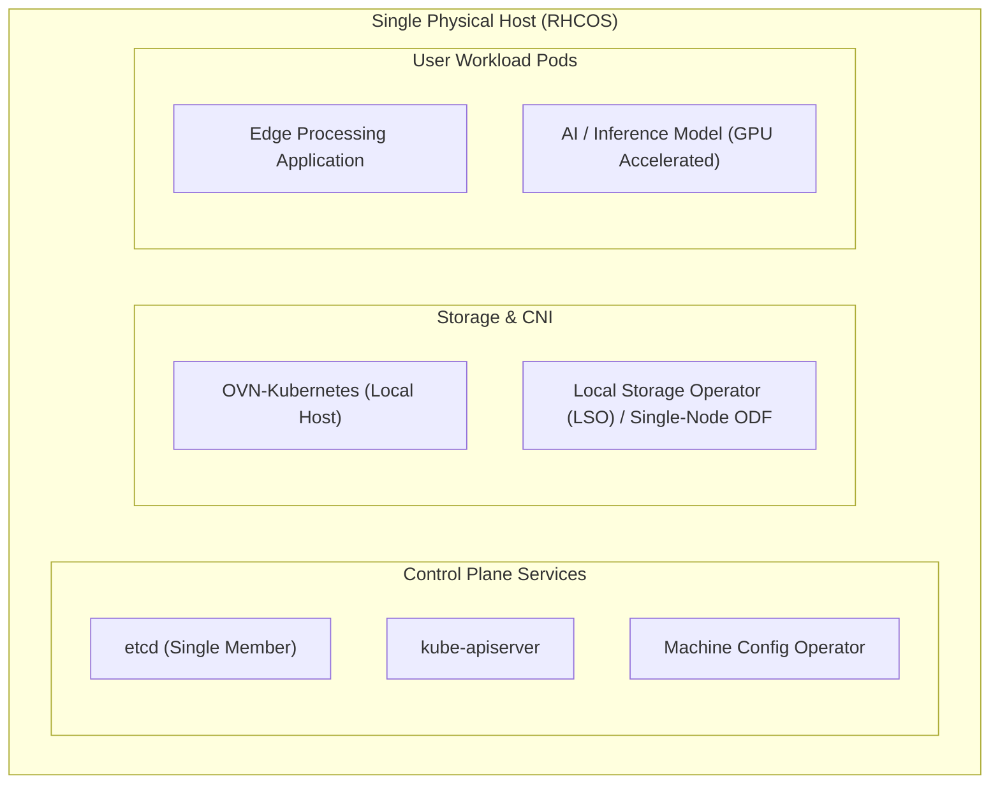

# Single Node OpenShift (SNO) Architecture & Engineering

Single Node OpenShift (SNO) packs the entire OpenShift Container Platform stack—etcd, Kubernetes control plane, CNI, storage, and customer workloads—onto a single physical bare-metal host or virtual machine.

---

## Architecture Overview

---

## Technical Specifications & Resource Baselines

| Component | Minimum Specification | Recommended Production Spec |
| :--- | :--- | :--- |
| **CPU** | 8 vCPUs (x86_64 or aarch64) | 16 to 32 vCPUs |
| **RAM** | 16 GB (minimal edge) | 32 to 64 GB ECC RAM |
| **Storage** | 120 GB SSD (Enterprise SATA) | 500 GB+ NVMe SSD |
| **Network** | 1x 1Gbps NIC | 2x 10Gbps/25Gbps (Bonded LACP / Active-Backup) |

---

## etcd in SNO: Absence of Quorum
Because SNO runs exactly one etcd member, **quorum loss does not exist in the traditional multi-node sense**. However:
- If etcd crashes or the disk becomes corrupted, the node goes offline immediately.
- Regular automated backups via  sent off-node (via NFS, S3, or rsync) are mandatory.
- Re-installing an SNO via Agent-Based ISO takes approximately 18–25 minutes.

---

## High Availability and Failure Domains
- **Node Failure**: Complete outage of all workloads. High availability must be handled at the application/DNS layer across multiple distinct SNO instances (e.g. via Red Hat Advanced Cluster Management - ACM and global load balancing).
- **Cluster Upgrades**: SNO upgrades cause workload interruption during node reboot. In OCP 4.20, upgrade reboots can be coordinated via maintenance windows and ACM ZTP policies.

---
[Next: 3-Node Compact Converged](02-compact-3-node-converged.md) • [Back to Topologies Index](README.md)
