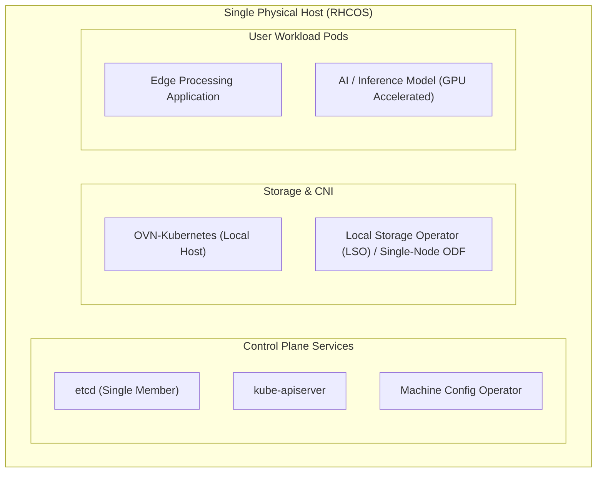

# Single Node OpenShift (SNO) Architecture & Engineering

Single Node OpenShift (SNO) packs the entire OpenShift Container Platform stack—etcd, Kubernetes control plane, CNI, storage, and customer workloads—onto a single physical bare-metal host or virtual machine.

---

## Architecture Overview



#### Architectural Breakdown: SNO Converged Stack

- **Unified Operating Environment**: RHCOS core system runs directly on a single physical server or VM with all Kubernetes control plane components, CNI, storage, and customer workloads converged onto a single node.
- **Single-Member etcd Engine**: Operates with a single etcd instance; quorum checks are disabled (`--listen-client-urls`, no peer clustering), eliminating split-brain risks while retaining full Kubernetes API functionality.
- **Integrated Local Storage & CNI**: Local Storage Operator (LSO) or Single-Node ODF provisions persistent volumes from local NVMe/SSD disks, while OVN-Kubernetes provides internal loopback and SDN routing without cross-node network encapsulation overhead.
- **Autonomous Edge Survivability**: Operates continuously without requiring network connectivity to a central datacenter, making it ideal for tactical edge, retail, industrial IoT, and far-edge AI inference.

---

## Technical Specifications & Resource Baselines

| Component | Minimum Specification | Recommended Production Spec |
| :--- | :--- | :--- |
| **CPU** | 8 vCPUs (x86_64 or aarch64) | 16 to 32 vCPUs |
| **RAM** | 16 GB (minimal edge) | 32 to 64 GB ECC RAM |
| **Storage** | 120 GB SSD (Enterprise SATA) | 500 GB+ NVMe SSD |
| **Network** | 1x 1Gbps NIC | 2x 10Gbps/25Gbps (Bonded LACP / Active-Backup) |

---

## End-to-End Step-by-Step Implementation Procedure

### Step 1: Physical Host & BIOS Preparation
1. Access server out-of-band management (Dell iDRAC, HPE iLO, or Lenovo XCC).
2. Set boot mode strictly to **UEFI** (Legacy BIOS is deprecated in RHCOS 9.6+).
3. Enable virtualization extensions (Intel VT-x / AMD-V) and IOMMU / SR-IOV if attaching physical accelerators.
4. Configure hardware RAID-1 for the OS boot drive (e.g. 2x 480GB SSDs) and leave application storage disks as raw non-RAID NVMe drives.

### Step 2: Prepare Workspace & Input Manifests
1. Create a dedicated directory on your deployment workstation:
   ```bash
   mkdir -p ~/sno-cluster && cd ~/sno-cluster
   ```
2. Create `install-config.yaml` specifying `controlPlane.replicas: 1` and `compute[0].replicas: 0`:
   ```yaml
   apiVersion: v1
   baseDomain: edge.corp.local
   metadata:
     name: sno-node01
   controlPlane:
     name: master
     replicas: 1
     architecture: amd64
   compute:
     - name: worker
       replicas: 0
   networking:
     networkType: OVNKubernetes
     clusterNetwork:
       - cidr: 10.128.0.0/14
         hostPrefix: 23
     serviceNetwork:
       - 172.30.0.0/16
     machineNetwork:
       - cidr: 192.168.50.0/24
   platform:
     none: {}
   pullSecret: '{"auths":{...}}'
   sshKey: 'ssh-ed25519 AAAAC3NzaC1lZDI1NTE5AAAAI... admin@corp'
   ```
3. Create `agent-config.yaml` with the host NMState static IP configuration:
   ```yaml
   apiVersion: v1alpha1
   kind: AgentConfig
   metadata:
     name: sno-node01-agent
   rendezvousIP: 192.168.50.10
   hosts:
     - hostname: sno-node01.edge.corp.local
       role: master
       rootDeviceHints:
         deviceName: /dev/sda
       interfaces:
         - name: eth0
           macAddress: '52:54:00:a1:b2:c3'
       networkConfig:
         interfaces:
           - name: eth0
             type: ethernet
             state: up
             ipv4:
               enabled: true
               address:
                 - ip: 192.168.50.10
                   prefix-length: 24
               dhcp: false
         dns-resolver:
           config:
             server:
               - 192.168.50.1
         routes:
           config:
             - destination: 0.0.0.0/0
               next-hop-address: 192.168.50.1
               next-hop-interface: eth0
   ```

### Step 3: Generate the Agent-Based Bootable ISO
1. Execute the agent image creation command:
   ```bash
   openshift-install agent create image --dir=. --log-level=info
   ```
2. Verify the generated output file `agent.x86_64.iso` and note its SHA256 checksum:
   ```bash
   sha256sum agent.x86_64.iso
   ```

### Step 4: Mount ISO & Initiate Installation
1. Mount `agent.x86_64.iso` via BMC Virtual Media (or write to a bootable USB drive via `dd if=agent.x86_64.iso of=/dev/sdX bs=4M status=progress`).
2. Power on the host and select Virtual Optical Drive as the one-time boot device.
3. The host boots into RHCOS Live. The Assisted Installer agent automatically initializes Bootstrap-in-Place.

### Step 5: Monitor Installation Progress
1. From your administration bastion, track the installation phases:
   ```bash
   openshift-install agent wait-for install-complete --dir=. --log-level=info
   ```
2. Once complete, export the generated kubeconfig:
   ```bash
   export KUBECONFIG=$(pwd)/auth/kubeconfig
   oc get nodes
   oc get clusteroperators
   ```

### Step 6: Deploy Local Storage Operator (LSO)
1. Since SNO has no external SAN/CSI by default, install the Local Storage Operator to discover extra raw NVMe drives:
   ```bash
   oc apply -f configs/day1/lso-subscription.yaml
   ```
2. Create a `LocalVolume` CR to provision persistent storage classes for edge workloads.

### Step 7: Configure Off-Node etcd Backups
1. Because SNO lacks multi-node quorum, schedule daily etcd snapshot creation to an external NFS or S3 bucket using [`scripts/etcd-backup.sh`](../../scripts/etcd-backup.sh).

---
[Next: 3-Node Compact Converged](02-compact-3-node-converged.md) • [Back to Topologies Index](README.md)
