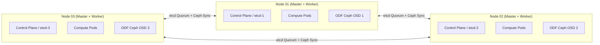

# 3-Node Compact Converged Architecture

The 3-Node Compact Converged topology collocates control plane components, compute workloads, and distributed storage (OpenShift Data Foundation - ODF) onto three physical or virtual nodes.

---

## Architecture Blueprint



---

## Hardware Sizing Table (Per Node)

| Hardware Resource | Minimum Requirement | Recommended (with ODF Ceph) |
| :--- | :--- | :--- |
| **CPU Cores** | 16 physical cores (32 threads) | 32 physical cores (64 threads) |
| **RAM** | 64 GB ECC | 128 GB - 256 GB ECC |
| **OS Storage** | 2x 240 GB SSD (Hardware RAID-1) | 2x 480 GB NVMe (Hardware RAID-1) |
| **ODF Storage Disks**| 1x 1TB Dedicated Enterprise NVMe | 2-4x 1.92TB NVMe SSDs (Raw, no RAID) |
| **Networking** | 2x 10Gbps Bonded | 2x 25Gbps Bonded (Separate VLANs for Ceph public & cluster) |

---

## End-to-End Step-by-Step Implementation Procedure

### Step 1: Network & Virtual IP Allocation
1. Reserve 3 static IP addresses for the physical hosts (`192.168.10.11`, `.12`, `.13`).
2. Reserve 2 static Virtual IPs (VIPs) on the same subnet:
   - `apiVIPs`: `192.168.10.100` (`api.compact.corp.local` and `api-int.compact.corp.local`)
   - `ingressVIPs`: `192.168.10.101` (`*.apps.compact.corp.local`)
3. Pre-configure forward DNS and reverse PTR records for all 5 IP addresses.

### Step 2: Configure install-config.yaml
1. Create `install-config.yaml` specifying `platform.baremetal` with the VIPs:
   ```yaml
   apiVersion: v1
   baseDomain: corp.local
   metadata:
     name: compact
   compute:
     - name: worker
       replicas: 0
   controlPlane:
     name: master
     replicas: 3
     architecture: amd64
   networking:
     networkType: OVNKubernetes
     machineNetwork:
       - cidr: 192.168.10.0/24
   platform:
     baremetal:
       apiVIPs:
         - 192.168.10.100
       ingressVIPs:
         - 192.168.10.101
   pullSecret: '{"auths":{...}}'
   sshKey: 'ssh-ed25519 AAAAC3... admin@corp'
   ```

### Step 3: Define agent-config.yaml with Rendezvous Host
1. Select `master-0` (`192.168.10.11`) as the `rendezvousIP`.
2. Configure all 3 master hosts with their MAC addresses and NMState bonded interfaces (LACP or Active-Backup):
   ```yaml
   apiVersion: v1alpha1
   kind: AgentConfig
   metadata:
     name: compact-agent
   rendezvousIP: 192.168.10.11
   hosts:
     - hostname: master-0.compact.corp.local
       role: master
       interfaces:
         - name: bond0
           macAddress: '52:54:00:10:00:01'
     - hostname: master-1.compact.corp.local
       role: master
       interfaces:
         - name: bond0
           macAddress: '52:54:00:10:00:02'
     - hostname: master-2.compact.corp.local
       role: master
       interfaces:
         - name: bond0
           macAddress: '52:54:00:10:00:03'
   ```

### Step 4: Build ISO and Boot All 3 Nodes Simultaneously
1. Generate the ISO:
   ```bash
   openshift-install agent create image --dir=.
   ```
2. Mount the generated `agent.x86_64.iso` to all 3 servers via Redfish Virtual Media.
3. Power on all three servers at the same time.
4. `master-0` boots Assisted Service, `master-1` and `master-2` discover `master-0`, and Bootstrap-in-Place establishes Raft quorum.

### Step 5: Wait for Cluster Availability
1. Execute the wait command:
   ```bash
   openshift-install agent wait-for install-complete --dir=.
   ```
2. Confirm all 3 nodes report `Ready,SchedulingDisabled=false` (masters are schedulable):
   ```bash
   oc get nodes
   ```

### Step 6: Deploy Converged OpenShift Data Foundation (ODF)
1. Install the ODF Operator from OperatorHub.
2. Create the `StorageCluster` CR targeting raw NVMe disks across all 3 nodes.
3. Verify Ceph MON, MGR, and OSD pods reach `Running` state and standard storage classes (`ocs-storagecluster-ceph-rbd`, `ocs-storagecluster-cephfs`) are created.

---
[Next: Standard Multi-Node HA](03-standard-ha-multinode.md) • [Back to Topologies Index](README.md)
