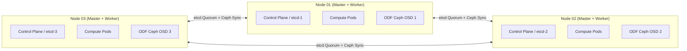

# 3-Node Compact Converged Architecture

The 3-Node Compact Converged topology collocates control plane components, compute workloads, and distributed storage (OpenShift Data Foundation - ODF) onto three physical or virtual nodes.

---

## Architecture Blueprint

---

## Hardware Sizing Table (Per Node)

| Hardware Resource | Minimum Requirement | Recommended (with ODF Ceph) |
| :--- | :--- | :--- |
| **CPU Cores** | 16 physical cores (32 threads) | 32 physical cores (64 threads) |
| **RAM** | 64 GB ECC | 128 GB - 256 GB ECC |
| **OS Storage** | 2x 240 GB SSD (Hardware RAID-1) | 2x 480 GB NVMe (Hardware RAID-1) |
| **ODF Storage Disks**| 1x 1TB Dedicated Enterprise NVMe | 2-4x 1.92TB NVMe SSDs (Raw, no RAID) |
| **Networking** | 2x 10Gbps Bonded | 2x 25Gbps Bonded (Separate VLANs for Ceph public & cluster) |

---

## Critical Engineering Considerations
1. **Schedulable Masters**:
   - In ,  is set to . The installer automatically configures .
2. **Failure Quorum**:
   - Tolerates exactly **1 node failure**. If node 1 fails, etcd maintains 2/3 quorum. If a second node fails, etcd loses quorum and the cluster enters read-only emergency state.
3. **ODF Converged Mode**:
   - Ceph MON pods run on each of the 3 nodes. Ceph OSDs consume local raw NVMe disks via the Local Storage Operator (LSO).
4. **No Dedicated Infra Pool**:
   - System workloads (monitoring, logging, ingress) run alongside user workloads. Pod resource requests and limits ( and ) must be strictly enforced.

---
[Next: Standard Multi-Node HA](03-standard-ha-multinode.md) • [Back to Topologies Index](README.md)
