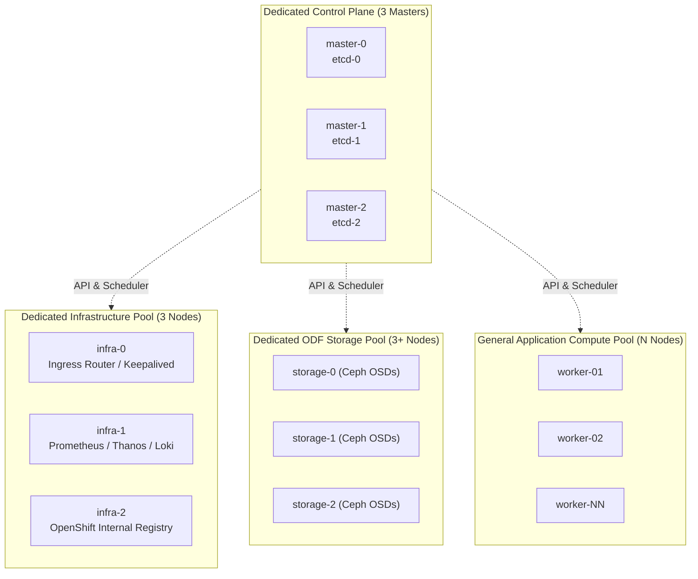

# Standard Multi-Node High Availability (HA) Architecture

Standard Multi-Node HA is the gold standard for enterprise production environments, providing strict physical and logical separation between the Kubernetes Control Plane, System Infrastructure services, and Application Workload compute pools.

---

## Enterprise Topology Blueprint



#### Architectural Breakdown: Multi-Tier Infrastructure Separation

- **Dedicated Control Plane Pool (3 Master Nodes)**: Purely hosts `kube-apiserver`, `etcd`, `kube-controller-manager`, and `openshift-apiserver`. Tainted with `node-role.kubernetes.io/master:NoSchedule` to prevent user workloads from impacting Raft stability and cluster coordination.
- **Dedicated Infrastructure Pool (`infra-0` to `infra-2`)**: Segregates cluster-wide ingress routers, Keepalived VIP handlers, Prometheus/Thanos/Loki monitoring, and the OpenShift internal image registry away from worker nodes, preventing subscription licensing consumption and noisy-neighbor interference.
- **Dedicated ODF Storage Pool (`storage-0` to `storage-2+`)**: Isolates storage daemons (Ceph OSDs, MONs, MGRs) on servers with high-speed NVMe drives and dedicated 25GbE storage networking to deliver guaranteed IOPS to database and stateful workloads.
- **General Worker Pool (`worker-01` to `worker-NN`)**: Horizontally scalable compute nodes running user application containers, AI inferencing pods, and OpenShift Virtualization VMs, completely decoupled from control plane lifecycles.

---

## End-to-End Step-by-Step Implementation Procedure

### Step 1: Pre-Allocating Subnets and Enterprise DNS
1. Plan machine network CIDR (e.g., `10.240.0.0/22`).
2. Establish static records in enterprise DNS:
   - `api.prod.corp.local` -> Load Balancer VIP (`10.240.0.10`)
   - `api-int.prod.corp.local` -> Load Balancer VIP (`10.240.0.10`)
   - `*.apps.prod.corp.local` -> Ingress Load Balancer VIP (`10.240.0.11`)
3. Configure enterprise load balancers (F5 BIG-IP / Citrix / HAProxy) with health checks:
   - Port 6443 (API): `GET /readyz` HTTP 200 check.
   - Port 22623 (Machine Config): TCP check.

### Step 2: Formulate Multi-Pool install-config.yaml
1. Define 3 Control Plane replicas and initial Worker replicas (e.g. 6 workers):
   ```yaml
   apiVersion: v1
   baseDomain: corp.local
   metadata:
     name: prod
   controlPlane:
     name: master
     replicas: 3
     architecture: amd64
   compute:
     - name: worker
       replicas: 6
       architecture: amd64
   networking:
     networkType: OVNKubernetes
     machineNetwork:
       - cidr: 10.240.0.0/22
   platform:
     baremetal:
       apiVIPs:
         - 10.240.0.10
       ingressVIPs:
         - 10.240.0.11
   pullSecret: '{"auths":{...}}'
   sshKey: 'ssh-ed25519 AAAAC3... admin@corp'
   ```

### Step 3: Build & Boot via Agent-Based ISO
1. Generate ISO:
   ```bash
   openshift-install agent create image --dir=./prod-cluster
   ```
2. Attach `agent.x86_64.iso` to all 9 physical servers via Redfish Virtual Media.
3. Power on servers; observe Rendezvous host coordination and automated node joining.

### Step 4: Carve Out Dedicated Infrastructure MachineConfigPool
1. Once installation completes, select 3 worker nodes to become dedicated Infra nodes:
   ```bash
   oc label node worker-0.corp.local node-role.kubernetes.io/infra=""
   oc label node worker-1.corp.local node-role.kubernetes.io/infra=""
   oc label node worker-2.corp.local node-role.kubernetes.io/infra=""
   oc label node worker-0.corp.local node-role.kubernetes.io/worker-
   oc label node worker-1.corp.local node-role.kubernetes.io/worker-
   oc label node worker-2.corp.local node-role.kubernetes.io/worker-
   ```
2. Taint the infra nodes to prevent regular workloads from scheduling:
   ```bash
   oc adm taint nodes -l node-role.kubernetes.io/infra node-role.kubernetes.io/infra=reserved:NoSchedule
   ```
3. Apply the Infra `MachineConfigPool` manifest:
   ```bash
   oc apply -f configs/day1/mcp-infra-nodes.yaml
   ```

### Step 5: Migrate Ingress, Monitoring, and Registry to Infra Nodes
1. Update IngressController node placement to target `node-role.kubernetes.io/infra`:
   ```bash
   oc patch ingresscontroller.operator default -n openshift-ingress-operator --type=merge -p '{"spec":{"nodePlacement":{"nodeSelector":{"matchLabels":{"node-role.kubernetes.io/infra":""}},"tolerations":[{"key":"node-role.kubernetes.io/infra","operator":"Exists","effect":"NoSchedule"}]}}}'
   ```
2. Move OpenShift Monitoring (Prometheus/Thanos) and OpenShift Logging (LokiStack) by updating `cluster-monitoring-config` with matching nodeSelector and tolerations.

---
[Next: Remote Worker Nodes over WAN](04-remote-workers-wan.md) • [Back to Topologies Index](README.md)
