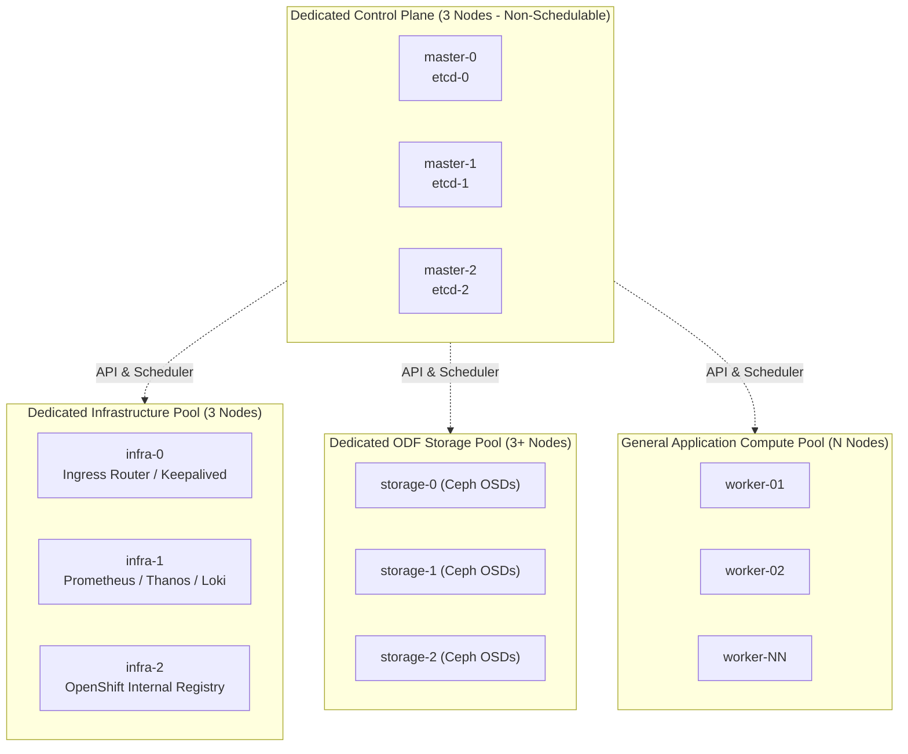

# Standard Multi-Node High Availability (HA) Architecture

Standard Multi-Node HA is the gold standard for enterprise production environments, providing strict physical and logical separation between the Kubernetes Control Plane, System Infrastructure services, and Application Workload compute pools.

---

## Enterprise Topology Blueprint

---

## Node Roles & MachineConfigPools (MCP)

To maintain stability at scale, the cluster is divided into distinct MachineConfigPools:

1. ** Pool**:
   - Size: Exactly 3 nodes (odd number for Raft quorum).
   - Taint:  (immutable).
   - Dedicated low-latency network interface for etcd replication.
2. ** Pool**:
   - Size: 3 nodes minimum (distributed across distinct failure zones / racks).
   - Taint: .
   - Workload assignment: IngressController, OpenShift Monitoring (Prometheus, Alertmanager), OpenShift Logging (Vector, LokiStack), Quay Registry.
3. ** Pool (Optional if running external SAN/NAS or separate ODF)**:
   - Size: 3 to 12 nodes.
   - Dedicated NVMe disks and 25/100GbE storage fabric.
4. ** Pool**:
   - Size: 3 to 2,000+ nodes.
   - Dynamic scaling via MachineSets or manual expansion.

---
[Next: Remote Worker Nodes over WAN](04-remote-workers-wan.md) • [Back to Topologies Index](README.md)
