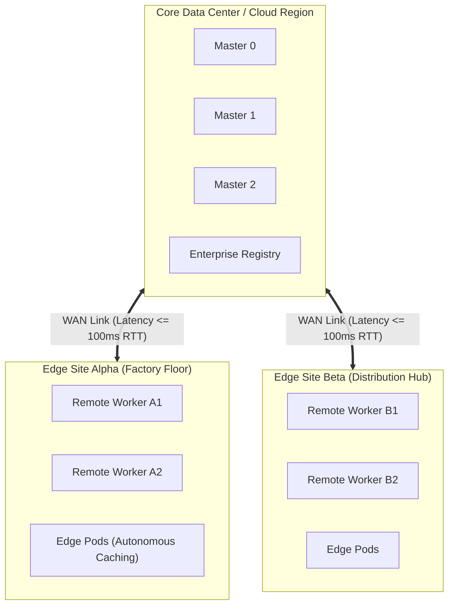

# Remote Worker Nodes over WAN Architecture

OpenShift 4.20 supports deploying worker nodes at remote edge sites or branch offices connected over Wide Area Networks (WAN) to a centralized 3-node Control Plane residing in a core data center or cloud region.

---

## Architectural Layout



---

## End-to-End Step-by-Step Implementation Procedure

### Step 1: Network & WAN SLA Verification
1. Validate that the WAN link between the Core Data Center and Edge Site satisfies:
   - Latency <= **100ms RTT** (ping test over 24 hours under load).
   - Packet loss < **0.5%**.
   - Available bandwidth >= **100 Mbps** per remote worker.
2. Ensure intermediate firewalls permit UDP port 6081 (OVN Geneve overlay) and TCP port 10250 (Kubelet).

### Step 2: Apply Remote Worker KubeletConfig to Core Cluster
1. Tune heartbeat reporting to prevent the master from evicting edge pods during transient WAN spikes:
   ```yaml
   apiVersion: machineconfiguration.openshift.io/v1
   kind: KubeletConfig
   metadata:
     name: remote-worker-kubelet-tuning
   spec:
     machineConfigPoolSelector:
       matchLabels:
         pools.operator.openshift.io/remote-worker: ""
     kubeletConfig:
       nodeStatusUpdateFrequency: 10s
       nodeStatusReportFrequency: 1m
   ```
2. Apply the manifest and verify the new rendered MachineConfig is generated.

### Step 3: Generate Remote Worker Discovery ISO
1. Using the central cluster's ignition and discovery service, generate a worker-specific bootable ISO:
   ```bash
   oc adm node-image create --role=worker --dir=./remote-worker-iso
   ```

### Step 4: Boot Remote Worker at the Edge Site
1. Boot the physical edge server using the generated worker ISO via local USB or edge BMC.
2. The node pulls its network configuration, reaches out across the WAN to `api-int.core.corp.local:22623`, and downloads `worker.ign`.

### Step 5: Approve Edge Node Certificate Signing Requests (CSRs)
1. Monitor pending CSRs on the core cluster:
   ```bash
   oc get csr -w
   ```
2. Approve node join certificates:
   ```bash
   oc get csr -o name | xargs oc adm certificate approve
   ```
3. Verify the remote worker appears in `Ready` state:
   ```bash
   oc get nodes -l node-role.kubernetes.io/remote-worker
   ```

### Step 6: Configure Autonomous Local Edge Pod Resilience
1. Set pod tolerations so workloads continue running during WAN disconnections:
   ```yaml
   tolerations:
     - key: "node.kubernetes.io/unreachable"
       operator: "Exists"
       effect: "NoExecute"
       tolerationSeconds: 86400  # Tolerate 24 hours of disconnection
     - key: "node.kubernetes.io/not-ready"
       operator: "Exists"
       effect: "NoExecute"
       tolerationSeconds: 86400
   ```

---
[Next: Hosted Control Planes (HyperShift)](05-hypershift-hosted-cp.md) • [Back to Topologies Index](README.md)
