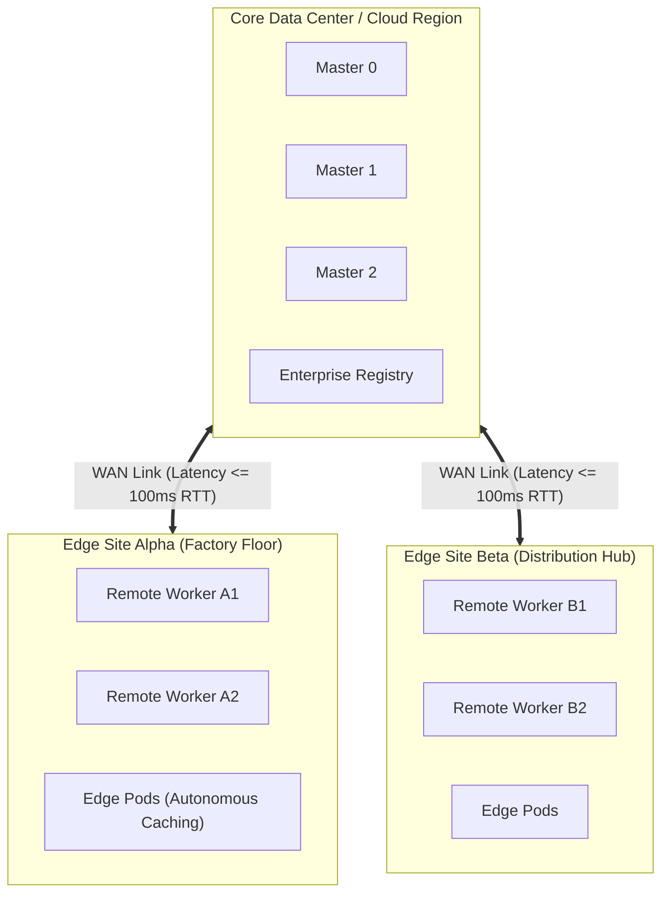

# Remote Worker Nodes over WAN Architecture

OpenShift 4.20 supports deploying worker nodes at remote edge sites or branch offices connected over Wide Area Networks (WAN) to a centralized 3-node Control Plane residing in a core data center or cloud region.

---

## Architectural Layout



---

## Network & Latency Engineering Parameters

| Parameter | Threshold Requirement | Consequence of Violation |
| :--- | :--- | :--- |
| **Max Network Latency** | <= 100ms RTT | Kubelet node heartbeats time out; master marks node  |
| **Network Bandwidth** | >= 100 Mbps per worker | Slow image pulling and metric collection throttling |
| **Packet Loss** | < 0.5% | TCP retransmissions impact etcd lease updates and pod status |
| **CNI Encapsulation** | OVN-Kubernetes Geneve (UDP 6081)| Firewalls across WAN must allow UDP 6081 and IPsec/WireGuard |

---

## Kubelet Heartbeat Tuning for WAN Links
Under default configurations, a node is marked  if the master does not receive node status for 40 seconds. For WAN links with transient jitter, tune the  via MCO:

```yaml
apiVersion: machineconfiguration.openshift.io/v1
kind: KubeletConfig
metadata:
  name: remote-worker-kubelet-tuning
spec:
  machineConfigPoolSelector:
    matchLabels:
      pools.operator.openshift.io/remote-worker: ""
  kubeletConfig:
    nodeStatusUpdateFrequency: 10s
    nodeStatusReportFrequency: 1m
```

---
[Next: Hosted Control Planes (HyperShift)](05-hypershift-hosted-cp.md) • [Back to Topologies Index](README.md)
