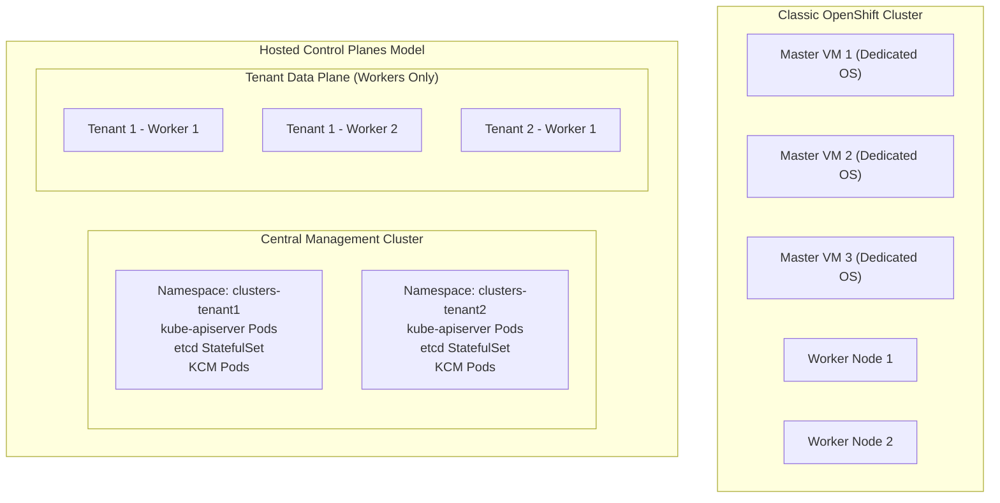

# Hosted Control Planes (HyperShift) Architecture

Hosted Control Planes (HyperShift) decouple the OpenShift control plane from the data plane, running the master components as native Kubernetes workloads (deployments, statefulsets, and configmaps) inside a centralized Management (Hosting) Cluster.

---

## Architectural Comparison



---

## End-to-End Step-by-Step Implementation Procedure

### Step 1: Install HyperShift CLI & Operator on Management Cluster
1. Ensure the management cluster is running OpenShift 4.20 with Red Hat Advanced Cluster Management (ACM 2.12+).
2. Install the `hypershift` CLI binary:
   ```bash
   curl -sSL -o hypershift https://mirror.openshift.com/pub/openshift-v4/clients/hypershift/latest/hypershift-linux.tar.gz
   tar -xzf hypershift-linux.tar.gz && sudo mv hypershift /usr/local/bin/
   ```
3. Initialize the Hosted Control Plane Operator on the Management Cluster:
   ```bash
   hypershift install --oidc-storage-provider-s3-bucket=enterprise-hypershift-oidc                       --oidc-storage-provider-s3-region=eu-west-1                       --oidc-storage-provider-s3-credentials=~/.aws/credentials
   ```

### Step 2: Create a HostedCluster Custom Resource
1. Deploy a new hosted control plane targeting AWS, KubeVirt, or Agent bare-metal workers:
   ```bash
   hypershift create cluster aws      --name tenant-alpha      --node-pool-replicas 3      --base-domain corp.cloud      --region eu-west-1      --pull-secret ~/.openshift/pull-secret      --aws-creds ~/.aws/credentials      --release-image quay.io/openshift-release-dev/ocp-release:4.20.0-x86_64
   ```

### Step 3: Monitor Control Plane Pod Deployment
1. Inspect the hosted control plane namespace on the Management Cluster:
   ```bash
   oc get pods -n clusters-tenant-alpha
   ```
2. Verify `kube-apiserver`, `etcd-0/1/2`, `openshift-apiserver`, and `oauth-openshift` pods reach `Running` state in under 60 seconds.

### Step 4: Extract Tenant Kubeconfig & Access Cluster
1. Retrieve the kubeconfig for the hosted tenant cluster:
   ```bash
   hypershift create kubeconfig --name tenant-alpha > tenant-alpha.kubeconfig
   export KUBECONFIG=$(pwd)/tenant-alpha.kubeconfig
   oc get nodes
   ```

### Step 5: Scale and Manage Worker NodePools
1. Scale the tenant data plane dynamically without affecting the control plane:
   ```bash
   oc scale nodepool tenant-alpha -n clusters --replicas=10
   ```

### Step 6: Zero-Downtime Control Plane Upgrades
1. Update the control plane version with zero disruption to tenant worker workloads:
   ```bash
   oc patch hostedcluster tenant-alpha -n clusters --type=merge -p '{"spec":{"release":{"image":"quay.io/openshift-release-dev/ocp-release:4.20.1-x86_64"}}}'
   ```

---
[Back to Topologies Index](README.md) • [Next Chapter: Provisioning Paradigms](../02-provisioning-paradigms/README.md)
