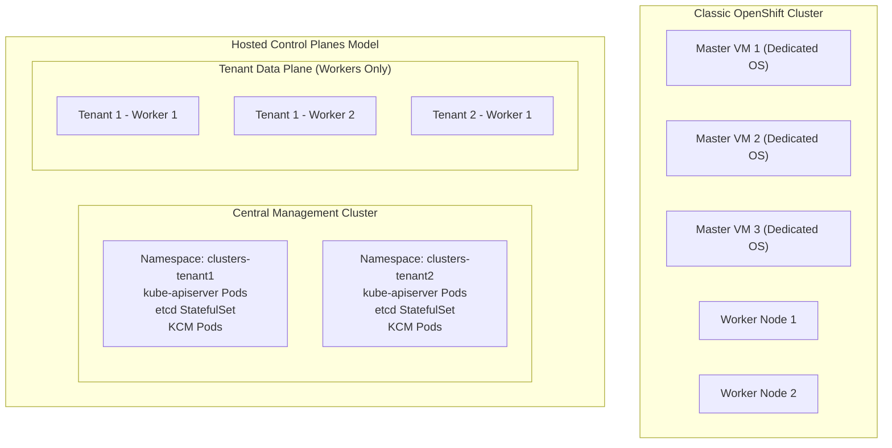

# Hosted Control Planes (HyperShift) Architecture

Hosted Control Planes (historically known as HyperShift) decouple the OpenShift control plane from the data plane, running the master components as native Kubernetes workloads (deployments, statefulsets, and configmaps) inside a centralized Management (Hosting) Cluster.

---

## Architectural Comparison

---

## Advantages of Hosted Control Planes in 2026

1. **Massive Infrastructure Cost Reduction**:
   - Eliminates 3 dedicated master nodes per cluster. A management cluster with 3 physical nodes can host 50+ tenant control planes.
2. **Sub-Minute Cluster Creation**:
   - Spawning a new control plane takes ~45 seconds (standard Pod startup time) compared to 25–45 minutes for full VM provisioning.
3. **Strong Blast Radius Isolation**:
   - Tenants only access worker nodes; tenant administrators have zero SSH or physical access to control plane operating systems.
4. **Automated Centralized Lifecycle**:
   - Upgrading control planes is executed through standard rolling updates of Kubernetes deployments managed by Red Hat Advanced Cluster Management (ACM).

---
[Back to Topologies Index](README.md) • [Next Chapter: Provisioning Paradigms](../02-provisioning-paradigms/README.md)
