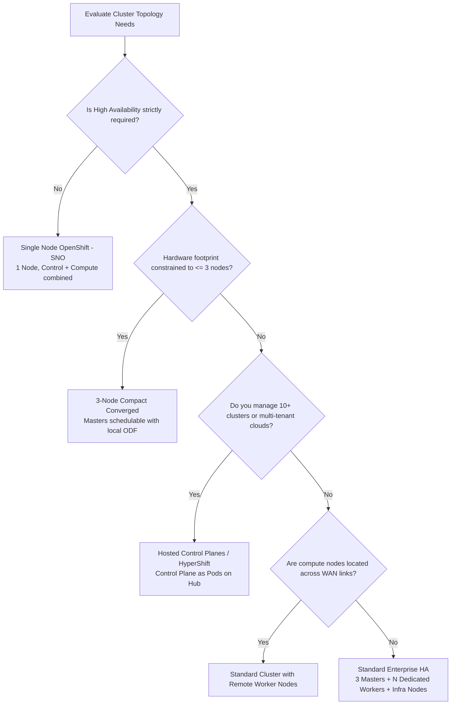

# 01 - OpenShift 4.20 Architecture & Cluster Topologies

Choosing the correct cluster topology is the foundational architectural decision in Day 0 planning. Red Hat OpenShift 4.20 supports five primary deployment topologies to address use cases ranging from edge telecommunications to multi-tenant enterprise data centers.

---

## Topology Comparison Matrix

| Topology | Min Control Nodes | Min Worker Nodes | Typical Footprint | Schedulable Masters | High Availability (HA) | Primary Target Use Case |
| :--- | :---: | :---: | :---: | :---: | :---: | :--- |
| **Single Node OpenShift (SNO)** | 1 | 0 | 8-16 vCPU, 32-64 GB RAM | Yes | No (Single failure domain) | Far Edge, 5G Cell Sites, Retail Stores, Factory Automation |
| **3-Node Compact Converged** | 3 | 0 | 48 vCPU, 192 GB RAM total | Yes | Yes (Tolerates 1 node failure) | Space-constrained On-Prem, Remote Branches (ROBO), Cost-optimized Core |
| **Standard Multi-Node HA** | 3 | 3+ | Dedicated Master & Worker | No | Yes (Tolerates master & multi-worker failures) | Enterprise Production, Tier-1 Multi-tenant, Scale-out Compute |
| **Remote Worker Nodes (WAN)** | 3 | Distributed | Central Masters + Remote Edge | No | Centralized control HA; Edge workloads run locally | Multi-branch retail, edge compute with centralized management |
| **Hosted Control Planes (HyperShift)**| Pods | N Workers | Lightweight Pods on Mgmt Cluster | N/A | High (Kubernetes-native control plane HA) | High-density multi-cluster tenancy, Telco edge slicing, Dev/Test automation |

---

## Architecture Selection Flowchart

---

## Sizing & Capacity Planning Guidelines

1. **etcd Disk Latency Requirement**:
   - Master nodes require p99 disk write latency under **10ms** (fdatasync). Solid-State NVMe or high-performance enterprise SSDs are mandatory.
2. **Infra Node Isolation**:
   - For Standard HA clusters exceeding 10 worker nodes, dedicate 3 Infra Nodes for Ingress routers, internal image registry, monitoring (Thanos/Prometheus), and OpenShift logging to prevent noisy-neighbor eviction on compute nodes.
3. **CoreOS In-Place Pivot**:
   - OpenShift 4.20 control plane runs on Red Hat Enterprise Linux CoreOS (RHCOS 9.6+), requiring immutable OS management via MachineConfig Operator (MCO).

---
[Back to Global Navigation](../00-navigation.md)
