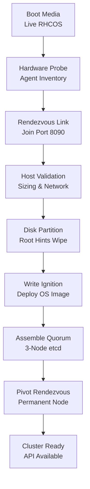

# OpenShift 4.20 Agent-Based Installer (ABI) Master Architecture & Engineering Guide

The **Agent-Based Installer (ABI)** is Red Hat's premier installation engine for enterprise OpenShift 4.20 on physical bare metal, VMware vSphere, Nutanix AHV, KVM, and edge clusters. ABI merges the automated intelligence of the Assisted Installer with the deterministic, offline control of declarative YAML configurations (`install-config.yaml` and `agent-config.yaml`), producing self-contained boot artifacts that operate completely out-of-band.

---

## Table of Contents

- [The Architectural Paradigm: Bootstrap-in-Place (BiP)](#the-architectural-paradigm-bootstrap-in-place-bip)
  - [Eliminating the 4th Temporary Bootstrap Node](#eliminating-the-4th-temporary-bootstrap-node)
  - [Assisted Service In-Memory Container Architecture](#assisted-service-in-memory-container-architecture)
  - [Bootstrap-in-Place Convergence Flow](#bootstrap-in-place-convergence-flow)
- [Complete CLI Command Reference](#complete-cli-command-reference)
  - [Global Flags & Options](#global-flags--options)
  - [Subcommand Directory](#subcommand-directory)
- [Complete Configuration Schema & Option Dictionaries](#complete-configuration-schema--option-dictionaries)
  - [`install-config.yaml` Option Dictionary](#install-configyaml-option-dictionary)
  - [`agent-config.yaml` Option Dictionary](#agent-configyaml-option-dictionary)
  - [Root Device Hints Specification](#root-device-hints-specification)
  - [NMState Declarative Networking Specification](#nmstate-declarative-networking-specification)
- [All 8 Enterprise Deployment Scenarios](#all-8-enterprise-deployment-scenarios)
  - [Scenario 1: Single Node OpenShift (SNO)](#scenario-1-single-node-openshift-sno)
  - [Scenario 2: 3-Node Compact Converged Cluster](#scenario-2-3-node-compact-converged-cluster)
  - [Scenario 3: Standard Multi-Node High Availability (Dedicated Masters + Workers)](#scenario-3-standard-multi-node-high-availability-dedicated-masters--workers)
  - [Scenario 4: Disconnected / Air-Gapped Dark-Site Deployment](#scenario-4-disconnected--air-gapped-dark-site-deployment)
  - [Scenario 5: High-Throughput LACP Bonded & 802.1Q VLAN Segmented Network](#scenario-5-high-throughput-lacp-bonded--8021q-vlan-segmented-network)
  - [Scenario 6: PXE / iPXE Network Booting (without Virtual Media)](#scenario-6-pxe--ipxe-network-booting-without-virtual-media)
  - [Scenario 7: Multi-Disk SAN / NVMe Storage with Root Device Hints](#scenario-7-multi-disk-san--nvme-storage-with-root-device-hints)
  - [Scenario 8: Day 0 Custom Manifest & MachineConfig Pre-Injection](#scenario-8-day-0-custom-manifest--machineconfig-pre-injection)
- [Rendezvous Host Triage & Deep Troubleshooting](#rendezvous-host-triage--deep-troubleshooting)
  - [Live SSH Access During Installation](#live-ssh-access-during-installation)
  - [Assisted Service REST API Endpoints](#assisted-service-rest-api-endpoints)
  - [Diagnostic Commands & Log Locations](#diagnostic-commands--log-locations)
  - [Common Failure Modes & Recovery Runbooks](#common-failure-modes--recovery-runbooks)

---

## The Architectural Paradigm: Bootstrap-in-Place (BiP)

### Eliminating the 4th Temporary Bootstrap Node

In legacy OpenShift 4 UPI and IPI installations, deploying a 3-node control plane required provisioning a 4th physical or virtual server: the **Bootstrap Node**. This node ran an ephemeral control plane (temporary etcd, temporary kube-apiserver, and temporary bootkube), orchestrated the installation of the three permanent masters, and was permanently destroyed once the cluster reached quorum. This model resulted in substantial hardware waste, complex DNS switching, and firewall routing challenges.

The Agent-Based Installer eliminates the temporary bootstrap node using **Bootstrap-in-Place (BiP)**:

```text
[ Traditional OpenShift UPI/IPI ]
Master-0  ──┐
Master-1  ──┼── [ Ephemeral 4th Bootstrap Node ] ──► (Destroyed Post-Install)
Master-2  ──┘

[ OpenShift 4.20 Agent-Based Installer (BiP) ]
Master-0 (Rendezvous Host) ──► Ephemeral Assisted Service & etcd in RAM
Master-1                   ──► Boots from same ISO, discovers Master-0
Master-2                   ──► Boots from same ISO, discovers Master-0
                                       │
                                       ▼
                       3-Node etcd Quorum Assembled
                                       │
                                       ▼
             Master-0 Pivots into Permanent Control Plane Node (0% Waste)
```

### Assisted Service In-Memory Container Architecture

When target nodes boot from the generated `agent.x86_64.iso`, the live RHCOS kernel unpacks a lightweight containerized installation coordinator directly into RAM (`tmpfs`):

1. **Rendezvous Host (Elected Master)**:
   - The node matching the configured `rendezvousIP` launches an internal **Assisted Service** container on port 8090.
   - It hosts the cluster database, monitors agent heartbeats, drives disk formatting, writes Ignition configurations to target block devices, and runs an ephemeral single-node etcd cluster.
2. **Non-Rendezvous Hosts (Masters & Workers)**:
   - Boot into live RHCOS and execute the **Assisted Installer Agent**.
   - The agent probes local hardware (CPUs, RAM, NIC MAC addresses, disk WWNs), establishes network reachability to the Rendezvous IP, sends inventory telemetry, and awaits disk wipe and installation instructions.

### Bootstrap-in-Place Convergence Flow



```text
[ Phase 1: Live Discovery ]
  All nodes boot agent.iso -> Agent probes inventory -> Discovers Rendezvous IP (TCP 8090)
           │
           ▼
[ Phase 2: Autonomous Validation ]
  Assisted Service validates CPU/RAM, static IPs, NTP skew, and root disk targets
           │
           ▼
[ Phase 3: Disk Formatting & Ignition Injection ]
  Root disks formatted -> CoreOS live installer streams RHCOS image -> Injects target Ignition
           │
           ▼
[ Phase 4: Ephemeral Bootstrap Execution ]
  Rendezvous host runs temporary etcd & kube-apiserver -> Joins remaining master nodes
           │
           ▼
[ Phase 5: Quorum Pivot & Convergence ]
  3-node etcd quorum formed -> Temporary bootstrap containers destroyed -> Cluster fully operational
```

---

## Complete CLI Command Reference

The `openshift-install agent` toolchain provides dedicated subcommands for every stage of media creation, pre-boot customization, and installation monitoring.

```text
openshift-install agent [command] [flags]
```

### Global Flags & Options

| Flag | Type | Default | Description |
| :--- | :--- | :--- | :--- |
| `--dir` | String | `.` | Target workspace containing `install-config.yaml` and `agent-config.yaml`. |
| `--log-level` | String | `info` | Logging verbosity: `debug`, `info`, `warn`, `error`. Use `debug` for detailed rendezvous tracing. |
| `-h`, `--help` | Boolean | `false` | Displays help information for the specified command. |

### Subcommand Directory

#### 1. `openshift-install agent create image`
Generates the bootable ISO image embedding the installer, live kernel, initramfs, network keyfiles, and cluster Ignition configs.
```bash
openshift-install agent create image --dir=/opt/ocp-build --log-level=info
```
- **Output Artifacts**:
  - `agent.x86_64.iso` (or `agent.aarch64.iso` on ARM platforms).
  - Encrypted auth files in `<dir>/auth/kubeconfig` and `<dir>/auth/kubeadmin-password`.
- **Note**: This command mutates the working directory. Always execute inside a clean, dedicated build folder.

#### 2. `openshift-install agent create pxe-files`
Extracts raw network boot artifacts for environments lacking Virtual Media / Redfish BMCs:
```bash
openshift-install agent create pxe-files --dir=/opt/ocp-build --log-level=info
```
- **Output Artifacts**:
  - `agent.vmlinuz.x86_64`: Live CoreOS kernel.
  - `agent.initramfs.x86_64.img`: Live ramdisk containing the Assisted Installer agent.
  - `agent.rootfs.x86_64.img`: Live root filesystem image to be served via HTTP.
  - `boot-artifacts/ipxe`: Template iPXE network boot script.

#### 3. `openshift-install agent create cluster-manifests`
Emits raw Kubernetes and OpenShift manifests before they are baked into the ISO:
```bash
openshift-install agent create cluster-manifests --dir=/opt/ocp-build
```
- **Output Artifacts**:
  - `<dir>/cluster-manifests/`: Directory containing generated CRDs and manifests.
- **Operational Rationale**: Allows platform engineers to inspect, patch, or inject custom Day 0 manifests (such as custom `MachineConfig`, `SriovNetworkNodePolicy`, or enterprise certificate authorities) before generating the final ISO.

#### 4. `openshift-install agent create ignition-configs`
Generates the raw Ignition configurations without creating boot media:
```bash
openshift-install agent create ignition-configs --dir=/opt/ocp-build
```
- **Output Artifacts**: `<dir>/bootstrap.ign`, `<dir>/master.ign`, `<dir>/worker.ign`.

#### 5. `openshift-install agent wait-for bootstrap-complete`
Monitors the cluster until the Rendezvous host completes bootstrap-in-place and pivots to permanent master status:
```bash
openshift-install agent wait-for bootstrap-complete --dir=/opt/ocp-build --log-level=info
```
- **Exit Condition**: Exits with code `0` when the temporary Assisted Service unloads and the 3-node etcd cluster assumes leadership.

#### 6. `openshift-install agent wait-for install-complete`
Monitors the cluster until all core ClusterOperators stabilize and the web console is available:
```bash
openshift-install agent wait-for install-complete --dir=/opt/ocp-build --log-level=info
```
- **Output**: Prints the OpenShift Web Console URL, `kubeadmin` username, and administrative password.

---

## Complete Configuration Schema & Option Dictionaries

The Agent-Based Installer requires two declarative files in the working directory:
1. `install-config.yaml`: Defines cluster identity, VIPs, base domain, network CIDRs, and pull secrets.
2. `agent-config.yaml`: Defines host network topology (NMState), MAC mappings, roles, root disk hints, and rendezvous configuration.

### `install-config.yaml` Option Dictionary

```yaml
apiVersion: v1
kind: InstallConfig
metadata:
  name: ocp420                    # [Required] Cluster name (RFC 1123 label)
baseDomain: example.com           # [Required] Enterprise root DNS domain
controlPlane:                     # [Required] Control plane sizing
  name: master
  replicas: 3                     # 1 (SNO), 3 (Compact or Standard)
  architecture: amd64             # amd64 or arm64
  hyperthreading: Enabled
compute:                          # [Required] Worker pool definition
  - name: worker
    replicas: 2                   # 0 (Converged SNO/Compact), >=1 (Standard)
    architecture: amd64
networking:                       # [Required] Software-Defined Networking
  networkType: OVN-Kubernetes     # Modern OVN CNI (Default in 4.20)
  clusterNetwork:
    - cidr: 10.128.0.0/14         # Internal pod overlay CIDR
      hostPrefix: 23              # Pods per node mask (510 pods/node)
  serviceNetwork:
    - 172.30.0.0/16               # Internal ClusterIP service CIDR
  machineNetwork:
    - cidr: 192.168.10.0/24       # Physical host network subnet
platform:                         # [Required] Target infrastructure platform
  baremetal:                      # baremetal, vsphere, nutanix, or none
    apiVIPs:
      - 192.168.10.100            # Keepalived Virtual IP for API (6443/22623)
    ingressVIPs:
      - 192.168.10.101            # Keepalived Virtual IP for Ingress (*.apps)
pullSecret: '{"auths":{...}}'     # [Required] Red Hat pull secret / Mirror token
sshKey: "ssh-ed25519 AAAAC3..."   # [Required] SSH public key for 'core' user access
additionalTrustBundle: |          # [Optional] Custom enterprise Root CA certificates
  -----BEGIN CERTIFICATE-----
  ...
  -----END CERTIFICATE-----
imageDigestSources:               # [Optional] Air-gapped disconnected mirror mappings
  - source: quay.io/openshift-release-dev/ocp-release
    mirrors:
      - quay.internal.corp:8443/openshift4/release-images
proxy:                            # [Optional] Enterprise egress proxy configuration
  httpProxy: http://proxy.corp:8080
  httpsProxy: http://proxy.corp:8080
  noProxy: .example.com,10.128.0.0/14,172.30.0.0/16,192.168.10.0/24
fips: false                       # [Optional] Enable FIPS 140-3 cryptographic mode
```

### `agent-config.yaml` Option Dictionary

```yaml
apiVersion: v1alpha1
kind: AgentConfig
metadata:
  name: ocp420-agent              # [Required] Agent build metadata name
rendezvousIP: 192.168.10.11       # [Required for Multi-Node] IP of the coordinator master
additionalNTPSources:             # [Optional] Enterprise NTP / Chrony servers
  - 192.168.10.1
  - time.corp.internal
hosts:                            # [Required] Host inventory declarations
  - hostname: master-0.example.com
    role: master                  # 'master' or 'worker'
    rootDeviceHints:              # Target installation disk matching
      deviceName: /dev/nvme0n1
      rotational: false
    interfaces:                   # Hardware MAC matching for NMState binding
      - name: eth0
        macAddress: "52:54:00:11:22:33"
    networkConfig:                # Embedded declarative NMState configuration
      interfaces:
        - name: eth0
          type: ethernet
          state: up
          ipv4:
            enabled: true
            address:
              - ip: 192.168.10.11
                prefix-length: 24
            dhcp: false
      dns-resolver:
        config:
          server:
            - 192.168.10.1
      routes:
        config:
          - destination: 0.0.0.0/0
            next-hop-address: 192.168.10.1
            next-hop-interface: eth0
    installerArgs:                # [Optional] Kernel parameters passed during boot
      - "console=tty0"
      - "console=ttyS0,115200n8"
```

### Root Device Hints Specification

In enterprise servers with multiple local NVMe drives, SAS RAID controllers, and Fibre Channel SAN LUNs, unambiguous disk identification is mandatory. The `rootDeviceHints` block prevents accidental destruction of external data volumes:

| Parameter | Type | Example | Evaluation Logic |
| :--- | :--- | :--- | :--- |
| `deviceName` | String | `/dev/sda`, `/dev/nvme0n1` | Matches Linux block device path. (Note: May change across reboots; WWN preferred). |
| `wwn` | String | `0x600508b400105e21` | Matches World Wide Name (SCSI / SAS / FC / NVMe-oF). |
| `wwnWithExtension` | String | `0x600508b400105e21...` | Matches WWN including vendor-specific extensions. |
| `wwnVendorExtension` | String | `0x105e21` | Matches vendor extension portion of the WWN. |
| `serialNumber` | String | `S3Z9NY0M123456` | Matches storage drive physical serial number. |
| `minSizeGigabytes` | Integer | `120` | Requires disk capacity to be greater than or equal to value. |
| `model` | String | `SAMSUNG MZ7L31T9` | Matches drive vendor model string. |
| `vendor` | String | `DELL`, `HP`, `SAMSUNG` | Matches storage controller vendor string. |
| `rotational` | Boolean | `false` | `false` forces Solid State Disks (NVMe/SSD); `true` matches HDD. |
| `hctl` | String | `1:0:0:0` | Matches SCSI Host:Channel:Target:LUN architecture. |

### NMState Declarative Networking Specification

The `networkConfig` block uses Kubernetes-native **NMState** syntax to configure interfaces before the host connects to the Rendezvous host:

```text
[ Physical NICs: ens1f0, ens1f1 ]
               │
               ▼
[ LACP Bond: bond0 (mode: 802.3ad) ]
        /              \
       ▼                ▼
[ VLAN 100: bond0.100 ] [ VLAN 200: bond0.200 ]
  (Management & API)      (ODF Storage Network)
```

- **Supported Modes**: Standard Ethernet, Active-Backup Bonding, 802.3ad LACP, 802.1Q VLANs, Dual-Stack IPv4/IPv6, MTU Jumbo Frames (9000).

---

## All 8 Enterprise Deployment Scenarios

### Scenario 1: Single Node OpenShift (SNO)
- **Target Use Case**: Far edge locations, telecommunication cell sites, remote branch offices, and isolated test environments.
- **Architectural Constraints**:
  - `controlPlane.replicas: 1`, `compute.replicas: 0`.
  - No `rendezvousIP` required in `agent-config.yaml` (master-0 is inherently the sole coordinator).
  - Master node runs all control plane workloads, etcd, and user application pods.
- **Configuration Reference**: [`configs/agent-based/install-config-sno.yaml`](../../configs/agent-based/install-config-sno.yaml).

### Scenario 2: 3-Node Compact Converged Cluster
- **Target Use Case**: Resource-constrained datacenters needing high availability without the footprint of 6+ physical servers.
- **Architectural Constraints**:
  - `controlPlane.replicas: 3`, `compute.replicas: 0`.
  - `rendezvousIP: 192.168.10.11` designated to `master-0`.
  - Master nodes are configured as schedulable (`mastersSchedulable: true`), co-locating Ceph ODF storage and user workloads.
- **Configuration Reference**: [`configs/agent-based/install-config-compact.yaml`](../../configs/agent-based/install-config-compact.yaml).

### Scenario 3: Standard Multi-Node High Availability (Dedicated Masters + Workers)
- **Target Use Case**: Production enterprise datacenters with strict isolation between infrastructure control planes and user compute workloads.
- **Architectural Constraints**:
  - `controlPlane.replicas: 3`, `compute.replicas: >=2`.
  - Distinct host definitions in `agent-config.yaml` with explicit roles: `role: master` and `role: worker`.
  - Masters remain unschedulable (`mastersSchedulable: false`) for maximum etcd stability.
- **Configuration Reference**: [`configs/agent-based/install-config-standard.yaml`](../../configs/agent-based/install-config-standard.yaml).

### Scenario 4: Disconnected / Air-Gapped Dark-Site Deployment
- **Target Use Case**: Defense, banking, and classified environments with zero outbound internet access.
- **Architectural Constraints**:
  - `pullSecret` authenticated against internal registry (Quay/Harbor).
  - `additionalTrustBundle` injected with internal enterprise Root CA.
  - `imageDigestSources` mapping all Red Hat upstream image references to local mirror repositories.
- **Configuration Reference**: [`configs/agent-based/install-config-airgap.yaml`](../../configs/agent-based/install-config-airgap.yaml).

### Scenario 5: High-Throughput LACP Bonded & 802.1Q VLAN Segmented Network
- **Target Use Case**: High-performance enterprise environments requiring NIC redundancy and physical traffic separation.
- **Architectural Constraints**:
  - Dual 25GbE physical interfaces aggregated via `mode: 802.3ad` (LACP) with `miimon: 100` and `lacp_rate: fast`.
  - Tagged VLAN sub-interfaces: VLAN 100 for API/Ingress traffic; VLAN 200 for dedicated Ceph ODF storage replication.
- **Configuration Reference**: [`configs/agent-based/agent-config-lacp-vlan.yaml`](../../configs/agent-based/agent-config-lacp-vlan.yaml).

### Scenario 6: PXE / iPXE Network Booting (without Virtual Media)
- **Target Use Case**: Legacy datacenters or automated bare-metal environments lacking Redfish Virtual Media BMC access.
- **Architectural Constraints**:
  - Run `openshift-install agent create pxe-files --dir=.`.
  - Place `agent.rootfs.x86_64.img` on an internal HTTP server (e.g., Apache/Nginx on Helper Node).
  - Boot target servers via DHCP/TFTP into iPXE chainloading the live kernel and ramdisk.
- **Configuration Reference**: [`configs/agent-based/ipxe-boot.cfg`](../../configs/agent-based/ipxe-boot.cfg).

### Scenario 7: Multi-Disk SAN / NVMe Storage with Root Device Hints
- **Target Use Case**: Bare-metal servers attached to Fibre Channel SAN fabrics or containing multiple internal NVMe and SAS disks.
- **Architectural Constraints**:
  - Explicit `wwn`, `serialNumber`, and `rotational: false` hints defined per host in `agent-config.yaml`.
  - Guarantees the RHCOS operating system installs onto the high-speed local NVMe drive while preserving secondary SAN LUNs for persistent data.

### Scenario 8: Day 0 Custom Manifest & MachineConfig Pre-Injection
- **Target Use Case**: Regulatory compliance environments requiring immediate hardening upon first boot (e.g., FIPS mode, real-time kernel, custom chrony NTP servers).
- **Execution Workflow**:
  1. Generate raw manifests: `openshift-install agent create cluster-manifests --dir=.`.
  2. Drop custom `MachineConfig` YAMLs directly into `<dir>/cluster-manifests/`.
  3. Generate boot ISO: `openshift-install agent create image --dir=.`.
  4. The custom MachineConfigs are embedded directly into the live Ignition configurations before the hosts power on.

---

## Rendezvous Host Triage & Deep Troubleshooting

### Live SSH Access During Installation

The Agent-Based Installer embeds the SSH public key from `install-config.yaml` into the live RHCOS environment. Administrators can SSH directly into any host while the agent is running:

```bash
# Connect to the Rendezvous Host during live boot
ssh -o StrictHostKeyChecking=no core@192.168.10.11

# Connect to a discovery worker node
ssh -o StrictHostKeyChecking=no core@192.168.10.21
```

### Assisted Service REST API Endpoints

The Rendezvous host exposes a local REST API on port `8090` managed by the internal `assisted-service` container:

```bash
# Query overall cluster deployment status
curl -s http://localhost:8090/api/assisted-install/v2/clusters | jq .

# List all discovered hosts and their validation states
curl -s http://localhost:8090/api/assisted-install/v2/clusters | jq '.[0].hosts[] | {id: .id, hostname: .requested_hostname, status: .status, role: .role}'

# Query detailed hardware inventory of discovered nodes
curl -s http://localhost:8090/api/assisted-install/v2/clusters | jq '.[0].hosts[].inventory | fromjson | {cpu: .cpu, memory: .memory, disks: .disks}'
```

### Diagnostic Commands & Log Locations

| Target Subsystem | Diagnostic Command | Description |
| :--- | :--- | :--- |
| **Assisted Service Daemon** | `journalctl -u assisted-service -f` | Live journal stream of the coordinator engine on Rendezvous host. |
| **Assisted Installer Agent** | `journalctl -u agent -f` | Live journal stream of node inventory probing and command execution. |
| **Container Engine** | `sudo podman ps -a` | Displays status of live Assisted containers (`assisted-service`, `agent`). |
| **Installation Logs** | `/var/log/assisted-installer/` | Directory containing disk partitioning, CoreOS installer, and Ignition logs. |
| **Network Manager** | `nmcli connection show` | Inspects rendered NMState keyfiles and active network interfaces. |
| **Storage Partitions** | `lsblk -f && wipefs /dev/sda` | Verifies disk layout and partition tables. |

### Common Failure Modes & Recovery Runbooks

#### 1. Rendezvous Host Unreachable (Nodes Stuck in Discovery)
- **Symptom**: `openshift-install agent wait-for install-complete` hangs waiting for nodes to report inventory.
- **Root Cause**: `rendezvousIP` in `agent-config.yaml` does not match the IP bound to the master-0 interface, or firewall port 8090 is blocked.
- **Remediation**:
  1. SSH to master-0: `ip addr show`. Verify that the Rendezvous IP is bound to the primary interface.
  2. From worker nodes, test connectivity: `curl -I http://<rendezvousIP>:8090/readyz`.

#### 2. Root Disk Wipe Failure (Existing Partitions Detected)
- **Symptom**: Assisted installer reports host status `error: disk has existing filesystem or LVM metadata`.
- **Remediation**:
  1. SSH to degraded node: `ssh core@<node-ip>`.
  2. Clear all partition tables and LVM signatures:
     ```bash
     sudo wipefs -a -f /dev/sda
     sudo dd if=/dev/zero of=/dev/sda bs=1M count=100
     sudo reboot
     ```

#### 3. Clock Skew Between Rendezvous Host and Worker Nodes
- **Symptom**: TLS certificate validation failures between nodes during etcd cluster assembly.
- **Remediation**:
  1. Ensure `additionalNTPSources` is defined in `agent-config.yaml`.
  2. Verify Chrony clock synchronization:
     ```bash
     chronyc tracking
     sudo chronyc makestep
     ```

---
[Next: Installer Provisioned Infrastructure (IPI)](02-installer-provisioned-ipi.md) • [Back to Index](README.md)
