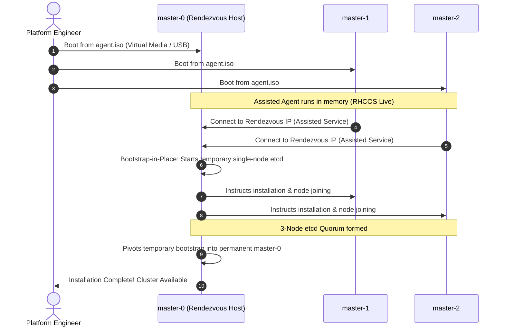

# Agent-Based Installer (ABI) Deep Dive

The Agent-Based Installer (ABI) is the primary, state-of-the-art installation mechanism for on-premises bare-metal, VMware vSphere, Nutanix, and edge clusters in OpenShift 4.20.

---

## The Paradigm Shift: Bootstrap-in-Place

In traditional OpenShift 4 UPI/IPI installations, a 4th temporary **Bootstrap Node** was required. This bootstrap node hosted an ephemeral control plane to launch etcd and the Machine Config Operator, only to be permanently destroyed upon installation completion.

The Agent-Based Installer eliminates this waste using **Bootstrap-in-Place (BiP)**:



---

## End-to-End Step-by-Step Implementation Procedure

### Step 1: Download OpenShift 4.20 Installer & Client Tools
1. Fetch the official installer and `oc` CLI binaries:
   ```bash
   curl -sSL -o openshift-install-linux.tar.gz https://mirror.openshift.com/pub/openshift-v4/clients/ocp/4.20.0/openshift-install-linux.tar.gz
   tar -xzf openshift-install-linux.tar.gz && sudo mv openshift-install /usr/local/bin/
   ```
2. Verify version output:
   ```bash
   openshift-install version
   ```

### Step 2: Formulate Cluster Definition (install-config.yaml)
1. Initialize an installation directory:
   ```bash
   mkdir -p ~/ocp-agent-install && cd ~/ocp-agent-install
   ```
2. Author `install-config.yaml` specifying baseDomain, network CIDRs, VIPs, and pull secret (see [`configs/agent-based/install-config-standard.yaml`](../../configs/agent-based/install-config-standard.yaml)).

### Step 3: Configure Host & Interface Topology (agent-config.yaml)
1. Designate the Rendezvous node IP address.
2. Define host roles, static NMState configurations, bonded NICs, and root disk hints (see [`configs/agent-based/agent-config.yaml`](../../configs/agent-based/agent-config.yaml)).

### Step 4: Validate Configuration Files
1. Run preflight syntax checks:
   ```bash
   python3 -c "import yaml; yaml.safe_load(open('install-config.yaml')); yaml.safe_load(open('agent-config.yaml'))"
   ```

### Step 5: Generate the Agent Bootable ISO
1. Trigger the image build:
   ```bash
   openshift-install agent create image --dir=. --log-level=info
   ```
2. The installer produces `agent.x86_64.iso` containing embedded Ignition files, network configurations, and the Assisted Installer agent.

### Step 6: Mount and Boot Hosts via Virtual Media
1. Connect to the Baseboard Management Controller (iDRAC, iLO, or CIMC) of each node.
2. Insert `agent.x86_64.iso` as a Virtual CD/DVD drive.
3. Configure the boot order to prioritize Virtual CD/DVD on the next reboot.
4. Power on all target nodes.

### Step 7: Monitor Automated Bootstrap-in-Place
1. From the administration workstation, monitor deployment progress:
   ```bash
   openshift-install agent wait-for install-complete --dir=. --log-level=info
   ```
2. Monitor node discovery, ignition injection, OS installation, and etcd cluster assembly.

### Step 8: Post-Installation Validation
1. Export the generated kubeconfig:
   ```bash
   export KUBECONFIG=$(pwd)/auth/kubeconfig
   oc get nodes -o wide
   oc get clusteroperators
   ```
2. Save `auth/kubeadmin-password` into a secure enterprise secret vault.

---
[Next: Installer Provisioned Infrastructure (IPI)](02-installer-provisioned-ipi.md) • [Back to Index](README.md)
