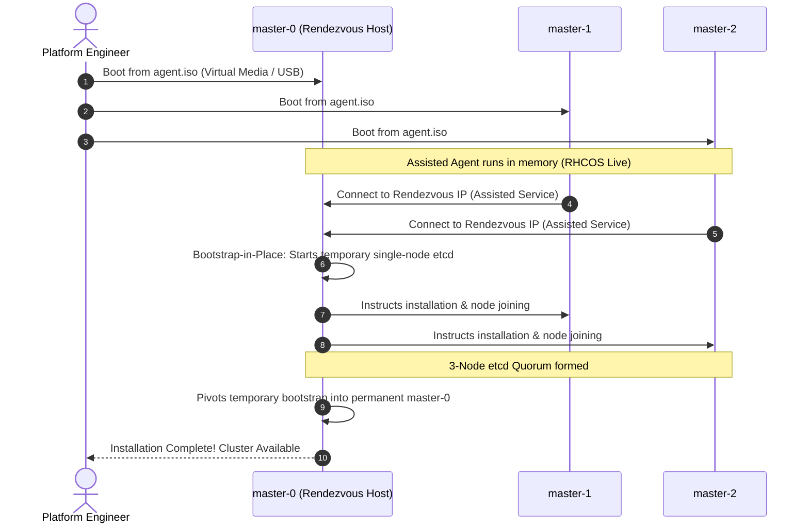

# Agent-Based Installer (ABI) Deep Dive

The Agent-Based Installer (ABI) is the primary, state-of-the-art installation mechanism for on-premises bare-metal, VMware vSphere, Nutanix, and edge clusters in OpenShift 4.20.

---

## The Paradigm Shift: Bootstrap-in-Place

In traditional OpenShift 4 UPI/IPI installations, a 4th temporary **Bootstrap Node** was required. This bootstrap node hosted an ephemeral control plane to launch etcd and the Machine Config Operator, only to be permanently destroyed upon installation completion.

The Agent-Based Installer eliminates this waste using **Bootstrap-in-Place (BiP)**:



---

## Key Configuration Files

The Agent-Based Installer is driven by two declarative YAML manifests:
1. `install-config.yaml`: Defines cluster metadata, network CIDRs, platform parameters, and pull secret.
2. `agent-config.yaml`: Defines the Rendezvous IP, target host MAC addresses, network interfaces (NMState for static IPs or bonds), and root disk hints.

Example generation command:
```bash
openshift-install agent create image --dir=./cluster-workspace
```
Outputs `agent.x86_64.iso` ready to be mounted via Redfish BMC virtual media.

---
[Next: Installer Provisioned Infrastructure (IPI)](02-installer-provisioned-ipi.md) • [Back to Index](README.md)
