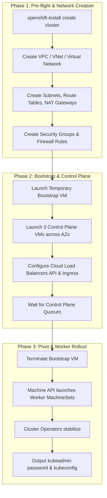

# Installer Provisioned Infrastructure (IPI)

Installer Provisioned Infrastructure (IPI) delivers full automation by directly interfacing with cloud provider APIs (AWS, Azure, GCP, OCI) or virtualization platforms (vSphere, Nutanix AHV, OpenStack).

---

## End-to-End IPI Orchestration



---

## Cloud Provider Security & Identity (STS / Workload Identity)

In 2026, root cloud credentials (`aws_access_key_id` or service account keys) are banned in enterprise environments. IPI enforces short-lived token authentication:
- **AWS**: Security Token Service (STS) and IAM Roles for Service Accounts (IRSA).
- **Azure**: Azure Workload Identity with federated OIDC credentials.
- **GCP**: Google Cloud Workload Identity Federation.

Manifest sample for Cloud Credentials in Manual Mode:
```yaml
credentialsMode: Manual
platform:
  aws:
    region: eu-west-1
```
Use `ccoctl` (Cloud Credential Operator CLI) to pre-create cloud IAM roles prior to triggering `openshift-install`.

---
[Next: User Provisioned Infrastructure (UPI)](03-user-provisioned-upi.md) • [Back to Index](README.md)
