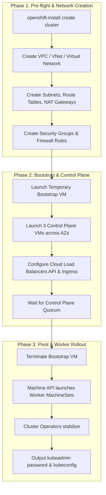

# Installer Provisioned Infrastructure (IPI)

Installer Provisioned Infrastructure (IPI) delivers full automation by directly interfacing with cloud provider APIs (AWS, Azure, GCP, OCI) or virtualization platforms (vSphere, Nutanix AHV, OpenStack).

---

## End-to-End IPI Orchestration



---

## End-to-End Step-by-Step Implementation Procedure

### Step 1: Pre-Requisite Cloud Account & Quota Verification
1. Verify cloud provider limits (vCPU, Elastic IPs, VPCs, and storage volume quotas).
2. Ensure cloud DNS zones (Route53, Azure DNS, Cloud DNS) are active and resolve correctly.

### Step 2: Cloud Credential Operator (ccoctl) Short-Lived Token Generation
1. Extract Cloud Credential Operator requests from the release image:
   ```bash
   oc adm release extract --credentials-requests      --cloud=aws      --to=./credrequests      quay.io/openshift-release-dev/ocp-release:4.20.0-x86_64
   ```
2. Run `ccoctl` to generate cloud IAM roles, OpenID Connect (OIDC) identity provider, and secret manifests:
   ```bash
   ccoctl aws create-all      --name=ocp420-prod      --region=eu-west-1      --credentials-requests-dir=./credrequests
   ```
3. Copy generated manifests to `./manifests/`.

### Step 3: Configure Cloud install-config.yaml
1. Create `install-config.yaml` specifying `credentialsMode: Manual`, private subnets, and instance sizing (see [`configs/ipi-cloud/aws-install-config.yaml`](../../configs/ipi-cloud/aws-install-config.yaml)).

### Step 4: Create Installation Manifests
1. Generate cluster manifests:
   ```bash
   openshift-install create manifests --dir=./cloud-cluster
   ```
2. Copy the `ccoctl` generated manifests into `./cloud-cluster/manifests/`.

### Step 5: Execute Automated Cluster Deployment
1. Initiate the full automated installation:
   ```bash
   openshift-install create cluster --dir=./cloud-cluster --log-level=info
   ```
2. The installer automatically provisions VPCs, subnets, route tables, security groups, NAT gateways, network load balancers, temporary bootstrap VM, and 3 control plane instances across availability zones.

### Step 6: Monitor Bootstrap Completion & Pivot
1. The installer establishes etcd quorum on the masters, transfers cluster control from the bootstrap node, and terminates the temporary bootstrap VM to stop billing.
2. The Machine API spawns the worker MachineSets.

### Step 7: Cluster Access & Secret Lockdown
1. Access the cluster:
   ```bash
   export KUBECONFIG=./cloud-cluster/auth/kubeconfig
   oc get nodes
   ```
2. Backup `metadata.json` (required for future cluster destroy operations).

---
[Next: User Provisioned Infrastructure (UPI)](03-user-provisioned-upi.md) • [Back to Index](README.md)
