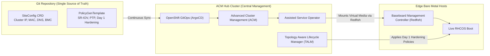

# Zero Touch Provisioning (ZTP) via ACM & GitOps

Zero Touch Provisioning (ZTP) enables centralized, declarative deployment of hundreds of OpenShift clusters (Single Node OpenShift, Compact, or Standard) at scale using GitOps.

---

## Architectural Workflow: ACM + TALM + GitOps



---

## SiteConfig Definition Example
Declarative definition of a remote edge cluster within Git:

```yaml
apiVersion: ran.openshift.io/v1
kind: SiteConfig
metadata:
  name: edge-site-madrid
  namespace: edge-sites
spec:
  baseDomain: edge.corp.local
  pullSecretRef:
    name: enterprise-pull-secret
  clusterImageSetNameRef: openshift-v4.20.0
  clusters:
    - clusterName: madrid-cell-01
      networkType: OVNKubernetes
      clusterProfile: single-node
      nodes:
        - hostName: sno-madrid.edge.corp.local
          role: master
          bmcAddress: idrac-virtualmedia://10.250.1.10/redfish/v1/Systems/System.Embedded.1
          bmcCredentialsName:
            name: bmc-secret-madrid
          bootMACAddress: 52:54:00:fa:10:01
```

---
[Back to Provisioning Index](README.md) • [Next Chapter: Network & Connectivity](../03-network-and-connectivity/README.md)
