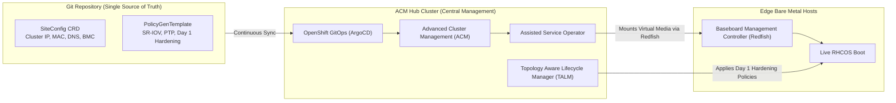

# Zero Touch Provisioning (ZTP) via ACM & GitOps

Zero Touch Provisioning (ZTP) enables centralized, declarative deployment of hundreds of OpenShift clusters (Single Node OpenShift, Compact, or Standard) at scale using GitOps.

---

## Architectural Workflow: ACM + TALM + GitOps



---

## End-to-End Step-by-Step Implementation Procedure

### Step 1: Deploy Hub Cluster Prerequisites
1. Ensure the central management cluster is running OpenShift 4.20.
2. Install the **Advanced Cluster Management for Kubernetes (ACM 2.12+)** operator.
3. Install the **Red Hat OpenShift GitOps (ArgoCD)** operator.
4. Install the **Topology Aware Lifecycle Manager (TALM)** operator.

### Step 2: Establish the Git Repository Structure
1. Create a structured Git repository to serve as the Single Source of Truth:
   ```
   ztp-fleet-repo/
   ├── siteconfig/
   │   └── edge-site-madrid.yaml
   └── policygen/
       ├── common-pbc.yaml
       └── group-du-sno.yaml
   ```

### Step 3: Define BMC Credentials in Hub Cluster
1. Store Baseboard Management Controller (BMC) credentials as Kubernetes secrets on the Hub cluster:
   ```bash
   oc create secret generic bmc-secret-madrid      --from-literal=username=root      --from-literal=password=CalvinSecret123!      -n edge-sites
   ```

### Step 4: Author SiteConfig Manifest
1. Declare the edge cluster topology, networking, MAC address, and BMC endpoint in `siteconfig/edge-site-madrid.yaml`:
   ```yaml
   apiVersion: ran.openshift.io/v1
   kind: SiteConfig
   metadata:
     name: edge-site-madrid
     namespace: edge-sites
   spec:
     baseDomain: edge.corp.local
     pullSecretRef:
       name: enterprise-pull-secret
     clusterImageSetNameRef: openshift-v4.20.0
     clusters:
       - clusterName: madrid-cell-01
         networkType: OVNKubernetes
         clusterProfile: single-node
         nodes:
           - hostName: sno-madrid.edge.corp.local
             role: master
             bmcAddress: idrac-virtualmedia://10.250.1.10/redfish/v1/Systems/System.Embedded.1
             bmcCredentialsName:
               name: bmc-secret-madrid
             bootMACAddress: 52:54:00:fa:10:01
   ```

### Step 5: Configure PolicyGenTemplates for Day 1 Hardening
1. Declare Day 1 policies for real-time kernel, PTP synchronization, and custom chrony NTP servers via `PolicyGenTemplate`.

### Step 6: Commit to Git & Trigger ArgoCD Synchronization
1. Commit the SiteConfig to Git:
   ```bash
   git add siteconfig/ policygen/
   git commit -m "feat: provision madrid-cell-01 edge site"
   git push origin main
   ```
2. ArgoCD detects the change, creates the `BareMetalHost`, `AgentClusterInstall`, and `ClusterDeployment` resources on the Hub.

### Step 7: Automated Installation & Policy Enforcement
1. The Assisted Service connects to the server BMC via Redfish Virtual Media, mounts the RHCOS ISO, and boots the node.
2. When the edge cluster installation completes, TALM automatically applies all Day 1 configuration policies in waves.

---
[Back to Provisioning Index](README.md) • [Next Chapter: Network & Connectivity](../03-network-and-connectivity/README.md)
