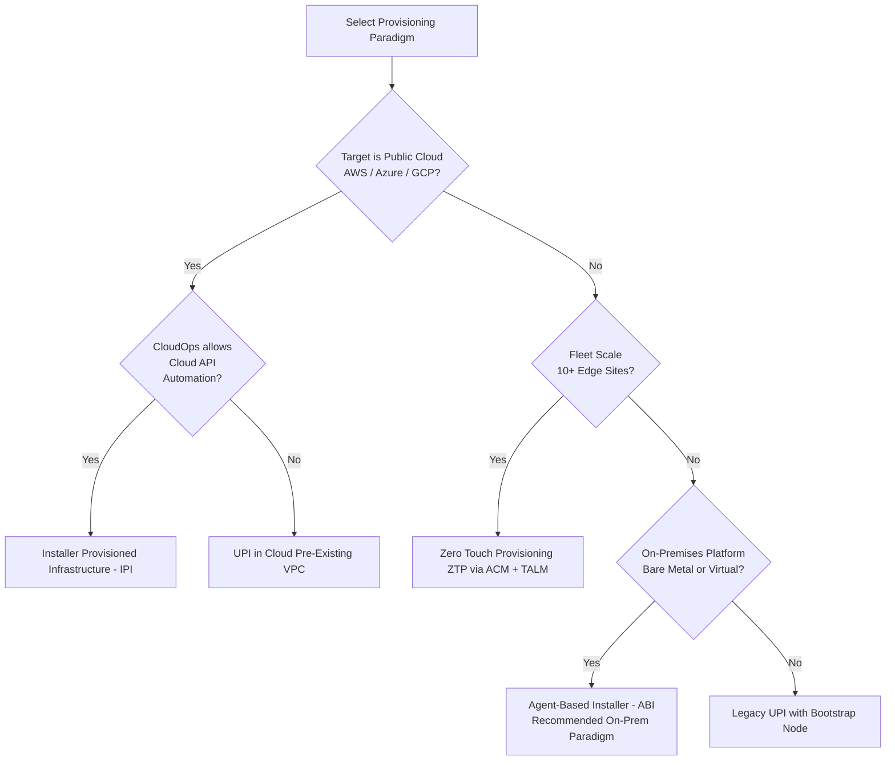

# 02 - Provisioning Paradigms & Installation Methods

OpenShift 4.20 supports four distinct installation paradigms. Selecting the proper method depends on your cloud automation capabilities, infrastructure governance, and scale.

---

## Provisioning Method Comparison Matrix

| Feature / Dimension | Agent-Based Installer (ABI) | Installer-Provisioned (IPI) | User-Provisioned (UPI) | GitOps Zero-Touch (ZTP) |
| :--- | :--- | :--- | :--- | :--- |
| **Recommended In 2026** | **Yes (Standard for On-Prem & Edge)**| **Yes (Standard for Public Cloud)**| Legacy / Highly Regulated Only | **Yes (Fleet & Edge Operations)**|
| **Temporary Bootstrap VM** | **None** (Bootstrap-in-Place) | Yes (Managed by installer) | Yes (Manually created by user) | **None** (Assisted Service on Hub) |
| **Network Requirements** | Static IP / DHCP / Bonded NMState | Cloud DHCP / VPC Subnets | Static IP / Pre-created DNS/VIPs | Hub-provisioned / Static via SiteConfig |
| **Cloud/Infra Automation** | Generates bootable ISO / PXE | Full cloud API automation | Manual VM creation / External IaC | Fully automated via ACM Hub |
| **Air-Gapped Feasibility** | **Native** (Embeds mirrors in ISO)| Requires internal cloud proxy | Manual mirror registry setup | **Native** (Hub serves releases) |
| **Time to Provision** | 25 - 35 minutes | 35 - 45 minutes | 60 - 120 minutes | 20 - 30 minutes per cluster |

---

## Provisioning Flow Decision Tree

---

## Provisioning Guides & Declarative Manifests

1. 🚀 **[`01-agent-based-installer.md`](01-agent-based-installer.md) — The Modern OpenShift Installer (Agent-Based / ABI)**:
   - **Bootstrap-in-Place (BiP)** mechanics eliminating external bootstrap VMs.
   - Comprehensive CLI reference: `create image`, `create pxe-files`, `create cluster-manifests`, `wait-for install-complete`.
   - Complete schema dictionary for `agent-config.yaml` and `install-config.yaml`.
   - **8 Enterprise Deployment Scenarios**: SNO, 3-Node Compact, Standard HA, Air-Gapped / Disconnected, LACP 802.3ad + 802.1Q VLANs, PXE/iPXE network boot, Multi-disk SAN hints, and Day 0 manifest injection.
   - Assisted Service in-memory container architecture (`http://localhost:8090/api/assisted-install/v2/clusters`) & live REST API diagnostics.
   - Declarative manifests: [`configs/agent-based/`](../../configs/agent-based/).

2. ☁️ **[`02-installer-provisioned-ipi.md`](02-installer-provisioned-ipi.md) — Installer-Provisioned Infrastructure (IPI)**:
   - Full automated cloud provisioning (AWS, Azure, GCP, VMware, Nutanix).
   - Keyless STS / Workload Identity configuration and IAM policies.
   - Declarative manifests: [`configs/ipi-cloud/`](../../configs/ipi-cloud/).

3. 🛠️ **[`03-user-provisioned-upi.md`](03-user-provisioned-upi.md) — User-Provisioned Infrastructure (UPI)**:
   - Regulated bare metal and custom virtualization environments with pre-existing network/storage topology.
   - Declarative manifests: [`configs/upi-vsphere/`](../../configs/upi-vsphere/).

4. 📡 **[`04-ztp-acm-gitops.md`](04-ztp-acm-gitops.md) — Zero-Touch Provisioning (ZTP) & GitOps**:
   - Fleet-scale edge rollouts via Red Hat Advanced Cluster Management (RHACM) and Topology Aware Lifecycle Manager (TALM).
   - Declarative `SiteConfig` and `PolicyGenTemplate` pipeline architecture.

---

[Back to Global Navigation](../00-navigation.md)

