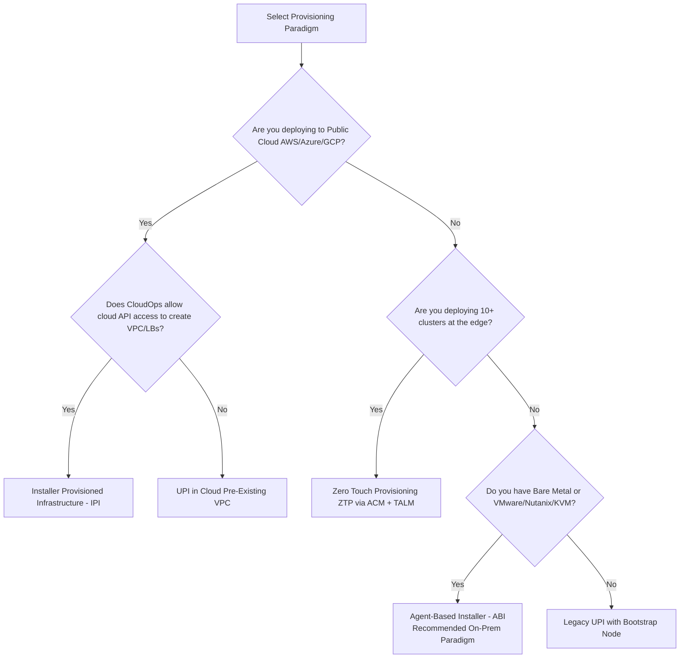

# 02 - Provisioning Paradigms & Installation Methods

OpenShift 4.20 supports four distinct installation paradigms. Selecting the proper method depends on your cloud automation capabilities, infrastructure governance, and scale.

---

## Provisioning Method Comparison Matrix

| Feature / Dimension | Agent-Based Installer (ABI) | Installer-Provisioned (IPI) | User-Provisioned (UPI) | GitOps Zero-Touch (ZTP) |
| :--- | :--- | :--- | :--- | :--- |
| **Recommended In 2026** | **Yes (Standard for On-Prem & Edge)**| **Yes (Standard for Public Cloud)**| Legacy / Highly Regulated Only | **Yes (Fleet & Edge Operations)**|
| **Temporary Bootstrap VM** | **None** (Bootstrap-in-Place) | Yes (Managed by installer) | Yes (Manually created by user) | **None** (Assisted Service on Hub) |
| **Network Requirements** | Static IP / DHCP / Bonded NMState | Cloud DHCP / VPC Subnets | Static IP / Pre-created DNS/VIPs | Hub-provisioned / Static via SiteConfig |
| **Cloud/Infra Automation** | Generates bootable ISO / PXE | Full cloud API automation | Manual VM creation / External IaC | Fully automated via ACM Hub |
| **Air-Gapped Feasibility** | **Native** (Embeds mirrors in ISO)| Requires internal cloud proxy | Manual mirror registry setup | **Native** (Hub serves releases) |
| **Time to Provision** | 25 - 35 minutes | 35 - 45 minutes | 60 - 120 minutes | 20 - 30 minutes per cluster |

---

## Provisioning Flow Decision Tree

---
[Back to Global Navigation](../00-navigation.md)
