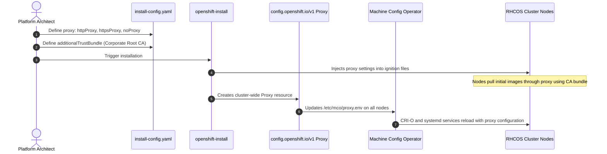

# Connected Deployments with Corporate Proxies

Enterprise security mandates that all outbound traffic traverse an inspection proxy (e.g. Blue Coat, Zscaler, Squid, McAfee Web Gateway).

---

## The Proxy Injection Workflow



---

## Crucial `noProxy` Requirements

If the `noProxy` string is missing internal cluster networks, node-to-node communication will fail. The following elements **MUST** be present:

```yaml
proxy:
  httpProxy: http://corp-proxy.internal:3128
  httpsProxy: http://corp-proxy.internal:3128
  noProxy: .internal.corp,.example.com,10.128.0.0/14,172.30.0.0/16,192.168.10.0/24,127.0.0.1,localhost
```

---

## Injecting Custom CA Certificates Day 1
To update or inject enterprise root certificates post-installation without breaking running workloads:

```bash
# 1. Create ConfigMap in openshift-config
oc create configmap custom-ca-bundle    --from-file=ca-bundle.crt=/etc/pki/ca-trust/source/anchors/enterprise-ca.crt    -n openshift-config

# 2. Patch the cluster Proxy object
oc patch proxy/cluster --type=merge    -p '{"spec":{"trustedCA":{"name":"custom-ca-bundle"}}}'
```
The Machine Config Operator automatically injects this certificate into `/etc/pki/ca-trust/extracted/pem/tls-ca-bundle.pem` across all master and worker nodes.

---
[Next: Air-Gapped oc-mirror v2](02-air-gapped-oc-mirror-v2.md) • [Back to Index](README.md)
