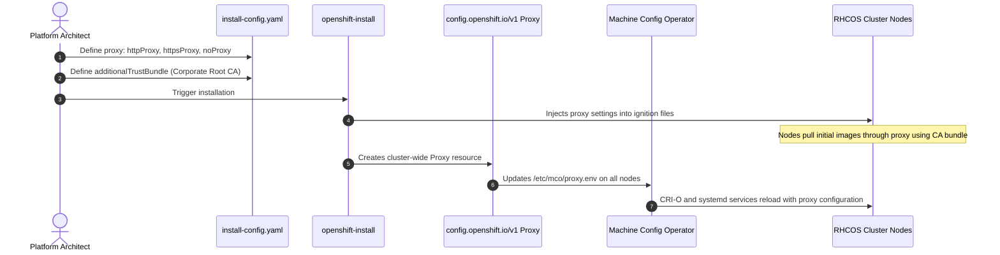

# Connected Deployments with Corporate Proxies

Enterprise security mandates that all outbound traffic traverse an inspection proxy (e.g. Blue Coat, Zscaler, Squid, McAfee Web Gateway).

---

## The Proxy Injection Workflow



---

## End-to-End Step-by-Step Implementation Procedure

### Step 1: Obtain Enterprise Proxy URL & Root CA Bundle
1. Acquire the inspection proxy URL (e.g. `http://proxy.corp.local:3128`).
2. Export the corporate root CA and any intermediate certificates into a PEM-encoded file:
   ```bash
   cat root-ca.crt intermediate-ca.crt > enterprise-ca-bundle.pem
   ```

### Step 2: Configure install-config.yaml Proxy Block
1. Embed the proxy settings and `additionalTrustBundle` in `install-config.yaml`:
   ```yaml
   apiVersion: v1
   baseDomain: corp.local
   metadata:
     name: ocp-proxy
   proxy:
     httpProxy: http://proxy.corp.local:3128
     httpsProxy: http://proxy.corp.local:3128
     noProxy: .corp.local,10.128.0.0/14,172.30.0.0/16,192.168.10.0/24,127.0.0.1,localhost
   additionalTrustBundle: |
     -----BEGIN CERTIFICATE-----
     MIIExtCCA0mgAwIBAgIUWc68Xv...
     -----END CERTIFICATE-----
   ```

### Step 3: Verify noProxy Inclusions
1. Ensure the `noProxy` string contains:
   - Base domain (`.corp.local`)
   - Machine network CIDR (`192.168.10.0/24`)
   - Cluster pod network CIDR (`10.128.0.0/14`)
   - Service network CIDR (`172.30.0.0/16`)
   - Loopback (`127.0.0.1,localhost`)

### Step 4: Execute Installation
1. Trigger the installation (Agent-based or IPI):
   ```bash
   openshift-install agent create image --dir=.
   ```
2. CoreOS ignition boots nodes, configures `/etc/mco/proxy.env`, and pulls initial container images through the proxy.

### Step 5: Post-Install Trust Bundle Updates (Day 1 / Day 2)
1. When enterprise root CAs rotate, create an updated ConfigMap in `openshift-config`:
   ```bash
   oc create configmap enterprise-custom-ca      --from-file=ca-bundle.crt=new-corporate-ca.pem      -n openshift-config
   ```
2. Patch the cluster Proxy object:
   ```bash
   oc patch proxy/cluster --type=merge -p '{"spec":{"trustedCA":{"name":"enterprise-custom-ca"}}}'
   ```
3. The Machine Config Operator rolls out the new certificate to `/etc/pki/ca-trust/extracted/pem/tls-ca-bundle.pem` on all nodes without downtime.

---
[Next: Air-Gapped oc-mirror v2](02-air-gapped-oc-mirror-v2.md) • [Back to Index](README.md)
