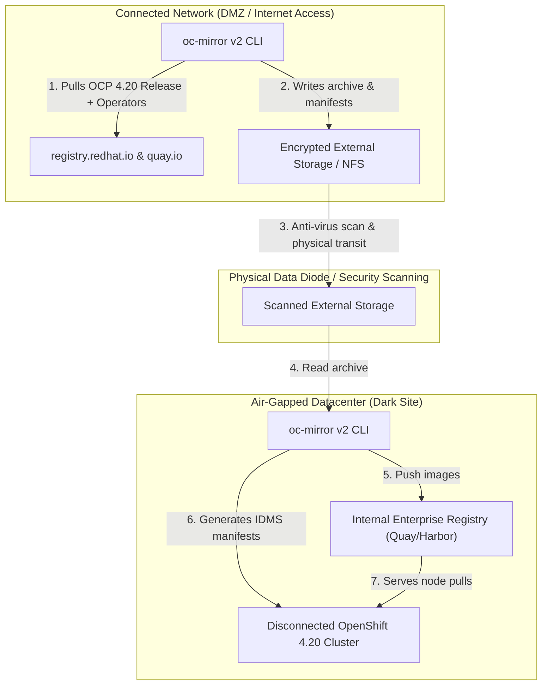

# Air-Gapped Disconnected Deployments: oc-mirror v2

In isolated, dark-site, or classified networks, OpenShift cannot contact `quay.io` or `registry.redhat.io`. Red Hat OpenShift 4.20 standardizes on the **`oc-mirror` v2 plugin**.

---

## End-to-End Air-Gap Workflow (Disk-to-Mirror)



---

## End-to-End Step-by-Step Implementation Procedure

### Step 1: Install oc-mirror CLI Plugin (v2)
1. On your connected bastion host, download and install `oc-mirror`:
   ```bash
   curl -sSL -o oc-mirror.tar.gz https://mirror.openshift.com/pub/openshift-v4/clients/ocp/4.20.0/oc-mirror.tar.gz
   tar -xzf oc-mirror.tar.gz && sudo mv oc-mirror /usr/local/bin/
   ```

### Step 2: Configure Combined Pull Secret
1. Create a merged `auth.json` containing credentials for both `registry.redhat.io` and your internal target registry (`quay.internal.corp:8443`):
   ```bash
   export REGISTRY_AUTH_FILE=~/.airgap/pull-secret.json
   ```

### Step 3: Define ImageSetConfiguration v2
1. Author `imageset-config-v2.yaml` defining the OCP 4.20 payload and required Operator packages (see [`configs/airgap/imageset-config-v2.yaml`](../../configs/airgap/imageset-config-v2.yaml)).

### Step 4: Mirror from Internet to Local Disk (Connected Bastion)
1. Run `oc-mirror` targeting a removable encrypted disk or staging directory:
   ```bash
   oc-mirror --config configs/airgap/imageset-config-v2.yaml file:///media/portable-drive/mirror-data --v2
   ```

### Step 5: Transfer Data to Air-Gapped Bastion
1. Safely transport removable storage through internal security screening / data diode into the air-gapped data center.
2. Mount the portable storage to the disconnected bastion.

### Step 6: Mirror from Disk to Local Internal Registry
1. Push images to the internal enterprise registry (Quay/Harbor):
   ```bash
   oc-mirror --from file:///media/portable-drive/mirror-data docker://quay.internal.corp:8443/openshift4 --v2
   ```

### Step 7: Apply Generated IDMS and CatalogSource Manifests
1. The mirror command outputs cluster configuration files in `working-dir/results-*/`.
2. Apply the `ImageDigestMirrorSet` (IDMS) and `CatalogSource` manifests to the cluster:
   ```bash
   oc apply -f working-dir/results-*/
   ```
3. Nodes now pull release images and operators directly from `quay.internal.corp:8443` with zero outbound connectivity.

---
[Next: Air-Gapped Core Services](03-air-gapped-core-services.md) • [Back to Index](README.md)
