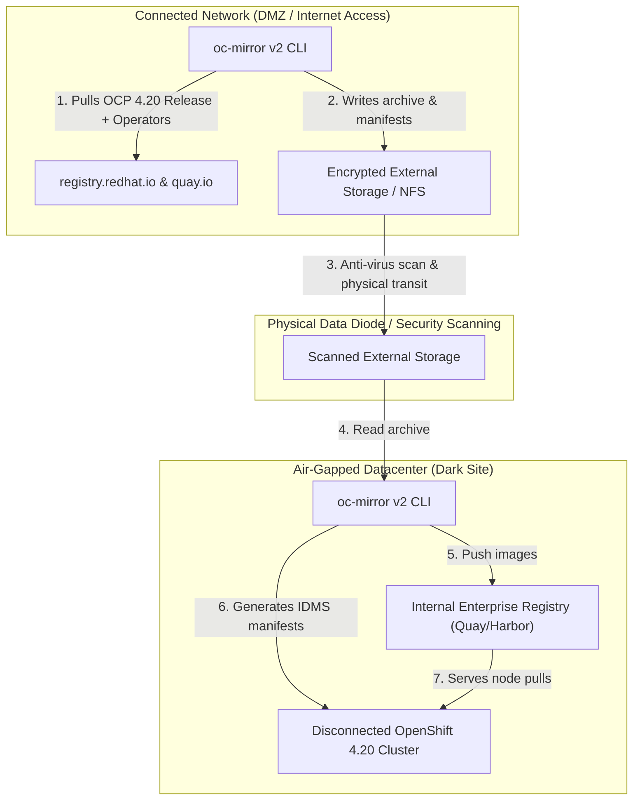

# Air-Gapped Disconnected Deployments: oc-mirror v2

In isolated, dark-site, or classified networks, OpenShift cannot contact `quay.io` or `registry.redhat.io`. Red Hat OpenShift 4.20 standardizes on the **`oc-mirror` v2 plugin**.

---

## oc-mirror v1 vs oc-mirror v2 Architecture

| Feature | oc-mirror v1 (Legacy) | oc-mirror v2 (OpenShift 4.20 Standard) |
| :--- | :--- | :--- |
| **Catalog Format** | SQLite-based Operator Catalogs | Native OCI File-Based Catalogs (FBC) |
| **Cache Architecture** | Monolithic local cache prone to locks | Ephemeral, content-addressable local storage cache |
| **Memory Footprint** | High (frequently ran OOM on large catalogs) | Highly optimized stream-based buffer (<2GB RAM) |
| **Mirroring Workflow** | Multi-step archive extraction | Direct mirror-to-mirror or deterministic disk-to-mirror |
| **Manifest Generation** | ICSP (ImageContentSourcePolicy) | **IDMS (ImageDigestMirrorSet)** & ITMS |

---

## End-to-End Air-Gap Workflow (Disk-to-Mirror)



---

## ImageSetConfiguration v2 Example
See [`configs/airgap/imageset-config-v2.yaml`](../../configs/airgap/imageset-config-v2.yaml) for a complete enterprise specification.

Mirror execution command:
```bash
# In connected bastion
oc-mirror --config configs/airgap/imageset-config-v2.yaml file:///media/portable-drive/mirror-data --v2

# In disconnected bastion
oc-mirror --from file:///media/portable-drive/mirror-data docker://quay.internal.corp:8443/openshift4 --v2
```

---
[Next: Air-Gapped Core Services](03-air-gapped-core-services.md) • [Back to Index](README.md)
