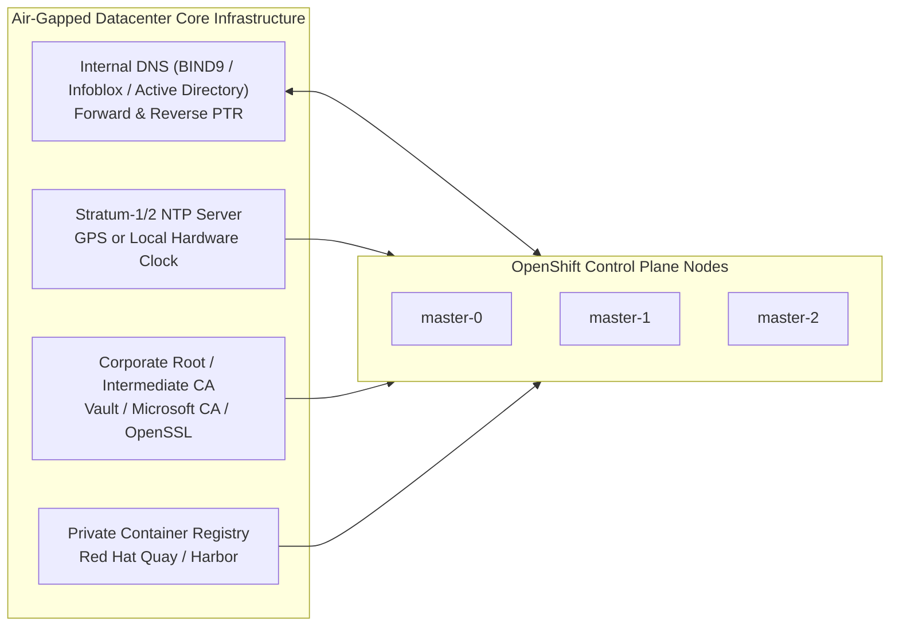

# Air-Gapped Core Services: DNS, NTP & Internal PKI

An air-gapped OpenShift 4.20 cluster requires three indispensable foundation services within the isolated network: **Split-Horizon Internal DNS**, **High-Precision Local NTP**, and **Enterprise Internal PKI**.

---

## Foundation Service Matrix



---

## 1. Internal DNS Requirements
The internal DNS server must resolve the following records without forwarding to public root servers:

| Record Name | Type | Target | Purpose |
| :--- | :---: | :--- | :--- |
| `api.<cluster>.<baseDomain>` | A | API VIP (or Load Balancer) | Kubernetes API Server (External & Node access) |
| `api-int.<cluster>.<baseDomain>` | A | API VIP (or Load Balancer) | Internal cluster components & Ignition downloads |
| `*.apps.<cluster>.<baseDomain>` | A | Ingress VIP (or LB) | Ingress router wildcard domain |
| Reverse PTR for all Master/Worker IPs | PTR | FQDN of respective node | etcd certificate validation & reverse identity |

---

## 2. High-Precision Local NTP (Chrony)
- etcd uses Raft consensus, which tolerates **no more than 500ms** of clock drift between masters before electing leaders repeatedly or triggering panic aborts.
- In disconnected networks with no public NTP pools (`pool.ntp.org`), nodes must synchronize against internal hardware appliances or internal NTP servers via custom MachineConfig (see [`configs/day1/machineconfig-chrony.yaml`](../../configs/day1/machineconfig-chrony.yaml)).

---

## 3. Internal Registry TLS Certificates
Local registries (Quay/Harbor) running on internal TLS certificates must have their Root/Intermediate CA bundle embedded directly inside `install-config.yaml`:

```yaml
additionalTrustBundle: |
  -----BEGIN CERTIFICATE-----
  MIIFazCCA1OgAwIBAgIUW1...
  -----END CERTIFICATE-----
```
Failure to include this bundle prevents the bootstrap node and CoreOS ignition from pulling release images from the local registry.

---
[Next: OVN-Kubernetes Tuning](04-ovn-kubernetes-tuning.md) • [Back to Index](README.md)
