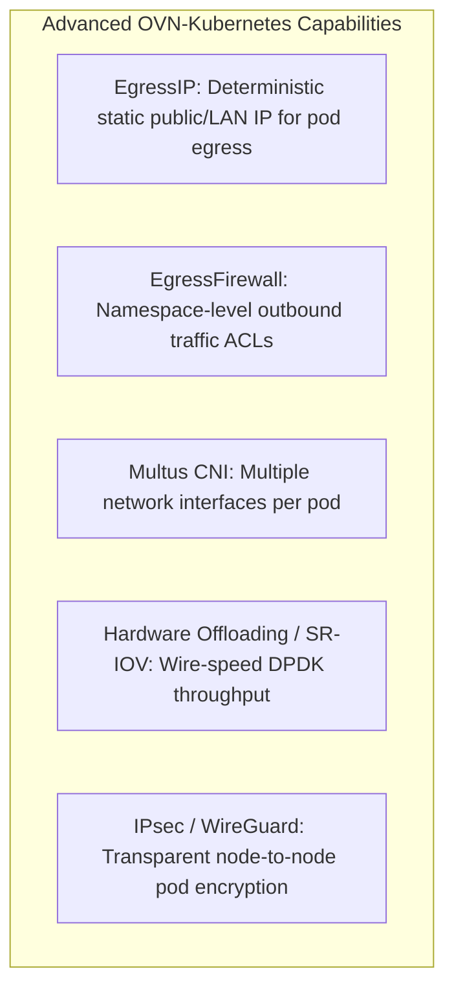

# OVN-Kubernetes CNI Tuning & Advanced Policies

OpenShift 4.20 defaults to **OVN-Kubernetes** (Open Virtual Network) as its native Container Network Interface (CNI), providing OpenFlow-based distributed routing, load balancing, security policies, and Geneve overlay encapsulation.

---

## Key Advanced Features in OVN-Kubernetes



---

## 1. MTU Optimization (Preventing Fragmentation)
The Geneve encapsulation protocol adds a **100-byte header** to every overlay packet:
- Standard Ethernet (MTU 1500) -> Cluster MTU **MUST be set to 1400**.
- Jumbo Frames (MTU 9000) -> Cluster MTU **MUST be set to 8900**.

If the underlying network switches do not support Jumbo frames, setting MTU 9000 causes packet dropping on overlay traffic while node-to-node ICMP ping works, resulting in mysterious connection drops.

---

## 2. Deterministic EgressIP Configuration
When external legacy firewalls require whitelisting specific IP addresses for microservices running inside OpenShift:

```yaml
apiVersion: k8s.ovn.org/v1
kind: EgressIP
metadata:
  name: payment-service-egress
spec:
  egressIPs:
    - 192.168.10.150
  namespaceSelector:
    matchLabels:
      security-zone: payment
```
OVN automatically assigns `192.168.10.150` to an available worker node and routes all outbound traffic from matching namespaces through that specific IP.

---
[Back to Network Index](README.md) • [Next Chapter: Platform Deployment Guides](../04-platforms/README.md)
