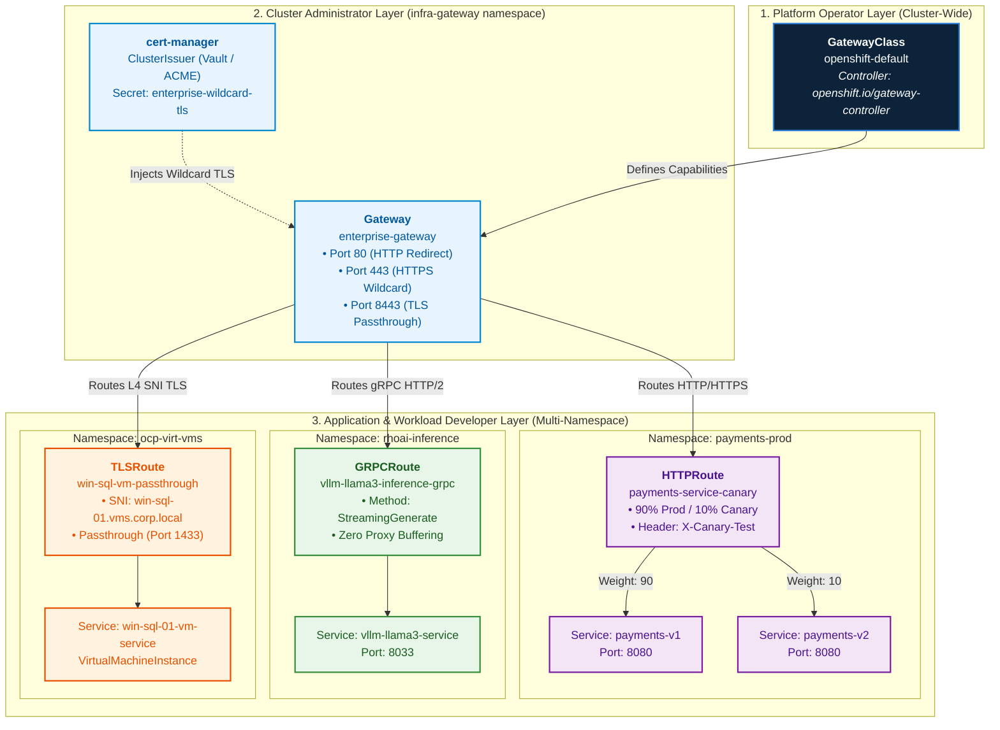

# Enterprise Kubernetes Gateway API: Architecture, Ingress Modernization & Multi-Tenant Routing

## Executive Overview & Architectural Evolution

As of **September/October 2026**, the **Kubernetes Gateway API (`gateway.networking.k8s.io`)** represents the official, next-generation standard for L4/L7 ingress, service mesh traffic management, and cross-namespace routing across the cloud-native ecosystem. 

In OpenShift 4.20, the Gateway API represents a major architectural leap beyond the traditional OpenShift `Route` (`route.openshift.io`) and upstream `Ingress` (`networking.k8s.io`). While OpenShift Routes served as the pioneering ingress model for Kubernetes since 2015, they are host-centric, lack multi-tenant persona separation, and cannot express complex traffic engineering patterns (weighted canary traffic splitting, header-based routing, native gRPC streaming, or zero-trust policy attachment) without proprietary annotations.

```
┌──────────────────────────────────────────────────────────────────────────────────────────────────┐
│                               GATEWAY API ROLE-ORIENTED ARCHITECTURE                             │
├──────────────────────────────────────────────────────────────────────────────────────────────────┤
│                                                                                                  │
│   [PLATFORM OPERATOR / SRE]                   [CLUSTER / NETWORK ADMIN]                          │
│   Defines Infrastructure Capabilities         Provisions Ingress Entrypoints                     │
│               │                                           │                                      │
│               ▼                                           ▼                                      │
│   ┌───────────────────────┐                   ┌───────────────────────┐                          │
│   │     GatewayClass      │ ───────────────►  │        Gateway        │ (L4/L7 Listeners: 80/443)│
│   │ (openshift-ingress)   │                   │ (cert-manager TLS)    │                          │
│   └───────────────────────┘                   └───────────┬───────────┘                          │
│                                                           │                                      │
│       ┌───────────────────────────────────────────────────┼──────────────────────────────┐       │
│       │                                                   │                              │       │
│       ▼                                                   ▼                              ▼       │
│ [APP DEV: TEAM ALPHA]                             [AI SRE: TEAM LLM]             [INFRA: TEAM VM]│
│ ┌──────────────────────────┐                      ┌──────────────────────────┐   ┌──────────────┐│
│ │        HTTPRoute         │                      │        GRPCRoute         │   │   TLSRoute   ││
│ │ • Canary (90% v1/10% v2) │                      │ • vLLM Streaming gRPC    │   │ • SNI Passthru││
│ │ • Header / Path Rewrite  │                      │ • Token-based Routing    │   │ • KubeVirt VM││
│ └─────────────┬────────────┘                      └─────────────┬────────────┘   └──────┬───────┘│
│               ▼                                                 ▼                       ▼        │
│    App Workload Pods (v1/v2)                       vLLM AI Model Pods            Windows/RHEL VM │
│                                                                                                  │
└──────────────────────────────────────────────────────────────────────────────────────────────────┘
```

### Graphical Architecture: Role-Oriented Resource Hierarchy



---

## Architectural Comparison: Route vs. Ingress vs. Gateway API

| Architectural Capability | Legacy OpenShift `Route` | Kubernetes `Ingress` v1 | Kubernetes `Gateway API` (`gateway.networking.k8s.io`) |
| :--- | :--- | :--- | :--- |
| **API Version & Maturity** | `route.openshift.io/v1` | `networking.k8s.io/v1` | `gateway.networking.k8s.io/v1` (GA) |
| **Persona Role Separation** | None (Single manifest) | None (Single manifest) | **Strict 3-Tier Separation**: Platform -> Cluster Admin -> App Dev |
| **Multi-Tenancy Model** | Host-bound per namespace | Host-bound per namespace | **Cross-Namespace Binding** via `allowedRoutes` & `ReferenceGrant` |
| **Traffic Splitting (Canary)** | Limited weight support | Requires custom annotations | **First-Class Primitive**: Native weighted splits with validation |
| **Advanced L7 Matching** | Path only | Path only | **Headers, Methods, Query Parameters, and URL Rewrites** |
| **Protocol Support** | HTTP, HTTPS, WebSockets | HTTP, HTTPS | **HTTP, HTTPS, gRPC, TCP, UDP, and TLS SNI Passthrough** |
| **Policy Attachment** | IngressOperator tuning | Proprietary annotations | **Standardized Hierarchical Policies** (Kuadrant Auth & Rate Limiting) |
| **Service Mesh Unification** | Separate VirtualServices | Separate VirtualServices | **Unified API** across Ingress Controller and Service Mesh 3.x |

---

## Gateway API Implementations in OpenShift 4.20

OpenShift 4.20 provides first-class support for multiple Gateway API controller implementations depending on the operational domain:

### 1. OpenShift Ingress Operator Gateway Controller
- **Controller**: `openshift-ingress-operator`.
- **Underlying Engine**: High-performance Envoy proxy instances managed dynamically by the Ingress Operator.
- **GatewayClass**: `openshift-default` or custom `openshift-ingress`.
- **Use Case**: Default enterprise ingress replacing or running alongside traditional HAProxy routers.

### 2. Red Hat OpenShift Service Mesh 3.x (OSSM 3.0 / Istio Ambient)
- **Controller**: Red Hat OpenShift Service Mesh 3.x natively standardizes on the Kubernetes Gateway API.
- **Capabilities**: Replaces legacy Istio `VirtualService` and `Gateway` CRDs with standardized `gateway.networking.k8s.io` resources for ingress, egress, and east-west service-to-service routing.

### 3. Kuadrant API Management & Policy Engine
- **Components**: **Authorino** (Identity verification, OIDC, API keys, Open Policy Agent) and **Limitador** (Distributed Redis-backed rate limiting).
- **Architecture**: Attaches `AuthPolicy` and `RateLimitPolicy` CRDs directly to `Gateway` and `HTTPRoute` resources without modifying application code.

### 4. Cloud-Native Gateway Controllers (Cloud IPI)
- **AWS**: AWS Gateway API Controller for **AWS VPC Lattice** and **Application Load Balancer (ALB)**.
- **Azure**: Azure Application Gateway for Containers (**AGC**) implementing Gateway API.
- **GCP**: Google Cloud Multi-Cluster Gateway integrating with GCP Cloud Load Balancing.

---

## Detailed Use Cases Across OpenShift Architectures

### Use Case 1: Multi-Tenant Enterprise Ingress with Automated TLS
In multi-tenant clusters, infrastructure teams manage the `Gateway` entrypoint and TLS certificates, while application teams bind `HTTPRoute` resources from their individual namespaces without needing cluster-admin privileges.

* **Infrastructure Definition**: Cluster administrators deploy the `Gateway` in the `openshift-ingress` or `infra-gateway` namespace, binding it to a wildcard certificate managed by **cert-manager**:
  ```yaml
  apiVersion: gateway.networking.k8s.io/v1
  kind: Gateway
  metadata:
    name: enterprise-gateway
    namespace: infra-gateway
  spec:
    gatewayClassName: openshift-default
    listeners:
      - name: https
        protocol: HTTPS
        port: 443
        hostname: "*.apps.corp.local"
        tls:
          mode: Terminate
          certificateRefs:
            - kind: Secret
              name: enterprise-wildcard-tls
        allowedRoutes:
          namespaces:
            from: All
  ```

* **Cross-Namespace Route Attachment**: The application team creates an `HTTPRoute` in their own namespace (`finance-prod`), attaching to the gateway:
  ```yaml
  apiVersion: gateway.networking.k8s.io/v1
  kind: HTTPRoute
  metadata:
    name: finance-api
    namespace: finance-prod
  spec:
    parentRefs:
      - name: enterprise-gateway
        namespace: infra-gateway
    hostnames:
      - "finance.apps.corp.local"
    rules:
      - matches:
          - path:
              type: PathPrefix
              value: /api/v1
        backendRefs:
          - name: finance-service
            port: 8080
  ```

---

### Use Case 2: Zero-Downtime Weighted Canary Deployments
Gateway API provides declarative, weighted traffic splitting with header-based overrides directly in the `HTTPRoute` resource, completely eliminating the need for complex Service Mesh VirtualServices or manual HAProxy configuration.


* **Canary Specification**: 90% of traffic routes to production (`v1`), 10% to canary (`v2`), with an immediate 100% override if the HTTP header `X-Canary: beta-tester` is present:
  ```yaml
  apiVersion: gateway.networking.k8s.io/v1
  kind: HTTPRoute
  metadata:
    name: payments-canary
    namespace: payments
  spec:
    parentRefs:
      - name: enterprise-gateway
        namespace: infra-gateway
    hostnames:
      - "payments.apps.corp.local"
    rules:
      # Rule 1: Header match override for testers -> 100% to v2
      - matches:
          - headers:
              - name: X-Canary
                value: beta-tester
        backendRefs:
          - name: payments-v2
            port: 8080
            weight: 100
      # Rule 2: General public traffic -> 90% to v1, 10% to v2
      - backendRefs:
          - name: payments-v1
            port: 8080
            weight: 90
          - name: payments-v2
            port: 8080
            weight: 10
  ```

---

### Use Case 3: Enterprise AI & High-Throughput Model Serving (vLLM & RHOAI)
Large Language Model (LLM) inference utilizes **gRPC** and **Server-Sent Events (SSE)** for streaming token responses. Traditional Ingress controllers often buffer responses, corrupting streaming chunks and introducing latency.


* **GRPCRoute for Low-Latency Inference**: Using `GRPCRoute` ensures native HTTP/2 multiplexing, zero buffering, and direct streaming to **vLLM** and **KServe** model runtimes:
  ```yaml
  apiVersion: gateway.networking.k8s.io/v1
  kind: GRPCRoute
  metadata:
    name: vllm-llama3-grpc
    namespace: rhoai-inference
  spec:
    parentRefs:
      - name: enterprise-gateway
        namespace: infra-gateway
    hostnames:
      - "llama3-grpc.apps.corp.local"
    rules:
      - matches:
          - method:
              service: inference.GRPCInferenceService
        backendRefs:
          - name: vllm-llama3-service
            port: 8033
  ```

---

### Use Case 4: OpenShift Virtualization Direct VM Routing (TLSRoute & TCPRoute)
Enterprise virtual machines running under **OpenShift Virtualization (KubeVirt)** frequently require direct layer 4 TCP or TLS connections (e.g. database replication, RDP, SSH, proprietary encrypted enterprise protocols) rather than standard HTTP translation.

```mermaid
flowchart LR
    Client(["<b>External Enterprise Client</b><br/>SQL Client / RDP / Database"]) -->|"TLS with SNI:<br/>win-sql-01.vms.corp.local:8443"| GW["<b>Gateway API Gateway</b><br/>Port 8443 (Mode: Passthrough)<br/><i>Zero TLS Decryption</i>"]
    
    GW -->|"Inspects SNI Header"| TLSR["<b>TLSRoute</b><br/>win-sql-vm-passthrough<br/>Namespace: ocp-virt-vms"]
    
    TLSR --> Svc["<b>VirtualMachine Service</b><br/>TargetPort: 1433"]
    
    Svc --> VMI["<b>VirtualMachineInstance</b><br/>Windows Server 2025 Guest<br/>Encrypted End-to-End"]

    classDef client fill:#0d233a,stroke:#2f7ed8,stroke-width:2px,color:#ffffff;
    classDef gw fill:#e8f4fd,stroke:#0288d1,stroke-width:2px,color:#01579b;
    classDef route fill:#f3e5f5,stroke:#7b1fa2,stroke-width:2px,color:#4a148c;
    classDef vm fill:#fff3e0,stroke:#e65100,stroke-width:2px,color:#e65100;

    class Client client;
    class GW gw;
    class TLSR,Svc route;
    class VMI vm;
```



* **Zero-Overhead SNI Passthrough via `TLSRoute`**:
  Routes encrypted TLS traffic directly to the VM guest OS without terminating TLS at the ingress boundary, preserving end-to-end encryption and custom guest certificates:
  ```yaml
  apiVersion: gateway.networking.k8s.io/v1alpha2
  kind: TLSRoute
  metadata:
    name: win-vm-tls-route
    namespace: ocp-virt-vms
  spec:
    parentRefs:
      - name: enterprise-gateway
        namespace: infra-gateway
        sectionName: tls-passthrough
    hostnames:
      - "win-sql-01.vms.corp.local"
    rules:
      - backendRefs:
          - name: win-sql-01-vm-service
            port: 1433
  ```

---

### Use Case 5: Hosted Control Planes (HyperShift) Multi-Tenant Ingress
In Hosted Control Planes (HCP), hundreds of customer control planes run as containerized pods on a central management cluster. Gateway API provides isolated, multi-tenant ingress listeners for the `kube-apiserver` (port 6443) and OAuth endpoints across all hosted tenant clusters using distinct `TLSRoute` or `TCPRoute` configurations.

---

## Deterministic Migration Runbook: OpenShift Route to Gateway API

To transition production workloads from legacy OpenShift `Route` to `HTTPRoute` without downtime:

### Step 1: Verify Gateway API CRDs & GatewayClass
Confirm that Gateway API CRDs are active in OpenShift 4.20:
```bash
oc get gatewayclasses
```
*Expected Output*: `openshift-default` (Controller: `openshift.io/gateway-controller`).

### Step 2: Deploy the Shared Enterprise Gateway
Apply the central gateway manifest in the infrastructure namespace:
```bash
oc apply -f configs/gateway-api/enterprise-gateway.yaml
oc wait --for=condition=Programmed=True gateway/enterprise-gateway -n infra-gateway --timeout=60s
```

### Step 3: Author the Target HTTPRoute Resource
Create the parallel `HTTPRoute` pointing to the exact same backend Service as the existing `Route`:
```bash
oc apply -f configs/gateway-api/httproute-canary-split.yaml
```

### Step 4: Validate Route Status & Ingress Health
Verify that the `HTTPRoute` has bound successfully to the parent `Gateway`:
```bash
oc get httproute -n <namespace>
oc describe httproute <route-name> -n <namespace> | grep -E "Accepted|ResolvedRefs"
```

### Step 5: Shift DNS Traffic & Decommission Legacy Route
1. Switch external DNS or global load balancers to resolve the hostname via the Gateway VIP/load balancer.
2. Monitor application access logs on the Envoy Gateway pods.
3. Once verified, delete the legacy OpenShift `Route`:
   ```bash
   oc delete route <old-route-name> -n <namespace>
   ```

---

## Production Declarative Manifests in this Repository

The repository includes ready-to-deploy Gateway API configurations in `configs/gateway-api/`:
- [`configs/gateway-api/gatewayclass-openshift.yaml`](../../configs/gateway-api/gatewayclass-openshift.yaml): OpenShift Ingress GatewayClass.
- [`configs/gateway-api/enterprise-gateway.yaml`](../../configs/gateway-api/enterprise-gateway.yaml): Multi-tenant L4/L7 Gateway with cert-manager automated TLS.
- [`configs/gateway-api/httproute-canary-split.yaml`](../../configs/gateway-api/httproute-canary-split.yaml): Weighted canary traffic split with header matching.
- [`configs/gateway-api/grpcroute-ai-inference.yaml`](../../configs/gateway-api/grpcroute-ai-inference.yaml): Native gRPC streaming route for vLLM AI model serving.
- [`configs/gateway-api/tlsroute-vm-passthrough.yaml`](../../configs/gateway-api/tlsroute-vm-passthrough.yaml): L4 SNI TLS passthrough route for OpenShift Virtualization VMs.
