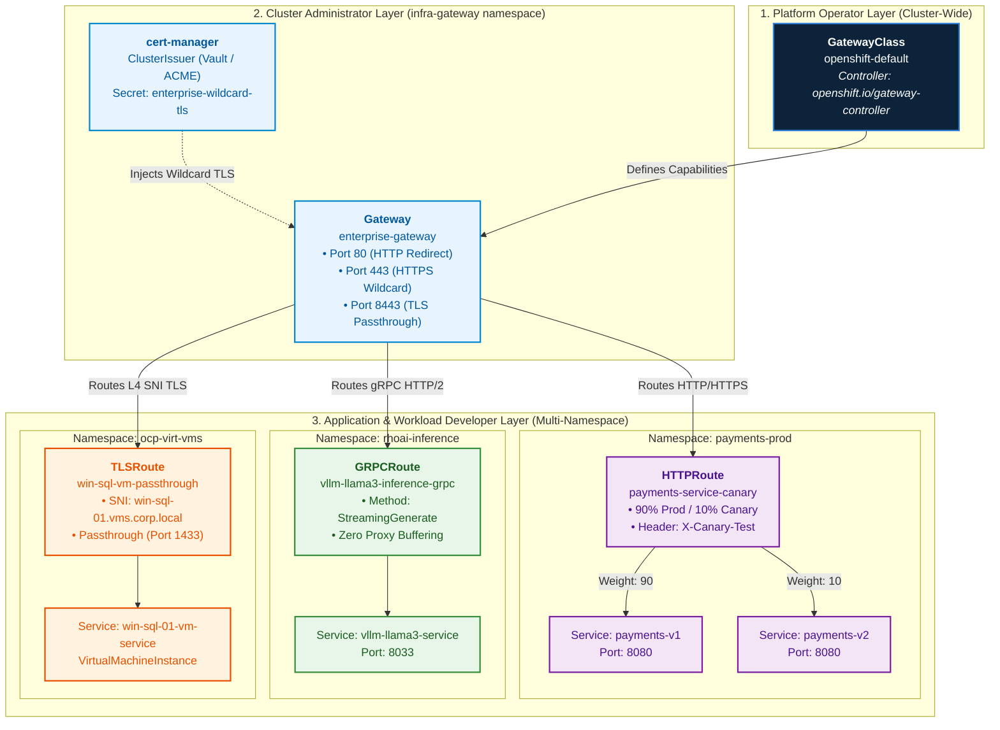
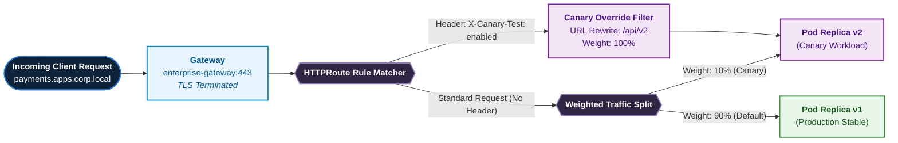

# Enterprise Kubernetes Gateway API: Architecture, Ingress Modernization & Multi-Tenant Routing

## Executive Overview & Architectural Evolution

As of **September/October 2026**, the **Kubernetes Gateway API (`gateway.networking.k8s.io`)** represents the official, next-generation standard for L4/L7 ingress, service mesh traffic management, and cross-namespace routing across the cloud-native ecosystem. 

In OpenShift 4.20, the Gateway API represents a major architectural leap beyond the traditional OpenShift `Route` (`route.openshift.io`) and upstream `Ingress` (`networking.k8s.io`). While OpenShift Routes served as the pioneering ingress model for Kubernetes since 2015, they are host-centric, lack multi-tenant persona separation, and cannot express complex traffic engineering patterns (weighted canary traffic splitting, header-based routing, native gRPC streaming, or zero-trust policy attachment) without proprietary annotations.

```
┌──────────────────────────────────────────────────────────────────────────────────────────────────┐
│                               GATEWAY API ROLE-ORIENTED ARCHITECTURE                             │
├──────────────────────────────────────────────────────────────────────────────────────────────────┤
│                                                                                                  │
│   [PLATFORM OPERATOR / SRE]                   [CLUSTER / NETWORK ADMIN]                          │
│   Defines Infrastructure Capabilities         Provisions Ingress Entrypoints                     │
│               │                                           │                                      │
│               ▼                                           ▼                                      │
│   ┌───────────────────────┐                   ┌───────────────────────┐                          │
│   │     GatewayClass      │ ───────────────►  │        Gateway        │ (L4/L7 Listeners: 80/443)│
│   │ (openshift-ingress)   │                   │ (cert-manager TLS)    │                          │
│   └───────────────────────┘                   └───────────┬───────────┘                          │
│                                                           │                                      │
│       ┌───────────────────────────────────────────────────┼──────────────────────────────┐       │
│       │                                                   │                              │       │
│       ▼                                                   ▼                              ▼       │
│ [APP DEV: TEAM ALPHA]                             [AI SRE: TEAM LLM]             [INFRA: TEAM VM]│
│ ┌──────────────────────────┐                      ┌──────────────────────────┐   ┌──────────────┐│
│ │        HTTPRoute         │                      │        GRPCRoute         │   │   TLSRoute   ││
│ │ • Canary (90% v1/10% v2) │                      │ • vLLM Streaming gRPC    │   │ • SNI Passthru││
│ │ • Header / Path Rewrite  │                      │ • Token-based Routing    │   │ • KubeVirt VM││
│ └─────────────┬────────────┘                      └─────────────┬────────────┘   └──────┬───────┘│
│               ▼                                                 ▼                       ▼        │
│    App Workload Pods (v1/v2)                       vLLM AI Model Pods            Windows/RHEL VM │
│                                                                                                  │
└──────────────────────────────────────────────────────────────────────────────────────────────────┘
```

### Graphical Architecture: Role-Oriented Resource Hierarchy



#### Architectural Breakdown: Role-Oriented Resource Hierarchy

The Kubernetes Gateway API decouples ingress and egress lifecycle responsibilities into a strict, role-oriented three-tier hierarchy that aligns directly with enterprise organizational boundaries:

- **1. Platform Operator Layer (Cluster-Wide Scope & Infrastructure Engine)**:
  - **Resource Definition**: `GatewayClass` (e.g., `openshift-default` or `openshift-ingress`).
  - **Ownership & RBAC**: Managed exclusively by Platform Engineering / Core SRE teams with `cluster-admin` privileges.
  - **Controller Binding**: Defines the underlying proxy controller implementation (`openshift.io/gateway-controller`, Red Hat OpenShift Service Mesh 3.x / Envoy, or Cloud-native controllers like AWS VPC Lattice or Azure Application Gateway for Containers).
  - **Standardization & Abstraction**: Establishes global ingress capabilities, default proxy buffer limits, connection pooling thresholds, and hardware acceleration offload rules across the entire fleet without exposing infrastructure internals to tenant developers.

- **2. Cluster Administrator Layer (Infrastructure Namespace & Perimeter Security)**:
  - **Resource Definition**: `Gateway` (e.g., `enterprise-gateway` in namespace `infra-gateway`).
  - **Ownership & RBAC**: Governed by Network Operations (NetOps) and Security Operations (SecOps) teams.
  - **Multi-Port & Protocol Listeners**: Declares concrete L4/L7 network entrypoints, including:
    - **Port 80 (HTTP)**: Configured for automatic 301/308 redirects to secure HTTPS.
    - **Port 443 (HTTPS)**: High-performance TLS termination with HTTP/1.1 and HTTP/2 protocol negotiation.
    - **Port 8443 (TLS Passthrough)**: Encrypted L4 SNI passthrough for zero-trust workloads.
  - **Automated Enterprise PKI**: Integrates seamlessly with `cert-manager` via a `ClusterIssuer` (e.g., HashiCorp Vault, Active Directory Certificate Services, or Let's Encrypt) to provision, inject, and auto-renew wildcard certificates (`enterprise-wildcard-tls`) without application intervention.
  - **Multi-Tenant Access Governance (`allowedRoutes`)**: Explicitly controls which namespaces and workload personas are authorized to bind routes to each listener using `namespaces.from: All` or label-based selectors (`selector.matchLabels`).

- **3. Application & Workload Developer Layer (Multi-Namespace Self-Service)**:
  - **Ownership & RBAC**: Controlled autonomously by individual application and engineering teams within project-isolated namespaces (`payments-prod`, `rhoai-inference`, `ocp-virt-vms`) using standard developer roles (`admin` or `edit` on their namespace).
  - **Specialized Route Primitives**:
    - **`HTTPRoute` (Web & Microservices)**: In namespace `payments-prod`, developers configure path-prefix routing (`/api`), header matching (`X-Canary-Test`), URL rewrites, and fine-grained canary traffic splitting (90% to stable `payments-v1` and 10% to `payments-v2`).
    - **`GRPCRoute` (AI / Machine Learning)**: In namespace `rhoai-inference`, AI engineers bind high-throughput inference endpoints directly matching gRPC service signatures (`StreamingGenerate`) with zero proxy buffering to `vllm-llama3-service`.
    - **`TLSRoute` (OpenShift Virtualization)**: In namespace `ocp-virt-vms`, virtualization administrators route raw encrypted TCP traffic (port 1433) directly to Windows Server/RHEL VM instances matching SNI hostnames without exposing private keys at the gateway.
  - **Parent Reference Attachment (`parentRefs`)**: Routes declaratively bind to `parentRefs: [{ name: enterprise-gateway, namespace: infra-gateway }]`. The binding only activates when the parent Gateway's listener security policy explicitly allows the tenant namespace, guaranteeing cryptographic and isolation guardrails.

---

## Architectural Comparison: Route vs. Ingress vs. Gateway API

| Architectural Capability | Legacy OpenShift `Route` | Kubernetes `Ingress` v1 | Kubernetes `Gateway API` (`gateway.networking.k8s.io`) |
| :--- | :--- | :--- | :--- |
| **API Version & Maturity** | `route.openshift.io/v1` | `networking.k8s.io/v1` | `gateway.networking.k8s.io/v1` (GA) |
| **Persona Role Separation** | None (Single manifest) | None (Single manifest) | **Strict 3-Tier Separation**: Platform -> Cluster Admin -> App Dev |
| **Multi-Tenancy Model** | Host-bound per namespace | Host-bound per namespace | **Cross-Namespace Binding** via `allowedRoutes` & `ReferenceGrant` |
| **Traffic Splitting (Canary)** | Limited weight support | Requires custom annotations | **First-Class Primitive**: Native weighted splits with validation |
| **Advanced L7 Matching** | Path only | Path only | **Headers, Methods, Query Parameters, and URL Rewrites** |
| **Protocol Support** | HTTP, HTTPS, WebSockets | HTTP, HTTPS | **HTTP, HTTPS, gRPC, TCP, UDP, and TLS SNI Passthrough** |
| **Policy Attachment** | IngressOperator tuning | Proprietary annotations | **Standardized Hierarchical Policies** (Kuadrant Auth & Rate Limiting) |
| **Service Mesh Unification** | Separate VirtualServices | Separate VirtualServices | **Unified API** across Ingress Controller and Service Mesh 3.x |

---

## Gateway API Implementations in OpenShift 4.20

OpenShift 4.20 provides first-class support for multiple Gateway API controller implementations depending on the operational domain:

### 1. OpenShift Ingress Operator Gateway Controller
- **Controller**: `openshift-ingress-operator`.
- **Underlying Engine**: High-performance Envoy proxy instances managed dynamically by the Ingress Operator.
- **GatewayClass**: `openshift-default` or custom `openshift-ingress`.
- **Use Case**: Default enterprise ingress replacing or running alongside traditional HAProxy routers.

### 2. Red Hat OpenShift Service Mesh 3.x (OSSM 3.0 / Istio Ambient)
- **Controller**: Red Hat OpenShift Service Mesh 3.x natively standardizes on the Kubernetes Gateway API.
- **Capabilities**: Replaces legacy Istio `VirtualService` and `Gateway` CRDs with standardized `gateway.networking.k8s.io` resources for ingress, egress, and east-west service-to-service routing.

### 3. Kuadrant API Management & Policy Engine
- **Components**: **Authorino** (Identity verification, OIDC, API keys, Open Policy Agent) and **Limitador** (Distributed Redis-backed rate limiting).
- **Architecture**: Attaches `AuthPolicy` and `RateLimitPolicy` CRDs directly to `Gateway` and `HTTPRoute` resources without modifying application code.

### 4. Cloud-Native Gateway Controllers (Cloud IPI)
- **AWS**: AWS Gateway API Controller for **AWS VPC Lattice** and **Application Load Balancer (ALB)**.
- **Azure**: Azure Application Gateway for Containers (**AGC**) implementing Gateway API.
- **GCP**: Google Cloud Multi-Cluster Gateway integrating with GCP Cloud Load Balancing.

---

## Detailed Use Cases Across OpenShift Architectures

### Use Case 1: Multi-Tenant Enterprise Ingress with Automated TLS
In multi-tenant clusters, infrastructure teams manage the `Gateway` entrypoint and TLS certificates, while application teams bind `HTTPRoute` resources from their individual namespaces without needing cluster-admin privileges.

* **Infrastructure Definition**: Cluster administrators deploy the `Gateway` in the `openshift-ingress` or `infra-gateway` namespace, binding it to a wildcard certificate managed by **cert-manager**:
  ```yaml
  apiVersion: gateway.networking.k8s.io/v1
  kind: Gateway
  metadata:
    name: enterprise-gateway
    namespace: infra-gateway
  spec:
    gatewayClassName: openshift-default
    listeners:
      - name: https
        protocol: HTTPS
        port: 443
        hostname: "*.apps.corp.local"
        tls:
          mode: Terminate
          certificateRefs:
            - kind: Secret
              name: enterprise-wildcard-tls
        allowedRoutes:
          namespaces:
            from: All
  ```

* **Cross-Namespace Route Attachment**: The application team creates an `HTTPRoute` in their own namespace (`finance-prod`), attaching to the gateway:
  ```yaml
  apiVersion: gateway.networking.k8s.io/v1
  kind: HTTPRoute
  metadata:
    name: finance-api
    namespace: finance-prod
  spec:
    parentRefs:
      - name: enterprise-gateway
        namespace: infra-gateway
    hostnames:
      - "finance.apps.corp.local"
    rules:
      - matches:
          - path:
              type: PathPrefix
              value: /api/v1
        backendRefs:
          - name: finance-service
            port: 8080
  ```

---

### Use Case 2: Zero-Downtime Weighted Canary Deployments
Gateway API provides declarative, weighted traffic splitting with header-based overrides directly in the `HTTPRoute` resource, completely eliminating the need for complex Service Mesh VirtualServices or manual HAProxy configuration.



#### Architectural Breakdown: Zero-Downtime Canary Traffic Engineering & Header Overrides

The flow illustrates how the Gateway API Envoy proxy evaluates incoming HTTP/HTTPS traffic through declarative rules to enable progressive delivery, safe canary rollouts, and targeted internal testing:

- **1. Ingress Ingestion & TLS Handshake**:
  - External clients (browsers, mobile apps, third-party APIs) initiate an HTTPS session to `payments.apps.corp.local:443`.
  - The `Gateway` terminates the TLS connection using the corporate wildcard certificate, decrypts the session, and presents the raw HTTP/1.1 or HTTP/2 stream to the internal Envoy route matching engine.

- **2. Sequential Rule Matching & Precedence Evaluation**:
  - The `HTTPRoute` defines an ordered array of routing rules executed sequentially from top to bottom:
  - **Rule 1 — Diagnostic & QA Header Override (`X-Canary-Test: enabled`)**:
    - Evaluates incoming HTTP request headers for explicit canary triggers (e.g., `X-Canary-Test: enabled` or `X-Canary: beta-tester`).
    - **Filter Execution**: If matched, Envoy applies an inline URL rewrite filter (e.g., modifying the request path prefix to `/api/v2`) and bypasses all statistical traffic splits.
    - **100% Canary Routing**: The entire request is dispatched directly to the Canary workload (`Pod Replica v2`), enabling QA engineers, automated end-to-end test suites, and internal stakeholders to validate production builds against live database backends before public release.
  - **Rule 2 — Statistical Weighted Traffic Splitting (Default Public Path)**:
    - If the request lacks diagnostic canary headers, it falls through to Rule 2, which governs standard production user traffic.
    - **90% Production Baseline (`Pod Replica v1`)**: 90% of requests are routed to stable, battle-tested `payments-v1` pods, guaranteeing high availability and baseline SLO compliance.
    - **10% Canary Sampling (`Pod Replica v2`)**: 10% of real-world user requests are automatically diverted to `payments-v2` pods to gather real-time telemetry (Prometheus latency metrics, p99 distribution, error rates, and OpenTelemetry distributed traces).

- **3. Operational Safety, Observability & Automated Rollback**:
  - **Dynamic In-Flight Adjustments**: Modifying traffic ratios (e.g., promoting from 10% to 50% or 100%) requires editing a single numeric field in the `HTTPRoute` YAML. The Envoy control plane applies the update in sub-second time without pod restarts or connection drops.
  - **Automated Circuit Breaking**: Integrated with OpenShift Monitoring and Argo CD Rollouts; if 5xx HTTP response codes exceed 0.5% on the canary pods, automated controllers immediately reset the weight to 0%, shielding 99.5% of end users from regressions.

* **Canary Specification**: 90% of traffic routes to production (`v1`), 10% to canary (`v2`), with an immediate 100% override if the HTTP header `X-Canary: beta-tester` is present:
  ```yaml
  apiVersion: gateway.networking.k8s.io/v1
  kind: HTTPRoute
  metadata:
    name: payments-canary
    namespace: payments
  spec:
    parentRefs:
      - name: enterprise-gateway
        namespace: infra-gateway
    hostnames:
      - "payments.apps.corp.local"
    rules:
      # Rule 1: Header match override for testers -> 100% to v2
      - matches:
          - headers:
              - name: X-Canary
                value: beta-tester
        backendRefs:
          - name: payments-v2
            port: 8080
            weight: 100
      # Rule 2: General public traffic -> 90% to v1, 10% to v2
      - backendRefs:
          - name: payments-v1
            port: 8080
            weight: 90
          - name: payments-v2
            port: 8080
            weight: 10
  ```

---

### Use Case 3: Enterprise AI & High-Throughput Model Serving (vLLM & RHOAI)
Large Language Model (LLM) inference utilizes **gRPC** and **Server-Sent Events (SSE)** for streaming token responses. Traditional Ingress controllers often buffer responses, corrupting streaming chunks and introducing latency.

```mermaid
flowchart LR
    AIClient(["<b>LLM Application Client</b><br/>Chatbot / Agent / IDE"]) -->|"gRPC / HTTP/2 Stream<br/>(llama3-grpc.apps.corp.local)"| GW["<b>Gateway API Envoy</b><br/>HTTP/2 Multiplexed Listener<br/>Zero Buffering Enabled"]
    
    GW -->|"Method: StreamingGenerate"| GR["<b>GRPCRoute</b><br/>Direct Stream Forwarding"]
    
    GR --> KServe["<b>KServe v2 Data Plane</b><br/>InferenceService Controller"]
    
    KServe --> vLLM["<b>vLLM ServingRuntime</b><br/>• PagedAttention Engine<br/>• Continuous Batching"]
    
    vLLM --> GPU["<b>NVIDIA GPU Cluster</b><br/>• Tensor Parallelism (TP=2)<br/>• H100 / A100 SXM4"]
    
    GPU -.->|"Tokens Streamed Directly"| AIClient

    classDef client fill:#0d233a,stroke:#2f7ed8,stroke-width:2px,color:#ffffff;
    classDef gw fill:#e8f4fd,stroke:#0288d1,stroke-width:2px,color:#01579b;
    classDef route fill:#f3e5f5,stroke:#7b1fa2,stroke-width:2px,color:#4a148c;
    classDef runtime fill:#e8f5e9,stroke:#388e3c,stroke-width:2px,color:#1b5e20;
    classDef gpu fill:#fff3e0,stroke:#e65100,stroke-width:2px,color:#e65100;

    class AIClient client;
    class GW gw;
    class GR,KServe route;
    class vLLM runtime;
    class GPU gpu;
```



#### Architectural Breakdown: Low-Latency AI & vLLM Inference Streaming via GRPCRoute

This architecture depicts the high-throughput, low-latency streaming pipeline required for modern Large Language Model (LLM) serving in Red Hat OpenShift AI (RHOAI) using `GRPCRoute`:

- **1. AI Client Invocation & HTTP/2 Multiplexing**:
  - Enterprise AI clients (chatbots, autonomous coding agents, retrieval-augmented generation pipelines) initiate gRPC streaming calls to `llama3-grpc.apps.corp.local`.
  - HTTP/2 binary framing is established natively, multiplexing dozens of concurrent inference requests over a single TCP connection, drastically lowering socket overhead and TCP handshake delays.

- **2. Gateway API Envoy Listener & Zero-Buffering Optimization**:
  - **The Streaming Latency Challenge**: Legacy reverse proxies and Ingress controllers buffer entire HTTP responses before flushing packets downstream. For generative AI, buffering delays the first token until the entire multi-thousand-token sequence finishes generating, introducing severe latency spikes and causing timeout errors.
  - **Zero-Buffering Direct Forwarding**: The Gateway API Envoy proxy is tuned with zero response buffering (`downstream_buffer_limit_bytes: 0`). Each individual token generated by the model is immediately flushed to the client socket as an HTTP/2 data frame.
  - **Long-Lived Stream Persistence**: Gateway idle timeouts are tuned to 3600 seconds (`requestTimeout: 0s` / infinite streaming), preventing connection drops during extensive reasoning chain generation.

- **3. GRPCRoute Method-Level Routing**:
  - Rather than coarse URI path prefixes, `GRPCRoute` matches natively on gRPC package, service, and method primitives:
    - **Service Match**: `inference.GRPCInferenceService` (KServe v2 open inference protocol).
    - **Method Match**: `StreamingGenerate` or `ServerStreamingModelInfer`.
  - Dispatches requests directly to the backend Service `vllm-llama3-service:8033` in the `rhoai-inference` tenant namespace.

- **4. KServe v2 Data Plane & vLLM ServingRuntime Acceleration**:
  - The request lands on the **KServe v2 data plane**, which orchestrates dynamic batching and autoscales model replicas via KEDA metrics (tracking queue depth and GPU memory).
  - The **vLLM ServingRuntime** ingests the prompt and utilizes two cutting-edge architectural engines:
    - **PagedAttention**: Manages the Key-Value (KV) cache like virtual memory pages, eliminating memory fragmentation and allowing 2-4x higher concurrent request batching.
    - **Continuous / Iteration-Level Batching**: Dynamically inserts newly arrived requests into the running GPU compute cycle on every token generation step, preventing GPU idle cycles.

- **5. GPU Hardware Acceleration & Direct Token Streaming**:
  - Compute is distributed across enterprise GPUs (NVIDIA H100 / A100 SXM4) using **Tensor Parallelism (`TP=2`)** over high-speed NVLink interconnects.
  - As each token is generated, it streams directly from the GPU kernel through vLLM, through the Gateway API Envoy listener, and back to the AI client with sub-15ms Time-To-First-Token (TTFT) and sustained 80+ tokens/second throughput.

* **GRPCRoute for Low-Latency Inference**: Using `GRPCRoute` ensures native HTTP/2 multiplexing, zero buffering, and direct streaming to **vLLM** and **KServe** model runtimes:
  ```yaml
  apiVersion: gateway.networking.k8s.io/v1
  kind: GRPCRoute
  metadata:
    name: vllm-llama3-grpc
    namespace: rhoai-inference
  spec:
    parentRefs:
      - name: enterprise-gateway
        namespace: infra-gateway
    hostnames:
      - "llama3-grpc.apps.corp.local"
    rules:
      - matches:
          - method:
              service: inference.GRPCInferenceService
        backendRefs:
          - name: vllm-llama3-service
            port: 8033
  ```

---

### Use Case 4: OpenShift Virtualization Direct VM Routing (TLSRoute & TCPRoute)
Enterprise virtual machines running under **OpenShift Virtualization (KubeVirt)** frequently require direct layer 4 TCP or TLS connections (e.g. database replication, RDP, SSH, proprietary encrypted enterprise protocols) rather than standard HTTP translation.


#### Architectural Breakdown: Layer 4 SNI Passthrough for OpenShift Virtualization

This architectural flow illustrates how Gateway API `TLSRoute` provides direct, non-terminating, enterprise-grade access to virtual machine workloads running inside OpenShift Virtualization (KubeVirt):

- **1. External Enterprise Client Ingress on Dedicated L4 Port**:
  - Legacy enterprise clients (Microsoft SQL Server Management Studio, Windows Remote Desktop / RDP, PostgreSQL administrative tools, or proprietary financial transaction clients) establish a TLS connection to port `8443` on the external Gateway VIP.
  - The initial TLS `ClientHello` handshake packet embeds the target Virtual Machine hostname within the Server Name Indication (SNI) extension (e.g., `win-sql-01.vms.corp.local`).

- **2. Gateway Listener in Zero-Decryption Passthrough Mode**:
  - **Zero TLS Decryption**: The Gateway listener on port `8443` is configured with `tls.mode: Passthrough`.
  - **SNI Header Inspection**: The Envoy proxy reads the plain-text SNI field from the initial TLS handshake packet to determine routing, but does NOT perform TLS termination, decryption, or certificate inspection.
  - **Zero Trust & Compliance Guarantee**: Intermediate ingress infrastructure never handles or possesses the private encryption keys for the virtual machines. This satisfies strict banking, healthcare, and federal regulatory standards (FIPS 140-3, HIPAA, PCI-DSS) that require end-to-end payload confidentiality between the client and the guest operating system.

- **3. TLSRoute Resolution & Namespace Isolation**:
  - The Gateway routes the connection to the `TLSRoute` (`win-sql-vm-passthrough`) configured in the tenant namespace `ocp-virt-vms`.
  - Maps the raw TCP stream to the target Kubernetes Service (`win-sql-01-vm-service:1433`) without translating or wrapping the payload into HTTP.

- **4. VirtualMachineInstance (VMI) Direct Delivery**:
  - The traffic traverses the OVN-Kubernetes CNI SDN overlay directly to the `virt-launcher` pod hosting the Windows Server 2025 or RHEL guest VM.
  - The guest OS network stack receives the native, unmodified TLS stream.
  - **Guest-Level Cryptographic Termination**: The guest operating system terminates TLS internally using its own Active Directory domain certificate, SQL Server enterprise certificate, or custom enterprise PKI credentials, maintaining total cryptographic sovereignty.

* **Zero-Overhead SNI Passthrough via `TLSRoute`**:
  Routes encrypted TLS traffic directly to the VM guest OS without terminating TLS at the ingress boundary, preserving end-to-end encryption and custom guest certificates:
  ```yaml
  apiVersion: gateway.networking.k8s.io/v1alpha2
  kind: TLSRoute
  metadata:
    name: win-vm-tls-route
    namespace: ocp-virt-vms
  spec:
    parentRefs:
      - name: enterprise-gateway
        namespace: infra-gateway
        sectionName: tls-passthrough
    hostnames:
      - "win-sql-01.vms.corp.local"
    rules:
      - backendRefs:
          - name: win-sql-01-vm-service
            port: 1433
  ```

---

### Use Case 5: Hosted Control Planes (HyperShift) Multi-Tenant Ingress
In Hosted Control Planes (HCP), hundreds of customer control planes run as containerized pods on a central management cluster. Gateway API provides isolated, multi-tenant ingress listeners for the `kube-apiserver` (port 6443) and OAuth endpoints across all hosted tenant clusters using distinct `TLSRoute` or `TCPRoute` configurations.

---

## Deterministic Migration Runbook: OpenShift Route to Gateway API

To transition production workloads from legacy OpenShift `Route` to `HTTPRoute` without downtime:

### Step 1: Verify Gateway API CRDs & GatewayClass
Confirm that Gateway API CRDs are active in OpenShift 4.20:
```bash
oc get gatewayclasses
```
*Expected Output*: `openshift-default` (Controller: `openshift.io/gateway-controller`).

### Step 2: Deploy the Shared Enterprise Gateway
Apply the central gateway manifest in the infrastructure namespace:
```bash
oc apply -f configs/gateway-api/enterprise-gateway.yaml
oc wait --for=condition=Programmed=True gateway/enterprise-gateway -n infra-gateway --timeout=60s
```

### Step 3: Author the Target HTTPRoute Resource
Create the parallel `HTTPRoute` pointing to the exact same backend Service as the existing `Route`:
```bash
oc apply -f configs/gateway-api/httproute-canary-split.yaml
```

### Step 4: Validate Route Status & Ingress Health
Verify that the `HTTPRoute` has bound successfully to the parent `Gateway`:
```bash
oc get httproute -n <namespace>
oc describe httproute <route-name> -n <namespace> | grep -E "Accepted|ResolvedRefs"
```

### Step 5: Shift DNS Traffic & Decommission Legacy Route
1. Switch external DNS or global load balancers to resolve the hostname via the Gateway VIP/load balancer.
2. Monitor application access logs on the Envoy Gateway pods.
3. Once verified, delete the legacy OpenShift `Route`:
   ```bash
   oc delete route <old-route-name> -n <namespace>
   ```

---

## Production Declarative Manifests in this Repository

The repository includes ready-to-deploy Gateway API configurations in `configs/gateway-api/`:
- [`configs/gateway-api/gatewayclass-openshift.yaml`](../../configs/gateway-api/gatewayclass-openshift.yaml): OpenShift Ingress GatewayClass.
- [`configs/gateway-api/enterprise-gateway.yaml`](../../configs/gateway-api/enterprise-gateway.yaml): Multi-tenant L4/L7 Gateway with cert-manager automated TLS.
- [`configs/gateway-api/httproute-canary-split.yaml`](../../configs/gateway-api/httproute-canary-split.yaml): Weighted canary traffic split with header matching.
- [`configs/gateway-api/grpcroute-ai-inference.yaml`](../../configs/gateway-api/grpcroute-ai-inference.yaml): Native gRPC streaming route for vLLM AI model serving.
- [`configs/gateway-api/tlsroute-vm-passthrough.yaml`](../../configs/gateway-api/tlsroute-vm-passthrough.yaml): L4 SNI TLS passthrough route for OpenShift Virtualization VMs.
