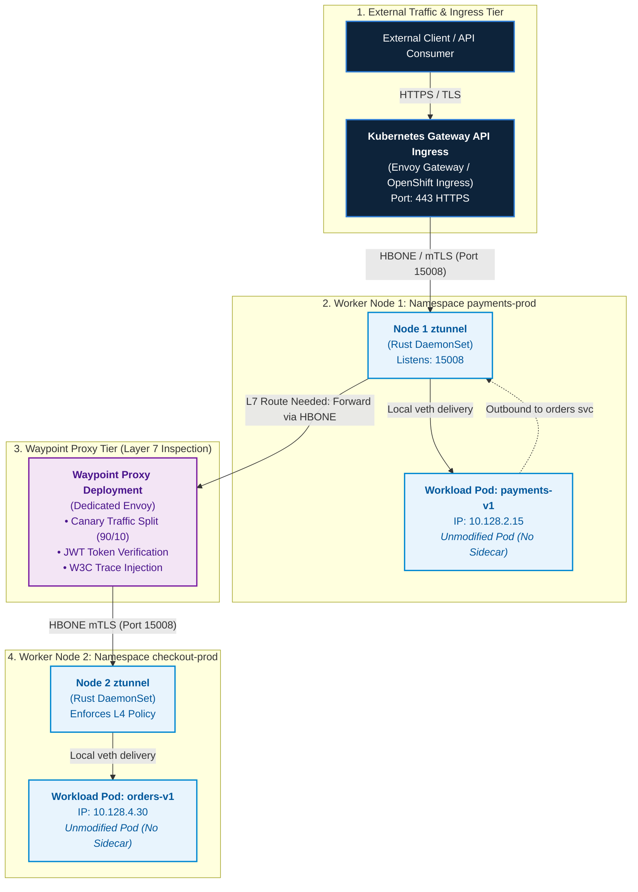

# Enterprise Istio Ambient Service Mesh: Architecture, Scenarios & Ingress Modernization

## Executive Summary & Architectural Evolution

As of **September/October 2026**, **Red Hat OpenShift Service Mesh 3.x (OSSM 3.0)** introduces the **Istio Ambient Mesh** architecture to OpenShift 4.20. Ambient Mesh represents the most significant architectural evolution in service mesh technology since the inception of Istio, dismantling the traditional **Sidecar architecture** in favor of an elegant, **sidecarless data plane**.

```
+---------------------------------------------------------------------------------------------------+
|                        THE SERVICE MESH ARCHITECTURAL EVOLUTION                                   |
+---------------------------------------------------------------------------------------------------+
|                                                                                                   |
|  [ TRADITIONAL SIDECAR ARCHITECTURE (OSSM 2.x) ]                                                  |
|    * Pod Spec Mutation: Injects Envoy proxy container into every application Pod.                 |
|    * Coupling: Proxy lifecycle is tightly coupled to application containers.                      |
|    * Heavy "Sidecar Tax": ~50MB RAM + 0.1 vCPU overhead multiplied by thousands of pods.         |
|    * Operational Friction: Pod restarts required for proxy upgrades, CVE patches, or config.     |
|    * Broken Workloads: Kubernetes Jobs hang (proxy never terminates); init containers fail.       |
|                                                                                                   |
|                                         |                                                         |
|                                         | EVOLUTION TO SIDECARLESS                                |
|                                         v                                                         |
|                                                                                                   |
|  [ ISTIO AMBIENT MESH ARCHITECTURE (OSSM 3.x / OpenShift 4.20) ]                                  |
|    * Zero Pod Mutation: Workload pods remain 100% untouched. No sidecars injected.                |
|    * Layer 4 Infrastructure (ztunnel): Per-node Rust DaemonSet handles zero-trust mTLS & HBONE.   |
|    * Layer 7 On-Demand (Waypoint): Envoy proxies deployed outside pods, only where L7 is needed.  |
|    * 90% Resource Reduction: Shared per-node ztunnels eliminate the per-pod sidecar overhead.    |
|    * Non-Disruptive Adoption: Label a namespace to join the mesh with ZERO pod restarts.          |
|    * Universal Workload Support: Native execution for Jobs, CronJobs, StatefulSets, and VMs.      |
+---------------------------------------------------------------------------------------------------+
```

In OpenShift 4.20, Ambient Mesh bridges the gap between infrastructure security and developer agility. By separating **Layer 4 transport encryption** from **Layer 7 traffic routing**, organizations can implement cluster-wide mutual TLS (mTLS) with zero application code changes, zero pod restarts, and a fraction of the compute resources previously required.

---

## Ambient Mesh Architecture: Separation of Concerns

Ambient Mesh decomposes the monolithic sidecar into two purpose-built layers:
1. **The Secure Transport Layer (L4)**: Powered by **ztunnel** (Zero Trust Tunnel).
2. **The Layer 7 Processing Layer**: Powered by **Waypoint Proxies**.

```
+---------------------------------------------------------------------------------------------------+
|                              AMBIENT MESH COMPONENT TOPOLOGY                                      |
+---------------------------------------------------------------------------------------------------+
|                                                                                                   |
|  [ APPLICATION NAMESPACE: payments-prod ]                                                         |
|                                                                                                   |
|    +----------------------+                    +----------------------------------------------+   |
|    | Workload Pod A       |                    | Waypoint Proxy Deployment                    |   |
|    | (Unmodified App)     |                    | (Envoy L7 - Managed via Gateway API)         |   |
|    | IP: 10.128.2.15      |                    |                                              |   |
|    | ServiceAccount: pay  |                    | * HTTP Path / Header Routing                 |   |
|    +----------+-----------+                    | * Weighted Canary Splitting (90/10)          |   |
|               | (Local veth)                   | * L7 AuthorizationPolicy & JWT Auth          |   |
|               v                                | * Distributed Tracing & Metric Spans         |   |
|    +----------------------+                    +----------------------+-----------------------+   |
|    | Istio CNI Redirection|                                           ^                           |
|    | (eBPF / iptables)    |                                           |                           |
|    +----------+-----------+                                           |                           |
|               |                                                       |                           |
|               v                                                       |                           |
|    +----------------------+                                           |                           |
|    | ztunnel DaemonSet    | ------------------------------------------+                           |
|    | (Rust - L4 Engine)   |    HBONE Tunnel (Port 15008 - mTLS with SPIFFE ID)                    |
|    +----------+-----------+                                                                       |
|               |                                                                                   |
+---------------|-----------------------------------------------------------------------------------+
|               |  Underlay Network: OVN-Kubernetes Geneve Overlay (UDP 6081)                       |
+---------------|-----------------------------------------------------------------------------------+
|               v                                                                                   |
|  [ REMOTE WORKER NODE: checkout-prod ]                                                            |
|                                                                                                   |
|    +----------------------+                    +----------------------+                           |
|    | ztunnel DaemonSet    | -----------------> | Workload Pod B       |                           |
|    | (Rust - L4 Engine)   |   (Local veth)     | (Unmodified App)     |                           |
|    +----------------------+                    +----------------------+                           |
|                                                                                                   |
+---------------------------------------------------------------------------------------------------+
```

### 1. ztunnel (Zero Trust Tunnel)
- **Engine**: A lightweight, high-performance DaemonSet running on every OpenShift worker node, written entirely in **Rust** for maximum memory safety and minimal resource footprint (~10-15MB RAM per node).
- **Responsibilities**:
  - Handles Layer 4 TCP traffic only.
  - Automatically encrypts and authenticates pod-to-pod traffic via **mutual TLS (mTLS)** using **SPIFFE/SPIRE** x509 workload identities (`spiffe://cluster.local/ns/<namespace>/sa/<serviceaccount>`).
  - Enforces Layer 4 `AuthorizationPolicy` rules (filtering by source identity, IP, or port).
  - Emits Layer 4 TCP connection metrics (bytes sent/received, connection duration).
- **Decoupled Architecture**: Operates at the node level. If a ztunnel pod is updated or restarted, established TCP sessions gracefully persist, and no application pods are terminated.

### 2. HBONE (HTTP-Based Overlay Network Encapsulation)
- **Protocol Standard**: All ztunnel-to-ztunnel and ztunnel-to-waypoint communication is encapsulated inside **HBONE**, operating over **TCP port 15008**.
- **Tunnel Mechanism**: HBONE uses standard **HTTP/2 CONNECT** requests to tunnel raw TCP streams inside encrypted mTLS tunnels.
- **Header Preservation**: Carries destination IP, port, and cryptographic workload identities in HTTP/2 pseudo-headers without modifying packet payloads.

### 3. Waypoint Proxies
- **Engine**: Dedicated **Envoy** proxy instances deployed as standard Kubernetes `Deployment` resources outside application pods.
- **Dynamic L7 Activation**: Waypoint proxies are **not** deployed by default. They are instantiated only when a namespace or service account explicitly requires Layer 7 features:
  - HTTP request routing, header rewrites, and path redirects.
  - Weighted canary traffic splitting.
  - Layer 7 `AuthorizationPolicy` (HTTP methods, paths, JWT claim validation).
  - Distributed tracing span generation (OpenTelemetry / Tempo).
  - Fault injection and circuit breaking.
- **Gateway API Native**: Waypoints are declared and managed directly through the **Kubernetes Gateway API (`gateway.networking.k8s.io`)** using `gatewayClassName: istio-waypoint`.

### 4. Istio CNI Integration with OVN-Kubernetes
- **Redirection**: The OpenShift Istio CNI plugin configures network namespace routing rules. When a pod belongs to an ambient-enabled namespace, inbound and outbound traffic is seamlessly redirected through the local node's ztunnel via dedicated Linux network interfaces.
- **Security**: Application pods execute without `NET_ADMIN` or `NET_RAW` Linux capabilities, adhering to OpenShift's default `restricted-v2` Security Context Constraint (SCC).

---

## Architectural Workflow & Visual Diagrams

### Graphical Architecture: Ingress, ztunnel & Waypoint Traversal



#### Companion ASCII Flow: End-to-End Packet Path

```
  +--------------------+
  | External Consumer  |
  +---------+----------+
            | (Public HTTPS: 443)
            v
  +-------------------------------------+
  | Kubernetes Gateway API Ingress GW   |  (Edge TLS termination & routing)
  +---------+---------------------------+
            | (HBONE mTLS over TCP 15008)
            v
  +-------------------------------------+
  | Node 1 ztunnel (payments-prod)      |  (Authenticates Gateway identity via SPIFFE)
  +---------+---------------------------+
            | (Local Linux veth)
            v
  +-------------------------------------+
  | payments-v1 Application Pod         |  (Processes request; calls orders service)
  +---------+---------------------------+
            | (Egress TCP redirected by Istio CNI)
            v
  +-------------------------------------+
  | Node 1 ztunnel                      |  (Checks xDS: Destination requires L7 Waypoint)
  +---------+---------------------------+
            | (HBONE mTLS over TCP 15008)
            v
  +-------------------------------------+
  | orders-prod Waypoint Proxy (Envoy)  |  (Evaluates HTTPRoute: 90% v1 / 10% v2; checks JWT)
  +---------+---------------------------+
            | (HBONE mTLS over TCP 15008)
            v
  +-------------------------------------+
  | Node 2 ztunnel (checkout-prod)      |  (Enforces L4 AuthorizationPolicy)
  +---------+---------------------------+
            | (Local Linux veth)
            v
  +-------------------------------------+
  | orders-v1 Application Pod           |  (Receives plain HTTP payload safely)
  +-------------------------------------+
```

---

## Comprehensive Use Cases & Production Scenarios

### Scenario 1: Zero-Downtime, Non-Intrusive Mesh Enrollment
- **The Problem**: In sidecar-based architectures, enrolling a namespace requires mutating webhooks that alter pod definitions. Rolling out a service mesh across 200 microservices forces the restart of thousands of production pods, risking outages, cache invalidations, and connection drops.
- **The Ambient Solution**: Workload enrollment is decoupled from pod lifecycles. Simply apply a single label to the target namespace:
  ```bash
  oc label namespace financial-payments istio.io/dataplane-mode=ambient
  ```
  The Istio CNI immediately intercepts traffic on the node and routes it through ztunnel. **Zero pods are restarted, zero YAML specifications are mutated, and all traffic is instantly encrypted with mTLS.**

### Scenario 2: Slashing the "Sidecar Tax" at Scale
- **The Problem**: Traditional sidecars consume ~50MB of RAM and 0.1 vCPU as a baseline per pod. In an enterprise cluster running 3,000 pods:
  $$\text{Memory Overhead} = 3000 \times 50\text{ MB} = 150\text{ GB RAM}$$
  $$\text{CPU Overhead} = 3000 \times 0.1\text{ vCPU} = 300\text{ vCPUs}$$
  Organizations pay millions of dollars annually purely to host idle proxy sidecars.
- **The Ambient Solution**: A single ztunnel daemon per worker node handles all L4 traffic. In a 30-node cluster:
  $$\text{Total Memory} = 30\text{ nodes} \times 15\text{ MB} = 450\text{ MB RAM}$$
  This represents an **over 99% reduction in service mesh infrastructure overhead** for Layer 4 encryption.

### Scenario 3: Kubernetes Batch Jobs, CronJobs & Init-Containers
- **The Problem**: The infamous Kubernetes sidecar bug: when a `Job` finishes its batch calculation, the application container exits with status `Completed`. However, the injected Envoy sidecar remains running indefinitely, preventing the Job from ever reaching completion and causing automated CI/CD pipelines to hang. Furthermore, `initContainers` cannot make network calls before the sidecar starts.
- **The Ambient Solution**: Because there is **no sidecar in the pod**, batch jobs, ETL pipelines, and database migration init-containers run naturally. When the application container exits, the Pod terminates cleanly.

### Scenario 4: Securing KubeVirt VMs & AI Inference Pipelines
- **The Problem**: OpenShift Virtualization VMs (KubeVirt) run full guest operating systems inside pods. Injecting an Envoy sidecar into a Windows Server or legacy Linux VM pod is fragile, breaks L4 protocols, and introduces severe latency. Similarly, high-throughput AI LLM inference engines (vLLM / Triton) using streaming gRPC suffer throughput degradation when subjected to double-proxy buffering.
- **The Ambient Solution**:
  - **KubeVirt VMs**: ztunnel operates at the node level, securing VM-to-Pod and VM-to-VM traffic with mTLS over the Geneve overlay without requiring any software agents inside the guest OS.
  - **AI Workloads**: Layer 4 ztunnel handles raw streaming gRPC inference calls at near-wire line speeds (Rust zero-copy packet processing), bypassing L7 parsing unless explicitly required.

### Scenario 5: Decoupled Proxy Lifecycle & Zero-Disruption CVE Patching
- **The Problem**: When a critical CVE is disclosed in Envoy (e.g., HTTP/2 rapid reset vulnerabilities), sidecar meshes require recompiling and redeploying every single application pod in the cluster. Application teams must coordinate maintenance windows, often taking weeks to achieve full compliance.
- **The Ambient Solution**:
  - For L4 issues: Update the single `ztunnel` DaemonSet via the Sail Operator. All nodes update in seconds without touching user workloads.
  - For L7 issues: Rolling update the `Waypoint` deployments independently of the application workloads.

---

## When is it Recommended to Implement?

### Architectural Decision Engine

```
                             [ SERVICE INGRESS / MESH REQUIREMENT ]
                                               |
                                               v
                             /-----------------------------------\
                            <  Is pod-to-pod East-West security   >
                            <  or mTLS encryption mandatory?     >
                             \-----------------------------------/
                                       /               \
                                      / YES             \ NO
                                     v                   v
                    /-----------------------------\     /-----------------------------\
                   <  Are workloads batch jobs,    >   <  Do you need modern persona-  >
                   <  VMs, or memory-constrained? >   <  based L7 canary & routing?   >
                    \-----------------------------/     \-----------------------------/
                             /              \                 /              \
                            / YES            \ NO            / YES            \ NO
                           v                  v             v                  v
                 +-------------------+  +-----------+  +---------------+  +--------------+
                 | ISTIO AMBIENT     |  | Consider  |  | STANDALONE    |  | TRADITIONAL  |
                 | SERVICE MESH      |  | Legacy    |  | GATEWAY API   |  | OPENSHIFT    |
                 | (OSSM 3.x)        |  | Sidecars  |  | (Envoy/Kuadr) |  | ROUTE        |
                 | • ztunnel (L4)    |  | if strict |  | • HTTPRoute   |  | • HAProxy    |
                 | • Waypoint (L7)   |  | per-pod   |  | • GRPCRoute   |  | • Simple Edge|
                 | • Zero restarts   |  | isolation |  | • North-South |  |   TLS        |
                 | • Resource-lean   |  | required  |  |   Ingress     |  | • Legacy apps|
                 +-------------------+  +-----------+  +---------------+  +--------------+
```

### Recommendation Matrix

| Architectural Scenario | Recommended Technology | Rationale & Justification |
| :--- | :--- | :--- |
| **Enterprise Zero-Trust & Regulatory Compliance (PCI-DSS / HIPAA)** | **Istio Ambient Mesh (OSSM 3.x)** | Delivers mandatory mutual TLS (mTLS) and cryptographic workload identities (SPIFFE) across all pods without disrupting running applications. |
| **High-Density Clusters (1,000+ Pods / Edge Clusters)** | **Istio Ambient Mesh (OSSM 3.x)** | Eliminates the multi-gigabyte memory footprint of sidecars, reducing cluster compute costs by up to 80%. |
| **Modern Multi-Tenant Ingress without East-West Mesh** | **Kubernetes Gateway API (Standalone)** | Provides role-oriented persona decoupling (Infra vs App Dev), weighted canaries, and clean certificate delegation without service mesh complexity. |
| **Simple Web Applications / Legacy Workloads** | **Traditional OpenShift Route** | Minimal operational overhead, baked directly into the platform, ideal for simple HTTP/HTTPS edge termination where pod-to-pod encryption is unnecessary. |
| **Batch Processing, AI Training & CronJobs** | **Istio Ambient Mesh (OSSM 3.x)** | Eliminates sidecar container exit deadlocks, allowing ephemeral containers to complete cleanly. |
| **Converged Containers & KubeVirt Virtual Machines** | **Istio Ambient Mesh (OSSM 3.x)** | Unifies VM and container security policies under a single L4/L7 control plane without guest OS agents. |

---

## The 3-Way Architectural Comparison

The following matrix provides a definitive, engineering-grade comparison across the three primary networking paradigms in OpenShift 4.20:

| Capability / Dimension | Traditional OpenShift Route (`route.openshift.io`) | Kubernetes Gateway API (`gateway.networking.k8s.io`) | Istio Ambient Mesh (`OSSM 3.x / Ambient`) |
| :--- | :--- | :--- | :--- |
| **Primary Scope** | **North-South Only**<br/>External edge ingress into the cluster. | **North-South & Multi-Cluster**<br/>Edge ingress, egress, and cross-namespace routing. | **East-West & North-South**<br/>Comprehensive pod-to-pod mesh + unified ingress. |
| **Underlying Proxy Engine** | **HAProxy**<br/>(Cluster Ingress Operator). | **Envoy Proxy**<br/>(or cloud-native Gateway controllers). | **ztunnel (Rust)** for L4 transport;<br/>**Envoy** for L7 Waypoint proxies. |
| **Mutual TLS (mTLS)** | **Edge / Passthrough / Reencrypt**<br/>Does not secure internal pod-to-pod east-west traffic. | **Listener TLS Only**<br/>Can terminate TLS or pass through SNI; no automated pod-to-pod mTLS. | **Automated Full-Mesh mTLS**<br/>SPIFFE x509 cryptographic identities with automatic 24h cert rotation. |
| **Resource Overhead** | **Negligible**<br/>Centralized HAProxy router pods only. | **Low**<br/>Dedicated Envoy Gateway pods scaled per ingress demand. | **Ultra-Low**<br/>Shared per-node ztunnel (~15MB RAM); Waypoint proxies deployed only when L7 is needed. |
| **Pod Lifecycle Impact** | **Zero**<br/>Application pods remain standard Kubernetes pods. | **Zero**<br/>Application pods remain standard Kubernetes pods. | **Zero**<br/>Sidecarless design; zero pod restarts, zero webhook mutations. |
| **Persona & RBAC Decoupling** | **Monolithic**<br/>Host-based model; requires cluster-admin or wildcard delegations. | **Strict 3-Tier Persona Model**<br/>Platform (GatewayClass) $\rightarrow$ Admin (Gateway) $\rightarrow$ Dev (HTTPRoute). | **Strict Role Separation**<br/>Infra team owns ztunnel; App team binds HTTPRoutes to Waypoints. |
| **Traffic Engineering** | Basic weighted balance via Route annotations; no native header rewrites. | Full L7 matching: header, path, query param, weighted canaries, gRPC. | Full L7 matching via Waypoint + Gateway API + circuit breaking & fault injection. |
| **Batch / Job Compatibility** | 100% Compatible. | 100% Compatible. | **100% Compatible**<br/>(Solves the legacy sidecar deadlock bug). |
| **API Standardization** | Proprietary OpenShift API (non-portable to vanilla K8s). | **Official CNCF Standard**<br/>Supported across all major clouds and Kubernetes distributions. | **Uses Gateway API as Native Syntax**<br/>Waypoints and routing rules are pure Gateway API objects. |

---

## Step-by-Step Implementation Procedure

### Step 1: Install the Red Hat OpenShift Service Mesh 3.x Operator (Sail Operator)
Ensure the Sail Operator is installed via OperatorHub in the `openshift-operators` namespace. Verify the CSV status:
```bash
oc get csv -n openshift-operators | grep -i "servicemesh"
```

### Step 2: Deploy the Istio CNI with Ambient Redirection
Apply the Istio CNI configuration supporting ambient traffic redirection on OVN-Kubernetes:
```bash
oc apply -f configs/ambient/01-istio-cni-ambient.yaml
```
Verify the CNI daemonset across all worker nodes:
```bash
oc rollout status daemonset/istio-cni-node -n istio-cni
```

### Step 3: Deploy the Istio Ambient Control Plane & ztunnel DaemonSet
Deploy the core `Istio` control plane resource configured with the `ambient` profile:
```bash
oc apply -f configs/ambient/02-istio-controlplane-ambient.yaml
oc apply -f configs/ambient/03-ztunnel-daemonset.yaml
```
Verify that `istiod` and all `ztunnel` pods reach `Running` state:
```bash
oc get pods -n istio-system -l app=istiod
oc get daemonset ztunnel -n istio-system
```

### Step 4: Non-Disruptively Enroll Workload Namespaces
Enroll the target microservices namespace into the ambient data plane:
```bash
oc label namespace payments-prod istio.io/dataplane-mode=ambient
```
*Note: Verify that existing pods continue serving traffic without restarting.*

### Step 5: Verify Layer 4 mTLS Enforcement with `istioctl`
Inspect the active ztunnel workload inventory to confirm that the pods are registered in the secure transport layer:
```bash
istioctl ztunnel-config workloads -n payments-prod
```
Expected output displays all pod IPs associated with their SPIFFE identities and HBONE protocol status (`HBONE: Enabled`).

### Step 6: Deploy a Layer 7 Waypoint Proxy via Kubernetes Gateway API
When the `payments-prod` namespace requires canary routing or JWT validation, instantiate a Waypoint proxy:
```bash
oc apply -f configs/ambient/04-waypoint-gateway.yaml
```
Label the namespace or target services to direct traffic through the Waypoint:
```bash
oc label namespace payments-prod istio.io/use-waypoint=payments-waypoint
```

### Step 7: Apply Canary HTTPRoute & Strict Zero-Trust AuthorizationPolicy
Bind an `HTTPRoute` to the Waypoint proxy to execute a 90/10 canary split between `v1` and `v2`, and apply an `AuthorizationPolicy` enforcing strict mTLS:
```bash
oc apply -f configs/ambient/05-ambient-httproute-canary.yaml
oc apply -f configs/ambient/06-authorization-policy-strict.yaml
```

---

## Operational Verification & Diagnostic Runbook

### Health Verification Commands
1. **Check Ambient Redirection Rules in OVN-Kubernetes**:
   ```bash
   oc exec -n istio-system daemonset/ztunnel -c ztunnel -- ztunnel-config certificates
   ```
2. **Trace Ingress to Waypoint HBONE Connectivity**:
   ```bash
   oc exec -n payments-prod deploy/payments-waypoint -- curl -s http://localhost:15000/stats | grep -E "cluster.inbound"
   ```
3. **Verify Zero-Trust L4 Denial**:
   Attempt an unauthorized plain-text connection from an unenrolled namespace:
   ```bash
   oc run test-client --image=curlimages/curl --rm -it -- curl -m 3 http://payments-v1.payments-prod.svc:8080
   # Expected output: Connection reset by peer / RBAC Access Denied
   ```

---

## Summary of Architectural Coexistence

In OpenShift 4.20, **OpenShift Routes, Kubernetes Gateway API, and Istio Ambient Mesh do not conflict—they converge**:

1. **North-South Entrypoint**: The **Kubernetes Gateway API** acts as the high-performance external ingress controller, terminating client TLS and evaluating hostnames.
2. **East-West Transport Security**: **Istio Ambient Mesh (ztunnel)** picks up traffic at the node boundary, securing all internal communication with automated, zero-overhead mTLS.
3. **Layer 7 Application Policies**: **Waypoint Proxies**, defined via Gateway API syntax, provide canary routing and authentication *only where explicitly needed*, delivering the ultimate balance of security, performance, and operational simplicity.

---
[Back to Network & Connectivity Index](README.md) | [Back to Global Navigation](../00-navigation.md)
