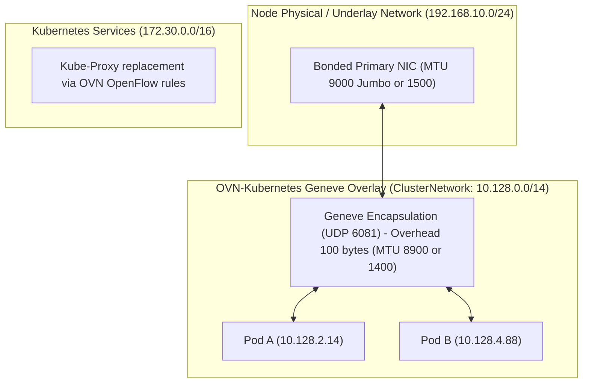

# 03 - Network Architecture & Connectivity Scenarios

Network architecture is the most common source of installation failure. OpenShift 4.20 requires precise routing, MTU sizing, DNS propagation, and certificate injection across connected, proxy, and air-gapped environments.

---

## Connectivity Scenario Matrix

| Scenario | Internet Access | Ingress / Egress Path | Mirror Registry Required | Root PKI Trust Injection |
| :--- | :--- | :--- | :---: | :---: |
| **Fully Connected** | Direct via NAT / IGW | Direct Outbound (TCP 443) | No | Optional |
| **Corporate Proxy** | Mediated via HTTP/HTTPS Proxy | Intercepted via forward proxy | Optional | Mandatory (`trustedCA` in cluster Proxy) |
| **Restricted / Air-Gapped** | Zero Outbound Internet Access | Dark site / Private LAN only | **Mandatory** (`oc-mirror` v2) | **Mandatory** (Internal Private CA) |
| **Dual-Homed DMZ** | Split (Mgmt vs Application) | Multi-NIC via Multus / SR-IOV | Recommended | Mandatory |

---

## Core Network Architecture (OVN-Kubernetes)

---
[Back to Global Navigation](../00-navigation.md)
