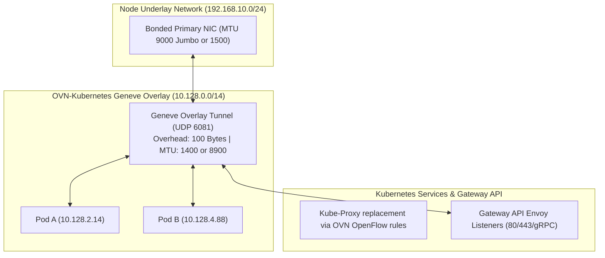

# 03 - Network Architecture & Connectivity Scenarios

Network architecture is the most common source of installation failure. OpenShift 4.20 requires precise routing, MTU sizing, DNS propagation, and certificate injection across connected, proxy, and air-gapped environments.

---

## Connectivity Scenario Matrix

| Scenario | Internet Access | Ingress / Egress Path | Mirror Registry Required | Root PKI Trust Injection | Ingress Standard |
| :--- | :--- | :--- | :---: | :---: | :--- |
| **Fully Connected** | Direct via NAT / IGW | Direct Outbound (TCP 443) | No | Optional | **Kubernetes Gateway API** / Ingress |
| **Corporate Proxy** | Mediated via HTTP/HTTPS Proxy | Intercepted via forward proxy | Optional | Mandatory (`trustedCA` in cluster Proxy) | **Gateway API** + Enterprise PKI |
| **Restricted / Air-Gapped** | Zero Outbound Internet Access | Dark site / Private LAN only | **Mandatory** (`oc-mirror` v2) | **Mandatory** (Internal Private CA) | **Gateway API** + Private CA TLS |
| **Dual-Homed DMZ** | Split (Mgmt vs Application) | Multi-NIC via Multus / SR-IOV | Recommended | Mandatory | **Gateway API** Multi-Listener |

---

## Documentation Modules in this Section

1. [`01-connected-with-proxies.md`](01-connected-with-proxies.md) — Forward proxy configuration, `noProxy` bypass rules, and custom `trustedCA` injection.
2. [`02-air-gapped-oc-mirror-v2.md`](02-air-gapped-oc-mirror-v2.md) — Disconnected mirroring standard with `oc-mirror` v2, OCI streaming catalogs, and IDMS manifests.
3. [`03-air-gapped-core-services.md`](03-air-gapped-core-services.md) — Split-horizon DNS, Chrony Stratum NTP sync, and internal enterprise PKI.
4. [`04-ovn-kubernetes-tuning.md`](04-ovn-kubernetes-tuning.md) — OVN-Kubernetes CNI, MTU Geneve encapsulation sizing, EgressIPs, and EgressFirewalls.
5. [`05-gateway-api-architecture.md`](05-gateway-api-architecture.md) — **Kubernetes Gateway API Standard (`gateway.networking.k8s.io`)**, OpenShift Ingress Operator, Service Mesh 3.x, canary routing, and migration from legacy Routes.

---

## Core Network Architecture (OVN-Kubernetes)

---
[Back to Global Navigation](../00-navigation.md)
