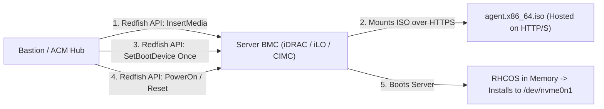

# Bare-Metal Physical Hardware Deployments

Bare-metal OpenShift 4.20 deployments eliminate hypervisor virtualization tax, unlocking maximum I/O performance, ultra-low latency, and direct hardware access for GPU compute, Telco RAN (SR-IOV/DPDK), and massive database clusters.

---

## Out-of-Band BMC Automation (Redfish & Virtual Media)

Modern bare-metal provisioning relies on DMTF Redfish APIs to mount the Agent-Based ISO dynamically to the server's Baseboard Management Controller (BMC):

---

## Server Vendor Specific Guidelines

### 1. Dell PowerEdge (iDRAC 9 / 10)
- Set Boot Mode to **UEFI** (Legacy BIOS is deprecated).
- Enable SR-IOV Global in BIOS.
- Disable USB 3.0 emulation throttling.
- Redfish endpoint URI: `https://<idrac-ip>/redfish/v1/Managers/iDRAC.Embedded.1/VirtualMedia/CD/Actions/VirtualMedia.InsertMedia`.

### 2. HPE ProLiant (iLO 5 / 6)
- Boot mode: **UEFI Optimized Boot**.
- Ensure Secure Boot keys include Red Hat UEFI CA.
- Redfish endpoint URI: `https://<ilo-ip>/redfish/v1/Managers/1/VirtualMedia/2/Actions/VirtualMedia.InsertMedia`.

### 3. Cisco UCS & Lenovo ThinkSystem
- Configure Cisco UCS Service Profile with vNIC templates and Hardware RAID-1 for OS boot disks.
- Lenovo XClarity Controller (XCC) supports direct Redfish Virtual Media attach.

---
[Next: VMware vSphere](02-vmware-vsphere.md) • [Back to Platforms Index](README.md)
