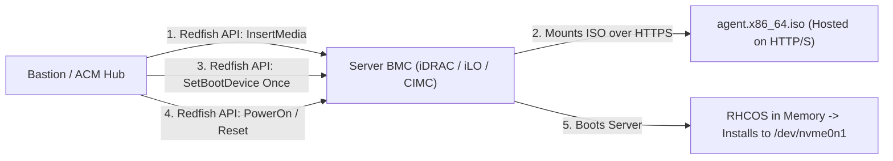

# Bare-Metal Physical Hardware Deployments

Bare-metal OpenShift 4.20 deployments eliminate hypervisor virtualization tax, unlocking maximum I/O performance, ultra-low latency, and direct hardware access for GPU compute, Telco RAN (SR-IOV/DPDK), and massive database clusters.

---

## Out-of-Band BMC Automation (Redfish & Virtual Media)

Modern bare-metal provisioning relies on DMTF Redfish APIs to mount the Agent-Based ISO dynamically to the server's Baseboard Management Controller (BMC):



---

## End-to-End Step-by-Step Implementation Procedure

### Step 1: Server Hardware & BIOS Configuration
1. Enter BIOS setup on all nodes (e.g. Dell PowerEdge Lifecycle Controller / HPE RBSU).
2. Set Boot Mode strictly to **UEFI**. Disable Legacy BIOS.
3. Configure Hardware RAID-1 for 2x boot disks (OS install), leaving all other NVMe/SSD drives as unconfigured raw disks for ODF Ceph.
4. Enable IOMMU, SR-IOV Global, and CPU Virtualization (VT-x / AMD-V).

### Step 2: Formulate Agent-Based Installation Manifests
1. Author `install-config.yaml` specifying `platform: baremetal` with virtual IPs:
   - `apiVIPs`: `192.168.10.100`
   - `ingressVIPs`: `192.168.10.101`
2. Author `agent-config.yaml` with server BMC MAC addresses, static IPs, and root disk hints (e.g. `deviceName: /dev/sda` or `/dev/nvme0n1`).

### Step 3: Generate Agent Bootable ISO
1. Run the image generation command:
   ```bash
   openshift-install agent create image --dir=./bm-cluster
   ```
2. Copy `agent.x86_64.iso` to an internal HTTP server (e.g. `http://bastion.corp.local/iso/agent.x86_64.iso`).

### Step 4: Mount ISO via Redfish API
1. Using `curl`, mount the virtual media image to each node's BMC:
   ```bash
   curl -k -u root:CalvinPassword -X POST      https://<idrac-ip>/redfish/v1/Managers/iDRAC.Embedded.1/VirtualMedia/CD/Actions/VirtualMedia.InsertMedia      -H "Content-Type: application/json"      -d '{"Image":"http://bastion.corp.local/iso/agent.x86_64.iso","Inserted":true}'
   ```
2. Set one-time boot to Virtual CD:
   ```bash
   curl -k -u root:CalvinPassword -X PATCH      https://<idrac-ip>/redfish/v1/Systems/System.Embedded.1      -H "Content-Type: application/json"      -d '{"Boot":{"BootSourceOverrideTarget":"Cd","BootSourceOverrideEnabled":"Once"}}'
   ```

### Step 5: Power On Servers & Monitor Bootstrap-in-Place
1. Power on all servers simultaneously via Redfish:
   ```bash
   curl -k -u root:CalvinPassword -X POST      https://<idrac-ip>/redfish/v1/Systems/System.Embedded.1/Actions/ComputerSystem.Reset      -H "Content-Type: application/json"      -d '{"ResetType":"On"}'
   ```
2. Monitor installation completion from the workstation:
   ```bash
   openshift-install agent wait-for install-complete --dir=./bm-cluster
   ```

### Step 6: Post-Install Physical Health Verification
1. Verify node readiness:
   ```bash
   export KUBECONFIG=./bm-cluster/auth/kubeconfig
   oc get nodes -o wide
   ```
2. Confirm NIC bonding status and storage disk detection.

---
[Next: VMware vSphere](02-vmware-vsphere.md) • [Back to Platforms Index](README.md)
