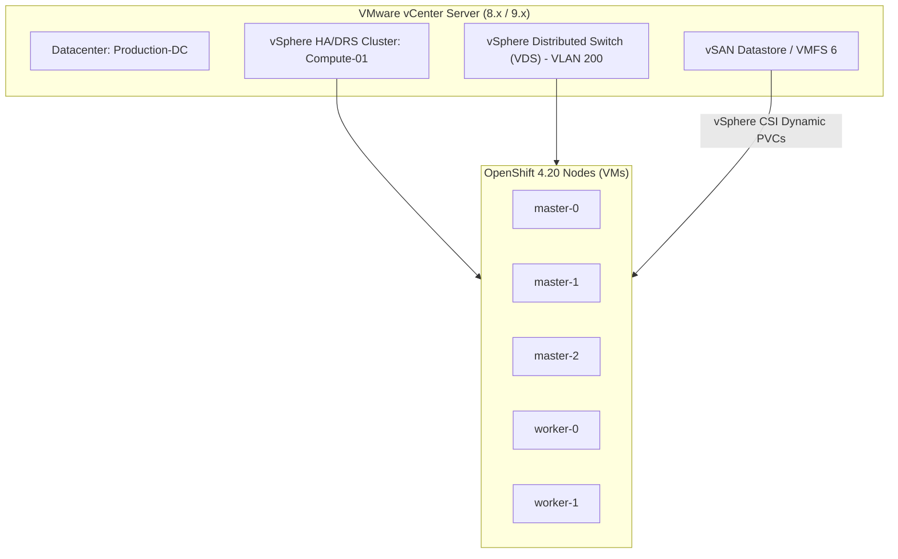

# VMware vSphere 8.x / 9.x Deployment Guide

VMware vSphere is the most prevalent on-premises enterprise platform for OpenShift. In OCP 4.20, both **vSphere IPI** and **Agent-Based Installer (ABI)** are fully supported on vSphere 8.0 Update 2 and vSphere 9.0.

---

## Architecture: vSphere IPI with Integrated VIPs



---

## End-to-End Step-by-Step Implementation Procedure

### Step 1: vCenter Role & Permissions Setup
1. Create a dedicated vCenter service account: `openshift-installer@vsphere.local`.
2. Grant required privileges on Datacenter, Cluster, Datastore, Distributed Switch, and VM Folders (Inventory, Configuration, Provisioning, vSphere CSI).
3. Ensure VM Hardware Version is 19 or higher.

### Step 2: vSphere Network & VIP Allocation
1. Allocate a port group on the vSphere Distributed Switch (VDS).
2. Reserve 2 static VIPs on the VM network:
   - `apiVIPs`: `10.200.10.100`
   - `ingressVIPs`: `10.200.10.101`
3. Configure DNS records matching the VIPs.

### Step 3: Configure vSphere IPI install-config.yaml
1. Generate `install-config.yaml` specifying vCenter parameters (see [`configs/upi-vsphere/vsphere-install-config.yaml`](../../configs/upi-vsphere/vsphere-install-config.yaml)).

### Step 4: Execute Automated vSphere IPI Installation
1. Run the installer:
   ```bash
   openshift-install create cluster --dir=./vsphere-cluster --log-level=info
   ```
2. The installer automatically:
   - Uploads RHCOS OVA template to vCenter datastore.
   - Deploys temporary bootstrap VM and 3 control plane VMs.
   - Creates DRS anti-affinity rules to distribute masters across distinct ESXi hosts.
   - Launches worker VMs, validates API, and tears down the bootstrap VM.

### Step 5: Verify vSphere CSI Driver & Dynamic Provisioning
1. Verify the VMware CSI Operator:
   ```bash
   oc get pods -n openshift-cluster-csi-drivers
   ```
2. Test dynamic volume provisioning by creating a test PVC using the `thin-csi` StorageClass:
   ```bash
   oc create -f configs/day1/test-pvc.yaml
   oc get pvc test-pvc
   ```

---
[Next: Nutanix AHV](03-nutanix-ahv.md) • [Back to Platforms Index](README.md)
