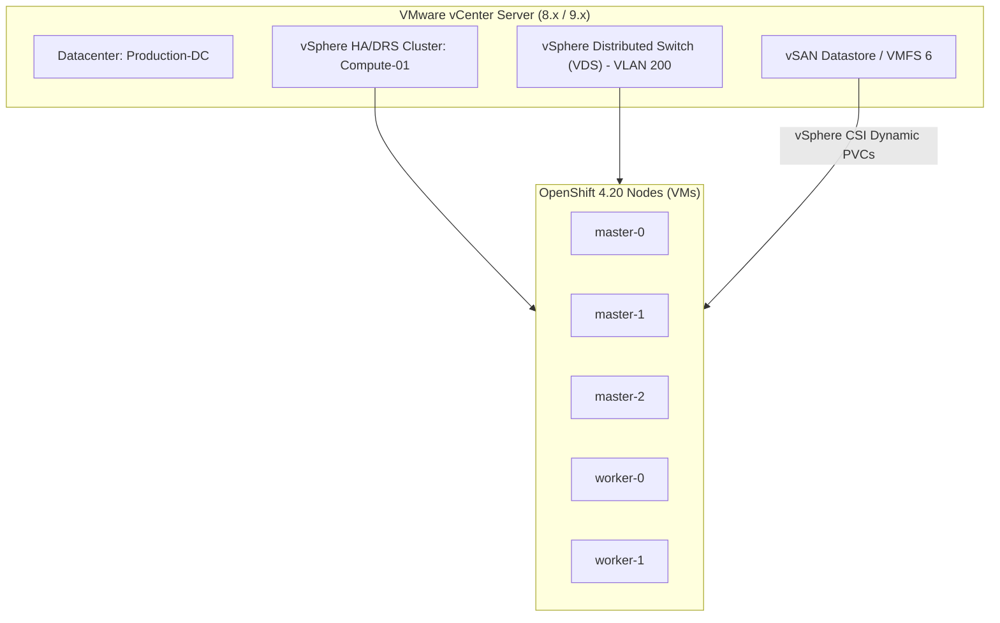

# VMware vSphere 8.x / 9.x Deployment Guide

VMware vSphere is the most prevalent on-premises enterprise platform for OpenShift. In OCP 4.20, both **vSphere IPI** and **Agent-Based Installer (ABI)** are fully supported on vSphere 8.0 Update 2 and vSphere 9.0.

---

## Architecture: vSphere IPI with Integrated VIPs

---

## Critical vSphere Prerequisites

1. **VM Hardware Version**:
   - Hardware Version 19 or higher.
2. **vCenter Privileges**:
   - For IPI, use a dedicated service account (`openshift-installer@vsphere.local`) with privileges to create folders, tag categories, and manage VMs.
3. **vSphere CSI Driver**:
   - The native `vmware-vsphere-csi-driver` provides dynamic provisioning of VMDKs backed by vSAN or external storage arrays.
   - Requires UUID activation on VMs (`disk.EnableUUID = "TRUE"`).
4. **Anti-Affinity Rules**:
   - The installer automatically creates vSphere DRS anti-affinity rules to guarantee that control plane VMs are never placed on the same physical ESXi host.

---
[Next: Nutanix AHV](03-nutanix-ahv.md) • [Back to Platforms Index](README.md)
