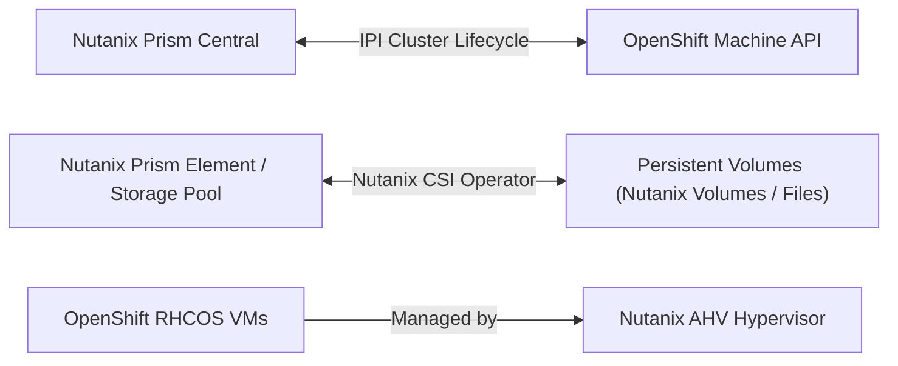

# Nutanix AHV Deployment Guide

OpenShift 4.20 offers first-class native integration with **Nutanix Acropolis Hypervisor (AHV)** and Prism Central.

---

## Architecture Overview



---

## Key Configuration in `install-config.yaml`

```yaml
platform:
  nutanix:
    prismCentral:
      endpoint: prism-central.internal.corp
      port: 9440
      username: ocp-installer
      password: SecretPrismPassword!
    prismElements:
      - endpoint: pe-cluster-01.internal.corp
        uuid: 0005b8a1-1234-5678-0000-000000000001
    subnet: ocp-subnet-vlan100
    clusterOSImage: rhcos-4.20-nutanix.qcow2
    apiVIPs:
      - 10.100.1.100
    ingressVIPs:
      - 10.100.1.101
```

---

## Nutanix CSI Best Practices
- Install the certified **Nutanix CSI Operator** from OperatorHub.
- Nutanix Volumes provides high-performance ReadWriteOnce (RWO) block storage.
- Nutanix Files provides ReadWriteMany (RWX) file storage for multi-pod sharing.

---
[Next: KVM & OpenStack](04-kvm-openstack.md) • [Back to Platforms Index](README.md)
