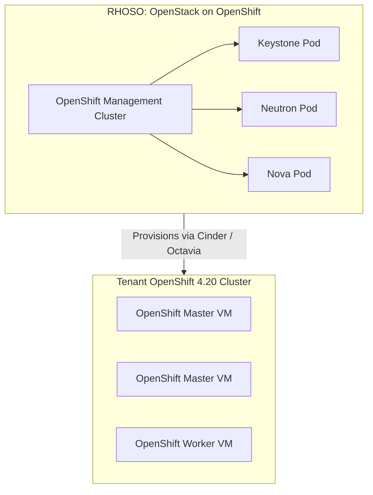

# KVM / Libvirt & Red Hat OpenStack Services (RHOSO)

For organizations standardizing on open-source virtualization or Red Hat OpenStack Services on OpenShift (RHOSO / RHOSP 17/18), OpenShift 4.20 delivers enterprise cloud elasticity.

---

## 1. Red Hat OpenStack Services on OpenShift (RHOSO)
In modern Red Hat infrastructure, OpenStack control plane services (Nova, Neutron, Cinder, Keystone) run containerized on top of OpenShift, while tenant OpenShift clusters can conversely run on top of OpenStack instances:



---

## 2. KVM / Libvirt Standalone Testing
For lab testing or air-gapped field edge deployments on bare Linux KVM servers:
- Use `platform: none` in `install-config.yaml`.
- Deploy using the Agent-Based Installer with `qemu-img` and `virt-install`:
```bash
virt-install   --name ocp-master-0   --ram 32768   --vcpus 8   --disk path=/var/lib/libvirt/images/master0.qcow2,size=120,bus=virtio   --cdrom /var/tmp/ocp-agent-build/agent.x86_64.iso   --network bridge=br0,model=virtio   --os-variant rhel9.0   --noautoconsole
```

---
[Next: Public Cloud AWS](05-aws.md) • [Back to Platforms Index](README.md)
