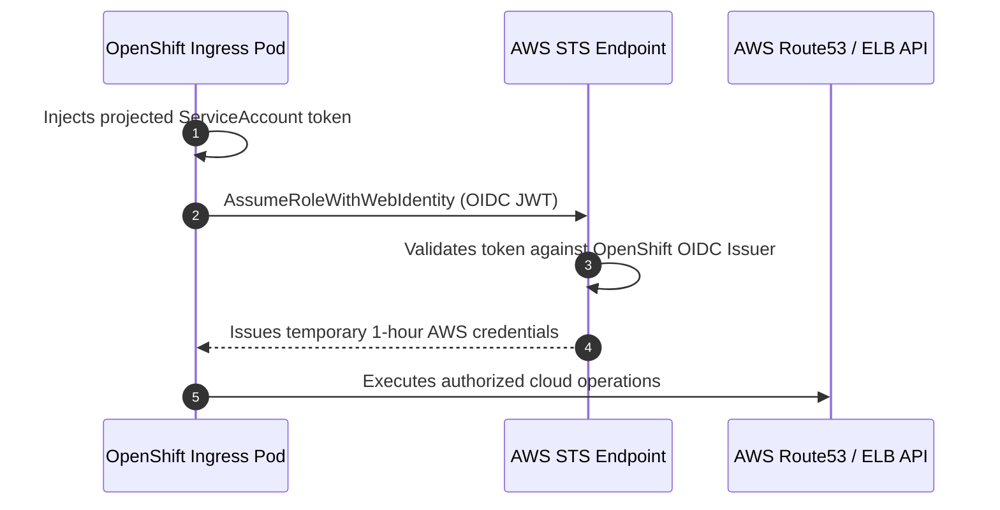

# Public Cloud AWS Deployment Guide

OpenShift 4.20 on Amazon Web Services (AWS) supports fully automated IPI deployments into greenfield or existing brownfield Virtual Private Clouds (VPC).

---

## Production Security: STS & IAM Roles for Service Accounts (IRSA)

Enterprise AWS deployments forbid static AWS IAM user credentials. Instead, OpenShift leverages **AWS Security Token Service (STS)**:

---

## AWS Architecture Best Practices
1. **Multi-AZ Availability**:
   - Distribute 3 master nodes and worker node MachineSets evenly across 3 distinct Availability Zones (`eu-west-1a`, `eu-west-1b`, `eu-west-1c`).
2. **Private Cluster (`publish: Internal`)**:
   - The Kubernetes API and Ingress routers are attached strictly to internal Network Load Balancers (NLB). No public IP addresses are assigned to EC2 instances.
3. **Storage Tiering**:
   - Default to `gp3` EBS CSI storage for balanced IOPS and throughput.
   - Use AWS EFS CSI Operator for ReadWriteMany (RWX) shared storage.

---
[Next: Azure Deployment Guide](06-azure.md) • [Back to Platforms Index](README.md)
