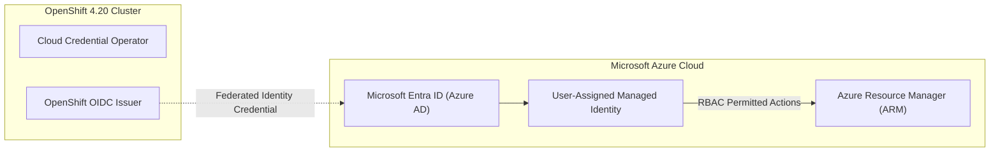

# Public Cloud Azure Deployment Guide

OpenShift 4.20 on Microsoft Azure supports self-managed IPI/UPI clusters deployed across Enterprise Azure Virtual Networks (VNet).

---

## Azure Architecture & Workload Identity

OpenShift 4.20 integrates natively with **Azure Workload Identity Federation**, removing the requirement to store client secrets in the cluster:

---

## Key Azure Configuration Highlights
1. **Pre-Existing Virtual Network (VNet)**:
   - Control plane subnet: `/27` minimum (recommended `/24`).
   - Compute subnet: `/24` or `/23` to prevent IP exhaustion during scale-out.
2. **Azure Accelerated Networking**:
   - Enable Accelerated Networking (SR-IOV) on all VM sizes to achieve sub-millisecond network latency and high throughput.
3. **Storage Classes**:
   - `managed-csi` (Premium_LRS) for primary low-latency workloads.
   - `azure-file-csi` for multi-read/write file systems.

---
[Next: Google Cloud Platform (GCP)](07-gcp.md) • [Back to Platforms Index](README.md)
