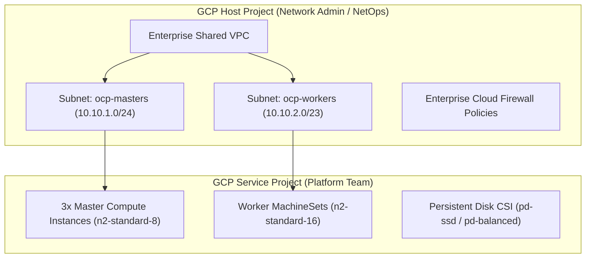

# Public Cloud Google Cloud Platform (GCP) Deployment Guide

OpenShift 4.20 on Google Cloud Platform (GCP) provides robust enterprise multi-zone reliability, Shared VPC networking, and Private Service Connect (PSC).

---

## GCP Shared VPC Architecture

In large enterprises, networking is centralized within a dedicated Host Project, while OpenShift compute and storage resources run within a Service Project:



---

## GCP Workload Identity Federation
`ccoctl` automates the binding between OpenShift service accounts and GCP IAM Service Accounts without creating service account key files:

```bash
ccoctl gcp create-all   --name=ocp-gcp-prod   --region=europe-west1   --project=enterprise-cloud-host-prod   --workload-identity-pool=enterprise-pool   --workload-identity-provider=enterprise-provider
```

---
[Back to Platforms Index](README.md) • [Next Chapter: Day 0 Readiness](../05-day0-readiness/README.md)
