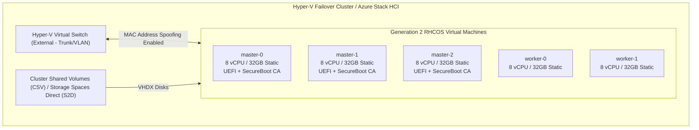

# Microsoft Hyper-V & Azure Stack HCI Deployment Guide

Deploying Red Hat OpenShift Container Platform 4.20 on Microsoft Hyper-V (Windows Server 2022 / 2025) and Azure Stack HCI utilizes the **Agent-Based Installer (ABI)** or User-Provisioned Infrastructure (UPI) using `platform: none` or `platform: baremetal` with virtual IPs.

---

## Architectural Overview



---

## Technical Comparison: Hyper-V vs Native Cloud/vSphere

| Dimension | Specification on Hyper-V | Critical Engineering Rule |
| :--- | :--- | :--- |
| **VM Generation** | **Generation 2 (Gen 2) Mandatory** | Gen 1 (Legacy BIOS) is completely unsupported for RHCOS 9.6+. |
| **Firmware / Secure Boot**| `MicrosoftUEFICertificateAuthority` | Default "Microsoft Windows" template blocks the Red Hat shim bootloader. |
| **Memory Allocation** | **Static Allocation Only** | **Dynamic Memory must be DISABLED.** Fluctuating memory crashes etcd and kubelet. |
| **Network Adapter** | Synthetic Network Adapter | **MAC Address Spoofing must be ENABLED** for Keepalived API and Ingress VIPs. |
| **Integration Services** | Native Linux Integration Services (LIS) | Pre-compiled into the RHCOS Linux kernel. |
| **Disk Format** | VHDX (Fixed or Dynamic) | Fixed-size VHDX recommended on CSV to prevent IOPS degradation. |
| **Storage Architecture** | OpenShift Data Foundation (ODF) or SMB/CSI| Direct VHDX for OS; dedicated raw VHDX disks attached for ODF Ceph OSDs. |

---

## Critical Hyper-V Host Configuration Rules

### 1. Secure Boot Template
By default, Hyper-V enables Secure Boot with the `MicrosoftWindows` template, which only trusts Microsoft Windows kernel signatures. Red Hat Enterprise Linux CoreOS (RHCOS) is signed by the Microsoft Third-Party UEFI Certificate Authority:

```powershell
Set-VMFirmware -VMName "ocp-master-0" -EnableSecureBoot $true -SecureBootTemplate "MicrosoftUEFICertificateAuthority"
```
*(Alternatively, Secure Boot can be disabled via `-EnableSecureBoot $false`).*

### 2. MAC Address Spoofing for Virtual IPs
If deploying with `apiVIPs` and `ingressVIPs` (Keepalived / VRRP), Hyper-V's virtual switch blocks ARP and MAC failover packets by default. You **MUST** enable MAC address spoofing on the virtual network adapters:

```powershell
Get-VMNetworkAdapter -VMName "ocp-*" | Set-VMNetworkAdapter -MacAddressSpoofing On
```

### 3. Disable Dynamic Memory
OpenShift nodes pre-allocate memory pages for the container runtime and etcd. Dynamic memory causes ballooning driver conflicts:

```powershell
Set-VMMemory -VMName "ocp-master-0" -DynamicMemoryEnabled $false
```

---

## Automated Deployment via PowerShell

Use the ready-to-run automation script [`scripts/deploy-hyperv-vms.ps1`](../../scripts/deploy-hyperv-vms.ps1) to provision all Generation 2 VMs, attach network switches, configure firmware, and mount the Agent-Based ISO.

```powershell
# Run on Windows Server Hyper-V Host as Administrator
.\scripts\deploy-hyperv-vms.ps1 -ClusterName "ocp420" `
                                -SwitchName "vSwitch-External" `
                                -IsoPath "C:\ISOgent.x86_64.iso" `
                                -VmPath "C:\Hyper-V\Virtual Machines"
```

---

## Post-Boot Installation Flow
1. Power on all VMs (`Start-VM -Name ocp-*`).
2. The VMs boot into RHCOS Live from `agent.x86_64.iso`.
3. The Rendezvous node coordinates with peers, formats the primary VHDX, and completes the installation via Bootstrap-in-Place.
4. Eject the ISO from the virtual DVD drives once installation is complete.

---
[Next: Public Cloud AWS](05-aws.md) • [Back to Platforms Index](README.md)
