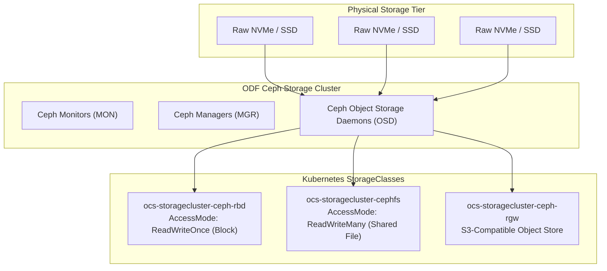

# Storage Architecture & OpenShift Data Foundation (ODF)

Persistent storage in OpenShift 4.20 is governed by CSI (Container Storage Interface) drivers. For on-premises environments lacking native cloud EBS/Managed Disks, **OpenShift Data Foundation (ODF)** is the enterprise gold standard.

---

## ODF Storage Layer Architecture



---

## End-to-End Step-by-Step Implementation Procedure

### Step 1: Storage Disk Allocation & Wipe
1. Ensure each storage/master node has at least one dedicated raw enterprise NVMe/SSD drive (minimum 1 TB).
2. Clean existing partition tables or LVM metadata:
   ```bash
   wipefs -a /dev/nvme1n1
   ```

### Step 2: Install Local Storage Operator (LSO)
1. In OperatorHub, subscribe to the **Local Storage Operator**.
2. Create a `LocalVolumeDiscovery` CR to scan all attached storage devices across nodes.

### Step 3: Install OpenShift Data Foundation (ODF) Operator
1. Subscribe to the **OpenShift Data Foundation Operator** in namespace `openshift-storage`.
2. Wait for the ODF, Rook-Ceph, and NooBaa operator pods to be `Running`.

### Step 4: Create StorageCluster Custom Resource
1. Deploy the `StorageCluster` CR targeting discovered NVMe devices:
   ```yaml
   apiVersion: ocs.openshift.io/v1
   kind: StorageCluster
   metadata:
     name: ocs-storagecluster
     namespace: openshift-storage
   spec:
     manageNodes: false
     monPVCTemplate:
       spec:
         accessModes: [ReadWriteOnce]
         resources:
           requests: {storage: 50Gi}
         storageClassName: localblock
     storageDeviceSets:
       - name: ocs-deviceset
         count: 3
         dataPVCTemplate:
           spec:
             accessModes: [ReadWriteOnce]
             resources:
               requests: {storage: 1Ti}
             storageClassName: localblock
             volumeMode: Block
   ```

### Step 5: Verify StorageClasses & Ceph Health
1. Verify storage cluster health:
   ```bash
   oc get cephcluster -n openshift-storage
   ```
2. Confirm the standard StorageClasses are registered and set `ocs-storagecluster-ceph-rbd` as default:
   ```bash
   oc patch sc ocs-storagecluster-ceph-rbd -p '{"metadata": {"annotations":{"storageclass.kubernetes.io/is-default-class":"true"}}}'
   ```

---
[Next: Helper Node Architecture](04-helper-node-architecture.md) • [Back to Day 0 Index](README.md)
