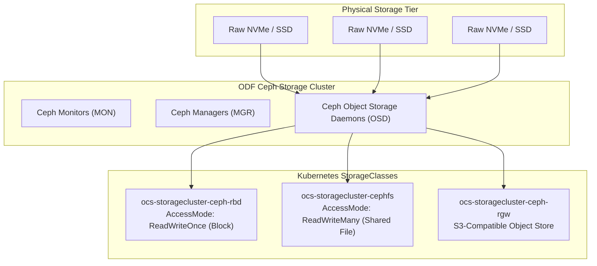

# Storage Architecture & OpenShift Data Foundation (ODF)

Persistent storage in OpenShift 4.20 is governed by CSI (Container Storage Interface) drivers. For on-premises environments lacking native cloud EBS/Managed Disks, **OpenShift Data Foundation (ODF)** is the enterprise gold standard.

---

## ODF Storage Layer Architecture

---

## Storage Class Capabilities

| Storage Class | Backing Type | Typical Workload | Supported Access Modes |
| :--- | :--- | :--- | :--- |
| **`ocs-storagecluster-ceph-rbd`** | Ceph Block Device | Databases (PostgreSQL, MySQL), Kafka | `ReadWriteOnce`, `ReadWriteOncePod` |
| **`ocs-storagecluster-cephfs`** | Ceph Shared Filesystem | CMS, Web Portals, CI/CD Shared Workspaces | `ReadWriteOnce`, `ReadWriteMany` |
| **`ocs-storagecluster-ceph-rgw`** | Ceph S3 Object Gateway | Registry storage, OADP Backups, Logs | S3 API endpoint |

---
[Back to Day 0 Index](README.md) • [Next Chapter: Day 1 Baselining](../06-day1-baselining/README.md)
