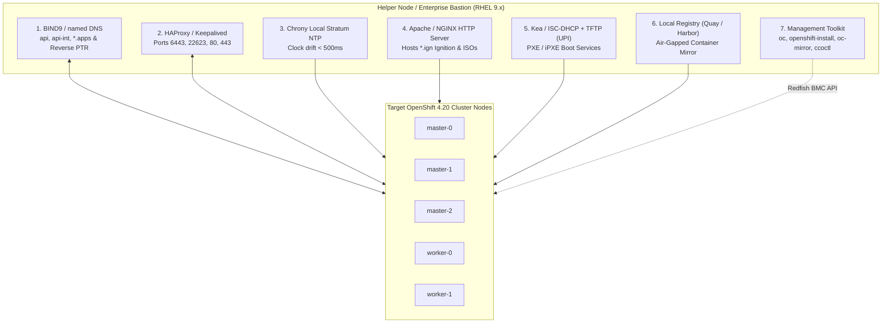

# Helper Node Architecture, Engineering & Automation

In on-premises bare-metal, private virtualization (VMware, Hyper-V, KVM, Nutanix), and air-gapped environments, the **Helper Node** (also termed the **Bastion / Core Services Node**) provides the mission-critical foundation services required by OpenShift 4.20 before a single cluster node can boot.

---

## Architectural Role & Services Layout



---

## Scenario Decision Matrix: When is a Helper Node Required?

| Deployment Scenario | Helper Node Status | Justification & Architectural Motivation |
| :--- | :---: | :--- |
| **Bare Metal UPI (PXE/iPXE)** | **MANDATORY** | Requires external DHCP with PXE options (66/67), TFTP, HTTP Ignition server, DNS, and HAProxy for API/MachineConfig. |
| **Air-Gapped / Disconnected** | **MANDATORY** | Must host the local mirror registry (Quay/Harbor), internal DNS root, and local hardware-backed Chrony NTP. |
| **VMware / Nutanix / Hyper-V UPI** | **MANDATORY** | Enterprise infrastructure lacks dynamic API-driven load balancers and automated DNS record generation. |
| **Bare Metal Agent-Based (ABI)** | **RECOMMENDED (Bastion)**| ABI has built-in Keepalived VIPs and eliminates DHCP/PXE, but a bastion is required to build ISOs, execute Redfish BMC calls, and run `oc-mirror`. |
| **Public Cloud IPI (AWS/Azure/GCP)**| **ELIMINATED / OPTIONAL** | Cloud providers natively manage Route53/CloudDNS, NLBs, VPC DHCP, and cloud metadata services. Bastion used only for private VPC access. |

---

## Foundation Services Deep Dive

### 1. DNS Server (BIND9 / named)
OpenShift mandates strict split-horizon resolution. The Helper Node must resolve:
- `api.<cluster>.<baseDomain>` -> Load Balancer VIP (TCP 6443)
- `api-int.<cluster>.<baseDomain>` -> Load Balancer VIP (TCP 6443 and 22623)
- `*.apps.<cluster>.<baseDomain>` -> Ingress Load Balancer VIP (TCP 80/443)
- Reverse `PTR` records for all node IPs.

### 2. High-Performance Load Balancer (HAProxy)
Balances external clients and cluster internal traffic across master and worker backends with active health checks (see [`configs/helper-node/haproxy.cfg`](../../configs/helper-node/haproxy.cfg)).

### 3. Chrony Local Stratum NTP
etcd Raft consensus fails if clocks drift by >500ms. In disconnected environments with no access to public NTP pools, the Helper Node acts as a local Stratum-8 clock source.

### 4. HTTP File Server
Hosts Ignition files (`bootstrap.ign`, `master.ign`, `worker.ign`) and live boot images for nodes booting via network or virtual media.

---

## End-to-End Step-by-Step Implementation Procedure

### Step 1: Base Operating System & Package Installation
1. Provision a physical server or virtual machine running **RHEL 9.4+** with 4 vCPUs, 16 GB RAM, and 100 GB+ disk.
2. Install foundational networking and service packages:
   ```bash
   sudo dnf install -y bind bind-utils haproxy chrony httpd tftp-server syslinux-tftpboot firewalld jq git
   ```

### Step 2: Configure Authoritative BIND9 DNS
1. Deploy the enterprise DNS configuration template:
   ```bash
   sudo cp configs/helper-node/named.conf /etc/named.conf
   ```
2. Create forward zone file `/var/named/zone.corp.local` and reverse zone file `/var/named/zone.192.168.10`.
3. Set permissions and start named:
   ```bash
   sudo chown -R root:named /var/named/
   sudo systemctl enable --now named
   ```
4. Verify with `dig`:
   ```bash
   dig @127.0.0.1 api.ocp420.corp.local +short
   ```

### Step 3: Configure HAProxy Load Balancer
1. Copy the production HAProxy configuration (see [`configs/helper-node/haproxy.cfg`](../../configs/helper-node/haproxy.cfg)):
   ```bash
   sudo cp configs/helper-node/haproxy.cfg /etc/haproxy/haproxy.cfg
   ```
2. Enable SELinux boolean for HAProxy network binding:
   ```bash
   sudo setsebool -P haproxy_connect_any 1
   sudo systemctl enable --now haproxy
   ```
3. Inspect HAProxy statistics dashboard at `http://<helper-ip>:9000/stats`.

### Step 4: Configure Local Chrony NTP
1. Edit `/etc/chrony.conf` to serve local NTP:
   ```ini
   local stratum 8
   allow 192.168.10.0/24
   ```
2. Restart and verify Chrony:
   ```bash
   sudo systemctl restart chronyd
   chronyc tracking
   ```

### Step 5: Configure Apache HTTP Server for Ignition
1. Enable Apache:
   ```bash
   sudo systemctl enable --now httpd
   sudo mkdir -p /var/www/html/ignition /var/www/html/iso
   sudo chown -R apache:apache /var/www/html/
   ```

### Step 6: Configure Firewall Rules
1. Open required ports in Firewalld:
   ```bash
   sudo firewall-cmd --permanent --add-service=dns
   sudo firewall-cmd --permanent --add-service=http
   sudo firewall-cmd --permanent --add-service=ntp
   sudo firewall-cmd --permanent --add-port={6443/tcp,22623/tcp,80/tcp,443/tcp,9000/tcp}
   sudo firewall-cmd --reload
   ```

### Step 7: Post-Bootstrap Cleanup
1. Once installation completes (`openshift-install wait-for bootstrap-complete`):
2. Remove the temporary bootstrap node backend from `/etc/haproxy/haproxy.cfg` under `backend api` and `backend machine-config`.
3. Reload HAProxy:
   ```bash
   sudo systemctl reload haproxy
   ```

---
[Back to Day 0 Index](README.md) • [Next Chapter: Day 1 Baselining](../06-day1-baselining/README.md)
