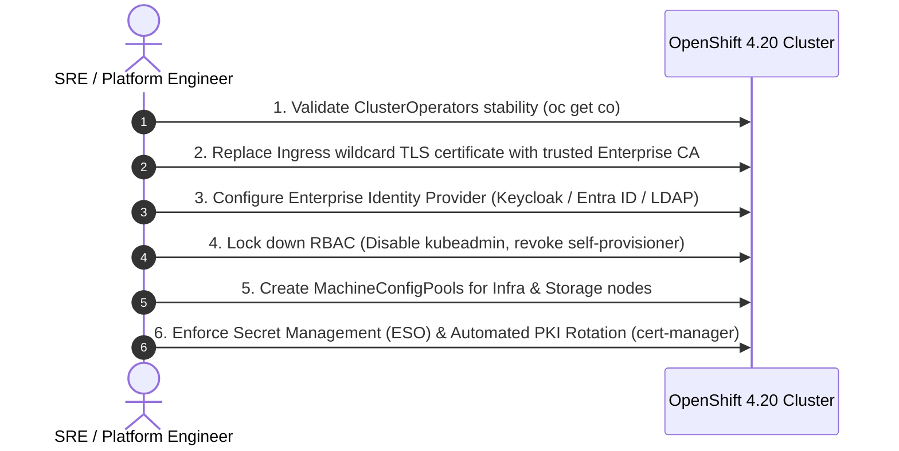

# 06 - Day 1 Post-Installation Hardening & Baselining

Day 1 activities begin the moment `openshift-install wait-for install-complete` succeeds. They transform a raw cluster into a hardened, production-ready enterprise platform.

---

## Day 1 Roadmap & Sequence

---

## Section Documents
- [01. Cluster Operator Hardening & Verification](01-cluster-operator-hardening.md)
- [02. Ingress & Custom TLS Certificates](02-ingress-and-custom-certs.md)
- [03. Enterprise Identity Providers & RBAC Hardening](03-identity-providers-rbac.md)
- [04. MachineConfigPools & Node Tuning](04-machineconfigpools-tuning.md)
- [05. Enterprise Secret Management & Automated PKI Rotation](05-secrets-and-cert-rotation.md)

---
[Back to Global Navigation](../00-navigation.md)
