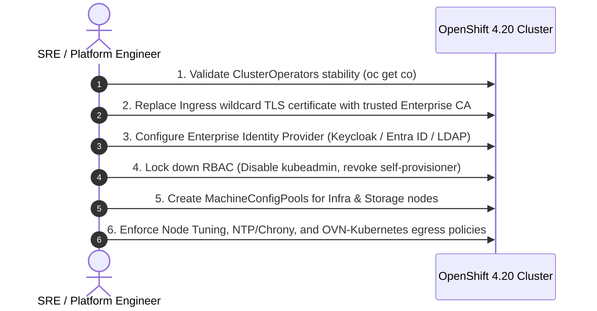

# 06 - Day 1 Post-Installation Hardening & Baselining

Day 1 activities begin the moment `openshift-install wait-for install-complete` succeeds. They transform a raw cluster into a hardened, production-ready enterprise platform.

---

## Day 1 Roadmap & Sequence

---
[Back to Global Navigation](../00-navigation.md)
