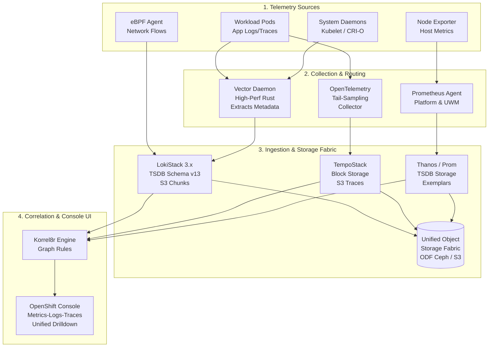
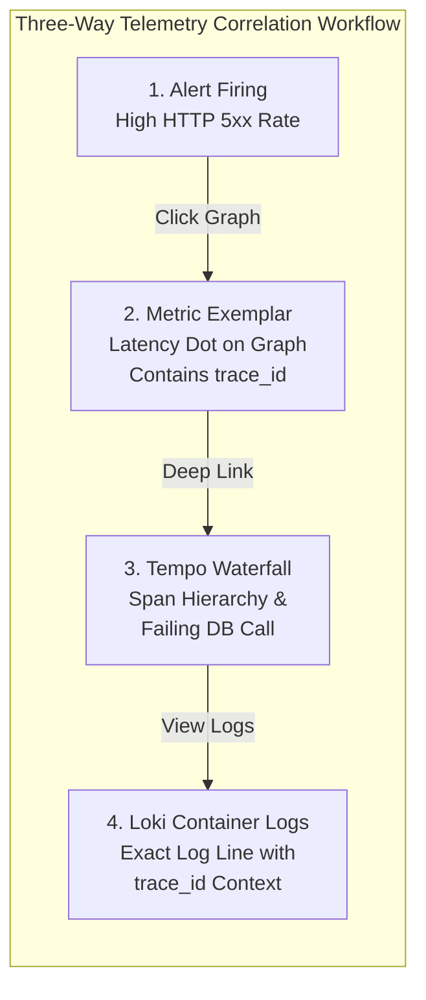

# Enterprise Native Observability Stack (Metrics, Logs, Traces & Correlation)

In **OpenShift 4.20** (current to September/October 2026), observability has evolved from isolated monitoring tools into a unified, cloud-native telemetry fabric.

This module provides the definitive reference architecture, production manifests, and operational procedures for deploying, tuning, and correlating the complete OpenShift Native Observability Stack: **Cluster Monitoring (Prometheus + User Workload Monitoring + Exemplars)**, **OpenShift Logging 6.x (Vector + LokiStack 3.x)**, **Distributed Tracing (OpenTelemetry + TempoStack)**, **Network Observability (eBPF FlowCollector)**, and the **Cluster Observability Operator (COO / Korrel8r)**.

---

## Observability Architecture & Telemetry Pipeline



```text
+-----------------------------------------------------------------------------------+
|               OpenShift 4.20 Native Observability Telemetry Fabric                |
+-----------------------------------------------------------------------------------+
  [ Workloads & Hosts ]          [ Collectors ]               [ Ingestion Engines ]
    App Pods (OTel SDK) ------> OpenTelemetry Collector -----> TempoStack (Traces)
    Container & Node Logs ----> Vector DaemonSet ------------> LokiStack (Logs)
    Host & Container Stats ---> Prometheus (CMO + UWM) ------> Thanos / Prom (Metrics)
    Kernel eBPF Probes -------> NetObserv eBPF Agent --------> NetObserv / Loki
                                                                     |
                                                                     v
                                                   +--------------------------------+
                                                   | S3 Object Storage (ODF Ceph)   |
                                                   +--------------------------------+
                                                                     |
                                                                     v
                                                   +--------------------------------+
                                                   | Korrel8r Correlation Engine    |
                                                   | (Exemplars -> Traces -> Logs)  |
                                                   +--------------------------------+
                                                                     |
                                                                     v
                                                   +--------------------------------+
                                                   | OpenShift Console UI Plugin    |
                                                   +--------------------------------+
```

---

## The 5 Native Observability Operators in OpenShift 4.20

| Operator | Primary Custom Resource | Architectural Role in 4.20 | Storage Backend |
| :--- | :--- | :--- | :--- |
| **Cluster Monitoring Operator (CMO)** | `ConfigMap/cluster-monitoring-config`<br/>`ConfigMap/user-workload-monitoring-config` | Scrapes platform & user workload metrics via Prometheus; evaluates alerts; stores OpenMetrics Exemplars. | Ceph RBD Block (WAL/Head) + S3 (Thanos) |
| **OpenShift Logging Operator 6.x** | `ClusterLogging`<br/>`ClusterLogForwarder` | Standardized exclusively on **Vector** (Fluentd deprecated); captures app, infra, and audit logs; injects structured metadata. | Streamed to LokiStack |
| **Loki Operator** | `LokiStack` | High-efficiency log aggregation engine (Loki 3.x); schema v13 with TSDB index; multi-tenant security (`openshift-logging`). | S3 Object Storage (ODF / AWS S3) |
| **Red Hat build of OpenTelemetry** | `OpenTelemetryCollector`<br/>`Instrumentation` | Ingests OTLP traces, metrics, and logs; performs tail-based sampling; auto-instruments Java, Node, Python, Go. | Forwards to TempoStack |
| **Red Hat build of Tempo** | `TempoStack` | High-scale distributed tracing platform; replaces legacy Jaeger Operator; stores trace blocks in object storage. | S3 Object Storage (ODF / AWS S3) |
| **Cluster Observability Operator (COO)** | `UIPlugin` | Injects native logging and distributed tracing drawers directly into the OpenShift Web Console; orchestrates **Korrel8r**. | In-memory correlation graph |
| **Network Observability Operator** | `FlowCollector` | eBPF-based flow tracking capturing packet drops, DNS latencies, and TCP RTT without kernel modules. | LokiStack (`network` tenant) |

---

## End-to-End Step-by-Step Implementation Procedure

### Step 1: Provision Unified S3 Object Storage & Credentials
LokiStack, TempoStack, and Thanos require S3-compatible object storage (backed by OpenShift Data Foundation Ceph RGW or enterprise cloud storage).

1. Create dedicated S3 buckets:
   - `loki-storage`
   - `tempo-storage`
   - `thanos-storage`
2. Create the LokiStack S3 secret in `openshift-logging`:
   ```bash
   oc create secret generic logging-loki-s3 \
     --namespace=openshift-logging \
     --from-literal=bucketnames="loki-storage" \
     --from-literal=endpoint="https://s3.openshift-storage.svc:443" \
     --from-literal=access_key_id="<CEPH_ACCESS_KEY>" \
     --from-literal=access_key_secret="<CEPH_SECRET_KEY>" \
     --from-literal=region="us-east-1"
   ```
3. Create the TempoStack S3 secret in `openshift-tracing`:
   ```bash
   oc create secret generic tempostack-s3 \
     --namespace=openshift-tracing \
     --from-literal=bucket="tempo-storage" \
     --from-literal=endpoint="https://s3.openshift-storage.svc:443" \
     --from-literal=access_key_id="<CEPH_ACCESS_KEY>" \
     --from-literal=access_key_secret="<CEPH_SECRET_KEY>" \
     --from-literal=region="us-east-1"
   ```

---

### Step 2: Enable User Workload Monitoring & OpenMetrics Exemplars
By default, OpenShift only monitors core platform components. User Workload Monitoring (UWM) must be activated to scrape application pods, evaluate custom PrometheusRules, and store **OpenMetrics Exemplars** for distributed trace linking.

1. Apply the production monitoring configuration:
   ```bash
   oc apply -f configs/observability/cluster-monitoring-config.yaml
   ```
2. Verify UWM Prometheus instances spin up in `openshift-user-workload-monitoring`:
   ```bash
   oc get pods -n openshift-user-workload-monitoring -l app.kubernetes.io/name=prometheus
   ```
3. Confirm that Exemplar storage is active on the Prometheus server:
   ```bash
   oc exec -n openshift-monitoring prometheus-k8s-0 -c prometheus -- \
     curl -s http://localhost:9090/api/v1/status/flags | grep -o "enable-feature=.*exemplar-storage.*"
   ```

---

### Step 3: Deploy Enterprise LokiStack (Loki 3.x)
1. Subscribe to **Red Hat OpenShift Logging** and **Loki Operator** via OperatorHub.
2. Apply the production [`configs/observability/lokistack-cr.yaml`](../../configs/observability/lokistack-cr.yaml):
   ```bash
   oc apply -f configs/observability/lokistack-cr.yaml
   ```
3. Verify that the LokiStack microservices (distributor, ingester, querier, query-frontend, compactor, gateway) achieve `Ready`:
   ```bash
   oc get lokistack logging-loki -n openshift-logging -o jsonpath='{.status.conditions[?(@.type=="Ready")].message}'
   ```

---

### Step 4: Configure Vector Collector & Structured Metadata Extraction
In OpenShift Logging 6.x, the collector is strictly powered by **Vector**.

1. Apply the [`configs/observability/clusterlogforwarder-cr.yaml`](../../configs/observability/clusterlogforwarder-cr.yaml) manifest:
   ```bash
   oc apply -f configs/observability/clusterlogforwarder-cr.yaml
   ```
2. Confirm Vector DaemonSet pods are deployed on every cluster node:
   ```bash
   oc get ds -n openshift-logging -l app.kubernetes.io/component=collector
   ```
3. Verify that Vector is parsing container logs and extracting `trace_id` into structured metadata:
   ```bash
   oc logs -n openshift-logging daemonset/collector -c vector --tail=20 | grep -E "trace_id|span_id"
   ```

---

### Step 5: Deploy TempoStack & OpenTelemetry Collector
1. Install **Red Hat build of OpenTelemetry** and **Red Hat build of Tempo** from OperatorHub.
2. Apply the [`configs/observability/tempostack-cr.yaml`](../../configs/observability/tempostack-cr.yaml) manifest:
   ```bash
   oc apply -f configs/observability/tempostack-cr.yaml
   ```
3. Apply the [`configs/observability/opentelemetry-collector.yaml`](../../configs/observability/opentelemetry-collector.yaml) manifest with tail-based sampling:
   ```bash
   oc apply -f configs/observability/opentelemetry-collector.yaml
   ```
4. Verify OTLP ingestion endpoints are listening on ports `4317` (gRPC) and `4318` (HTTP):
   ```bash
   oc get svc cluster-collector -n openshift-tracing
   ```

---

### Step 6: Deploy Cluster Observability Operator & Korrel8r Rules
1. Install the **Cluster Observability Operator (COO)** from OperatorHub.
2. Apply the UI Plugins and Korrel8r graph correlation rules:
   ```bash
   oc apply -f configs/observability/coo-ui-correlation.yaml
   ```
3. Verify that the console plugins are registered in the OpenShift Console operator:
   ```bash
   oc get consoles.operator.openshift.io cluster -o jsonpath='{.spec.plugins}'
   ```

---

### Step 7: Enable Network Observability (eBPF FlowCollector)
1. Install the **Network Observability Operator** from OperatorHub.
2. Apply the [`configs/observability/flowcollector-cr.yaml`](../../configs/observability/flowcollector-cr.yaml) manifest:
   ```bash
   oc apply -f configs/observability/flowcollector-cr.yaml
   ```
3. Confirm eBPF agent pods are running as a privileged DaemonSet:
   ```bash
   oc get ds -n netobserv-privileged
   ```

---

## Correlation Deep Dive: Metrics ⟷ Traces ⟷ Logs

In OpenShift 4.20, telemetry correlation is fully automated across the Web Console via three interlocking mechanisms:



```text
+--------------------------------------------------------------------+
|            OpenShift 4.20 Three-Way Correlation Engine             |
+--------------------------------------------------------------------+
  1. Prometheus Metric Spike / Firing Alert (HTTP 5xx rate > 2%)
                            |
                            | (OpenMetrics Exemplar dot clicked in UI)
                            v
  2. Distributed Trace Waterfall in Tempo (Trace ID: 4bf92f3577b34da6)
     Shows exact failing span: payment-gateway -> database connection
                            |
                            | (Console UI executes one-click "View Logs")
                            v
  3. Structured Log Lines in LokiStack
     Filter: {kubernetes_namespace_name="prod"} | json | trace_id="..."
     Reveals exact stack trace without index cardinality explosion!
```

### 1. Metrics to Traces: OpenMetrics Exemplars
* **How it works**: OpenTelemetry SDKs running inside application pods attach the active W3C `trace_id` as an exemplar to Prometheus counter and histogram metrics (e.g., `http_server_duration_milliseconds_bucket`).
* **Console Integration**: When viewing metric graphs in the OpenShift Console (**Observe -> Metrics**), exemplars appear as clickable dots on the time-series curves.
* **Drilldown**: Clicking an exemplar opens a direct link to the exact trace in **Observe -> Traces**, bypassing manual timestamp matching.

### 2. Traces to Logs: Structured Metadata & W3C Trace Context
* **The High-Cardinality Trap**: In legacy setups, putting `trace_id` into log stream labels crashed log aggregators due to millions of unique streams.
* **The Loki 3.x Solution**: In OpenShift 4.20, the Vector collector extracts `trace_id` and `span_id` from JSON application logs into **Loki Structured Metadata** (`spec.structuredMetadata`).
* **Zero Index Bloat**: Structured metadata is stored alongside log chunks without generating separate index streams.
* **One-Click Jump**: From any span in the Tempo trace waterfall, clicking **"View Logs"** automatically executes an exact LogQL query:
  ```logql
  {kubernetes_namespace_name="ecommerce-prod"} | json | trace_id = "4bf92f3577b34da6a3ce929d0e0e4736"
  ```

### 3. Alerts and Resources to Telemetry: Korrel8r
* **Graph Correlation Engine**: Korrel8r builds a directed graph of relationships between Kubernetes resources and telemetry.
* **Correlated Resources Drawer**: In the OpenShift Console, every firing Alert or degraded Deployment features a **"Correlated Resources"** drawer:
  * **Alert** `KubePodCrashLooping` $\longrightarrow$ **Pod** `checkout-backend` $\longrightarrow$ **Loki Logs** (errors in last 10m) $\longrightarrow$ **Tempo Traces** (failed spans) $\longrightarrow$ **Prometheus Metrics** (memory RSS vs limit).

---

## Storage Architecture & Sizing Tiers

S3-compatible object storage is the unified backbone for OpenShift Native Observability.

### Storage Allocation Matrix

| Component | Ingestion Storage (Ceph RBD Block) | Long-Term Storage (S3 Object) | Retention Default | Caching Tier |
| :--- | :--- | :--- | :--- | :--- |
| **LokiStack** | 20–100 GiB (Ingester WAL & Head) | Unlimited S3 Bucket (Chunks + TSDB) | App: 14d, Infra: 30d, Audit: 365d | Memcached (Chunks & Index) |
| **TempoStack** | 10–50 GiB (Ingester WAL) | Unlimited S3 Bucket (Trace Blocks) | 7 days (168h) | In-memory block cache |
| **Prometheus Platform** | 100 GiB Ceph RBD PVC | N/A (Local TSDB) | 15 days | OS Page Cache |
| **Prometheus UWM** | 50 GiB Ceph RBD PVC | S3 (Optional Thanos Store) | 7 days | OS Page Cache |

### LokiStack Deployment Sizing Tiers

| Sizing Tier | Daily Log Volume | Ingester Replicas | Querier Replicas | Distributor Replicas | Target Infrastructure |
| :--- | :---: | :---: | :---: | :---: | :--- |
| `1x.extra-small` | < 100 GB / day | 1 | 1 | 1 | SNO, Compact 3-Node, Development |
| `1x.small` | 100 GB – 500 GB / day | 2 | 2 | 2 | Standard HA Datacenter (Recommended) |
| `1x.medium` | 500 GB – 2 TB / day | 4 | 4 | 3 | Large Enterprise Clusters (50–200 Nodes) |
| `1x.large` | > 2 TB / day | 6+ | 6+ | 4+ | Multi-Tenant Massive Clusters (>200 Nodes) |

---

## Cardinality Governance & Cost Control

High-cardinality data is the leading cause of cluster monitoring outages, OOMKills, and runaway cloud storage costs. OpenShift 4.20 enforces strict multi-layer cardinality governance:

### 1. Metric Cardinality Governance (Prometheus)
* **The Root Cause**: High-cardinality labels such as `user_id`, `client_ip`, `order_id`, or ephemeral GUIDs injected into Prometheus metric series create millions of unique time series, exhausting Prometheus memory.
* **Enforced Controls**:
  1. **Scrape Sample Limits**: The `user-workload-monitoring-config` enforces `scrapeSampleLimit: 10000` per scrape target. Any ServiceMonitor attempting to emit more series is dropped immediately.
  2. **Metric Relabeling (`metricRelabelings`)**: Drop high-cardinality labels before storage:
     ```yaml
     metricRelabelings:
       - action: labeldrop
         regex: "(user_id|session_id|client_ip)"
     ```
  3. **Target Limits**: Limits user namespaces to a maximum of 200 scrape targets per cluster.

### 2. Log Cardinality Governance (Loki 3.x & Vector)
* **The Stream Explosion Pitfall**: In Loki, every unique combination of key-value labels creates a separate stream. Generating more than 50,000 active streams exhausts ingester RAM.
* **Enforced Controls**:
  1. **Strict Index Label Set**: Only static infrastructure coordinates are allowed as stream labels:
     - `kubernetes_namespace_name`
     - `kubernetes_pod_name`
     - `kubernetes_container_name`
     - `log_type` (`application`, `infrastructure`, `audit`)
  2. **Structured Metadata for Dynamic Fields**: Application-level dynamic keys (`trace_id`, `http_status`, `level`, `caller`) are routed via Vector into **Structured Metadata** instead of stream labels.
  3. **ClusterLogForwarder Drop Filters**: Drop noisy health-check logs (`/healthz`, `/readyz`, `kube-rbac-proxy`) at the collector layer before network transmission.

### 3. Trace Cardinality Governance (OpenTelemetry & Tempo)
* **The Storage Volume Dilemma**: Storing 100% of distributed traces in high-volume microservices (e.g. 50,000 RPS) generates tens of terabytes of trace data daily, 99% of which represents healthy, boring HTTP 200 responses.
* **Enforced Controls**:
  1. **Head-Based Sampling**: Edge gateways sample 5% of routine incoming requests.
  2. **Tail-Based Sampling Processor**: Deployed in [`configs/observability/opentelemetry-collector.yaml`](../../configs/observability/opentelemetry-collector.yaml):
     - Buffers complete traces across all spans for 10 seconds.
     - **Errors**: Retains **100%** of traces containing spans with status `ERROR` or HTTP `5xx`.
     - **Latency Outliers**: Retains **100%** of traces where latency exceeds 500ms.
     - **Health Probes**: Drops **100%** of `/healthz`, `/readyz`, and `/metrics` traces.
     - **Normal Requests**: Samples **5%** of remaining successful traces.

---

## Operational Triage & Diagnostic Runbooks

### 1. Automated Health Verification Script
Execute the repository's native diagnostic engine to evaluate the entire observability stack:
```bash
./scripts/verify-observability-stack.sh
```

### 2. Prometheus High-Cardinality Triage
Identify the top 10 highest-cardinality metric names in the active Prometheus head memory:
```bash
oc exec -n openshift-monitoring prometheus-k8s-0 -c prometheus -- \
  curl -s http://localhost:9090/api/v1/status/tsdb | jq '.data.seriesCountByMetricName[0:10]'
```

### 3. Querying Loki Logs via LogQL
Verify application log ingestion with structured metadata filtering:
```bash
# Query application logs via logcli or curl
oc exec -n openshift-logging -c loki ds/logging-loki-ingester -- \
  curl -s -G -H "X-Scope-OrgID: application" "http://localhost:3100/loki/api/v1/query" \
  --data-urlencode 'query={kubernetes_namespace_name="openshift-monitoring"} | json'
```

### 4. Querying Tempo Traces via TraceQL
Verify distributed trace ingestion for a specific microservice:
```bash
# Query Tempo gateway for traces with latency > 500ms
oc exec -n openshift-tracing deployment/simplest-querier -c querier -- \
  curl -s -G "http://localhost:3200/api/search" \
  --data-urlencode 'q={resource.service.name = "checkout" && duration > 500ms}'
```

---

## Production Declarative Manifest Catalog

The repository provides production-grade Custom Resources located in [`configs/observability/`](../../configs/observability/):

1. [`configs/observability/cluster-monitoring-config.yaml`](../../configs/observability/cluster-monitoring-config.yaml) — Cluster Monitoring ConfigMaps enabling UWM, Ceph RBD persistent storage, retention limits, and OpenMetrics Exemplar storage.
2. [`configs/observability/lokistack-cr.yaml`](../../configs/observability/lokistack-cr.yaml) — Enterprise `LokiStack` CR (Loki 3.x) with schema v13, S3 storage, retention tiers, and node affinity.
3. [`configs/observability/clusterlogforwarder-cr.yaml`](../../configs/observability/clusterlogforwarder-cr.yaml) — High-throughput Vector `ClusterLogForwarder` routing application, infra, and audit logs with structured metadata extraction.
4. [`configs/observability/tempostack-cr.yaml`](../../configs/observability/tempostack-cr.yaml) — Production `TempoStack` CR configuring S3 block trace storage and compactor lifecycle.
5. [`configs/observability/opentelemetry-collector.yaml`](../../configs/observability/opentelemetry-collector.yaml) — `OpenTelemetryCollector` CR with tail-based sampling (100% errors, 5% healthy) and OTLP gRPC export.
6. [`configs/observability/coo-ui-correlation.yaml`](../../configs/observability/coo-ui-correlation.yaml) — Cluster Observability Operator UI Plugins and Korrel8r rules enabling 3-way correlation in the OpenShift Web Console.
7. [`configs/observability/flowcollector-cr.yaml`](../../configs/observability/flowcollector-cr.yaml) — eBPF Network Observability `FlowCollector` CR with LokiStack network tenant integration.

---

[Next: Security & Compliance](02-security-and-compliance.md) • [Back to Day 2 Index](README.md)
