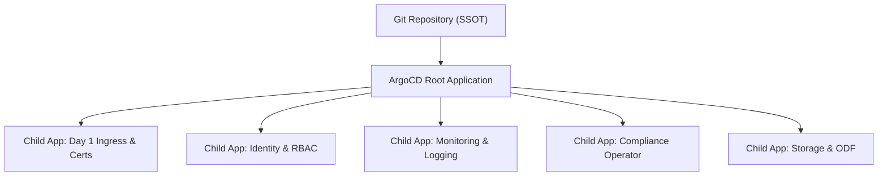

# GitOps Foundation: ArgoCD & External Secrets

Declarative management of all Day 1 and Day 2 cluster configurations eliminates configuration drift across multi-cluster fleets.

---

## Architecture: App-of-Apps Pattern

---

## Secret Management via External Secrets Operator (ESO)
Storing raw secrets in Git violates security standards. OpenShift 4.20 pairs GitOps with the **External Secrets Operator (ESO)**:
- Secrets are maintained in HashiCorp Vault, AWS Secrets Manager, or Azure Key Vault.
- The `ExternalSecret` CR pulls secrets into native Kubernetes `Secrets` dynamically.

---
[Next: Lifecycle & Upgrades](04-lifecycle-and-upgrades.md) • [Back to Day 2 Index](README.md)
